# Organocatalysis

| Name                                |                  Catalyst                   |                          Reactants                           |                    Reactive Intermediate                     |                           Reaction                           |
| ----------------------------------- | :-----------------------------------------: | :----------------------------------------------------------: | :----------------------------------------------------------: | :----------------------------------------------------------: |
| Lewis Base                          | $\ce{H2N-R/HS-R}$ DMAP and derivitives, |          Nucleophile  + Carbonyl with L.G.           | 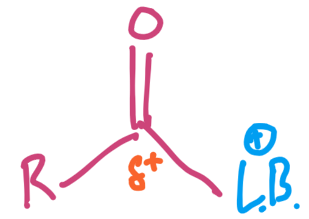{: style="max-height: 50px;" class="center sharp"} | 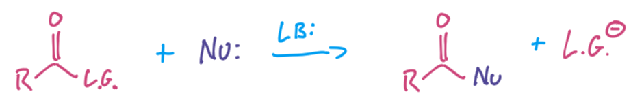{: style="max-height: 100px;" class="center sharp"} |
| Lewis Base with Conjugate acceptors |          LB (DMAP and derivitives)          |        α,β-unsaturated ketone + Electrophile         | 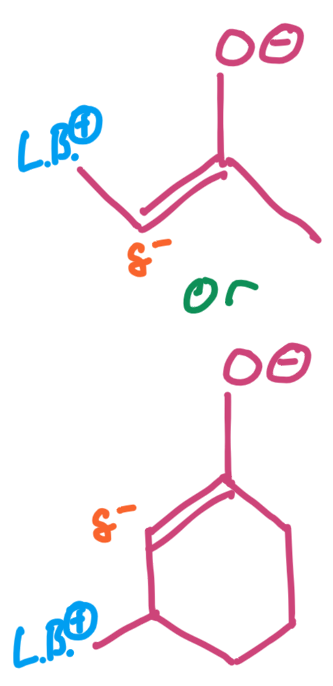{: style="max-height: 50px;" class="center sharp"} | 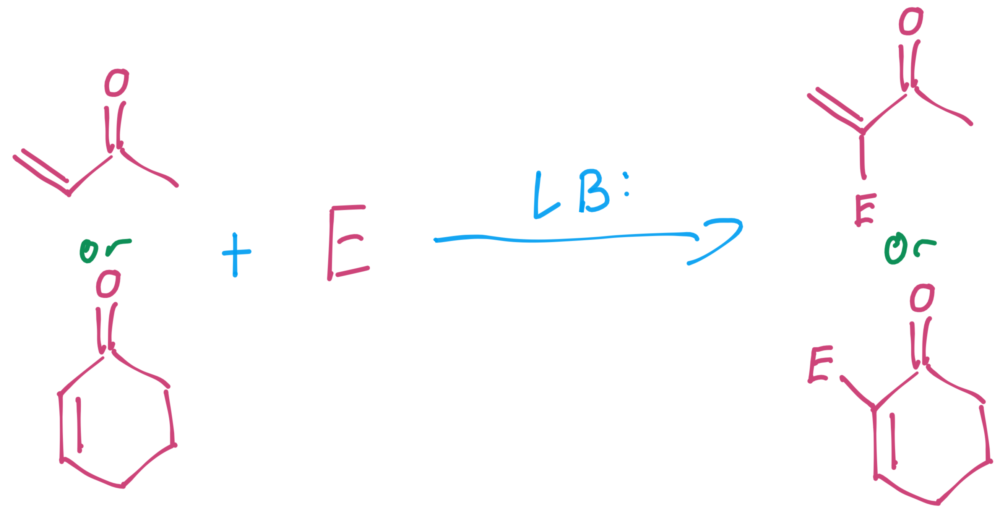{: style="max-height: 200px;" class="center sharp"} |
| LUMO Lowering with iminium          |               $2^\circ$ amine               |               DA with ketone EWG on dienophile               | 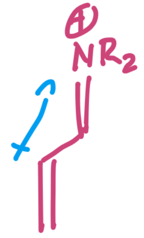{: style="max-height: 50px;" class="center sharp"} | 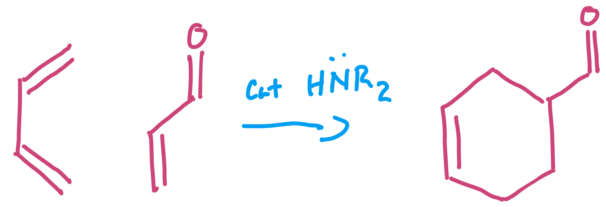{: style="max-height: 100px;" class="center sharp"} |
| Enamine/Iminium Formation           |               $2^\circ$ amine               |               Carbonyl + Electrophile                | 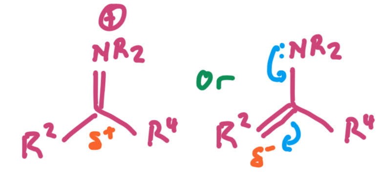{: style="max-height: 50px;" class="center sharp"} |      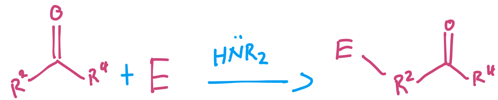       |
| Enamine aldol reaction              |        Proline ($2^\circ$ amine)        |                   Imine + Carbonyl                   | 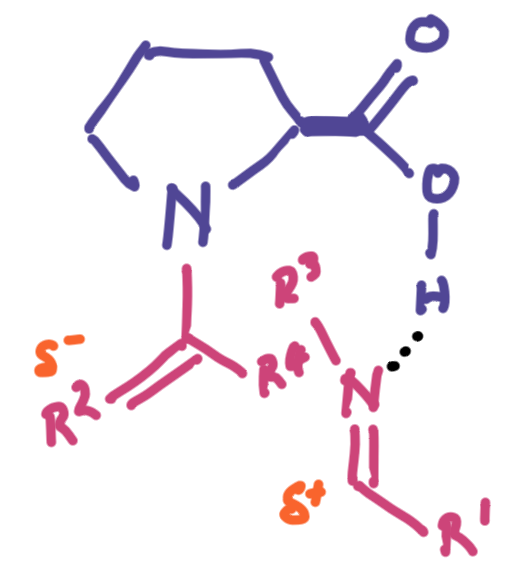{: style="max-height: 50px;" class="center sharp"} | 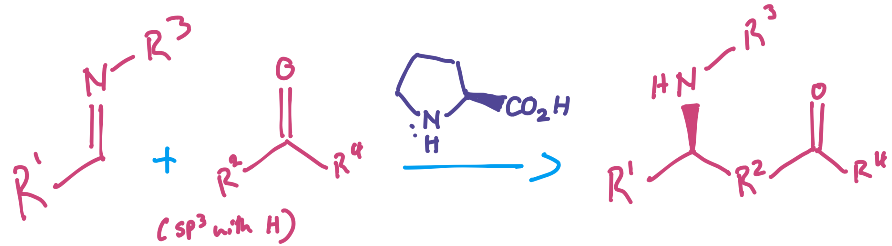{: style="max-height: 100px;" class="center sharp"} |
| Acyl anion reaction                 |           $\ce{C#N-}$ or Carbene            |          Carbonyl with L.G. + Electrophile           | 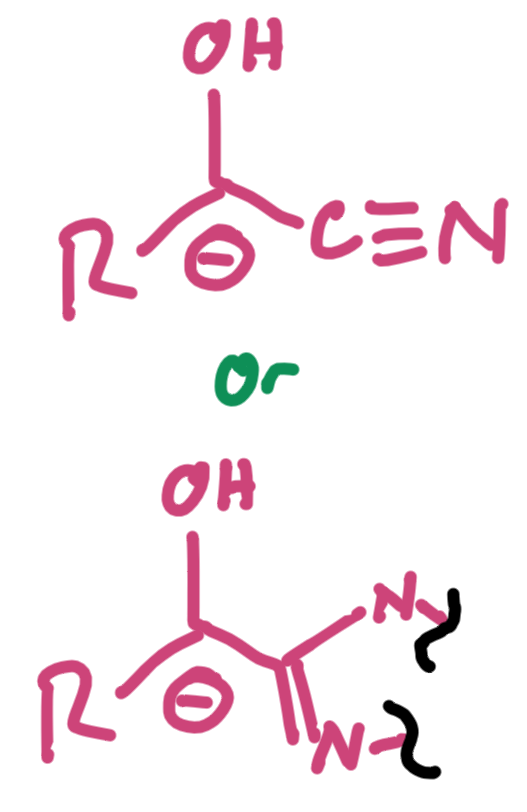{: style="max-height: 50px;" class="center sharp"} | 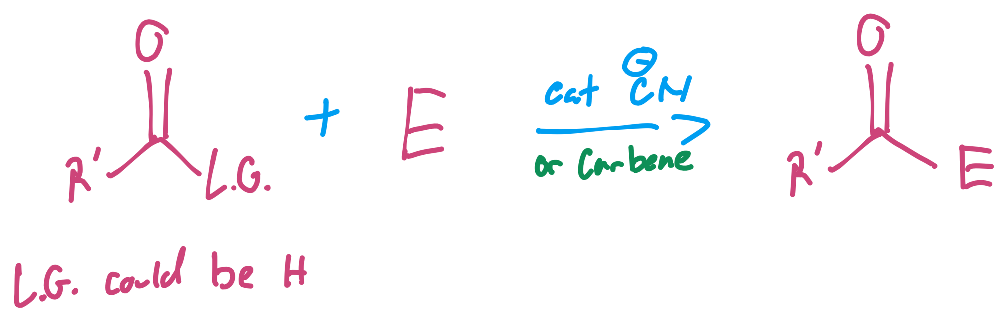{: style="max-height: 100px;" class="center sharp"} |
| Acyl anion reaction (carbonyl)  |           $\ce{C#N-}$ or Carbene            | Carbonyl with L.G. + Carbonyl with L.G. or α,β-unsaturated ketone | {: style="max-height: 50px;" class="center sharp"} | 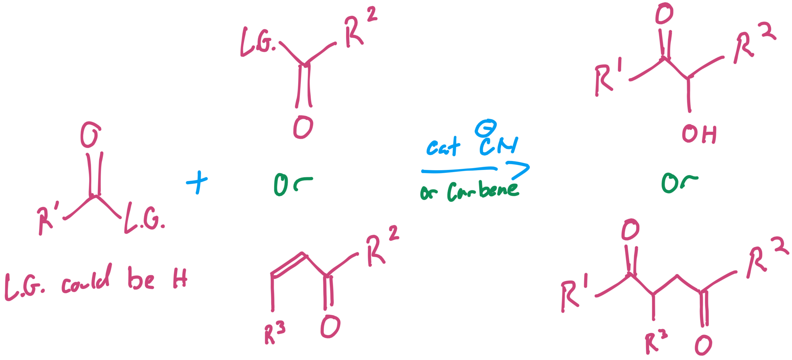{: style="max-height: 200px;" class="center sharp"} |

Organocatalysis is the use of small organic molecules to catalyse reactions. The "small" notion is there to distinguish it from large biocatalytic complexes. It's one of the oldest forms of catalysis, though the study of these molecules was only defined in the 2000's.

### Strengths and Weaknesses

|                 | Efficiency                   | Generality           | Toxicity       | Operational ease       | General utility |
| --------------- | ---------------------------- | -------------------- | -------------- | ---------------------- | --------------- |
| Biocatalysis    | ✔️✔️✔️✔️✔️ TON in the thousands   | - highly specialised | ✔️✔️✔️            | ✔️                      | ✔️✔️✔️✔️            |
| Organocatalysis | ✔️ Very high catalyst loading | ✔️✔️                   | ✔️✔️✔️            | ✔️✔️✔️✔️ Convenient to use | ✔️✔️✔️✔️            |
| TM Catalysis    | ✔️✔️                           | ✔️✔️✔️                  | ✔️ Heavy metals | ✔️                      | ✔️✔️✔️✔️            |

These are defined as the following:

* Efficiency - TON and TOF, how good are they as catalysists
* Generality - Can the catalyst be used for lots of different molecules
* Operation ease - How easy is it to perform the reaction
* General Utility - Is it useful as a tool

## Normal Polarity

Molecules have a natural polarity 

### DMAP Esterification

Lewis bases can be used as catalysts for esterifaction, like the one shown below

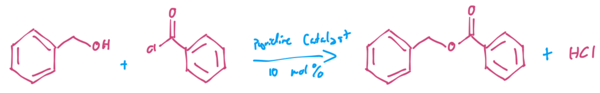{: style="width: 70%;" class="center sharp"}

If we consider how this reaction is catalysed, we might first consider how modifications to the catalyst change its activity. When we do this, we can see that the more electron donating components are present, the more active the catalyst. This implies that perhaps the pyridine is acting as a nucleophile, perhaps as a Bronsted base, activating the molecules by deprotonating the hydroxyl.

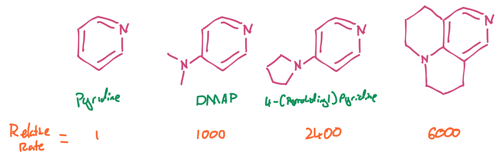{: style="width: 70%;" class="center sharp"}

We can make another modification to the pyridine by 2,6-dimethylating it, which SIGNIFICANTLY deactivates it as a catalyst.

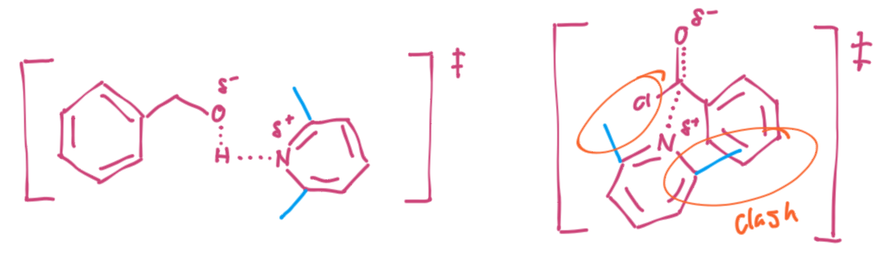{: style="width: 70%;" class="center sharp"}

If we compare this behaviour, it wouldn't interfere with the deprotonation, but it would prevent the pyridine from acting as lewis base; a nucleophile.

In this particular case, the pyridine is adding to the carbonyl group, displacing the leaving group and withdrawing even more electron density from the carbonyl carbon, making it even more electrophilic.

???+ info "Mechanism"
	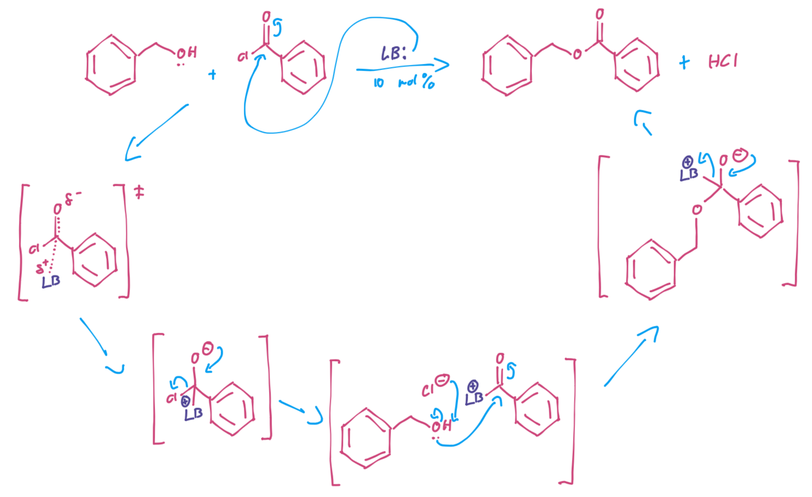{: style="width: 100%;" class="center sharp"}

For this particular mechanism, the **"Turnover Limiting Step"** is the transition state marked. This means that the more electrophilic the catalyst is, the more active it will be. In the case of DMAP, we can see what the electron distribution will be by looking at it's resonance structures:

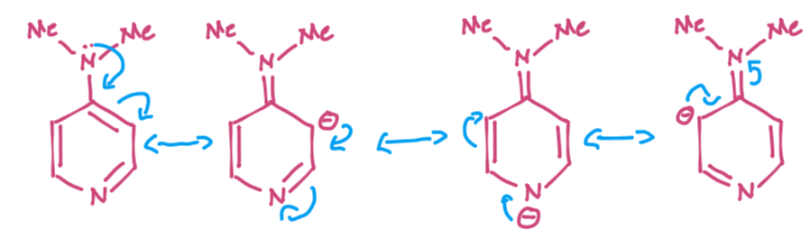{: style="width: 50%;" class="center sharp"}

When we combine all of them into a "resonance hybrid", we can see that there is a large shift of the electron density out of the amine substituent and into the pyridine nitrogen

 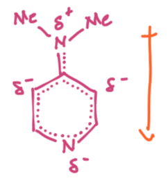{: style="width: 15%;" class="center sharp"}

As for why the difference in activity between the substituents, we can consider that the donating nitrogen LPE is in a P orbital, that needs to line up with the aromatic P orbitals to be able to donate. This can only happen when the rotation of the bond is in the right position. In the case of the rigid form, there will be no rotation, so there will always be contribution, leading to a 6X increase in activity over "floppy" DMAP,

|                           Rotating                           |                            Rigid                             |
| :----------------------------------------------------------: | :----------------------------------------------------------: |
| 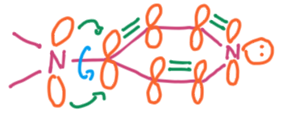{: style="max-height: 80px;" class="center sharp"} | 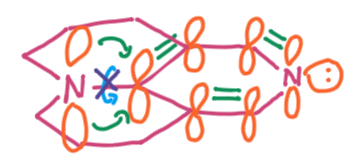{: style="max-height: 80px;" class="center sharp"} |

## Reverse Polarity

When we consider molecules computationally, we can see that carbonyl compounds have an alternating polarity down the length of its chain that we can consider its "natural polarity"

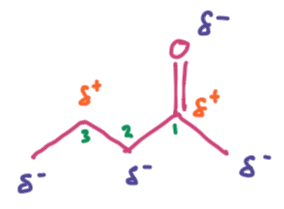{: style="width: 20%;" class="center sharp"}

When we consider "natural polarity" reactions, we can look at the location of the bonds being added and we can look at the polarity of the starting materials to see that they all involve bonds forming between opposite polar connections and they all end up bonding at odd number connections.

 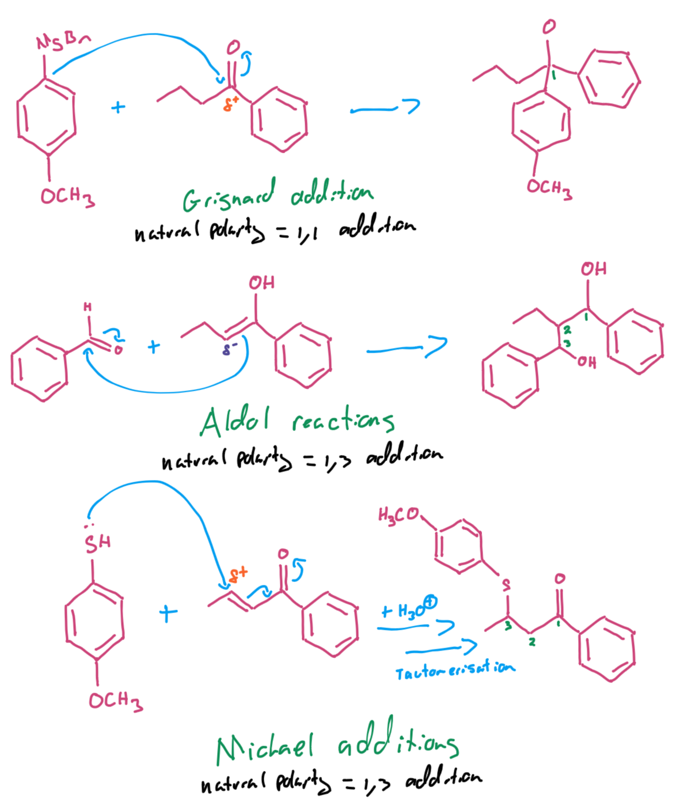{: style="width: 60%;" class="center sharp"}

### Lewis Base with Conjugate Acceptors

A common example of exploiting this polarity is to be able to direct the addition across the bond of an α,β-unsaturated ketone. We are effectively converting the α,β-unsaturated ketone to an aldol to force the iodine to add in the 2 position.

???+ info "Mechanism"
	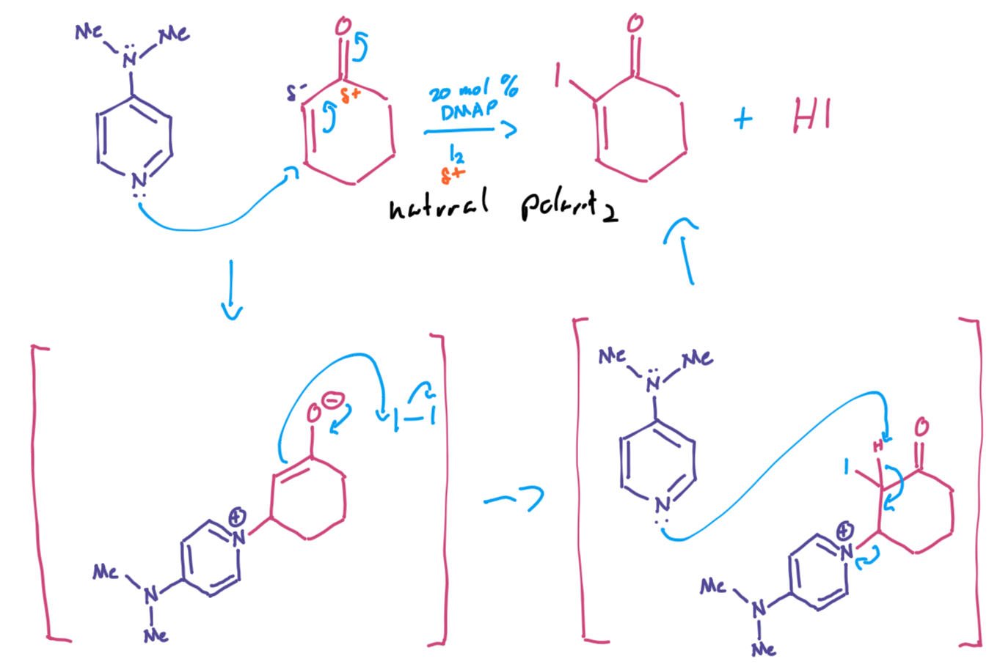{: style="width: 70%;" class="center sharp"}

### Iminium and Enamine (conjugate acceptors/α,β-Unsaturated Ketones)

We can also exploit this natural polarity by using an iminium or enamine complex. these complexes have similarities to carbonyl based compounds. For this unit, all of the compounds we use to form iminiums will be **secondary amines**

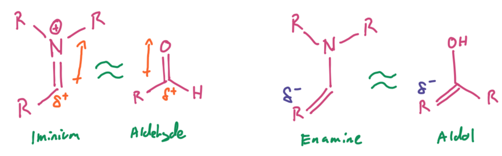{: style="width: 50%;" class="center sharp"}

The basic mechanism is as follows. 

!!! note
	If the α-carbon is sp3 and has a free proton, the complex **will** form the more energetically favourable enamine

???+ info "Mechanism"
	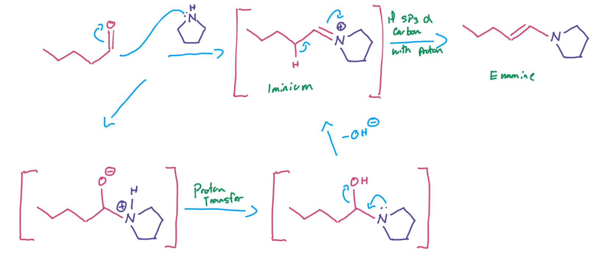{: style="width: 80%;" class="center sharp"}

### LUMO Lowering With Iminium

Since the Diels-Alder reactions are only limited by the thermodynamic barrier between the HOMO and LUMO of the diene and dienophile respectively, we can lower the LUMO by withdrawing electron density from it with an iminium.

???+ info "Mechanism"
	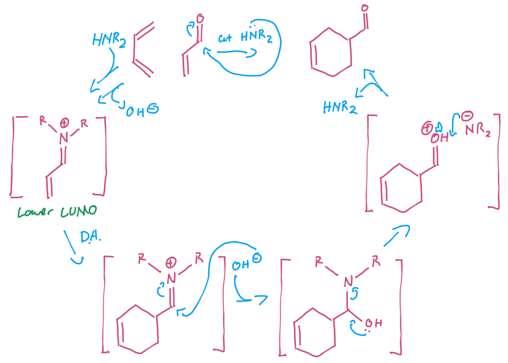{: style="width: 80%;" class="center sharp"}

This has been used in conjunction with chiral components on the catalysts to form enantioenriched products with decent enantiomeric purity. The $\ce{t-Bu}$ group prevents the dienophile from rotating to the wrong side and the aromatic group blocks the diene from adding to the wrong face of the dienophile.

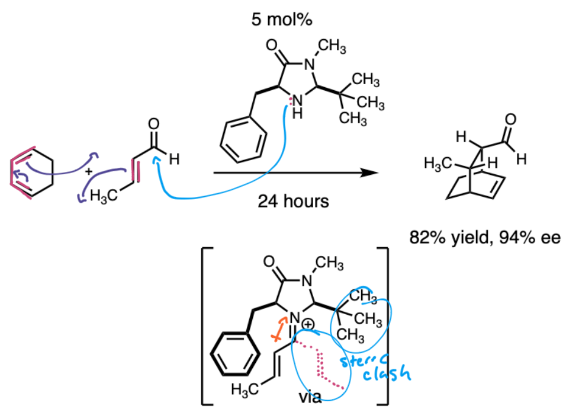{: style="width: 60%;" class="center sharp"}

If we calculate the TON and TOF for this though, we have 16.5 turnovers for this catalysts and <1 turnover per hour. It's an incredibly limited process, due to how many hurdles need to be met in the process to form the product.

### Enamine Aldol Reactions

Lots of enamine catalysed reactions use proline as it has **dual activation** potential, that is, it can activate both the nucleophile and the electrophile, as well as helping the reaction by bringing the reactants together. In the reaction below, the imine here can be any carbonyl or carbonyl surrogate.

The reaction activates through the enamine, as it takes on an aldol like behaviour, making the alkene more nucleophilic and it H-bonds to the imine (more than 3 bond equivalents to a nitrogen), withdrawing some electron density, making its carbon more electrophilic.

???+ info "Mechanism"
	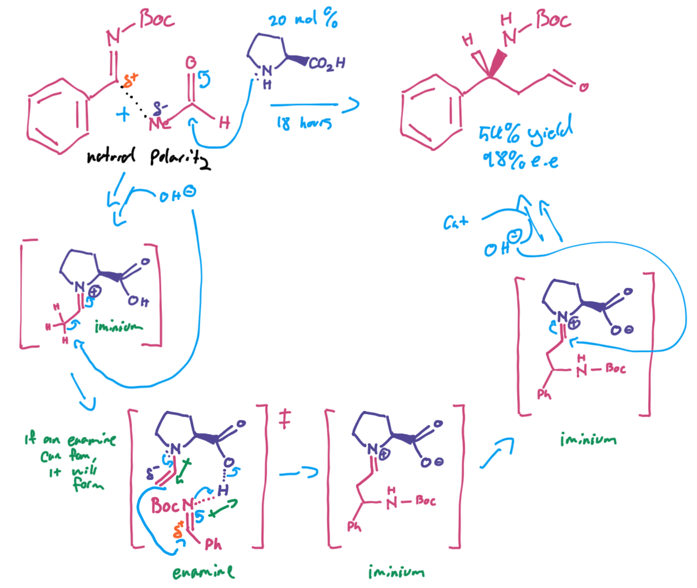{: style="width: 90%;" class="center sharp"}

### Acyl Anion Reaction ($\ce{C#N-}$)

The oldest organocatalytic reaction was discovered in the 1830s and involves reversing the polarity of the carbonyl carbon. This form however is limited in that it uses toxic cyanide and is non-enantioselective, due to the VERY small cyanide ion size. In it's basic cyanide form, it's mostly useful for dimerisation of carbonyl compounds. they take the general form of:

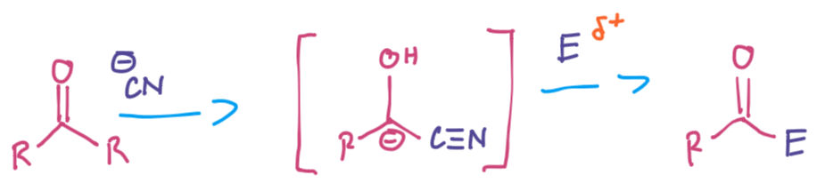{: style="width: 60%;" class="center sharp"}

These reactions are identifiable by their distinct $\ce{1,2-dioxy}$ or $\ce{1,4-dioxy}$ structures, which go against the natural polarity that you'd expect of these reactions.

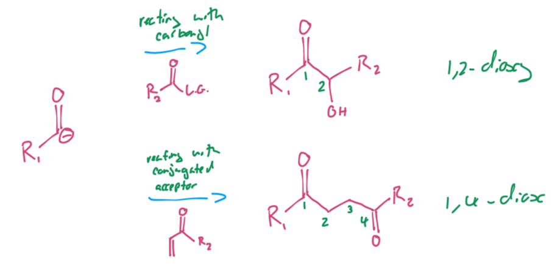{: style="width: 80%;" class="center sharp"}

The key to these reactions working is the cyanohydrin ion, which is most similar to an acyl anion.

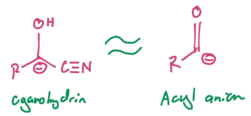{: style="width: 35%;" class="center sharp"}

???+ info "Mechanism"
	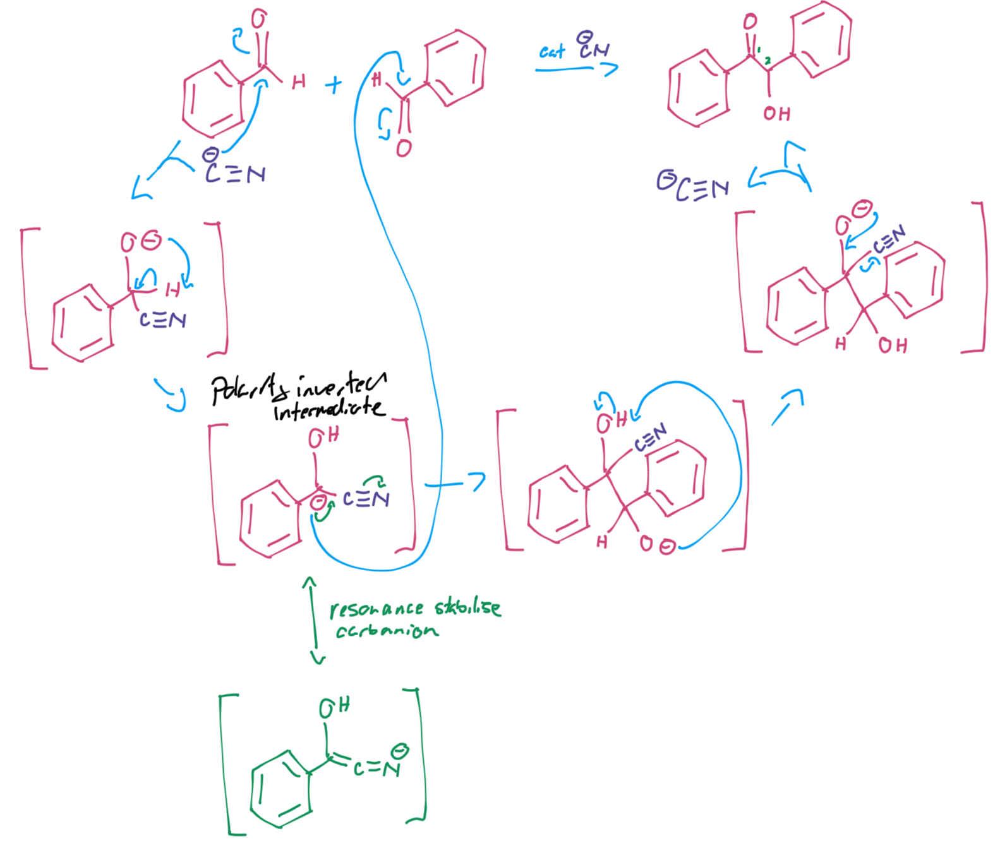{: style="width: 100%;" class="center sharp"}

### Carbene

To address the issues with cyanide based catalysts, we can use N-heterocyclic carbene based molecules instead. These functionalities have a lone pair of electrons and are sp2 hybridised, though because of two bonds, despite their strange structure, they are formally neutral molecules.

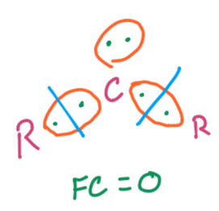{: style="width: 15%;" class="center sharp"}

A full carbene catalyst may look like this with chiral components, but we'll either be dealing with just the catalyst core, or more likely, if we need to deal with a mechanism, just the CN based acyl anions.

The main thing to note here is that the polarity of the starting molecule is not conducive to bonding, though through the catalytic intermediate, the carbanion is formed that can attack the conjugated acceptor.

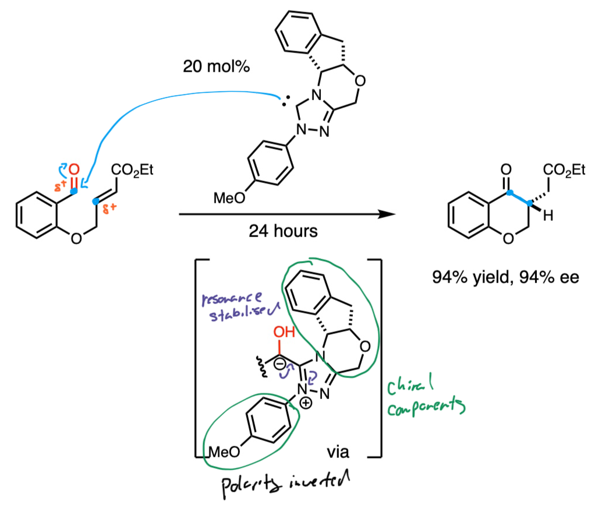{: style="width: 700%;" class="center sharp"}

A full mechanism might look more like this, though is unlikely to be assessed.

???+ info "Mechanism"
	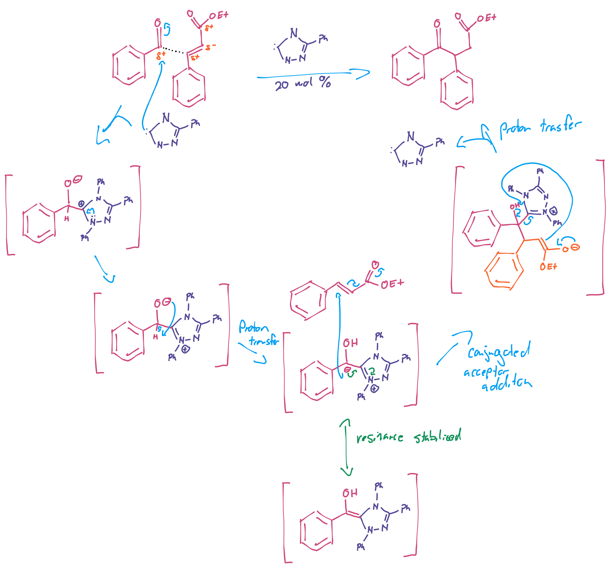{: style="width: 100%;" class="center sharp"}

