# Transition Metal Catalysis 2

## Summary of Cross Coupling

???+ info "Cross Coupling Overview"
	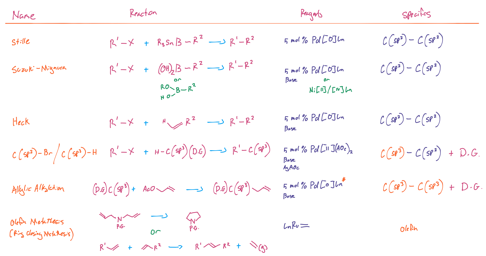{: style="width: 100%;" class="center sharp"}

## Heck Cross Coupling

An even more simple variation on the Stille starting point is the Heck cross coupling reaction which replaces the boronate or stannane with an even simpler alkene.

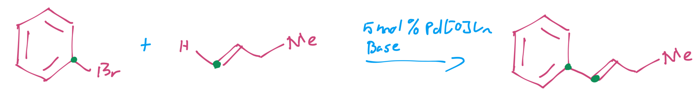{: style="width: 70%;" class="center sharp"}

This cycle uses the β-hydride elimination to it's advantage to re-form the alkene after it's broken by the catalyst. It still requires a $\ce{C(sp^2)-X}$ to work though.

???+ info "Catalytic Cycle"
	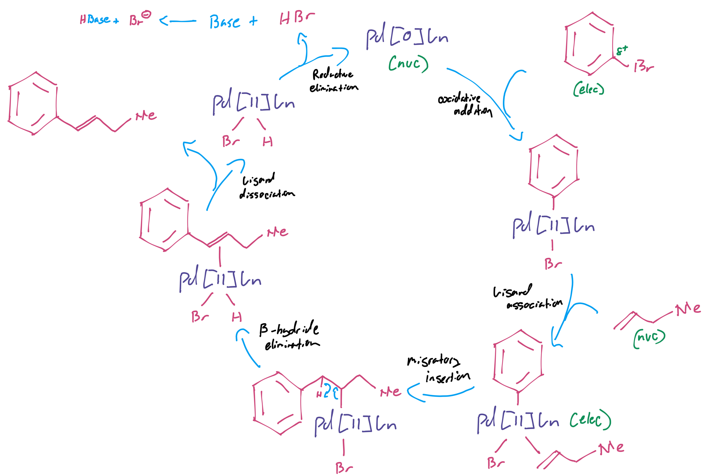{: style="width: 100%;" class="center sharp"}

## Saegusa-Ito Oxidation

### Base Oxidation

We can also use palladium catalysts for oxidation reactions as shown in the reaction below

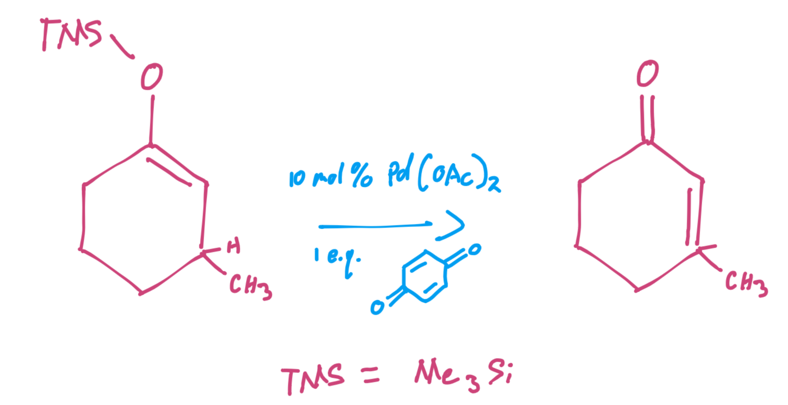{: style="width: 40%;" class="center sharp"}

The palladium adds in to the aldol form which allows the ketone to form and eliminates the β-hydride to re-form the alkene.

???+ info "Catalytic Cycle"
	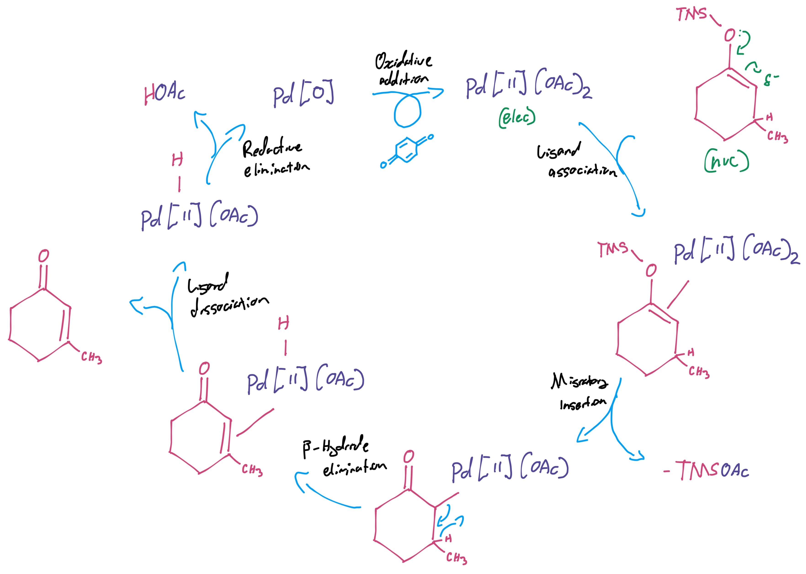{: style="width: 100%;" class="center sharp"}

### α,β-Unsaturated Ketone Methylation

The Saegusa-Ito oxidation can also be used to methylate an α,β-unsaturated ketone using a Grignard and a copper bromide, with $\ce{O2}$ instead of the benzoquinone as the oxidising agent.

!!! note
	The addition of the $\ce{CuBrMe2S}$ stopes the Grignard from adding in to the carbonyl carbon and makes it add in to the β position.

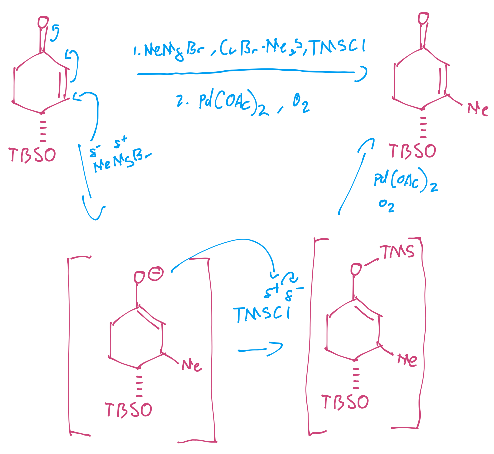{: style="width: 50%;" class="center sharp"}

### α,β-Unsaturated Ketone Formation

If we deprotonate a cyclic ketone with a strong base ($\ce{LiHMDS}$, we can also use the Saegusa-Ito oxidation to form an α,β-unsaturated ketone with $\ce{TMSCl}$.

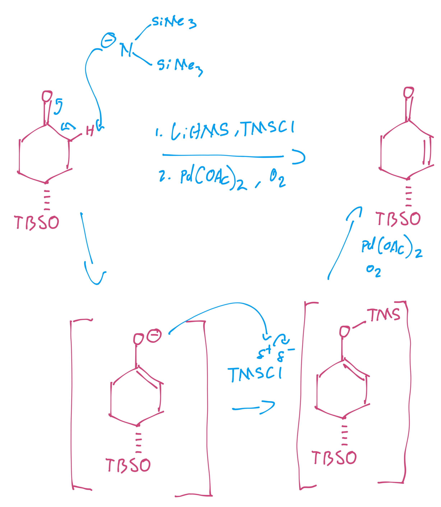{: style="width: 50%;" class="center sharp"}

## $\ce{C(sp^3)-H}$ Cross Coupling

This is the most useful tool, but it's one of the most difficult for a number of reasons:

* The $\ce{C-H}$ is the most common type in organic molecules, so selectivity is really tricky
* The $\ce{C-H}$ bond is also very strong (1.2-1.5x as strong as a $\ce{C-Br}$ bond) which means that you'd likely need forcing conditions to remove them.

What we can do instead is use a directing group (DG) to control what the catalysts can react with. In this way we can use the specifics of the geometry that form with the catalyst and directing group to position a specific $\ce{C(sp^3)}$ to β-hydride eliminate from.

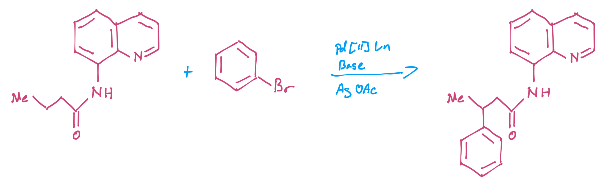{: style="width: 70%;" class="center sharp"}

In this reaction we can see that the Pd catalyst coordinates to form two 5 membered rings with the directing group and the carbon we want to couple. This process requires the use of $\ce{AgOAc}$ to replenish the consumed ligands in the process.

???+ info "Catalytic Cycle"
	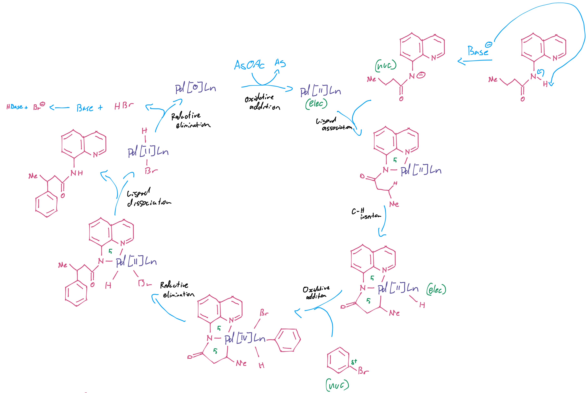{: style="width: 100%;" class="center sharp"}

This still requires the use of an $\ce{sp^3}$ hybridised component to couple on though.

## Allylic Alkylation

We can completely remove any $\ce{sp^2}$ components if we want to add on an allyl ion, as it will be stable in how it binds to the catalyst. We just need to add it as the acetate to activate the coupling carbon.

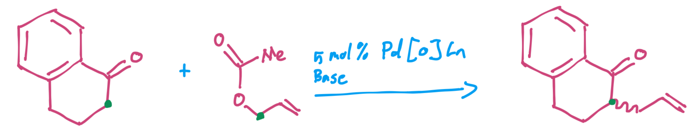{: style="width: 60%;" class="center sharp"}

We still require the base to be able to act as a partner for the transmetallation step though, as with the Suzuki-Miyaura coupling.

???+ info "Catalytic Cycle"
	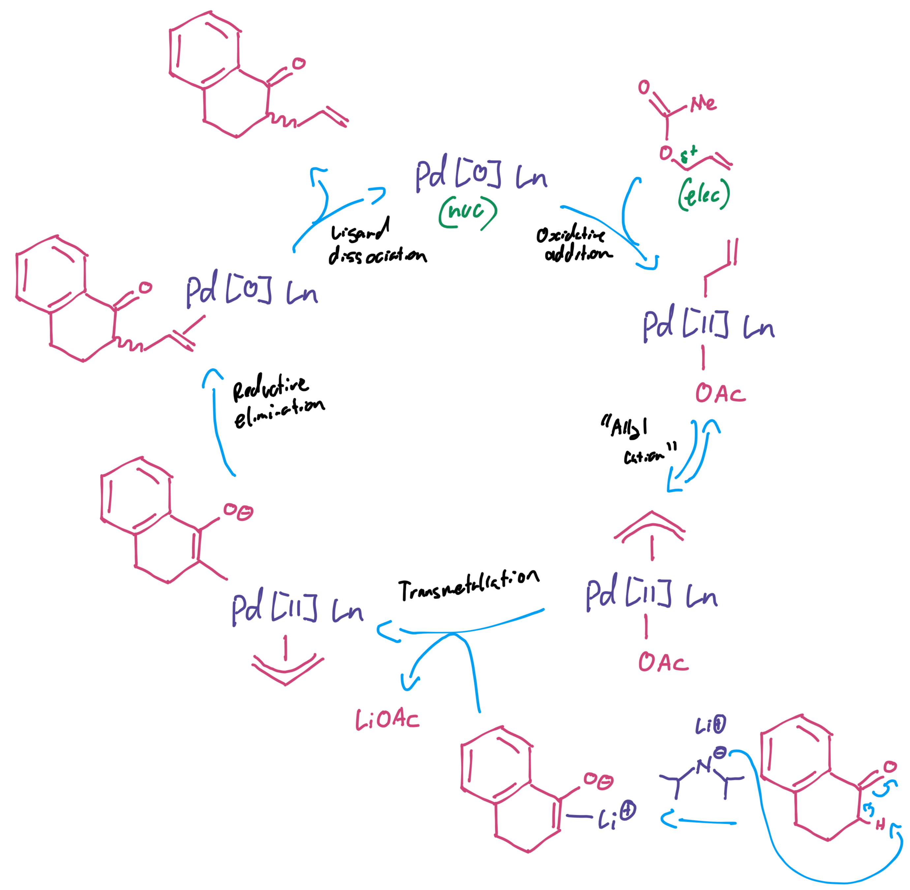{: style="width: 70%;" class="center sharp"}

As can be seen though, we're now starting to form chiral products, as we're dealing with $\ce{sp^3}$ hybridised carbons. Some chiral ligands that are commonly used for this reaction look like the following:

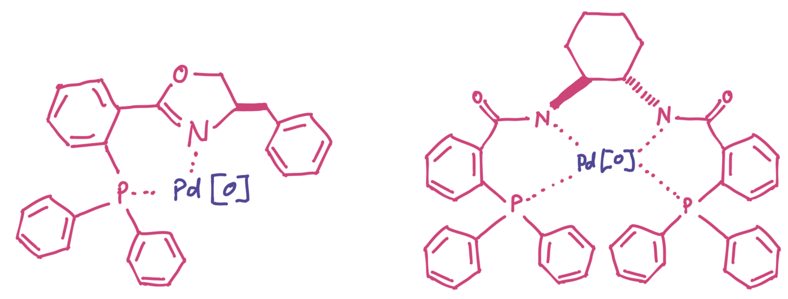{: style="width: 60%;" class="center sharp"}

## Olefin Metathesis

Metathesis is the act of redistributing fragments of one thing to build another, and this can be seen in the base mechanism of the olefin metathesis. The two components end up redistributing their carbons to form new products. The mechanism below also shows that the reactants can only combine in one way to form the product, which is entropically driven (rather than being enthalpically driven by the stability of the products). If they combine in the wrong way, they will just form the starting products over again.

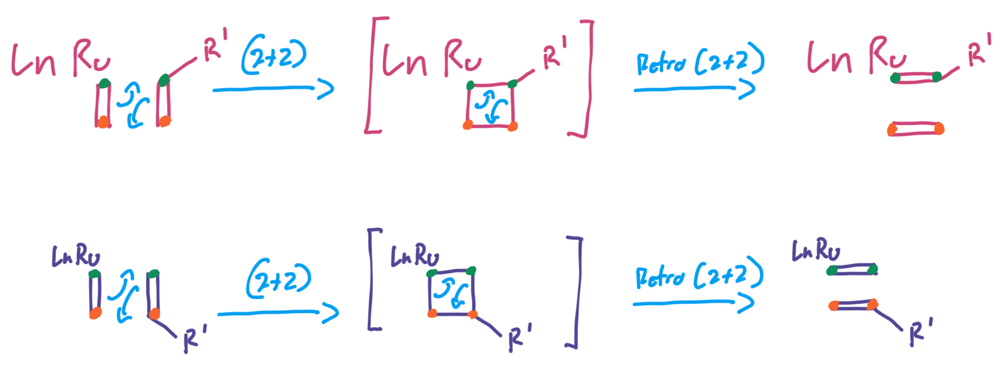{: style="width: 60%;" class="center sharp"}

In practice, the cycle looks something like this, with two key things to remember:

1. The ruthenium must be on the same side as the $\ce{R}$ group for the products to form
2. The ruthenium must also be on the outside of the molecule

???+ info "Catalytic Cycle"
	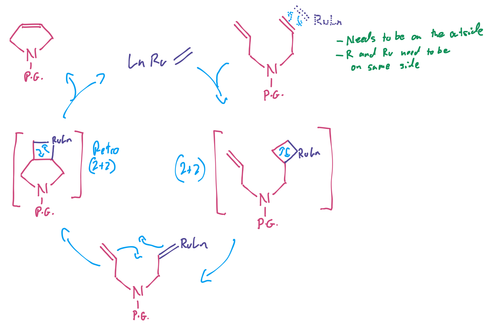{: style="width: 80%;" class="center sharp"}

## Putting it all Together

Putting it all into the one process we can see how these were used by Merck to produce some research compounds for the treatment of type II diabetes.

Since this is MedChem, it breaks some rules, such as using toxic metals and expensive reagents, but this is a research drug that is in testing to see if it's viable, which means that expensive cleanup process can be used. If the drug proves worthwhile, it's synthesis can be refined to avoid the use of these toxic metals and to make it more friendly to industrial processes.

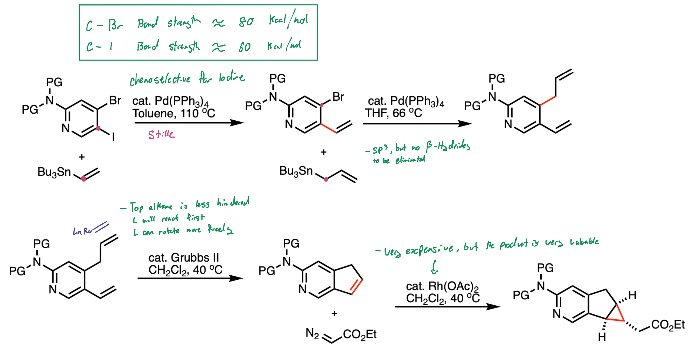{: style="width: 100%;" class="center sharp"}
