# Chemoselectivity - Reduction

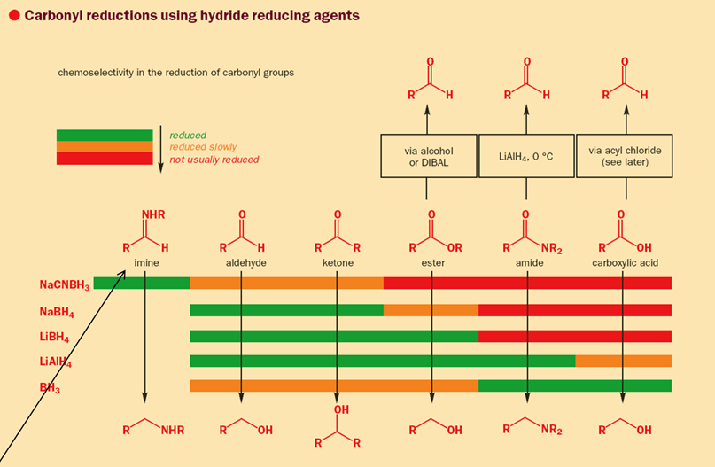{: style="width: 80%;" class="center sharp"}

| Reagent        | Solvent                                  | Conditions                                                   |
| -------------- | ---------------------------------------- | ------------------------------------------------------------ |
| $\ce{NaBH4}$   | Protic Solvents ($\ce{EtOH, MeOH, H2O}$) | $+\ce{CeC3l}$ for $\alpha,\beta$-unsaturated carbonyl preservation |
| $\ce{LiBH4}$   | Protic Solvents ($\ce{EtOH, MeOH, H2O}$) |                                                              |
| $\ce{NaCNBH4}$ | Protic Solvents ($\ce{EtOH, MeOH, H2O}$) |                                                              |
| $\ce{LiAlH4}$  | Typically THF                            | $0^\circ C$ for ⟶ Aldehyde ($+\ce{KMnO4}$, be careful not to oxidise anything else...) + $\ce{H+}$ for amide ⟶ aldehyde |
| $\ce{BH3}$     | Typically THF                            |                                                              |
| $\ce{DIBAL}$   | Typically THF or hexane                  | $-70^\circ C$ $+\ce{H+}$ for ester ⟶ aldehyde $+\ce{H+}$ workup for nitrile ⟶ aldehyde |

!!! note "The three main types of selectivity"
	Chemoselectivity: Which functional group will react 
	Regioselectivity: Where it will react 
	Stereoselectivity: How it will react (which configration) 

## Reactivity of Carbonyl Groups Towards Nucleophiles

Aldehydes are the most reactive because there's no hinderance and the electron density of the carbonyl is not being withdrawn. The further to the right we go, the more electron withdrawing the $\alpha$ groups are and the less reactive the carbonyl carbon.

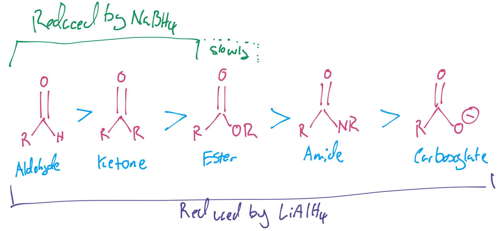{: style="width: 50%;" class="center sharp"}

We can select our reducing agent to ensure that only desired functional groups will be reduced.

#### Reducing Agent Potency in Increasing Strength

| Reducing Agent | Ability                                                      |
| -------------- | ------------------------------------------------------------ |
| $\ce{NaBH4}$   | Reduces ketones and aldehydes, but not esters                |
| $\ce{LiBH4}$   | Replacing the $\ce{Na}$ with a $\ce{Li}$ counterion makes $\ce{LiBH4}$ more reactive |
| $\ce{LiAlH4}$  | The $\ce{Al-H}$ bond is weaker than the $\ce{B-H}$ rendering $\ce{LiAlH4}$ the most reactive |

* It's best to use the most mild reducing agent possible
* $\ce{NaBH4}$ is the easiest to handle and $\ce{LiAlH4}$ catches fire when wet

### Reducing Aldehydes and Ketones with $\ce{NaBH4}$

Here, the $\ce{NaBH4}$ is consumed and produces $\ce{EtOBH3}$ (with the solvent) which is a further reducing agent. In this reduction we don't want to reduce the nitro group so we use $\ce{NaBH4}$. ==As a result of this, $\ce{NaBH4}$ requires the use of protic solvents or to be in the presene of electrophilic cations ($\ce{Li^{2+}, Mg^{2+}}$).==

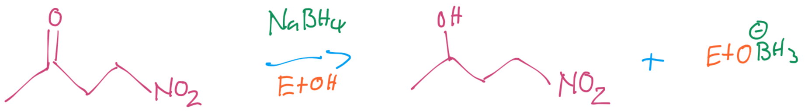{: style="width: 50%;" class="center sharp"}

??? note "Mechanism"
	
	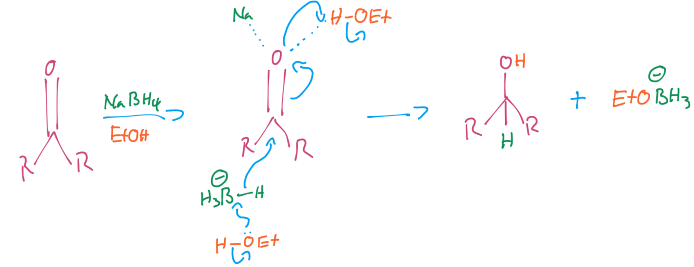{: style="width: 100%;" class="center sharp"}

#### Reducing $\alpha,\beta$-unsaturated carbonyl compounds with $\ce{NaBH4}$

In this case, the $\ce{NaBH4}$  will reduce the $\alpha,\beta\hskip{0.1cm}\ce{C=C}$ as well with 100% yield, however if we use $\ce{CeCl3}$ which acts as a hard Lewis-acidic metal salt, we can make the reduction regioselective to the carbonyl group.

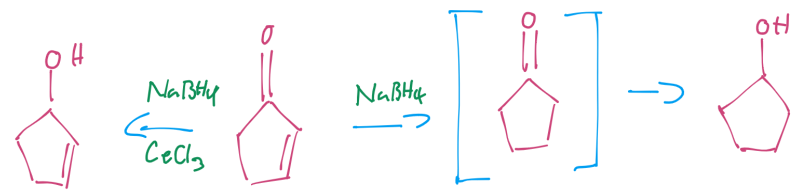{: style="width: 50%;" class="center sharp"}

### Reduction of Esters

In alcoholic solutions, $\ce{LiBH4}$ will reduce esters over carboxylic acids

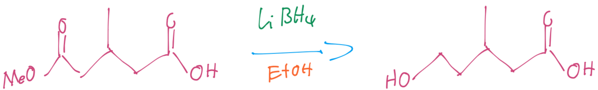{: style="width: 50%;" class="center sharp"}

??? note "Mechanism"
	
	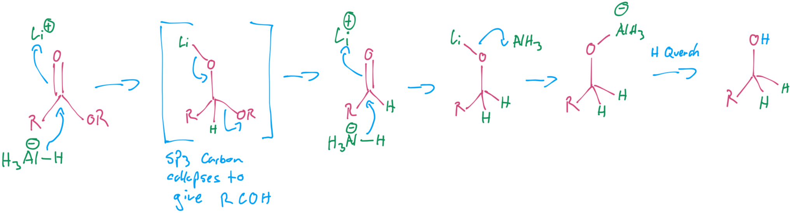{: style="width: 100%;" class="center sharp"}

### Reduction of Amides with  $\ce{LiAlH4}$

The $\ce{C-O-Li -> C-O-AlH3}$ is constant among  $\ce{LiAlH4}$ reduction. Note that compared with the reduction of esters, the tetrahedral intermediate doesn't result in the elimination of the amine.

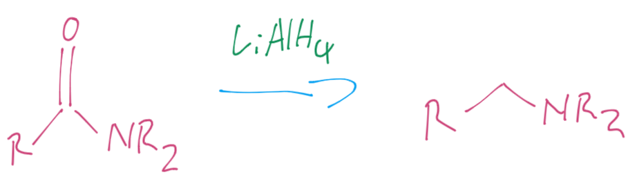{: style="width: 40%;" class="center sharp"}

??? note "Mechanism"
	
	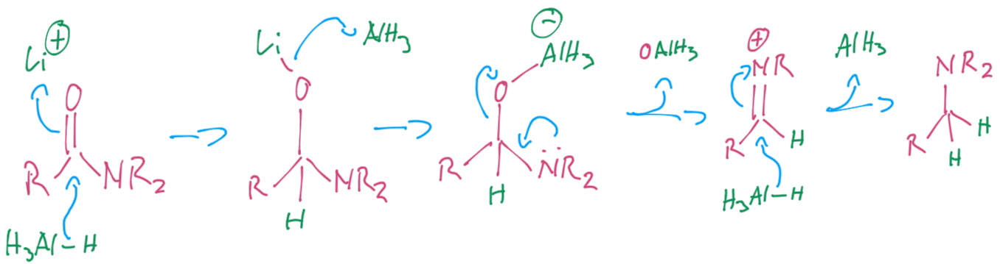{: style="width: 100%;" class="center sharp"}

### Reduction of Carboxylic Acids

The borane ($\ce{BH3}$) will not touch the acyl chlorides, and it reduces esters slowly, as the carbonyl groups are relatively electron poor, since the Cl and OR are highly electronegative, however borane will reduce amides.

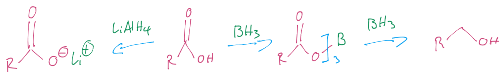{: style="width: 60%;" class="center sharp"}

### Reduction of Esters and Amides to Aldehydes

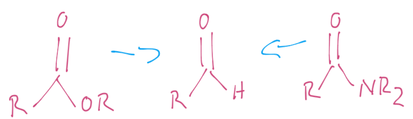{: style="width: 35%;" class="center sharp"}

This can be done in one or two steps

#### Two Steps

The two step method works by first reducing the ether to an alcohol as per the [Reduction of Esters](#reduction-of-esters) then oxidises the ester with $\ce{Cr^{VI}}$

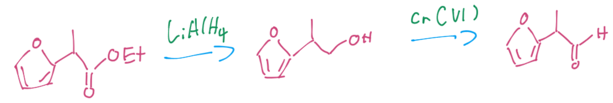{: style="width: 50%;" class="center sharp"}

#### One Step - DIBAL

The one step mechanism requires the use of DIBAL (diisobutyl aluminium hydride - *i*-Bu$_2$AlH), which like borane, becomes active upon forming it's lewis acid complex.

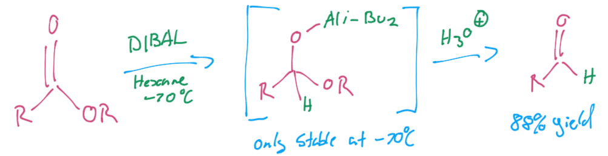{: style="width: 50%;" class="center sharp"}

??? info "DIBAL (diisobutyl aluminium hydride - *i*-Bu$_2$AlH)"
	
	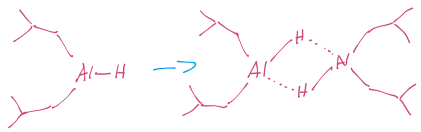{: style="width: 50%;" class="center sharp"}

#### One Step -  $\ce{LiAlH4}$

They can also be reduced through with  $\ce{LiAlH4}$ with the typical  $\ce{C-O-Li -> C-O-AlH3}$ mechanism. The tetrahedral intermediate is only stable at 0$^\circ$C.

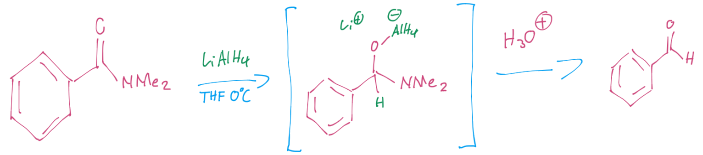{: style="width: 60%;" class="center sharp"}

### Reducing Lactones to Lactols

Lactones are cyclic esters and lactols are the hemiacetal that results from their reduction. they can be reduced through the use of DIBAL.

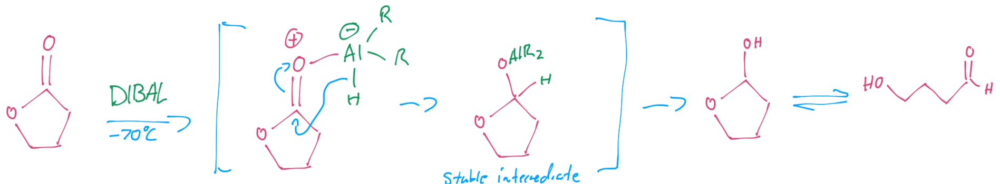{: style="width: 70%;" class="center sharp"}

### Reducing Nitriles to Aldehydes

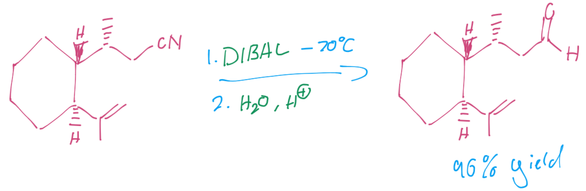{: style="width: 40%;" class="center sharp"}
