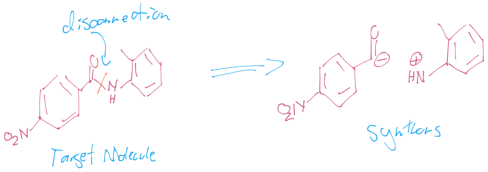
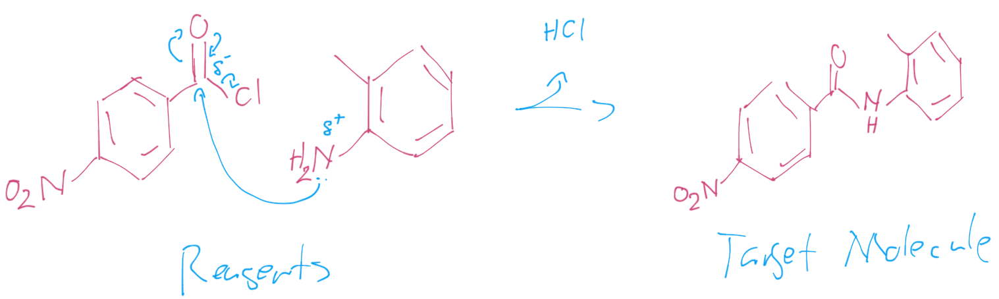
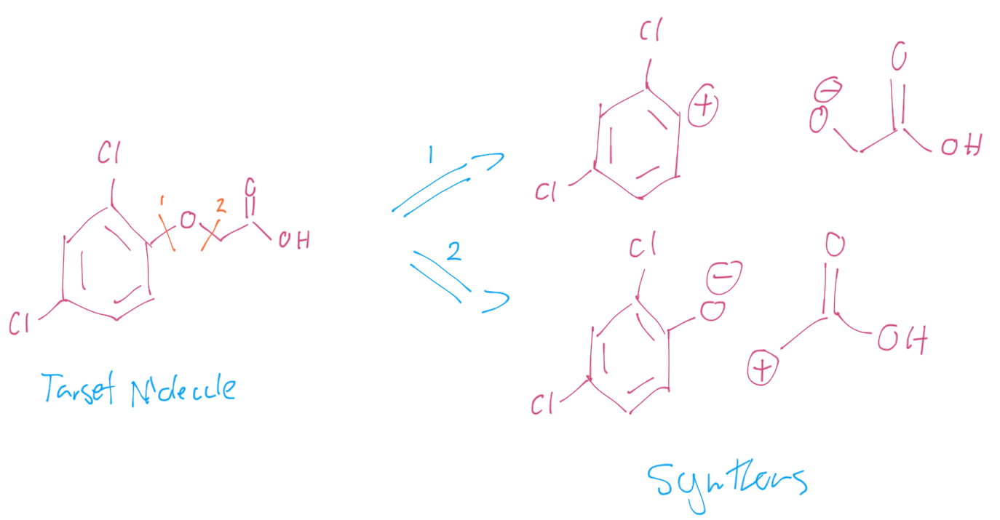
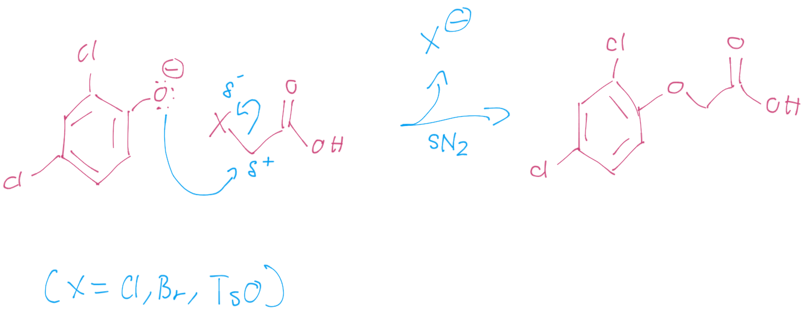
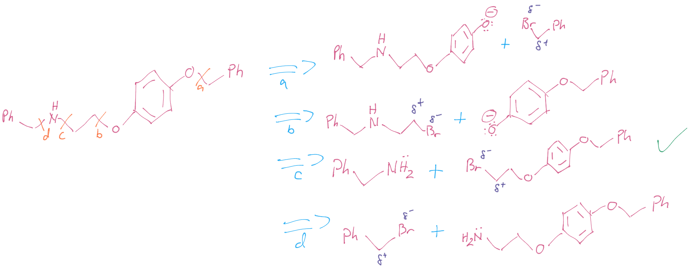
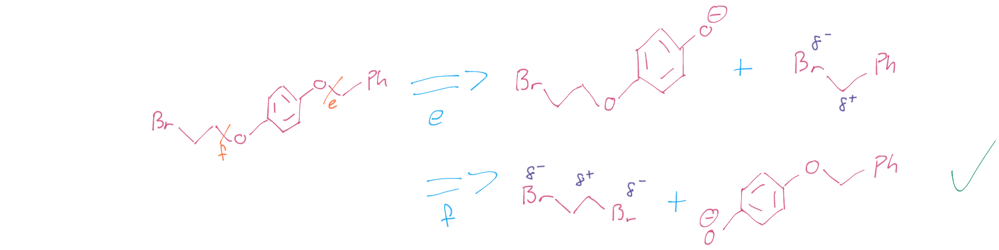
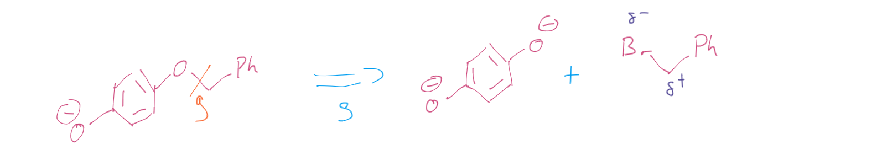
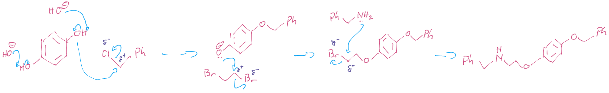
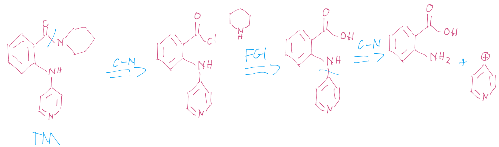
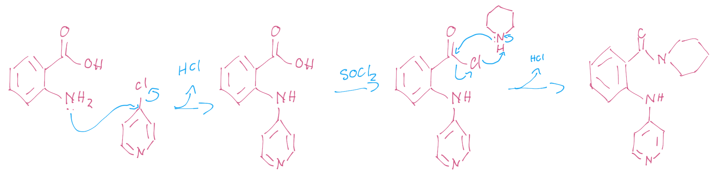

# Retrosynthesis

Retrosynthesis is the process of taking a product and figuring out what reagents you could use, with what reactions to form it (denoted by the retrosynthetic arrow ⟹):

$$
\ce{X + Y -> Z}\\
\ce{Z ⟹ X + Y}
$$

The ideal charged fragments are called **synthons**.

### Guidelines

1. Disconnections must correspond to known, reliable reactions
2. For molecules with heteroatoms, these are some of the simplest reactions, so disconnect next to them
3. consider backtracking and trying a different retrosynthetic route to avoid chemoselectivity problems
   * try disconnecting more reactive groups first to avoid this issue
4. Use two group disconnections wherever possible (don't just cleave a single group off).

From here it's best to think about your toolbox and what reactions you know.

!!! note "Example 1"
	
	For the retrosynthesis below, the heteroatom is the nitrogen and the cut is made next to the carbonyl because it's a simple reaction to form them back up.
	
	{: style="width: 60%;" class="center sharp"}
	
	We can take the synthons produced and figure out what functionality will give us the synthos we require. in this case, the acyl chloride will give us the negative carbon and a primary amine will have an inherent partial positive charge to match 
	
	{: style="width: 60%;" class="center sharp"}

!!! note "Example 2"
	
	In this one, our heteroatom is the ether oxygen and we can cut is on either side. If we cut it on the left, we end up with retrosynthesis **1** which would be a difficult choice of synthons, however retrosynthesis **2** is much more doable.
	
	{: style="width: 60%;" class="center sharp"}
	
	In this case, we can use the oxygen as the nucleophile for an SN2 reaction on an electropositive carbon.
	
	{: style="width: 60%;" class="center sharp"}

## Multi-Step Retrosynthesis

When you're faced with a multi-step retrosynthesis, this is where you should start to think about chemoselectivity

!!! note "Example 3"
	
	### Step 1
	
	{: style="width: 80%;" class="center sharp"}
	
	### Step 2
	{: style="width: 80%;" class="center sharp"}
	
	### Step 3
	{: style="width: 80%;" class="center sharp"}
	
	### Final Reaction
	{: style="width: 80%;" class="center sharp"}

## Functional Group Interconversion (FGI)

We can also think about how we can convert between functionalities to get to our product.

!!! note "Example 4"
	
	### Retrosynthesis
	
	{: style="width: 80%;" class="center sharp"}
	
	### Synthesis
	
	{: style="width: 80%;" class="center sharp"}

