# Chemoselectivity - Oxidation

| Reagent                                                      |  → aldehyde  | 2$^\circ$ alcohol → ketone | Functions                                              |
| ------------------------------------------------------------ | :----------: | :------------------------: | ------------------------------------------------------ |
| Jones Conditions ($\ce{Na2Cr2O7, H2SO4, acetone}$)           | if anhydrous |            yes             | common for non-acid sensitive                          |
| PCC (Pyridinium chlorochromate)                              | if anhydrous |            yes             | acid sensitive alcohols                                |
| PDC (Pyridinium dichromate)                                  | if anhydrous |            yes             |                                                        |
| TPAP (terapropylammonium perruthenate)  NMO (optional) will regenerate the TPAP catalytically | if anhydrous |            yes             | can be regenerated catalytically                       |
| Dess-Martin periodinate                                      | if anhydrous |            yes             | IBX precursor is insoluble and slow (good for control) |
| Swern                                                        |     yes      |            yes             |                                                        |
| $\ce{KMnO4}$                                                 |      no      |            yes             | used if you want to over-oxidise to an acid            |

### Solvent: Use DCM unless water is required

## Aldehydes → Carboxylic Acid (overoxidation/complet oxidation)

While most reagents in an aqueous solution will manage to completely oxidise an aldehyde due to their [equilibrium with their hydrated form](#primary-alcohols-aldehyde), possibly the most simple method is to use an aqueous solution of $\ce{Cr^{VI}}$ or an acidic/basic solution of $\ce{KMnO4}$.

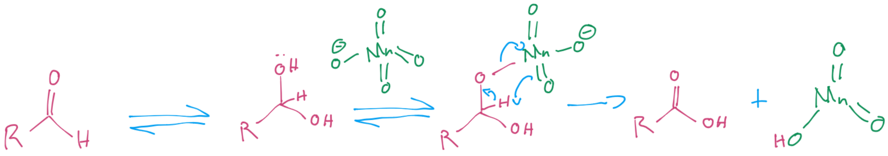{: style="width: 70%;" class="center sharp"}

## Secondary Alcohols → ketones

For secondary alcohols, pretty much all oxidising agents will work to convert them to a ketone.

### Jones Oxidation

Jones oxidation is often used for alcohols that aren't acid sensitive, as it's difficult to over oxidise 

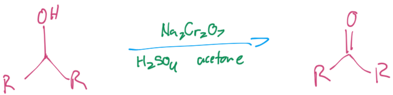{: style="width: 40%;" class="center sharp"}

A good alternative if the alcohol is acid sensitive is to use PCC

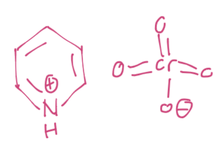{: style="width: 20%;" class="center sharp"}

??? note "Mechanism"
	
	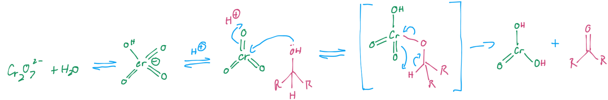{: style="width: 100%;" class="center sharp"}

## Primary Alcohols → Aldehyde

Primary alcohols can be oxidised to either an aldehyde (partial oxidation) or a carboxylic acid (complete oxidation).

In aqueous situations, the carboxylic acid will be in equilibrium with its hydrated form, which is readily oxidised to a carboxylic acid. ==This means that primary alcohols cannot be oxidised to aldehydes in an aqueous environment==

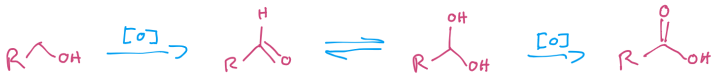{: style="width: 70%;" class="center sharp"}

??? note "Mechanism"
	
	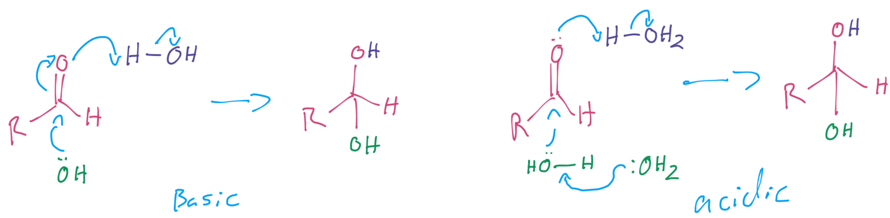{: style="width: 100%;" class="center sharp"}

### Other Oxidising Agents

Some other oxidising agents to use could be Pyridinium chlorochromate PCC, pyridinium dichromate (PDC) or tetrapropylammonium perruthenate (TPAP)

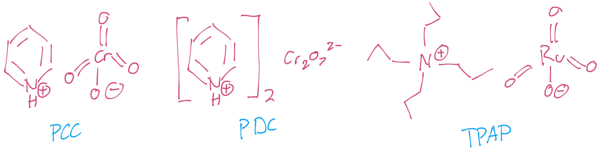{: style="width: 70%;" class="center sharp"}

#### Tetrapropylammonium Perruthenate (TPAP)

TPAP is a mild oxidising agent that can be regenerated in situ to use it catalytically

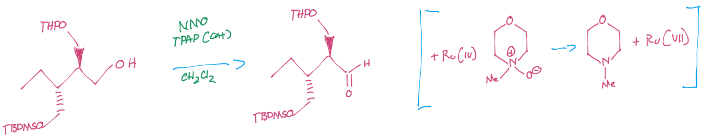{: style="width: 80%;" class="center sharp"}

#### Dess-Martin Periodinane

Is another mild oxidising agent that has the ability to oxidise very sensitive alcohols to carbonyl compounds. Dess-Martin periodinane is made from IBX, which is a useful oxdising agent in itself, as it's insoluble in many organic solvents, ==meaning that it can be reacted slowly and filtered off, to control the level of oxidation==.

Dess-Martin periodinane is acetylated which makes it much more soluble in organic solvents and is in turn more reactive.

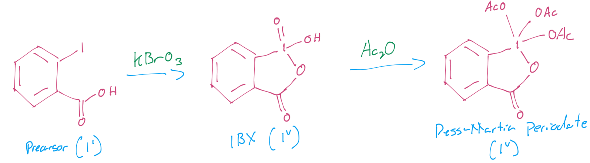{: style="width: 70%;" class="center sharp"}

#### Swern Oxidation

Is another mild oxidising agent that will convert a primary alchol to an aldehyde. One of the products is $\ce{Me2S}$ which smells really bad, so the reaction needs to be carried out in a fume cupboard and all the glassware involved needs to be bleached ASAP.

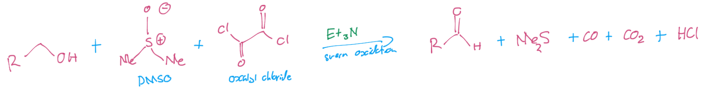{: style="width: 80%;" class="center sharp"}

??? info "Mechanism (assessable)"
	
	#### Generation of the reagent
	
	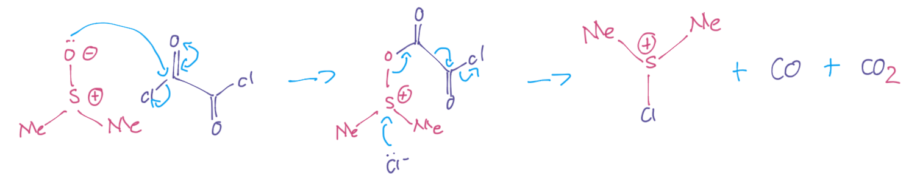{: style="width: 80%;" class="center sharp"}
	
	#### Reaction itself
	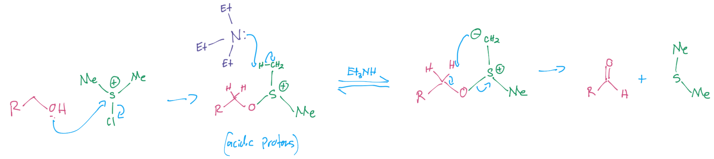{: style="width: 80%;" class="center sharp"}
