# Protecting Groups

| Protecting Group        | Structure                                                    | Protects                 | From                       | Protection                                                   | Deprotection                       |
| ----------------------- | ------------------------------------------------------------ | ------------------------ | -------------------------- | ------------------------------------------------------------ | ---------------------------------- |
| acetal (dioxolane)      | 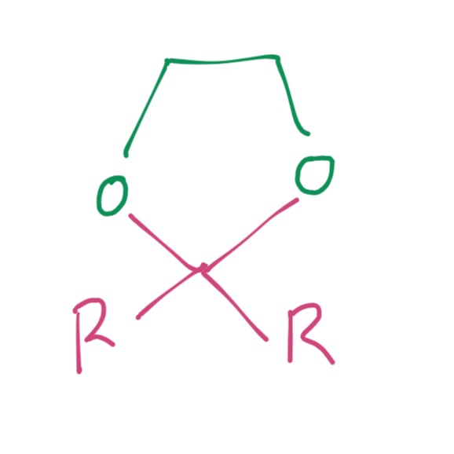{: style="max-width: 110px;" class="center sharp"} | ketones, aldehydes       | nucleophiles, bases        | 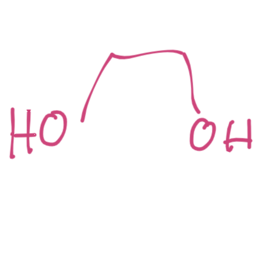{: style="max-width: 110px;" class="center sharp"} $+\ce{H+}$ Requires the removal of $\ce{H2O}$ to drive the reaction | water, $\ce{H+}$ cat               |
| trialkylsilyl (TBDMS)   | {: style="max-width: 110px;" class="center sharp"} $\ce{RO-SiMe3Bu^t}$ $\ce{RO-SIMe3}$ can be used but will be removed by $\ce{H2O}$ or $\ce{MeOH}$ | alcohols (OH in general) | nucleophiles, C or N Bases | $\ce{R3SiCl}$, base                                          | $\ce{H+}$, $\ce{H2O}$ or $\ce{F-}$ |
| tetrahydropyranyl (THP) | 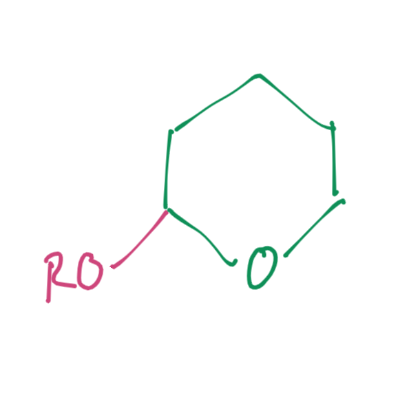{: style="max-width: 110px;" class="center sharp"} | alcohols (OH in general) | strong bases               | 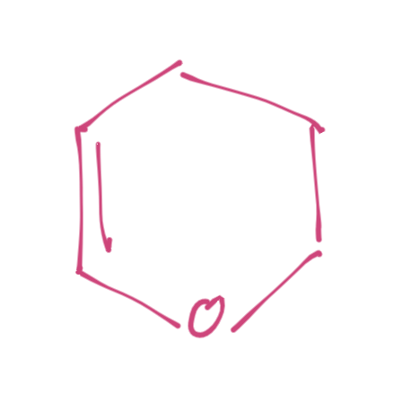{: style="max-width: 110px;" class="center sharp"} dihydropyran and acid | $\ce{H+,H2O}$                      |
| benzyl ether (OBn)      | 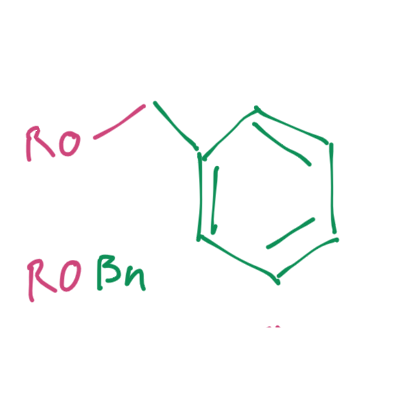{: style="max-width: 110px;" class="center sharp"} | alcohols (OH in general) | almost everything          | $\ce{NaH,BnBr}$                                              | $\ce{H2, Pd/C}$ or $\ce{HBr}$      |
| methyl ether (ArOMe)    | 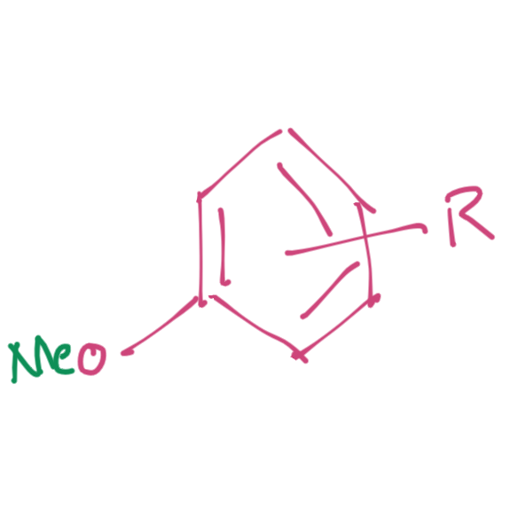{: style="max-width: 110px;" class="center sharp"} | Phenols (ArOH)           | bases                      | $\ce{NaH, MeI}$ or $\ce{(MeO)2SO2}$                          | $\ce{BBr3, HBr, HI, Me3SiI}$       |
| benzyl amine (NBn)      | 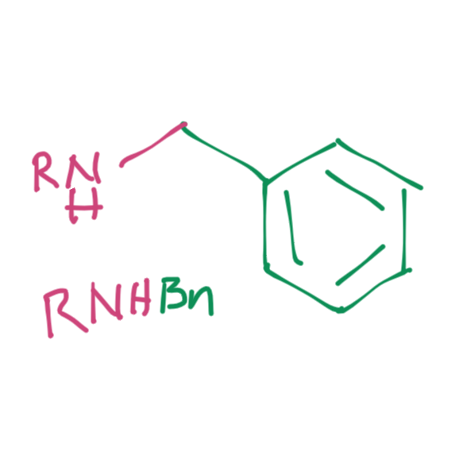{: style="max-width: 110px;" class="center sharp"} | amines                   | strong bases               | $\ce{BnBr, K2CrO3}$                                          | $\ce{H2, Pd/C}$                    |

Protecting groups are components that are added to a molecule to protect one or more of it's functional groups through  other reaction processes. They are vitally important in multi-step synthesis.

In the example below, the Grignard reagent will attack the more electrophilic ketone before the ester, resulting in the incorrect product

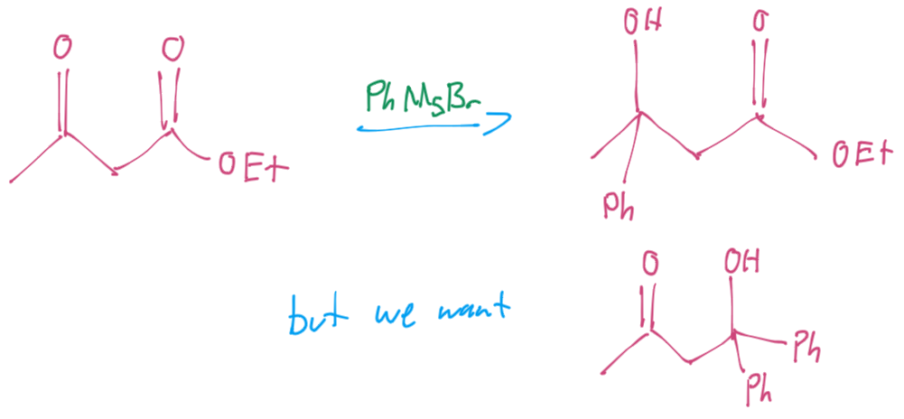{: style="width: 40%;" class="center sharp"}

## Acetal Protecting Groups

We can, however use the ketone's electrophilicity to target the acetal protecting group, before performing the Grignard addition and reducing the acetal → ketone with acid. 

This group is deprotonated under basic conditions, so it can't be used with any basic intermediate reactions. It also produces water when removed, so we need to remove this to pull the equilibrium forward (use a Dean-Stark apparatus)

!!! note "Double Reaction"
	The ester R group acts as a good leaving group, so we'll end up reducing the ester → ketone → alcohol, through two Grignard additions

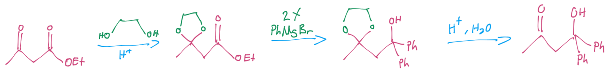{: style="width: 80%;" class="center sharp"}

??? note "Mechanism"
	
	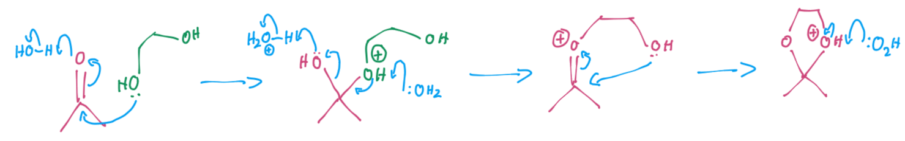{: style="width: 80%;" class="center sharp"}

## Hydroxyl Protecting Groups

### Silylation (TBDMS)

{: style="width: 50%;" class="center sharp"}

Silicon has a strong affinity for electronegative elements and can be used to protect hydroxyls.

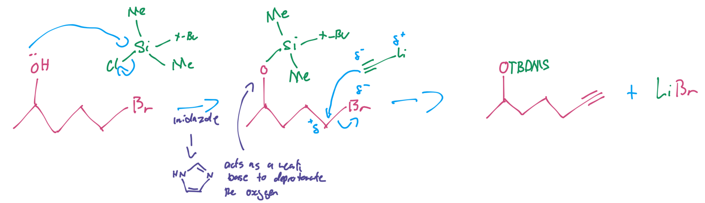{: style="width: 80%;" class="center sharp"}

It can be removed with Fluoride salts or acid/water

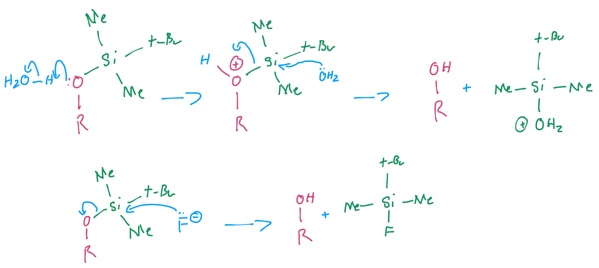{: style="width: 70%;" class="center sharp"}

### Alkyl Ethers (TetraHydroPyranyl THP)

Alkyl ethers don't make particularly good protecting groups because they're easy to put on but can be quite difficult to remove

THP is a good protecting group because it is stable under basic conditions, ==but is susceptible to hydrolysis under acidic conditions.==

THP is not created from a carbonyl compound, and instead uses the oxonium intermediate

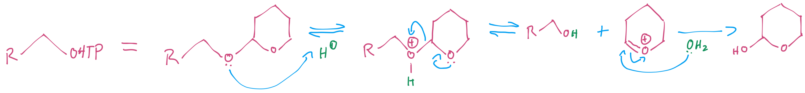{: style="width: 80%;" class="center sharp"}

??? note "In Situ Generation"
	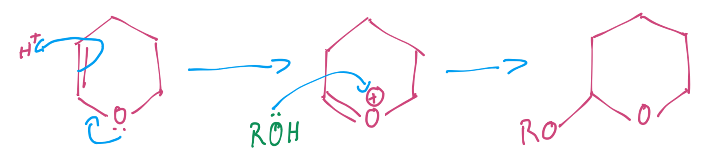{: style="width: 50%;" class="center sharp"}

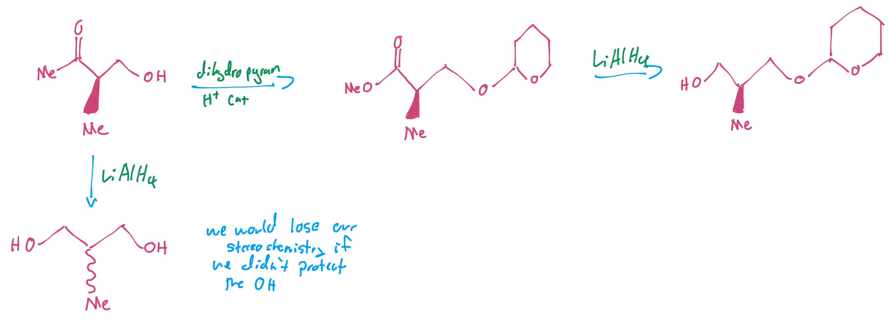{: style="width: 80%;" class="center sharp"}

### Benzyl Ether

Benzyl ethers are a good protecting group because they are only removed by hydrogenation or by certain acids with nucleophilic conjugate bases.

When hydrogenated, the benzyl ether comes off as toluene which is highly volatile and easily removed. ==This must be done with $\ce{H2, Pd/C}$ as anything stronger would hydrogenate the aromatic ring as well.==

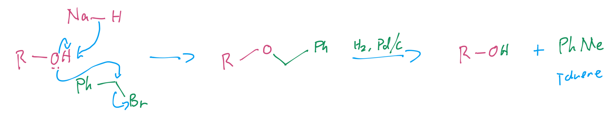{: style="width: 70%;" class="center sharp"}

If using a acid with a nucleophilic base however, you won't get toluene. This is also not a great method of deprotecting the groups if you have other acid sensitive functionality on the molecule

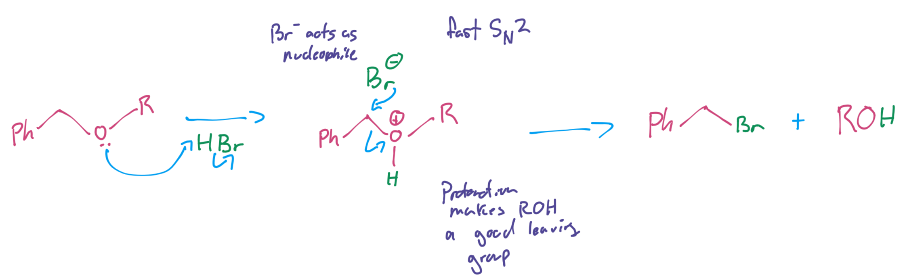{: style="width: 60%;" class="center sharp"}

### Methyl Ether

Methyl ether is considered a bad choice as a protecting group, except for phenol hydroxyls.

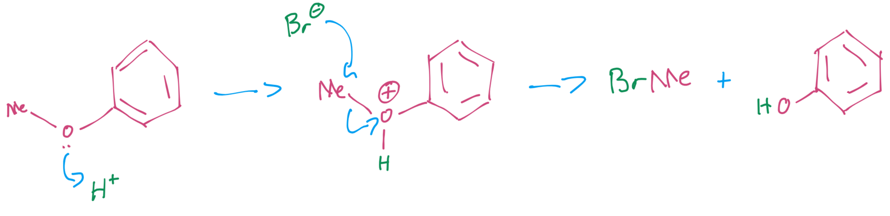{: style="width: 60%;" class="center sharp"}

## Wastefulness

It's important to recognise that protecting groups can be quite wasteful, as you're just adding functionality that will be destroyed again. It can however help to reduct the amount of other components that are used.

In this example, 5 equivalents of Grignard would be required to deprotonate all of the labile hydrogen before the actual Grignard addition can occur.

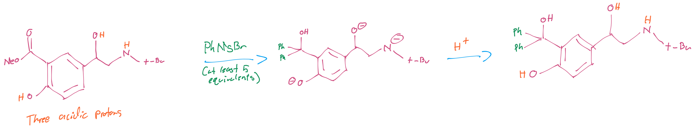{: style="width: 80%;" class="center sharp"}

By protecting those hydroxyls though, we can avoid the need for excess Grignard and can easily remove the protecting groups with $\ce{H2, Pd/C}$ .

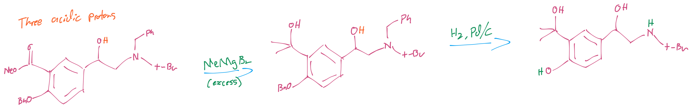{: style="width: 80%;" class="center sharp"}

## Chemoselectivity  - Do we always need protecting groups?

### Reacting the less reactive group

if we try to acetylate this molecule, the most reactive primary hydroxyl will be acetylated first. We could use protecting groups to prevent this from happening, but we don't necessarily need to.

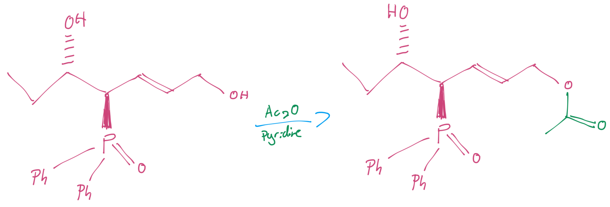{: style="width: 40%;" class="center sharp"}

If instead we react the molecule with an excess of acetic anhydride, we can acetylate both hydroxyls, and since the primary acetyl group will remain more reactive, when we react it with $\ce{K2CO3, MeOH}$, it will be reduced first. If we're careful, we can end up with just the secondary alcohol being acetylated.

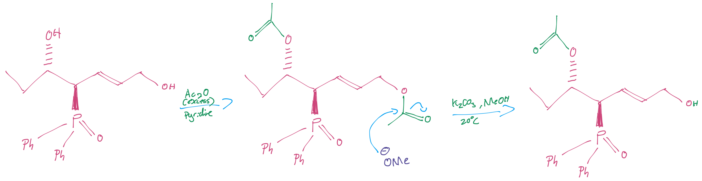{: style="width: 60%;" class="center sharp"}

### Reactions of dianions

In this case, the last hydroxyl to be deprotonated will be the first to react. The proton with the lower $pK_a$ will have the higher $pK_b$, if stoichiometry is observed, then this should be chemoselective

{: style="width: 60%;" class="center sharp"}

### Reactions of anions

This is our desired synthon pathway

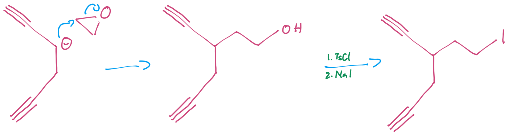{: style="width: 60%;" class="center sharp"}

However when we go to do the reaction, the terminal alkyl hydrogens are more acidic and will react first. So if we protect the protons with lithium, the last lithium site will have the most electronegative carbon and will react first.

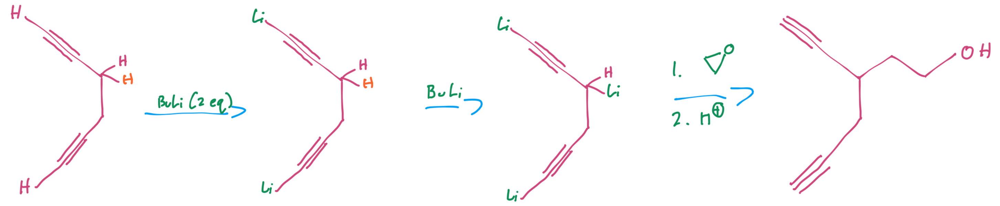{: style="width: 80%;" class="center sharp"}