# Types of Reactions, Diels-Alder and FMO diagrams

There are three primary types of reaction in organic chemistry

#### Polar Reactions

New bond forms between electrophile and nucleophile, with both electrons coming from the nucleophile

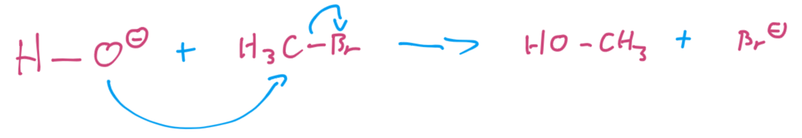{: style="width: 40%;" class="center sharp"}

#### Radical Reaction

Now bond is formed using one electron from each species

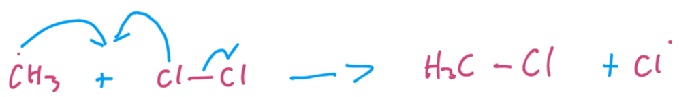{: style="width: 40%;" class="center sharp"}

#### Pericyclic Reactions

The electrons are distributed simultaneously through a cyclic transition state

{: style="width: 40%;" class="center sharp"}

Pericylcic reactions are unaffected by solvents, cannot be catalysed/promoted/inhibited, however are affected by light and are highly stereoselective

## Types of Pericyclic Reactions

There are three types of pericyclic reactions, each defined by how many $\sigma$ bonds are broken or formed int he process

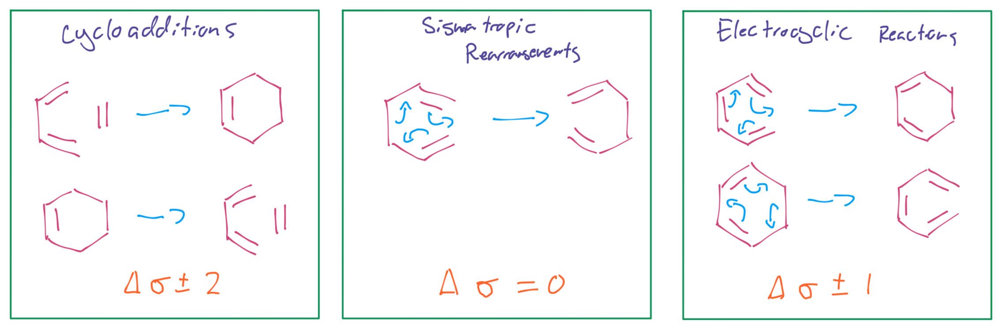{: style="width: 80%;" class="center sharp"}

## FMO Determination

When looking at pericyclic reactions, their ability to perform and their selectivity (regio/stereo) will be determined based on their frontier molecular orbitals.

These are the product of the $\pi$ bond formation between the, producing bonding and antibonding orbitals, each with different phase.

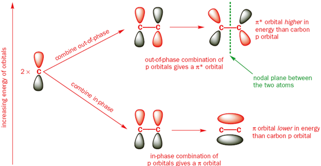{: style="width: 60%;" class="center sharp"}

We can see in the above example that when we combine two pi orbitals we get two resulting orbitals out, but when we combine multiple, as with a conjugated system, we will get more FMOs.

These FMOs will have a distinct energetic order, based on the number of nodes, which in turn determines how many bonding/antibonding interactions happen in each MO.

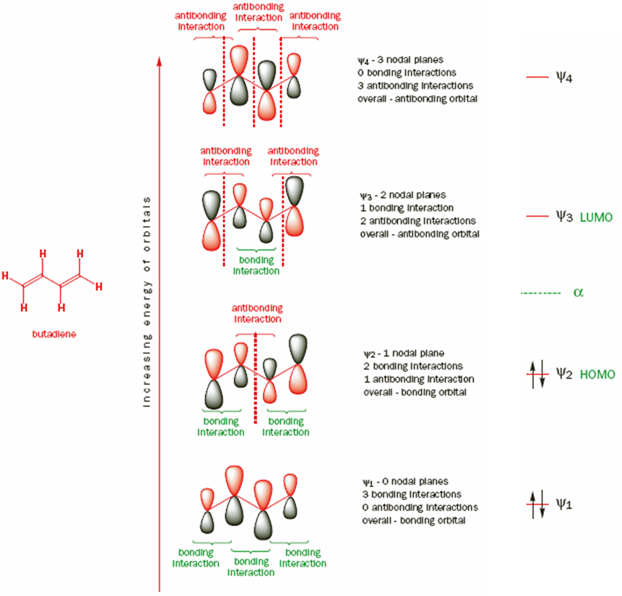{: style="width: 60%;" class="center sharp"}

## Diels-Alder Reactions

Are a [2+4] cycloaddition in which a diene and a dienophile react to form a new cyclic structure. They are able to proceed because they progress though a stable, delocalised transition state that has an aromatic character.

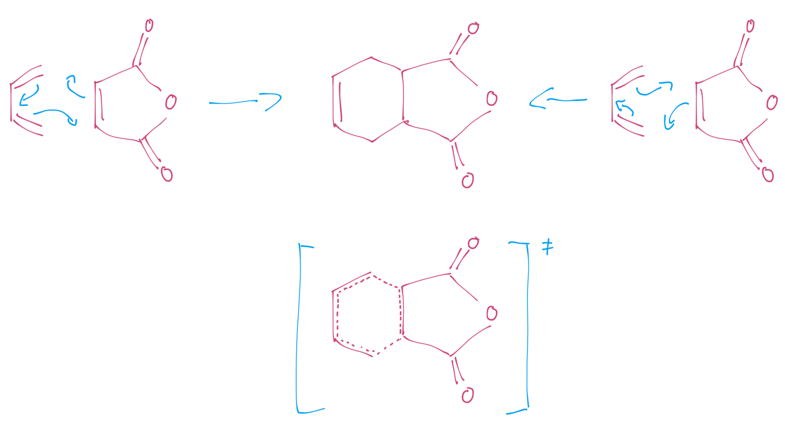{: style="width: 60%;" class="center sharp"}

### Identifying Diels-Alder Adducts for Retrosynthesis

Simply put, al you need to do is look for a six membered ring with a double bond in it, once you've done that, just push the $\pi$ bond around the ring and you'll find the starting products.

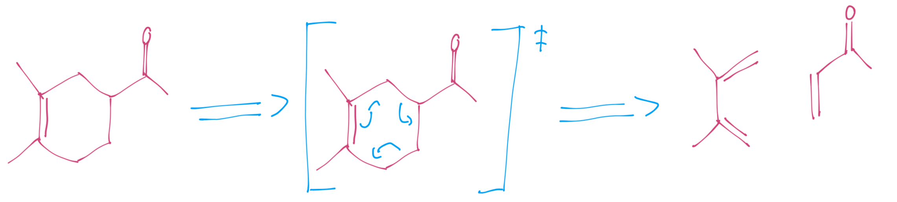{: style="width: 60%;" class="center sharp"}

### Endo Rule

For the DA reaction, two stereoisomers can form, the endo, with the dienophile ending up tucked underneath the new ring, or the exo, with the dienophile ending up pointing outwards away from the ring. Though it's also to note here that the reaction is reversible. 

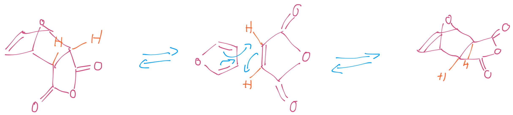{: style="width: 60%;" class="center sharp"}

The endo product is the kinetically favourable one, as there's some back donation from the diene that can stabilise the transition state, giving it a lower barrier.

{: style="width: 40%;" class="center sharp"}

This can be seen in the reaction coordinate diagram; while the endo product has a lower activation barrier, the exo is significantly less hindered and thus has a lower total energy. It is thermodynamically favoured, even though the endo product is kinetically favoured.

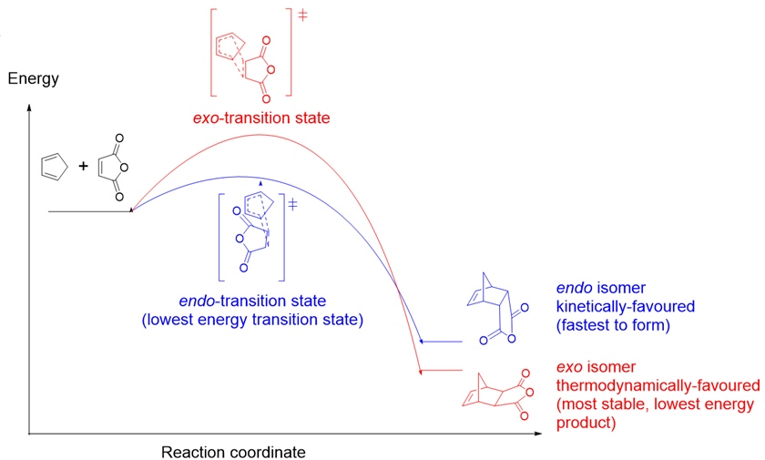{: style="width: 60%;" class="center sharp"}

### The Diene

can be open chain or cyclic, but the open chain option will have to rotate into an unfavored rotamer to enter the s-*cis* configuration (s for single bond) required for the reaction

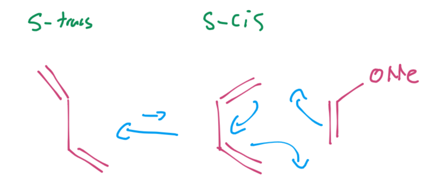{: style="width: 30%;" class="center sharp"}

### The Dienophile

Dienophile examples will always have an EWG attached, though it's not entirely necessary

Simple alkenes that undergo Diels-Alder reactions include:
Conjugated carbonyls, nitro compounds, nitriles, sulfones, aryl alkenes, vinyl ethers/esters haloalkenes and dienes.

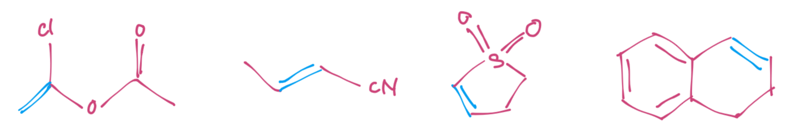{: style="width: 50%;" class="center sharp"}

### Intramolecular Reactions

When he reactants are all contained within a single molecule, the reaction can be very fast, as the two groups are held close to each other in a way that makes the transition geometry more favourable.

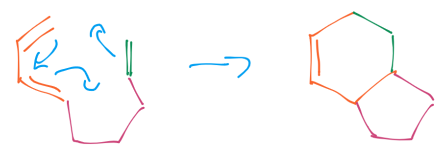{: style="width: 40%;" class="center sharp"}

This reduces the entropy requirement of the reaction.

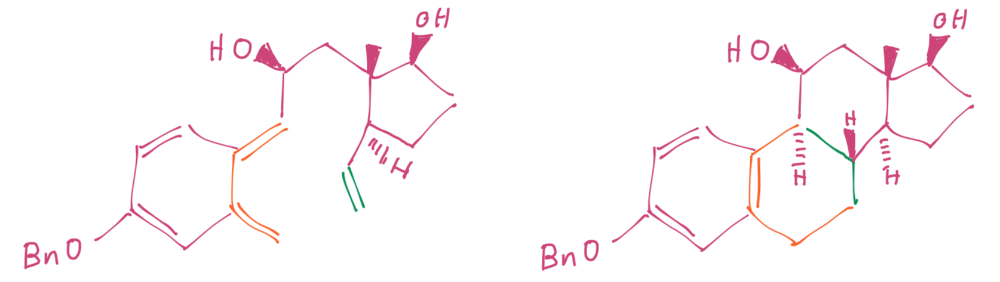{: style="width: 50%;" class="center sharp"}

### Which HOMO and LUMO do we Use?

It really comes down to two criteria:

1. The HOMO ad LUMO must interact in a manner that has a maximum of constructive orbital overlap (they have to be in phase)

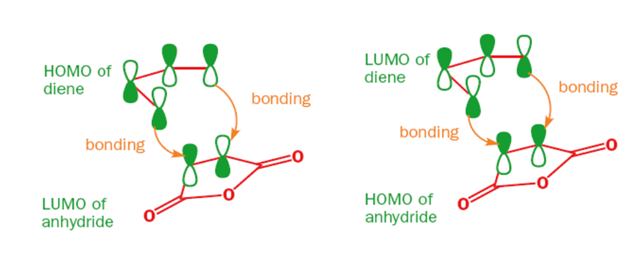{: style="width: 40%;" class="center sharp"}

2. The smaller the energy difference between the two orbitals, the more likely the interaction

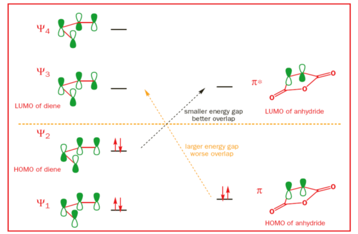{: style="width: 60%;" class="center sharp"}

In the diagram above, both HOMO and LUMO combinations have the correct overlap, however the  energy gap between the diene HOMO and the dienophile LUMO is much less than the other way around. this can however be switched around in an "inverse electron demand" Diels-Alder reaction.

We can push these MOs together even further by adding EDGs  to the diene to increase the electron density and increase the height of the HOMO and EWGs to the dienophile to decrease electron density and decrease the height of the LUMO.

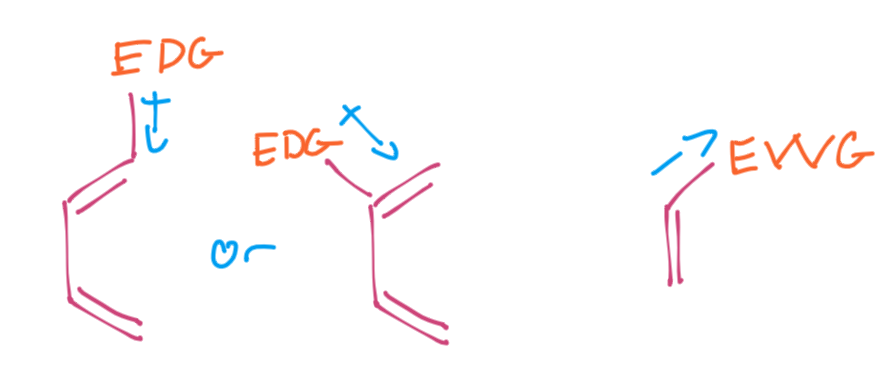{: style="width: 40%;" class="center sharp"}