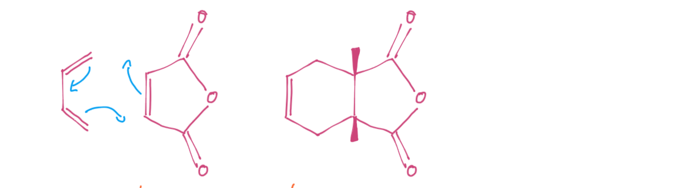
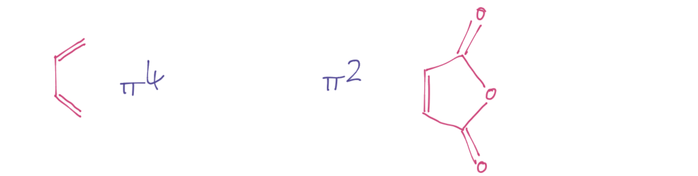
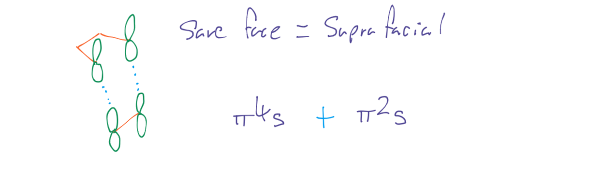
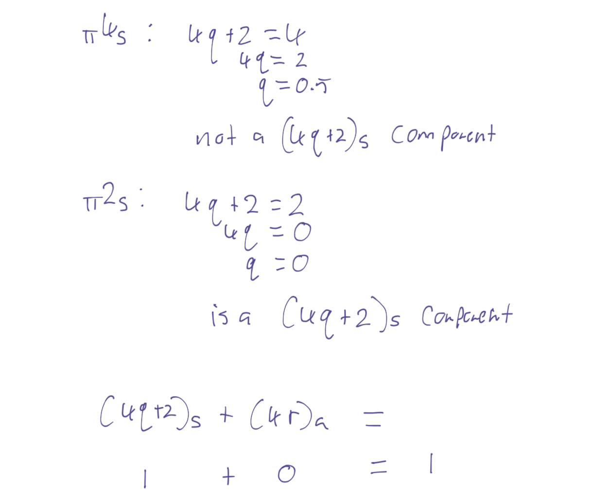

# Woodward-Hoffman Description

The Woodward-Hoffman formalism states:

!!! info "Woodward-Hoffman formalism"
	For a thermal pericylcic reaction, the sum of $(4q+2)_s$ and $(4r)_a$ components must be odd

We can break this down a bit:

The $s$ and $a$ subscript represent suprafacial (same face) and antarafacial (opposite face) so the first formula applies to reactions that attack fro the same face and the second formula applies ot those which attack from opposite faces.

For the actual formulae, you set the number of participating electrons as the product of the equation and solve for the variable. ==If the number is an integer, or zero, then it belongs to that component==

## The Process

We can lay out a simple process to use this formalism:

### 1. Draw the Mechanism

{: style="width: 60%;" class="center sharp"}

### 2. Count how many electrons are participating in the reaction

There cannot be a mix of π and σ electrons

{: style="width: 60%;" class="center sharp"}

###  3. Figure out if it's suprafacial or antarafacial

{: style="width: 60%;" class="center sharp"}

### 4. Count the number of $(4q+2)_s$ and $(4r)_a$ components

{: style="width: 60%;" class="center sharp"}

### 5. If the total number is odd, the reaction is thermal

{: style="width: 60%;" class="center sharp"}