# Aromatic NMR

There are really three big contributing components to NMR shifts that will compound to give increasing amounts of deshielding

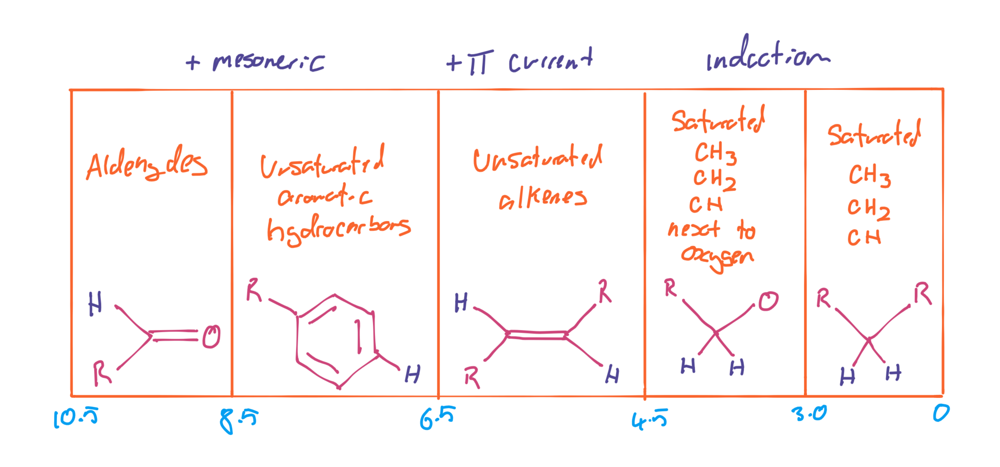{: style="width: 80%;" class="center sharp"}

???+ note "Example"
	In this example we bring everything together and show a simple approach to determine shifts. We can simpy look to quantify for each proton, which effects it will experience, and can then determine where their peak will appear on the spectrum.
	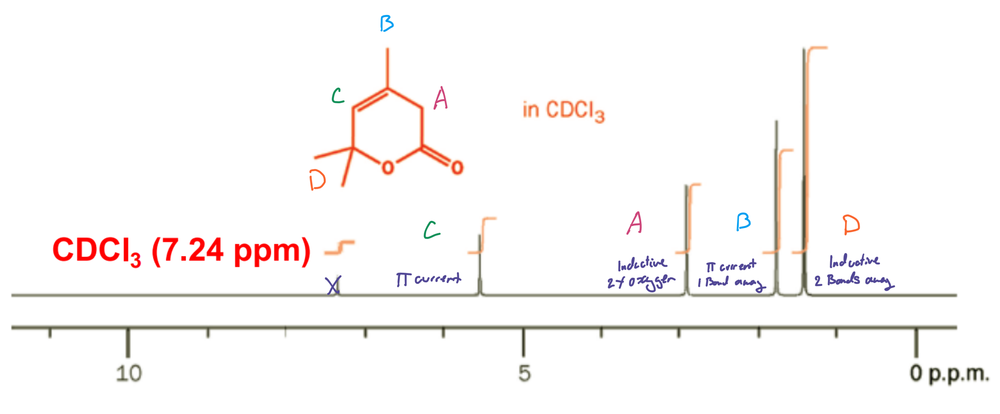{: style="width: 70%;" class="center sharp"}

## Induction

This is pretty simply, the withdrawing of electron density by more electronegative adjacent atoms

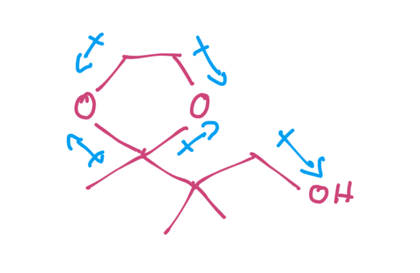{: style="width: 20%;" class="center sharp"}

This is pretty simply governed by the elecronegativity of the inducting atoms

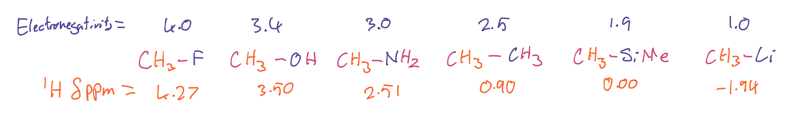{: style="width: 70%;" class="center sharp"}

And can be compounded with multiple inducting atoms

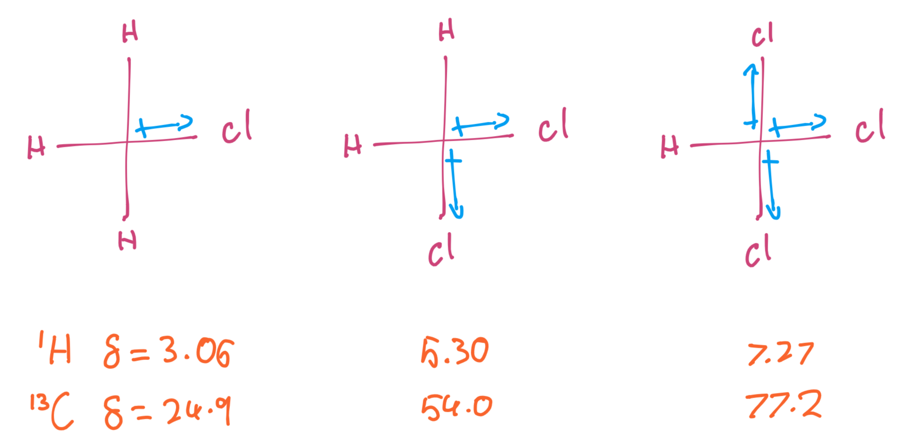{: style="width: 50%;" class="center sharp"}

## π Current Regions

When a π system is put in a magnetic field, a secondary magnetic filed in produced by the π electrons that start to move rapidly around the pi bonds. The more conjugated the system, the stronger the magnetic field.

This field can be generated from any π system and the resulting shielding/deshielding regions will differ between them.

Some of these regions will have a more prevalent effect with intermolecular interactions, such as π-π stacking 

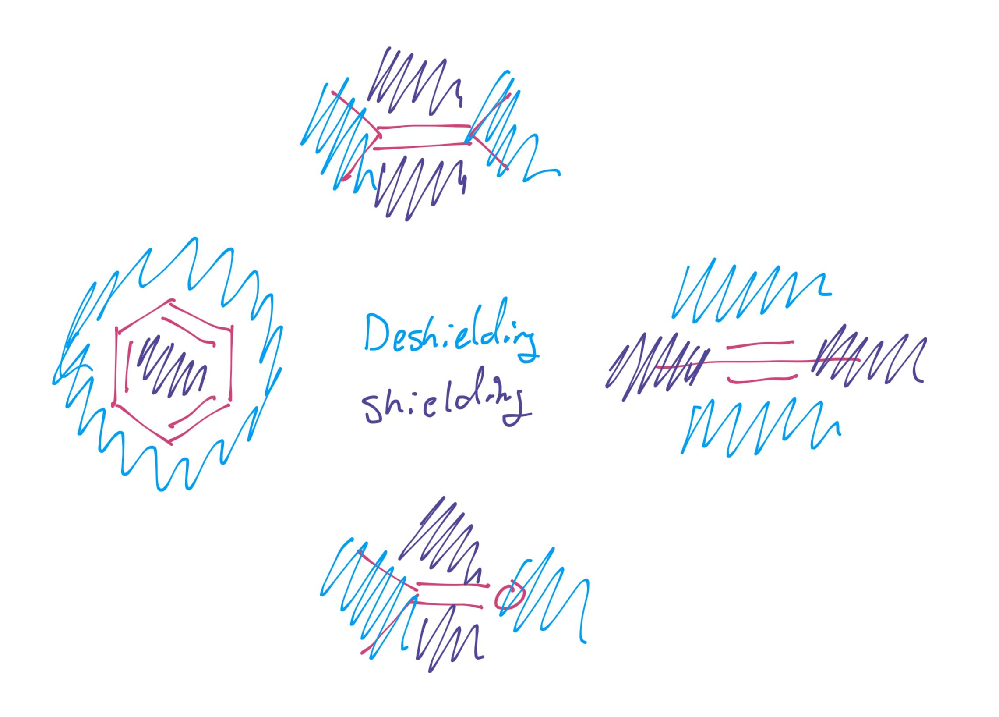{: style="width: 50%;" class="center sharp"}

## Mesomeric Effects

Mesomeric effects are some of the most interesting, as the various resonance structures of a molecule will also play a large effect in the shielding and deshielding of atoms.

!!! note
	A ==positive charge== in a resonance structure will result in a highly ==electronegative carbon== that will ==deshield== the adjacent protons 
	A ==negative charge== in a resonance structure will result in a highly ==electropositive carbon== that will ==shield== the adjacent proton

For reference a typical benzene shift is $\delta=7.29\:ppm$

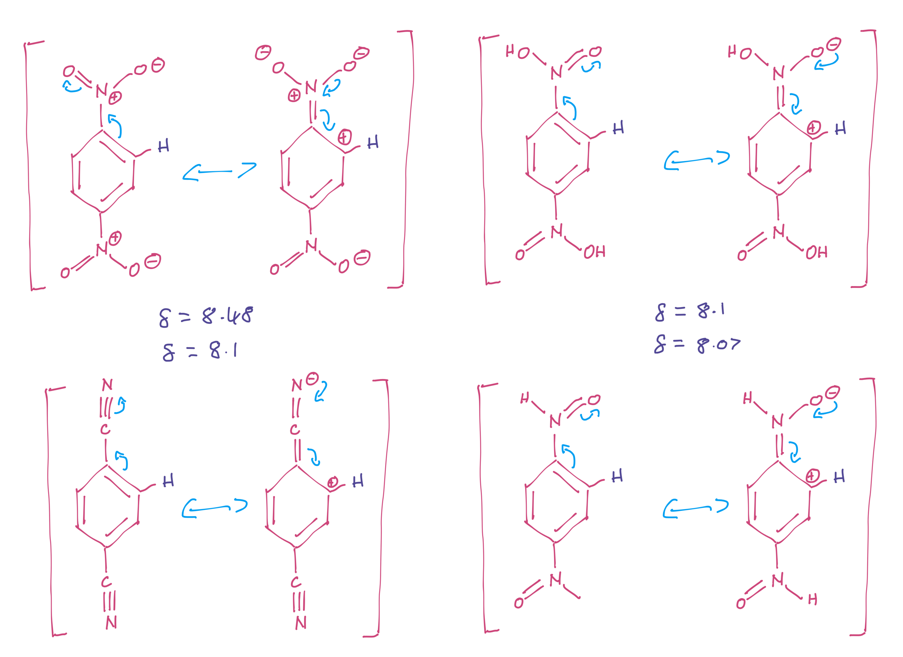{: style="width: 70%;" class="center sharp"}

### Mesomeric Vs Induction

Mesomeric shifts are often not the only consideration. since they will typically originate from a heteroatom, we also need to consider the induction effect. These two are in push and pull relationship.

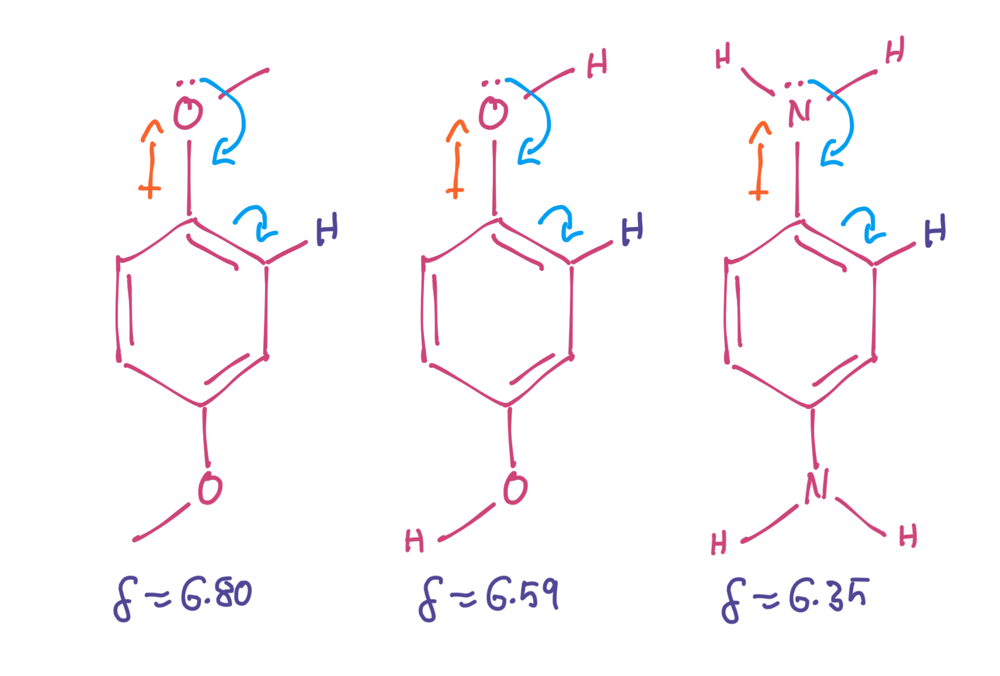{: style="width: 40%;" class="center sharp"}

### Mesomeric Vs Electronegativity

This can be quite well demonstrated with the halogen series, as the electronegativity increases, the chance of the halogen letting go of its LPE decreases, resulting in weaker mesomeric effects and less deshielding.

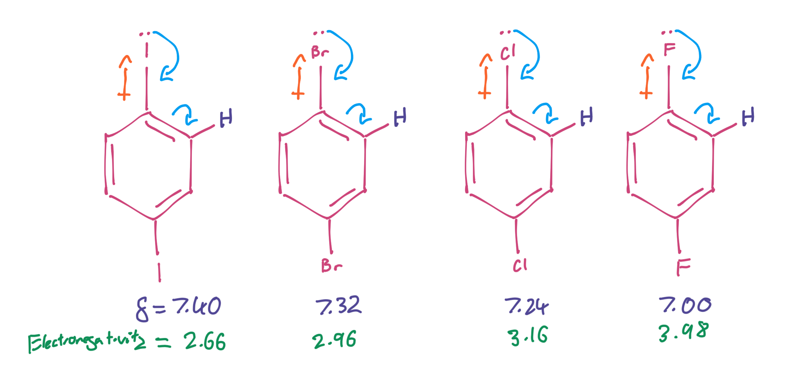{: style="width: 60%;" class="center sharp"}

We can also see that the the chemical shift parallels the reactivity of a conjugated EWG (deshielding) or EDG (shielding), and the relative acidity of the proton (more deshielded = more acidic). In this case, we can see that the effects of this actually give us protons that look more like they belong to benzene that to cyclohexene.

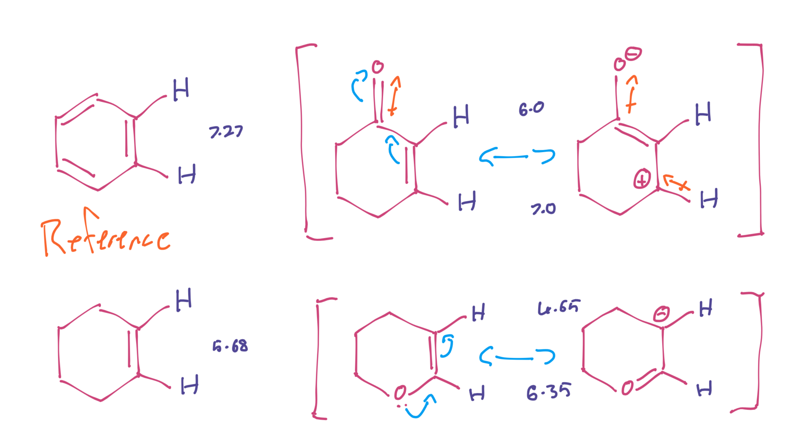{: style="width: 60%;" class="center sharp"}

Here we have an electron deficient nitrolalkene, an electron rich silyl enol ether and an eletron rich enamine

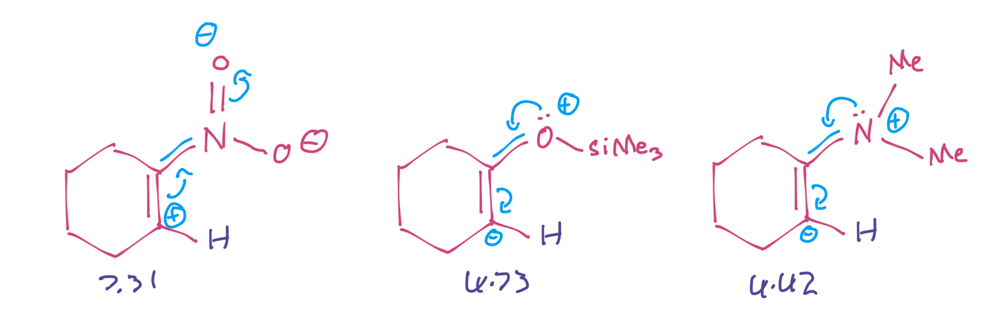{: style="width: 60%;" class="center sharp"}
