# Aromaticity

#### Benzene EAS Summary

| Reaction                  | Reagents                                                     | Electrophile                                                 | Products                                                     |
| ------------------------- | ------------------------------------------------------------ | ------------------------------------------------------------ | ------------------------------------------------------------ |
| Bromination               | $\ce{Br2}$ and Lewis Acid  ($\ce{AlCl3}$, $\ce{FeCl3}$, $\ce{Fe}$ powder) The Lewis acid gives the $\ce{Br2}$ a dipole | 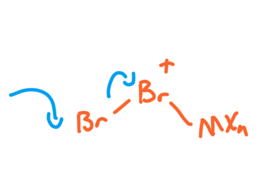{: style="max-height: 100px;" class="center sharp"} | 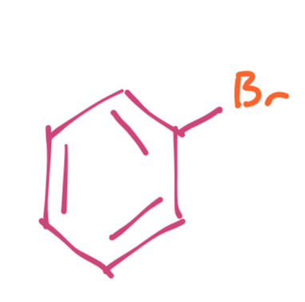{: style="max-height: 100px;" class="center sharp"} |
| Nitration                 | $\ce{HNO3 + H2SO4}$                                          | 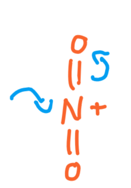{: style="max-height: 100px;" class="center sharp"} | 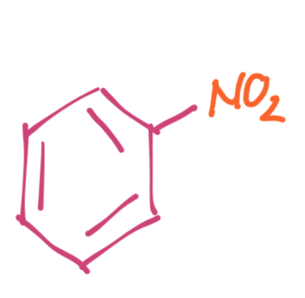{: style="max-height: 100px;" class="center sharp"} |
| Sulphonation              | Conc. $\ce{H2SO4}$ or oleum ($\ce{H2SO4 + SO3}$)         | 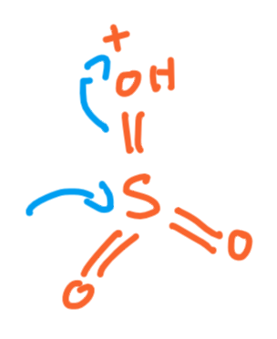{: style="max-height: 100px;" class="center sharp"} | 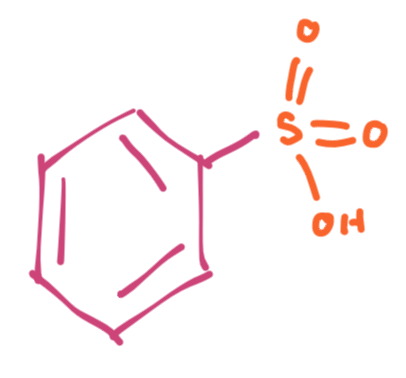{: style="max-height: 100px;" class="center sharp"} |
| Friedel-Crafts Alkylation | $\ce{RX}$ + Lewis Acid Usually $\ce{AlCl3}$              | {: style="max-height: 100px;" class="center sharp"} | 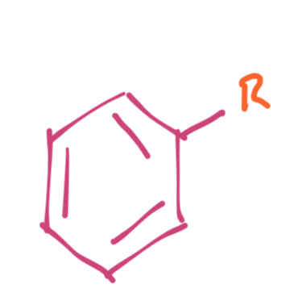{: style="max-height: 100px;" class="center sharp"} |
| Friedel-Crafts Acylation  | Acid chloride + Lewis Acid  Usually $\ce{AlCl3}$         | 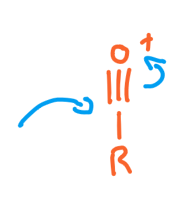{: style="max-height: 100px;" class="center sharp"} | 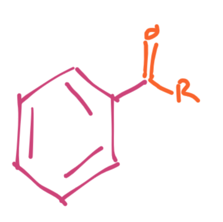{: style="max-height: 100px;" class="center sharp"} |

## Aromaticity

Compounds (or portions of compounds have to meet the following criteria to be considered aromatic:

* Have to be cyclic
* Have to be planar (angles of 120$^\circ$)
* consist of a conjugated π system
* Have $4n+2$ π (where $n$ is an integer) electrons 
  * These could come from heteroatoms with LPE, such as O or N

This gives them a few specific properties:

* They are really stable, due to the delocalisation of the π electrons
* They have a ring current in a magnetic filed
* They have a unique reactivity that disfavours addition reactions, but allows for EAS/NAS
* They have bond lengs of $1.39\:\AA$, longer than a $C=C$ double bond ($1.34\:\AA$), but shorter than a $C-C$ single bond ($1.54\:\AA$)

## Benzene EAS

One of the big unique reactivities of aromatics is their ability to undergo electrophilic aromatic substitution. That is, an electrophile replaces one of the hydrogens in the aromatic ring. The mechanism for this is quite simple and uses the resulting conjugation resonance to stabilise the intermediate carbocation.

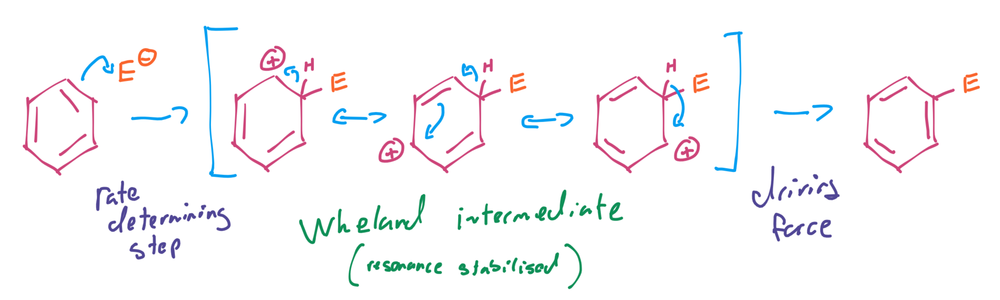{: style="width: 70%;" class="center sharp"} 

There are a few characteristic reaction in this process to make the base the base benzene compounds

### Nitraion of Benzene

Nitrobenzene is made with the nitronium ion

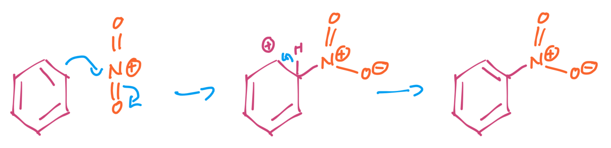{: style="width: 60%;" class="center sharp"}

This is made in-situ from the reaction between nitric and sulphuric acid

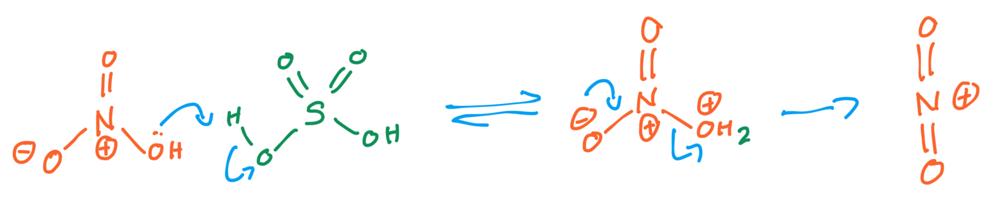{: style="width: 70%;" class="center sharp"}

### Sulphonation of Benzene

Benzene can be sulphonated with the same mechanism, using either protonated or deprotonated sulphur trioxide as formed form conc. sulphuric acid, or oleum

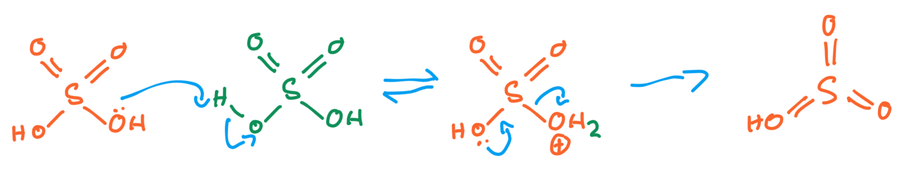{: style="width: 70%;" class="center sharp"}

### Friedel-Crafts Alkylation

Another really powerful electrophile it the carbocation which can be formed using Friedel-Crafts alkylation as follows:

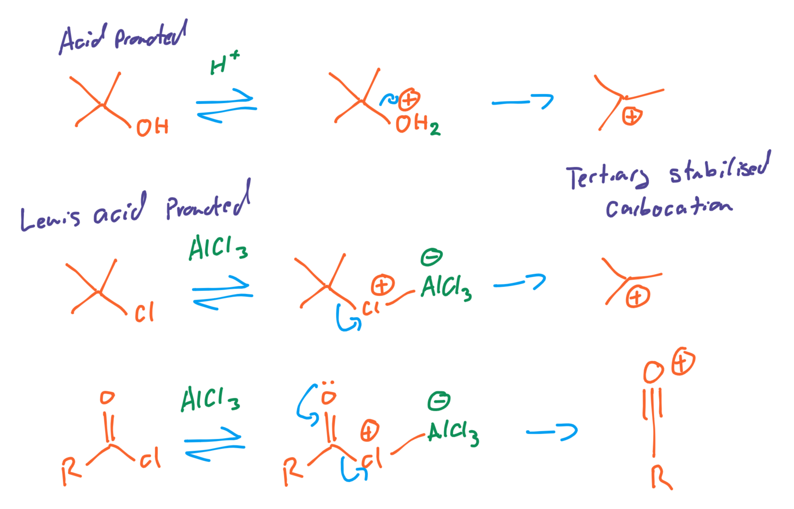{: style="width: 70%;" class="center sharp"}

In the latter case, the nucleophile is actually the electron deprived carbon. Oxygen being highly electronegative REALLY doesn't want to have a positive charge and will pull a massive amount of electron density from the adjacent carbon atom

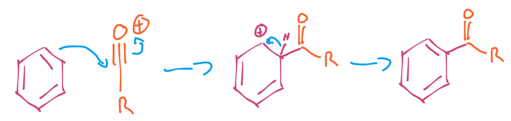{: style="width: 70%;" class="center sharp"}
