# Aromatic EAS Directing Groups

These notes are going to be a continuation on from the [aromatic notes](../../../Sem%203.%20Organic/10.%20Aromatic%20Compounds/) form Investigative Organic Chemistry

#### EAS activation/directing Summary

| Electronic Effect                                   | Example                                                      | Activation        | Direction                   |
| --------------------------------------------------- | ------------------------------------------------------------ | ----------------- | --------------------------- |
| Donation by conjugation                             | 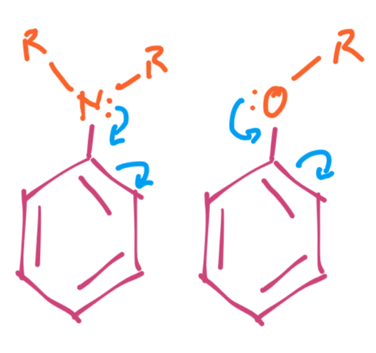{: style="max-height: 100px;" class="center sharp"} | Very activating   | *o*/*p*                     |
| Donation by induction                               | 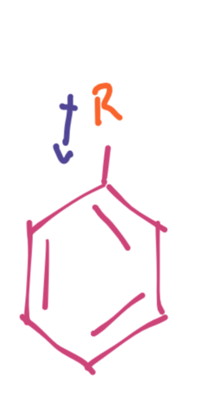{: style="max-height: 100px;" class="center sharp"} | Activating        | mostly *o*/*p* but some *m* |
| Donation by conjugation and withdrawal by induction | 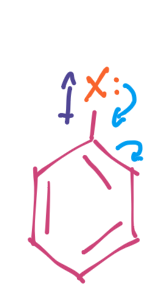{: style="max-height: 100px;" class="center sharp"} | Deactivating      | *o*, and mostly *p*         |
| Withdrawal by induction                             | 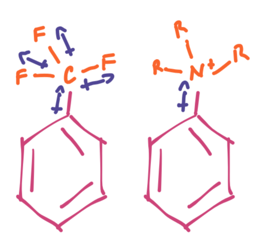{: style="max-height: 100px;" class="center sharp"} | Deactivating      | *m*                         |
| Withdrawal by conjugation (and induction)           | 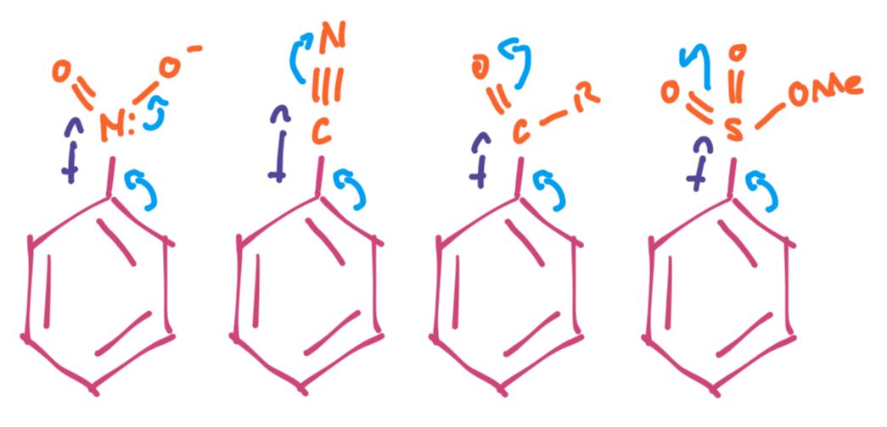{: style="max-height: 100px;" class="center sharp"} | Very deactivating | *m*                         |

## Phenol/Aniline EAS

We already know phenol EAS, so I won't describe it too in depth here, except to add a couple of things:

We can see the amount of electron donation/withdrawal from NMR spectra of the compound, which reveals the true amount of deshielding/shielding from the donation/withdrawal for eh substituents:

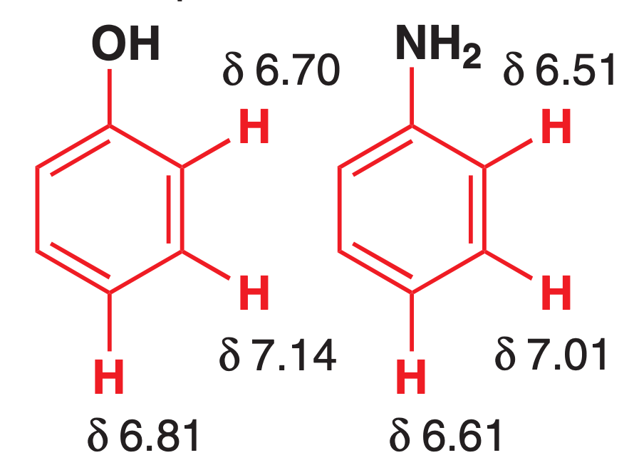{: style="width: 30%;" class="center sharp"}

From here, we can clearly see that the nitrogen, being less electrophilic is going to donate more electron density to the ring through conjugation than the oxygen will. We can see this clearly by looking at their relative reactivity (OR behaves very similarly to OH):

| Compound                 | R           | Relative rate of bromination |
| ------------------------ | ----------- | ---------------------------- |
| Benzene                  | $\ce{H}$    | $1$                          |
| Anisole (methoxybenzene) | $\ce{OMe}$  | $1^9$                        |
| *N,N*-dimethylaniline    | $\ce{NMe2}$ | $1^{14}$                     |

Because of this, we can pretty easily control the bromination of phenol to only get a mono-brominated product:

$$
\ce{phenol + Br2 ->[CS2, <5^\circ C] p-bromophenol}
$$

!!! note "Important Chemistry"
	When we deprotonate the phenol, it becomes more reactive, allowing for the addition of weak electrophiles such as $\ce{CO2}$. This is vital to the synthesis of aspirin. The $\ce{Na+}$ actually helps to coordinate the oxygen of the $\ce{CO2}$ and the deprotonated phenol, to make the transition state more stable.
	

	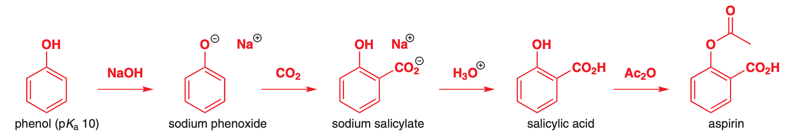

If we try to do this with aniline however it will triply brominate. What we can do instead is to acylate ($\ce{OAc}$) the nitrogen. This has a dual effect, firstly of allowing for the delocalisation of the amine LPE to go in both directions, somewhat deactivating them, but also, the rotation of the $\ce{N-C}$ bond allows for the acyl group to protect the ortho positions, meaning that only para should be brominated.

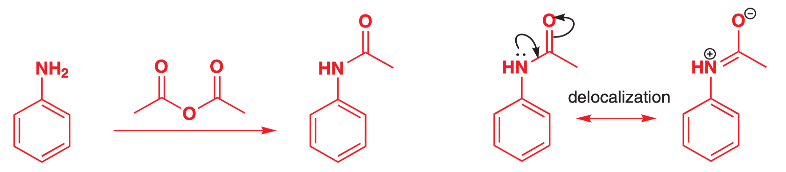{: style="width: 70%;" class="center sharp"}

This can be easily hydrolysed with a little bit of acid in ethanol

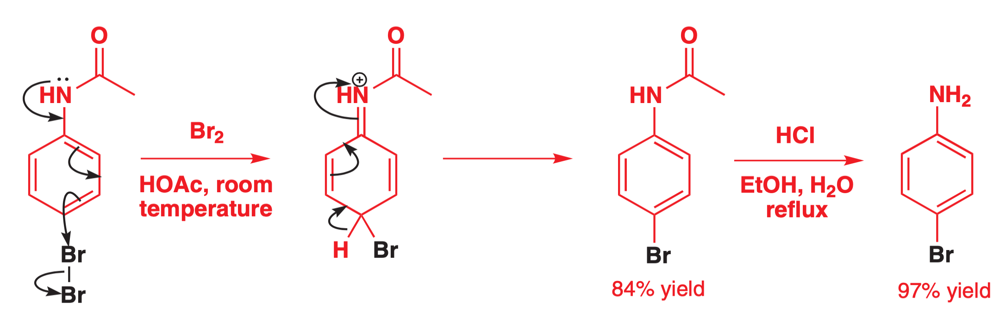{: style="width: 70%;" class="center sharp"}

!!! note "Important Chemistry"
	The acylation of amine is also vital in the production of paracetamol, even if not as a deactivating agent.
	

	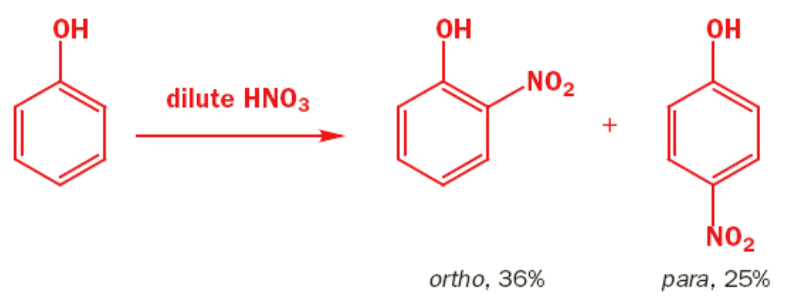{: style="width: 50%;" class="center sharp"}
	
	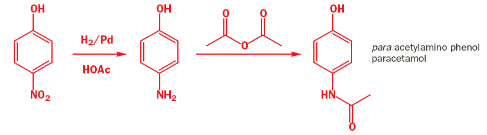{: style="width: 70%;" class="center sharp"}

## Alkyl Benzene EAS

Since they do have electron density that they can readily donate, alkyl groups are *o*/*p* directing, however much more weakly, as can be seen in the NMR shifts below. While the meta proton of toluene has the same shielding as for phenol, the ortho and para protons are much less shielded, indicating that the adjacent carbons are less electron rich.

This is as a result of the donation of electron density occurring through the σ bond, and not through the π bonds. Since there is far less overlap, there is far less ability for the electron density to delocalise.

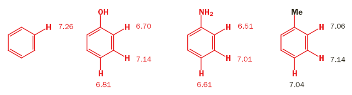{: style="width: 70%;" class="center sharp"}

This results in *some* meta product being formed, with the majority of the product being ortho and para.

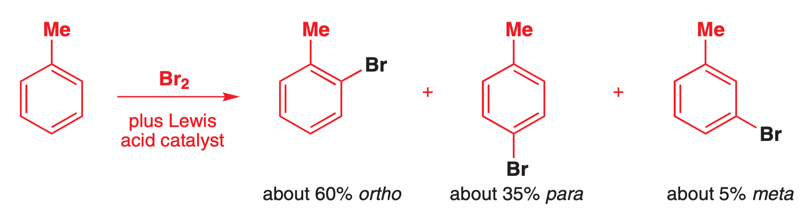{: style="width: 70%;" class="center sharp"}

We can also look at the stability of the Wheland intermediate to see why the meta position is disfavoured

|                          ortho/para                          |                             meta                             |
| :----------------------------------------------------------: | :----------------------------------------------------------: |
| 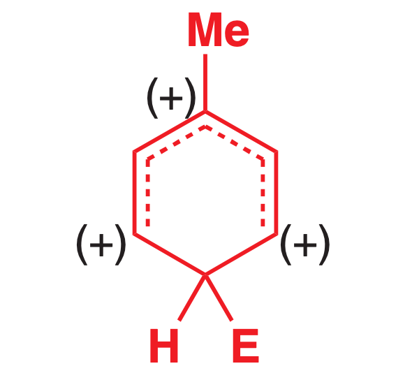{: style="max-height: 150px;" class="center sharp"} | 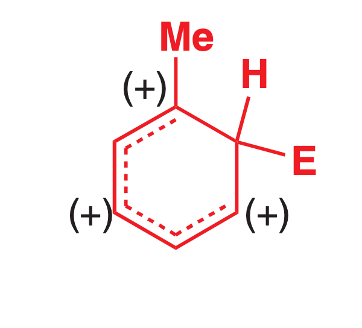{: style="max-height: 150px;" class="center sharp"} |

 !!! note "Important Chemistry"
	Being able to make the ortho product of toluene is how we can make saccharin. Both the ortho and para products are made, but the ortho product will dominate and can be distilled off, as it has a different boiling point. The para product can be purified by recrystallisation.
	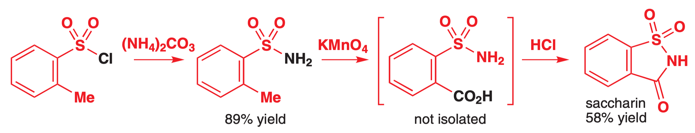{: style="width: 70%;" class="center sharp"}

## σ-Withdrawing EAS

For groups that only have an inductive σ-withdrawing effect ($\ce{CF3, R3N+, R3P+}$), they will be meta directing, due to the stability of the resonance structure of the Wheland intermediate putting the +ve charge next to a +ve substituent, causing a big clash. These substituent s are deactivating, however and require extra encouragement to react

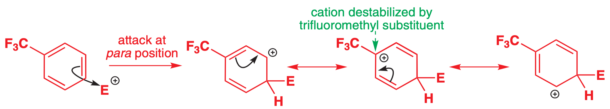{: style="width: 80%;" class="center sharp"}

## σ-Withdrawing/π-Donating EAS

These are primarily halogens, as the are very withdrawing but also have LPE that can conjugate back in to the ring.

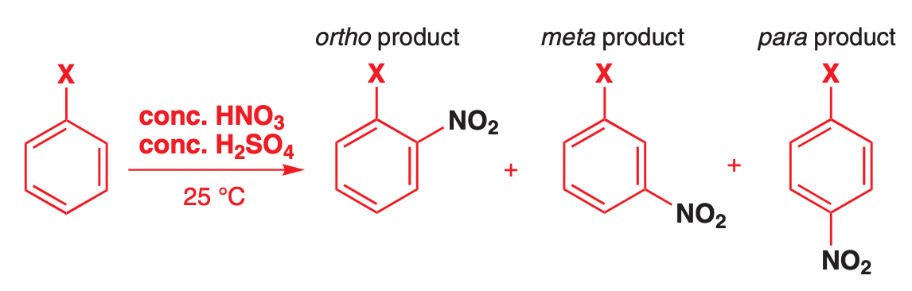{: style="width: 70%;" class="center sharp"}

These substituents are mostly activating as the mesomeric effects win out over the inductive effects, and as we can see from the table below, this is also dependent on the electronegativity of the halide.

| Compound    | % Ortho | % Meta | % Para | Nitration rate (relative to $\ce{Ph}$) |
| ----------- | :-----: | :----: | :----: | :------------------------------------: |
| $\ce{PhF}$  |   13    |  0.6   |   86   |                  0.18                  |
| $\ce{PhCl}$ |   35    |  0.9   |   64   |                 0.064                  |
| $\ce{PhBr}$ |   43    |  0.9   |   56   |                 0.060                  |
| $\ce{PhI}$  |   45    |  1.3   |   54   |                  0.12                  |

## σ-Withdrawing/π-Withdrawing EAS

Since these groups are strongly inductively withdrawing and also will have resonant forms with +ve charges in the ring, these groups are strongly deactivating. These groups will also have the destabilisation oft the 3$^\circ$ carbocation Wheland intermediate, due to their positive charges.

The incredibly deshielded protons in the NMR below should serve as an indicator for electron deficient the aromatic carbon are.

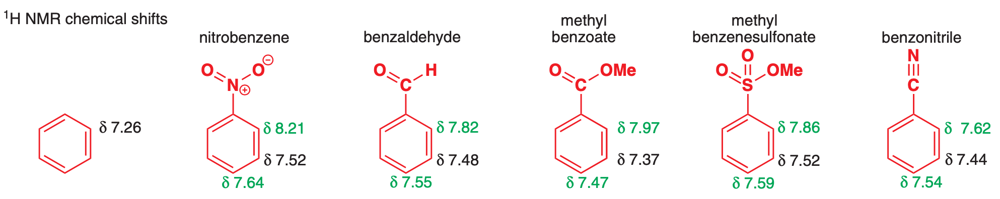{: style="width: 90%;" class="center sharp"}

 These groups really need extra support if they are to further undergo EAS (high temperatures and catalytic $\ce{Fe}$ powder).

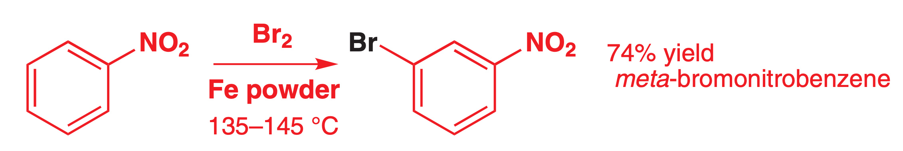{: style="width: 60%;" class="center sharp"}

Or in this case, a highly acidic environment and high temperature 

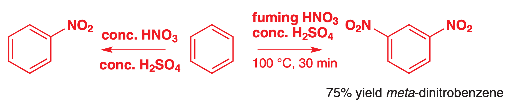{: style="width: 70%;" class="center sharp"}

These groups can be used however to prevent multi EAS addition

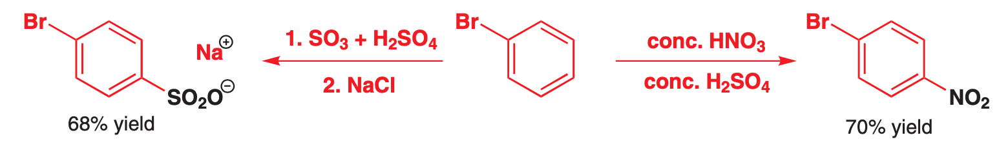{: style="width: 70%;" class="center sharp"}

