# Aromatic - Pyridine

!!! note "Pyridine is:"
	
	1. Unreactive to EAS
	2. Reactive to NAS
	3. Electron deficient
	4. Has Lewis basic/nucleophilic LPE

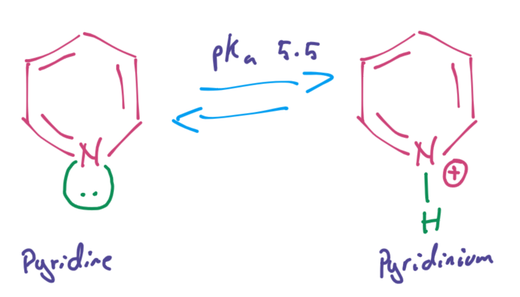{: style="width: 40%;" class="center sharp"}

## The LPE

At its most basic level, the LPE are Lewis basic and can be used catalytically, such as with bromination

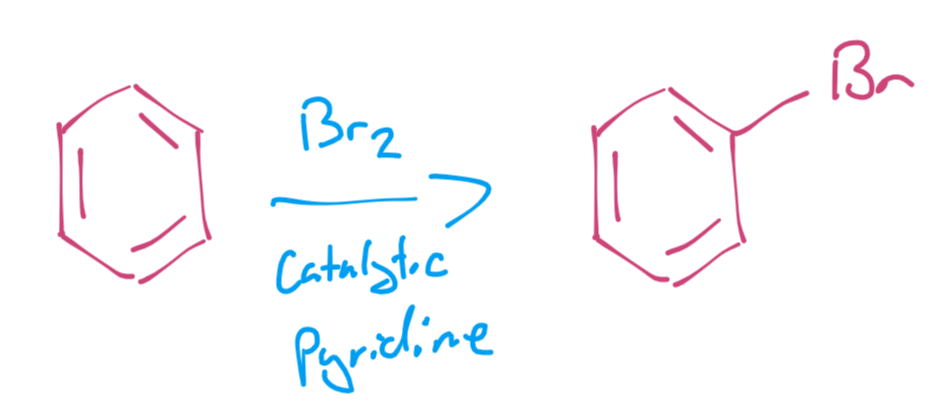{: style="width: 40%;" class="center sharp"}

!!! note "Mechanism"
	
	In this exmaple, the bromine is undergoning EAS with benzene, hwich requires catalysis
	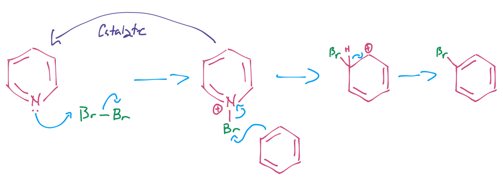{: style="width: 70%;" class="center sharp"}

### PTB

This is actually quite  common usage and is sold as pyridinium tribromide, which is a solid, stable crystalline substance, which makes it easier to handle and weigh out

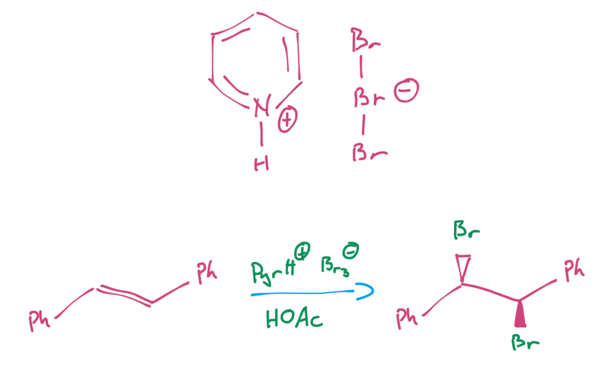{: style="width: 50%;" class="center sharp"}

### PCC

This is also used in the oxidising agent pyridinium chlorochromate (PCC)

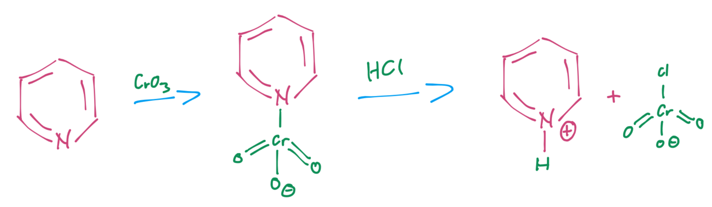{: style="width: 60%;" class="center sharp"}

### Acylation

It can also be used as a better leaving group than chlorine for acylation (or more generally, esterification), as it's more active that it's acyl chloride counterpart. 

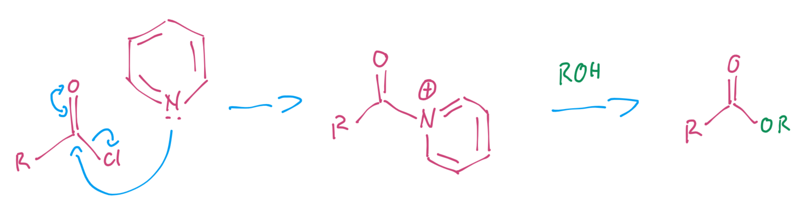{: style="width: 60%;" class="center sharp"}

### DMAP

This is further exploited by adding a dimethyl group ortho to the pyrolidinium, as the nitrogen can donate its LPE to make the new acyl group more weakly bonded.

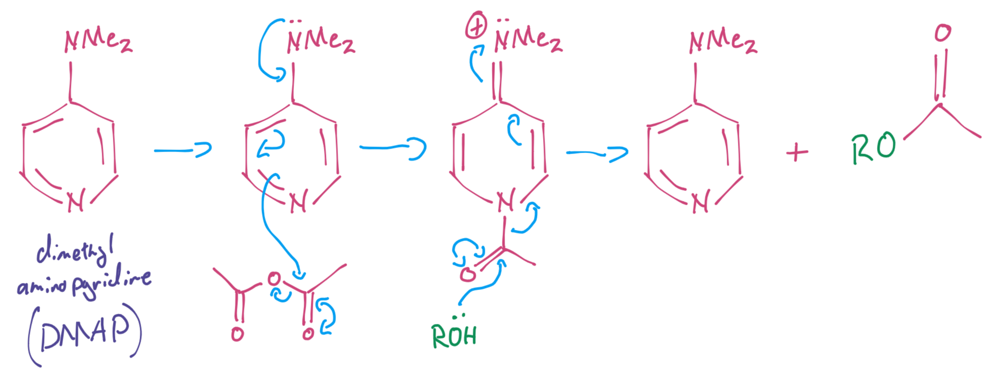{: style="width: 70%;" class="center sharp"}

### Alkylation

More generally, the pyridine can be alkylated by any bromoalkyl compound

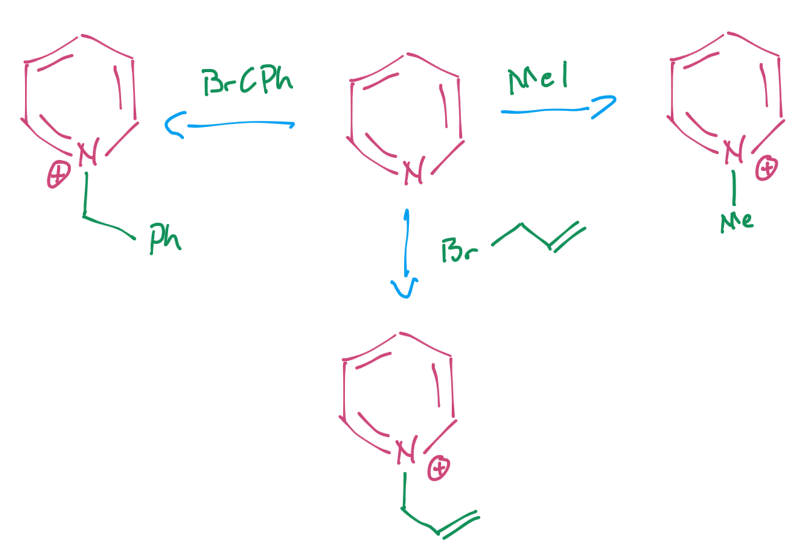{: style="width: 50%;" class="center sharp"}

## Pyridinium Ion

Once in its ionic form, the ring becomes so electron deficient that normal alkene chemistry can be performed, such as reducing, oxidising ans hydrogenating it

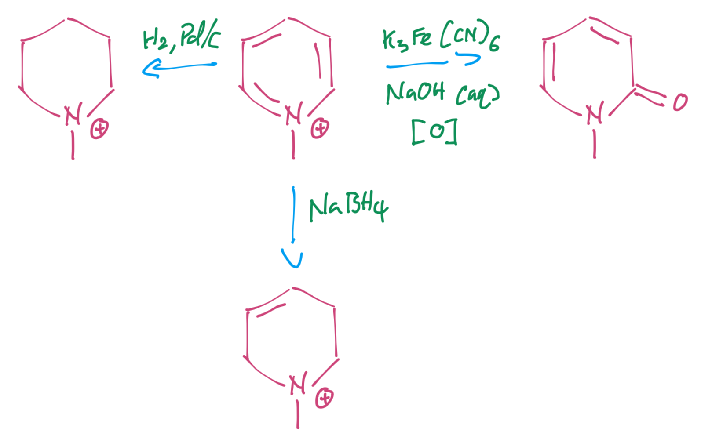{: style="width: 50%;" class="center sharp"}

It  also becomes active to simple organometallic addition and can easily be oxidised back to pyridines

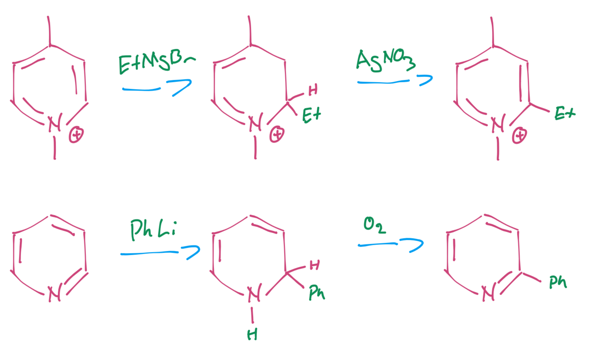{: style="width: 50%;" class="center sharp"}

## Pyridine-*N*-oxides

Are a really clever way of activating pyridines, as it will activate them to EAS (since they can't undergo EAS normally). This re-introduces Friedel-Crafts acylation, nitration and other useful EAS reactions.

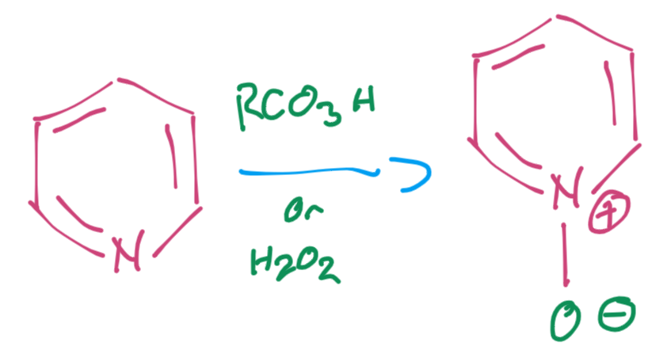{: style="width: 30%;" class="center sharp"}

### Activation

Because the oxygen can donate an electron or the nitrogen can accept one, the n-oxides are active to both EAS and NAS

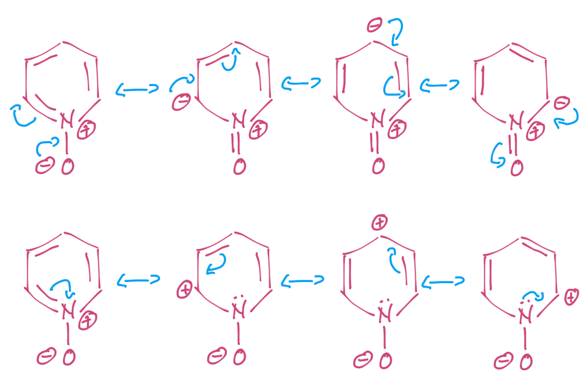{: style="width: 60%;" class="center sharp"}

So they can undergo reactions like nitrations, ==with the oxygen directing *o*/*p*==, facilitated by the donation of the LPE

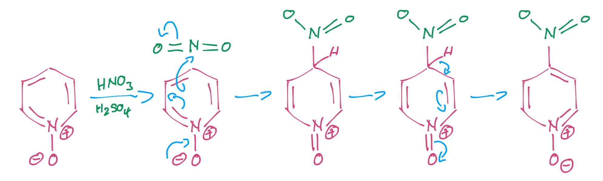{: style="width: 70%;" class="center sharp"}

~~Once the desired EAS reaction has occurred, the oxide can be removed cleanly~~

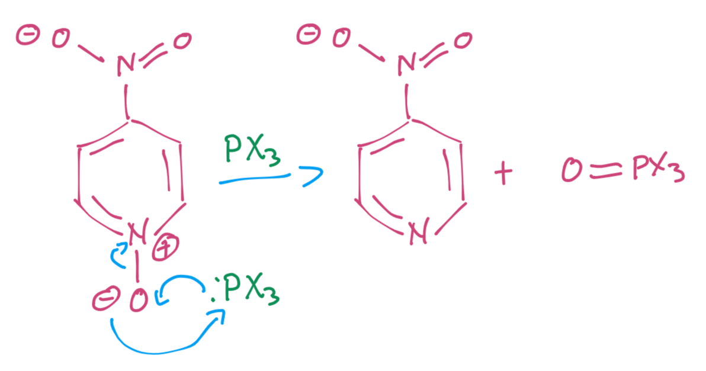{: style="width: 40%;" class="center sharp"}

!!! warning
	While this  *will* remove the oxygen, however it will also add in a halide, *meta* to the nitrogen, as shown below

Another useful reaction of the *N*-oxides is that they can add a chloride ortho to the nitrogen. This conveniently also consumes the oxide in the process

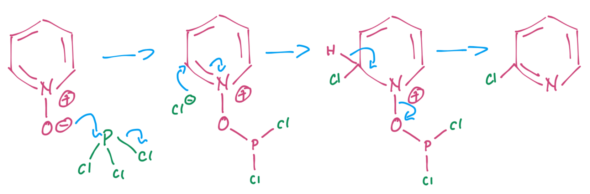{: style="width: 60%;" class="center sharp"}

!!! note "Important Chemistry"
	The synthesis of the analgesic niflumic acid is another synthesis that uses the *N*-oxide to facilitate a chlorination that allows for NAS to be directed cleanly.
	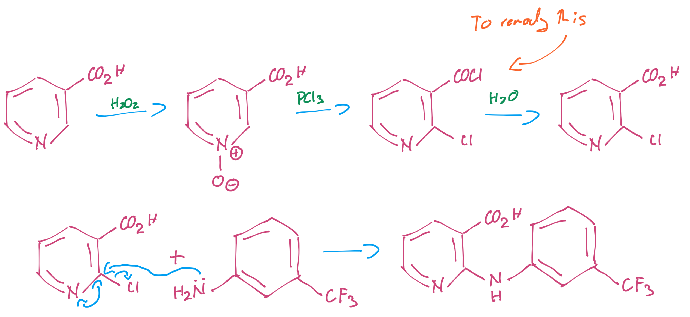{: style="width: 70%;" class="center sharp"}
