# Pyrrole

|                           Benzene                            |                       Furan                       |                        Pyrrole                        |                         Thiophene                         |                        Pyridine                         |
| :----------------------------------------------------------: | :-----------------------------------------------: | :---------------------------------------------------: | :-------------------------------------------------------: | :-----------------------------------------------------: |
| {: style="max-height: 150px"} | 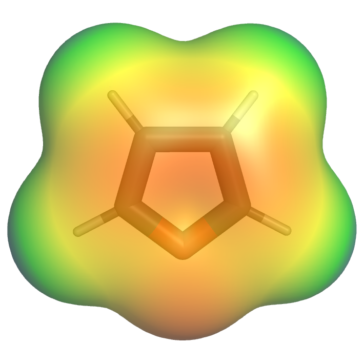{: style="max-height: 150px"} | 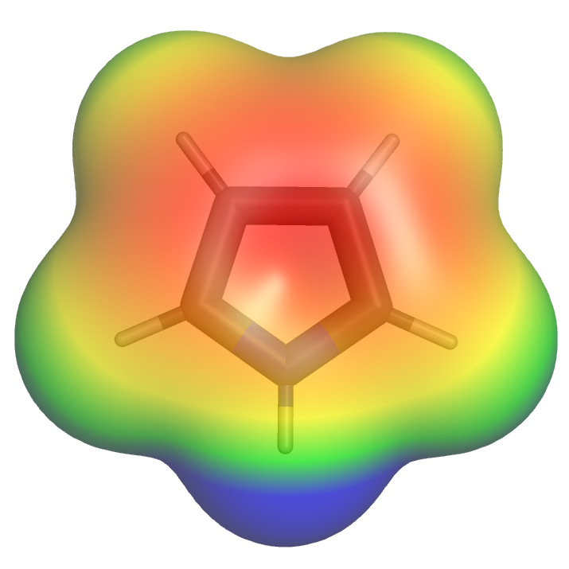{: style="max-height: 150px"} | 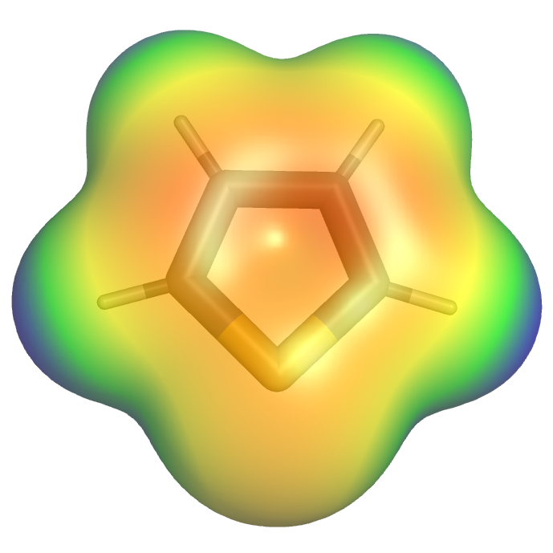{: style="max-height: 150px"} | 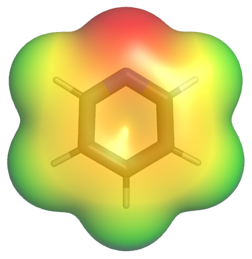{: style="max-height: 150px"} |

{: style="width: 40%;" class="center sharp"}

Compared to benzene and pyridine, pyrrole is quite electron rich. Unlike pyridine, the LPE are a part of the aromatic system.

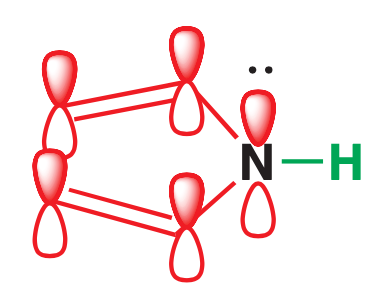{: style="width: 20%;" class="center sharp"}

This electron rich ring makes pyrrole a goo nucleophile and very reactive in EAS, though the 5 membered ring mans that the charges can resonate onto any of the carbons, there is however a decent selectivity for 2'.

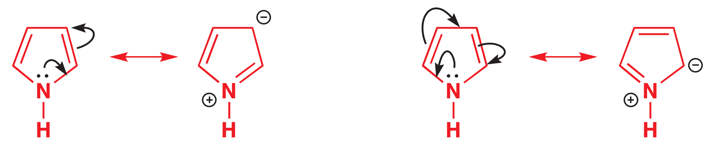{: style="width: 65%;" class="center sharp"}

This selectivity is due the the 2-position addition having a slightly more stable intermediate form, due to having more resonance forms to be able stabilise the structure.

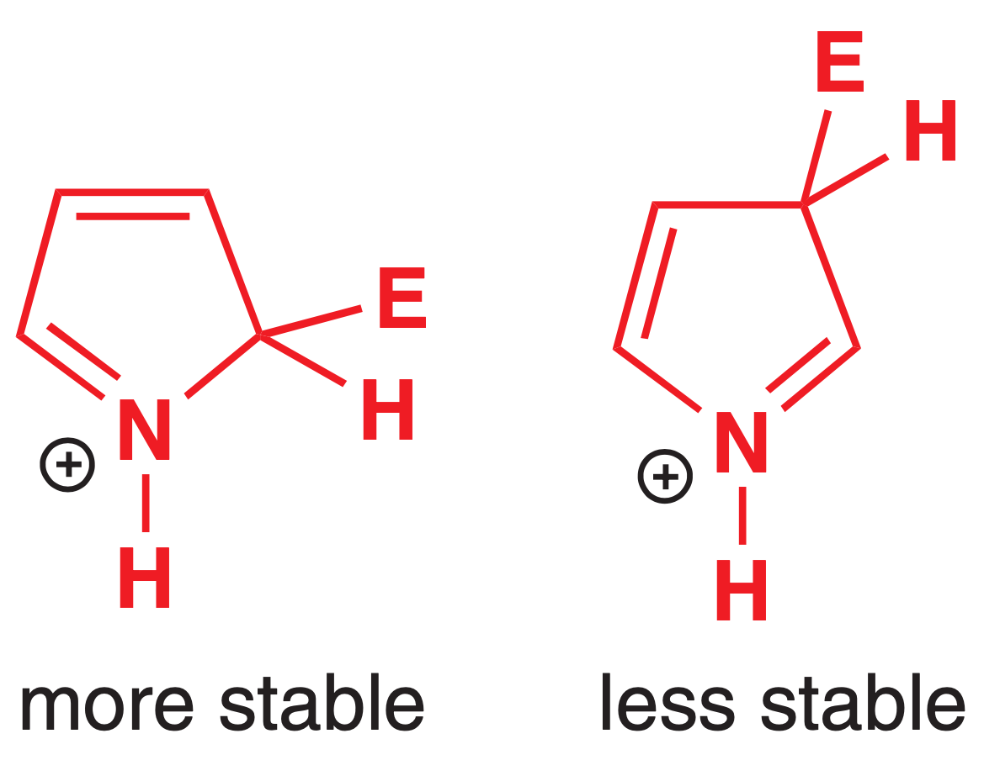{: style="width: 25%;" class="center sharp"}

## Polymerisation

However, because of their reactivity typical nitration conditions (or acids of pKa ~ -4) will cause pyrrole to polymerise and/or decompose.

Once protonated, the pyrrole can act as an electrophile, being attacked by a non-protonated (nucleophilic) pyrrole. Once the protonated pyrrole is deprotonated, tautomerisation can occur, moving the double bond to the N, making it positive and making the adjacent carbon another electrophile, ready for attack by another pyrrole, causing polymerisation.

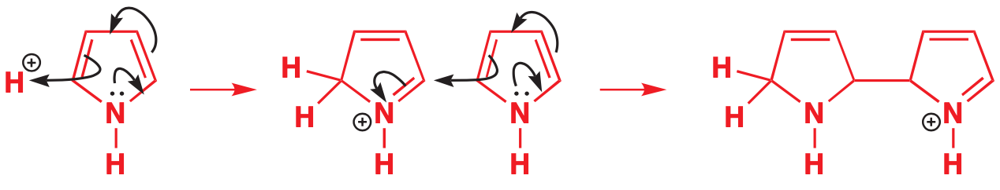{: style="width: 70%;" class="center sharp"}

| Acid           | pKa  | Conjugate base |
| -------------- | :--: | :------------: |
| $\ce{HI}$      | -10  |   $\ce{I-}$    |
| $\ce{HCl}$     |  -7  |   $\ce{Cl-}$   |
| $\ce{H2SO4}$   |  -3  |  $\ce{HSO4-}$  |
| $\ce{CH3COOH}$ | 4.8  | $\ce{CH3COO-}$ |
| $\ce{PhOH}$    |  10  |  $\ce{PhO-}$   |

While this will form a polypyridine, conducting polymers can use polypyrroles so that the delocalised pi electrons can act as molecular wires.

## Halogenation

While pyridine will simply act as a nucleophile with bromine, pyrrole will undergo EAS, however due to its reactivity, it will be saturated with the bromine, with very little control.

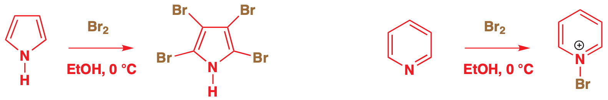{: style="width: 70%;" class="center sharp"}

Chlorination can also occur, and with some careful stoichiometry, the mono-substituted product can be formed

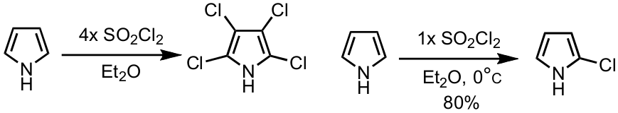{: style="width: 70%;" class="center sharp"}

## Nitration

Since typical nitration conditions will cause pyrrole to polymerise, nitration can be accomplished with acetly nitrate instead, with the nucleophilic aromatic electrons attacking the electophilic quarternary amine, kicking off the acid in the process.

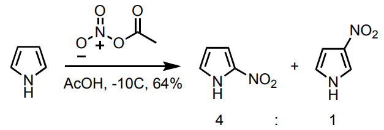{: style="width: 60%;" class="center sharp"}

The acetyl nitrate is formed *in situ* from fuming nitric acid and acetic anhydride

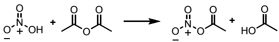{: style="width: 60%;" class="center sharp"}

## EAS - Vilsmeier reaction

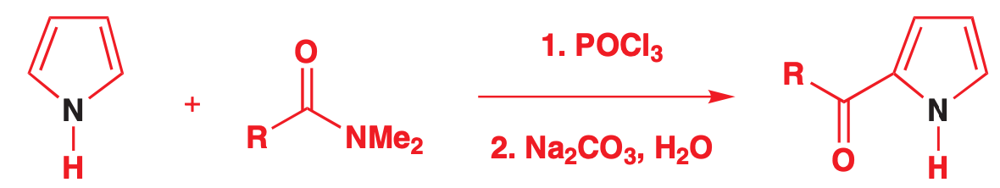{: style="width: 60%;" class="center sharp"}

??? info "Mechanism"
	
	First we need to form the imine in situ
	
	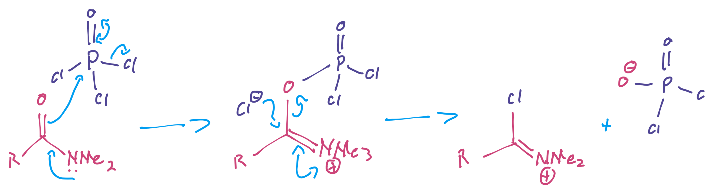{: style="width: 60%;" class="center sharp"}
	
	Then we react it with the pyrrole
	
	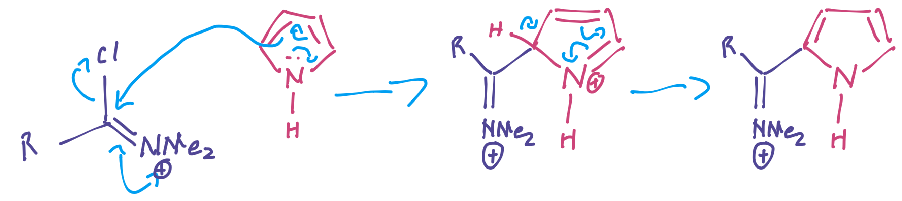{: style="width: 60%;" class="center sharp"}
	
	And finally convert the imine to a ketone
	
	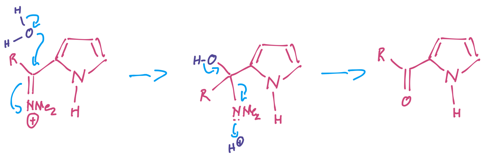{: style="width: 60%;" class="center sharp"}

## Acidity

Because the electrons that hold the proton in place *aren't* the electrons that participate in aromaticity, the pKa of pyrrole is quite low (16) , meaning that its proton is relatively acidic, compared to pyrrolidine or cyclopentane (both have a pKa of 35)

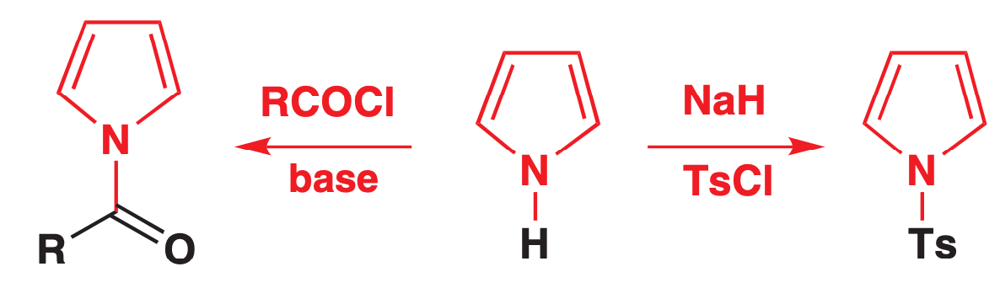{: style="width: 50%;" class="center sharp"}

## Reversing Selectivity

We can use the acidic nature of pyrrole to attach a bulky substituent , such as TriIsopropylSillane (TIPS) to block the 2 positions from reacting, forcing a 3' addition. We use TIPSCl for this and remove the TIPS group with TetraButylAmmonium Fluoride (TBAF). TBAF works because the $\ce{Si-F}$ bond is extremely strong ($582\:KJ\cdot mol^{-1}$)

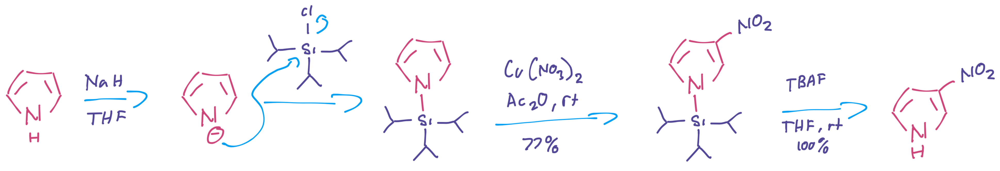{: style="width: 90%;" class="center sharp"}

??? note "TBAF removal"
	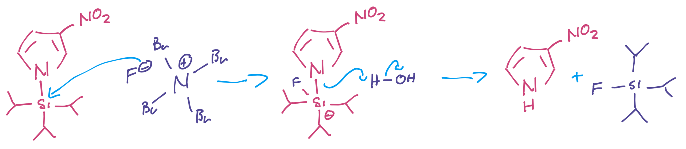{: style="width: 70%;" class="center sharp"}

## NAS

Pyrrole is too electron rich to undergo NAS typically, but when the ring has two nitro groups, the electron density can be sufficiently removed to allow for NAS

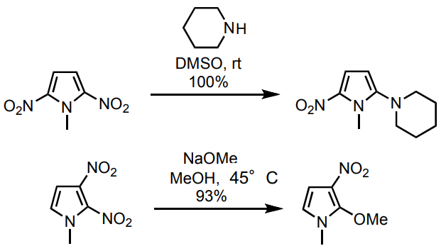{: style="width: 60%;" class="center sharp"}
