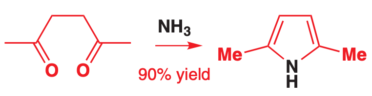
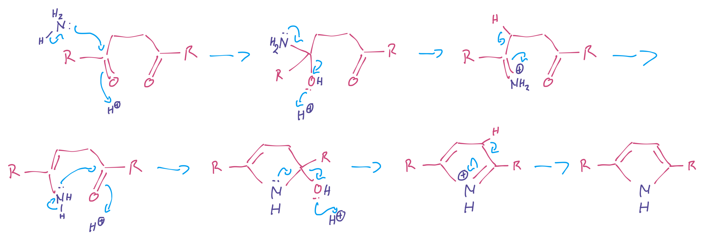
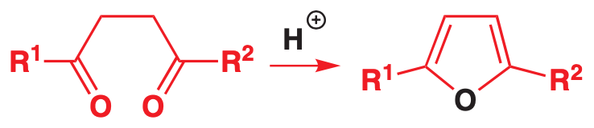
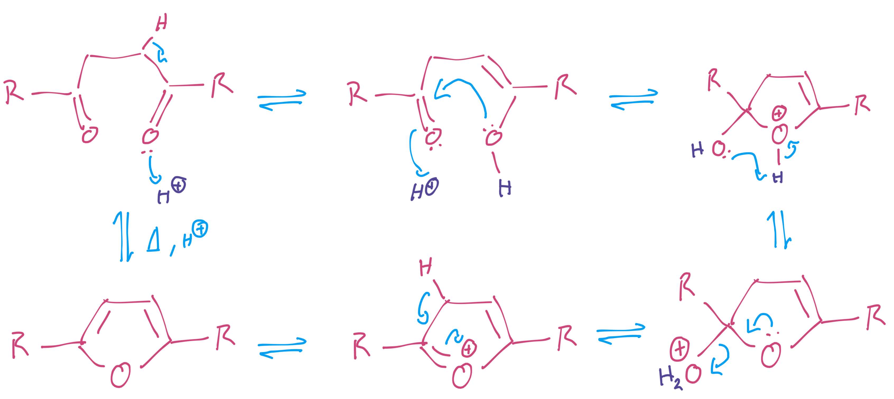
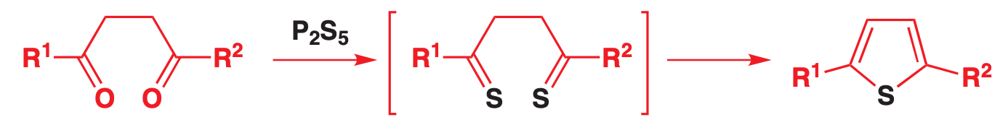
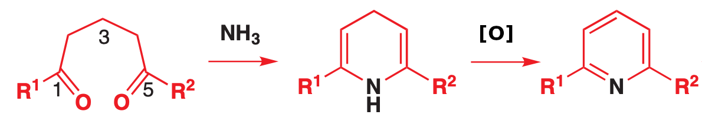
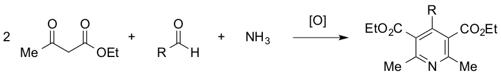

# Heterocycle Retrosynthesis 

The reactions that form aromatic heterocycles are typically condensation reactions and can be geberalised to these simple reactions:

### Pyrrole

{: style="width: 50%;" class="center sharp"}

??? note "Mechanism"
	{: style="width: 90%;" class="center sharp"}

### Furan

{: style="width: 50%;" class="center sharp"}

??? note "Mechanism"
	{: style="width: 70%;" class="center sharp"}

### Thiophene

{: style="width: 90%;" class="center sharp"}

### Pyridine

{: style="width: 75%;" class="center sharp"}

or to avoid using an oxidant 

{: style="width: 75%;" class="center sharp"}

