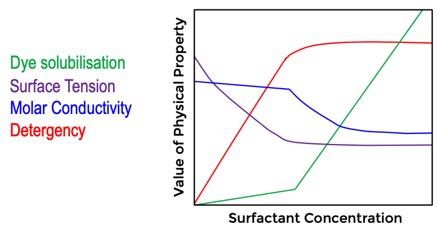
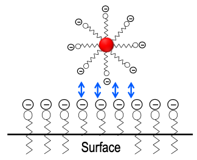
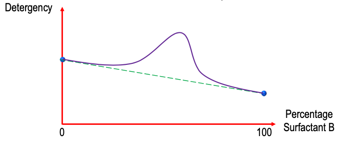

# Surfactants as Detergents

So these notes aren't going to be comprehensive, as I've already written about surfactants in my notes for [Surface and Colloids](../../Sem%206.%20Surface%20and%20Colloids/Surface%20Chemistry/12c/). These notes will ultimately be the few things that Daniel has added to this unit, that Aimin didn't cover in hers

## Ionic Surfactants

* Form an insoluble salt in hard water (scum)
* Form an insoluble acid in slightly acidic water
* Potassium salts are slightly more soluble than sodium salts
* Unsaturated surfactants are more soluble than saturated ones

## Concentration and Properties

The way that the properties of the solution change with the concentration of surfactant can be seen in this figure

{: style="width: 60%;" class="center"}

* Dye solubilisation increases as more micelles are there to support it
* The surface tension will decrease as more surfactant molecules are added to the surface of the solution, but once they reach the CMC, the surface will be saturated and the surface tension will no longer decrease
* The Molar conductance (conductivity per mole) will decrease, as the surfactant molecules are bundled up in to  micelles and will have much lower mobility
* Detergency will increase with concentration, however only until it starts to form micelles. Micelles are useful for cleaning, but not necessarily for detergency

## Detergents

Are surfactants which wet both the substrate and the dirt, remove the dirt in bulk liquid and/or keep the dirt soluble

In general:

* Anionic surfactants are good for soaps and kitchen/laundry detergents
* Cationic surfactants are mostly used to counteract the action of anionic surfactants, and are used for fabric softeners, conditioners and antiseptic throat lozenges
* Amphoteric surfactants have very specialised uses
* Non-ionic surfactants are low foaming and are therefore best for front loaders
  * Work best just below their cloud pint (temperature at which they precipitate out of solution)
    * As the temperature increases, the H-bonds that would otherwise serve to stabilise the surfactants, break down and render the surfactant less soluble

| Name                                  | Structure                       | class      | Facts                                                        |
| ------------------------------------- | ------------------------------- | ---------- | ------------------------------------------------------------ |
| Fatty acid soaps                      | $\ce{CH3(CH2)_{x}COO^{-}Na+}$   | anionic    | Very simple/primitive, produced by saponification of triglycerides (triglyceride + $\ce{NaOH}$ $\to$ fatty acid ) |
| Alkyl sulfates (e.g. SDS)             | $\ce{CH3(CH2)_{x}O3SO^{-}Na+}$  | anionic    | difficult to manufacture, but completely degrade in the environment |
| Alkylauryl sulphonates (e.g. SDBS)    | $\ce{CH3(CH2)_{x}PhSO3^{-}Na+}$ | anionic    | The benzene ring makes them easier to manufacture            |
| Quaternary ammonium salts (e.g. CTAB) | $\ce{CH3(CH2)_{x}N^{+}R3Br-}$   | cationic   |                                                              |
| Coconut diethanolamide                | $\ce{CH3(CH2)_{x}N(EtOH)2}$     | non-ionic  |                                                              |
| β-N-alkylamino propionic acids        | $\ce{RH2N^+(CH2)_{x}COO-}$      | amphoteric |                                                              |

## Surfactants in the Environment

In general order of human toxicity, the ascending order (least to most toxic) is cationic → anionic → non-ionic → amphoteric

Some surfactants that are very useful have been banned, such as tetrapropylene benzene sulphonate, which is hard to break down due to how much foam it produces. Other products such as Trix, were banned because they don't foam as much as the consumer is used to, so they used too much.

## Surfactants as Detergents

There are three main factors that are required for cleaning to occur. They are; chemical treatment, mechanical agitation, and temperature increase (for ionic surfactants).

Typically, tests for detergency are performed on cotton as there is a wealth of comparison data available. "Dirt" is typically made of clay, iron oxide, pigments  and carbon, but mostly it's mmade of sebum, which is ; 1/3 free fatty acids, 1/3 triglycerides and 1/3 fatty esters.

### Wetting

The first function that surfactants provide to actually wet all of the surfaces so that the water can access it. the wetting reduces the surface tension between the water and the dirt, and causes the dirt to "roll up". This typically works best at higher temperatures. $\ce{C12}$ has been found to be a good balance between lipophilic and hydrophilic for allowing wetting to occur.

This is only half the story though, as mechanical agitation will force the dirt up off the substrate and into solution where the next role of the surfactant comes in. Here the surfactant locks the dirt in micelles that prevent it from being redeposited on to the substrate. There is a layer of surfactant left on the substrate that acts to repel the solubilised dirt.

This can be through charge repulsion, however it can also be through a hydration layer, as with PEG from Peter Kingshot's research

{: style="width: 40%;" class="center"}

### The Process

The process of detergency is as follows:

1. The surfactants lower the interfacial tension, allowing for the wetting of all the surfaces
2. The hydrophobic end of the surfactant attaches to the dirt
3. Agitation oft eh water pulls on the surfactant and the oil, allowing more of the surface of the dirt to be exposed 
4. the dirt forms in to a ball surrounded by the surfactant
5. The dirt is kept off the surface, either by the formation of micelles, or the formation of hydration barriers around the dirt

### The Right Surfactant

Most surfaces that we interact (With the exception of some plastics) will form a negative charge. so it makes sense to use an anionic surfactant to wash them, otherwise the polar head can attach itself on to the surface, leaving a greasy feeling.

Quite often the combination of two surfactants will help each other, providing effect that is greater than either of them on their own. this is known as ==mutual reinforcement==.

{: style="width: 60%;" class="center"}

### Additives

We can often add other additives to out detergents to make them more effective. These include (but are not limited to):

* Sequestering agents/chelating agents (e.g. $\ce{Na6P3O10}$, EDTA)
  * These act to remove heavy metals from the water that would interfere with the function of the detergent
* Buffering agents (e.g. borax, $\ce{Na2CO3}$)
  * These act to ensure that the surfactants stay in their correct protonation state
* Deflocculants (e.g. CMC)
  * These serve to prevent the micelles of dirt from aggregating
* Brighteners and bleaches (e.g. hypochlorite, perborate, $\ce{NaBO3.xH2O}$)
* Enzymes (e.g. lipases to degrade lipids and proteases to degrade proteins)
* Foaming (lather) agents (fatty acids and ethanolamides)
  * Can be useful when the dirt needs to be contained in a non-bulk aqueous phase, such as shaving foams and shampoos
* Anti microbial agents
* corrosion inhibitors
* Synergistic agents (e.g. silicates)