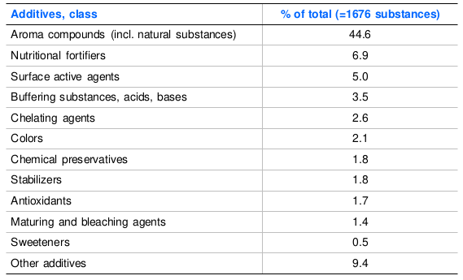

# Food Additives

Each day, the average human consumes 3L of water, 11,520 L of $\ce{O2}$ and 1.5 kg of food. These contain carbohydrates, fats and proteins, but also lots of other small molecules.

## Food Additives

These are very broadly defined as any substance that intentionally added to a food product in trace amounts. they typically help with; flavour, texture, colour, nutritive value, appearance, function or storage properties.

## Regulation
!!! info "Definitions"
	> “any substance the intended use of which results or may reasonably be expected to result -- directly or indirectly -- in its becoming a component or otherwise affecting the characteristics of any food”

	 US FDA
	
	> "Substances added to food to act as any of the following: acidity regulator, anti-caking agent, antioxidant, bulking agent, colouring, colour fixative, emulsifier, firming agent, flavour enhancer, flavouring, foaming agent, gelling agent, glazing agent, humectant, intense sweetener, preservative, propellant, raising agent, sequestrant, stabiliser or thickener."
	
	FSANZ

Food additives are regulated by Food Standards Australia and New Zealand (FSANZ), with the details contained in the Australia New Zealand Food Standards Code

The code is maintained by the National Health and Medical Research Council (NHMRC), who reccomend guidelines  for food and nutrition in general, including the Generally Recognised as Safe (GRAS) status.

The breakdown of how many compounds there are per class cna be seen below. It's pretty obvious that aromas are the biggest category.

{: style="width: 60%;" class="center sharp"}

Generally speaking in Australia these are the main classes of additives

* Vitamins, amino acids and minerals
* Flavour enhancers
* Sugar substitutes
* Sweeteners
* Food colours
* Antimicrobial agents
* Antioxidants
* Chelating Agents
* Humectants
* Anti-caking agents
* Thickening agents, gel builders and stabilisers
* Bleaching agents
* Clarifying agents
* Surface active agents
* Acids and bases
* Fat substitutes
* Aroma Compounds
* Propellants and protective gasses

## Vitamins, Amino Acids and Minerals

### Vitamins

Are typically added to adjust for loss of naturally occurring vitamins through the processing of the product. This also increases the nutritive value of the product, though many vitamins also have other functions, such as:

* Antioxidants - vitamin c
* Colouring agents - vitamin B2
* Colour stability agent - vitamin B3

### Amino Acids

Are added to increase the nutritive value of the product, and to replace proteins that might be lost from removed part of the product. Certain foods can be naturally deficient in particular amino acids and will need to be supplemented:

* Cereals and plant proteins - lysine
* Bovine milk and meat - methionine
* Wheat and rye - threonine
* Casein, corn and rice - tryptophan

### Minerals

Are inorganic products that act as electrolytes, enzyme components and structural materials (bones and teeth). Fortification can be important, such as happens with the iodization of salt.

## Flavours and Flavour Enhancers

Flavours are added to improve the taste of food, to maintain uniformity of flavour and to improve the aesthetic appeal of the product. Flavour enhancers improve the flavours that are already there, without necessarily adding to the taste of the product itself.

## Flavours

The overall flavour of a food is the product of both the flavours and the odours. these can be broadly categorised by their physical properties:

* Flavours - non-volatile, usually polar, water soluble
* Odours - volatile, much less polar, elicit a broader range of flavour sensations

While the main four flavours are widely recognised (salty sour, bitter, sweet), there are a few more debatable ones, such as; astringency, pungency (spicy), coolness (mints) and umami, though most of these are physical sensations rather than flavours themselves.

## Artificial Flavours

Are typically permitted if they are listed in at least one of the following three documents:

* ' Food Technology' (journal) GRAS list (1960-1996)
* Flavouring Substances and Natural Sources of Flavourings, 4th Edition, Volume 1, Chemically-defined flavouring substances, Council of Europe, 1992
* United States Code of Federal Regulations, 1996, 21 CFR Part 172.515

Though flavours are complex! there are about 130 different compounds that make up the distinct flavour of an apple, yet we have single flavours that we will call "apple flavour".
Extracting flavour compositions from natural products is typically accomplished through GC or HPLC

## Flavour Enhancers

The key one is MSG, which is an active component in the algae *Laminaria japonica*, and has been used in Asian cultures for a long time to improve the umami flavour in dishes. Large amounts of MSG can cause "Chinese restaurant syndrome" which os characterised by temporary ailments such as drowsiness, headaches, stomach aches and stiffening joints.

## Sugar Substitutes

<iframe class="center" style="width: 100%; height: 200px;" frameborder="0" src="https://embed.molview.org/v1/?mode=balls&cid=5780"></iframe>

These are substances that are used in the same way as sugars but don't exhibit an insulin response in their metabolism. These are typically poly-alcohols (like sugars, but no carbonyl), and examples include sorbitol (420), xylitol, mannitol (421)

## Sweeteners

<iframe class="center" style="width: 100%; height: 200px;" frameborder="0" src="https://embed.molview.org/v1/?mode=balls&cid=134601"></iframe> 

Are natural or synthetic compounds that taste sweet, but have no, or negligible nutritive value. They're not usually structurally similar to sugars. examples include; saccharin (954), cyclamate (952), and aspartame (951) .

Cyclamates and saccharin have both shown to be carcinogenic (and counter proven in sponsored research).

Aspartame breaks down to form phenylalanine, which for some people can;t be broken down. This is why on the packet, they will have to say "Contains phenylketonurics". Phenylalanine is one of the natural amino acids and is harmless to most people..

### Natural Sweeteners

Some other natural sweeteners include:

* Monellin from the *Dioscoreophyllum cumminsii* fruit
* Thaumatins from the *Thaumatococcus daniellii* fruit
* Curculin from the *Curculigo latifolia* fruit
* Stevioside from the *Stevia rebaudiana* leaves

## Food colours

A number of natural food colours are available and are used to adjust or correct food discolouration or colour change during processing or storage of food. Carotenoids are the most commonly used, followed by red beet pigment and brown coloured caramel compounds. Yellow and red colours are the most commonly used. There aren't a huge amount of approved synthetic colours.

### Riboflavin (101)

Is an orange, naturally occurring colourant that's often used to colour mayonnaise, soups, puddings, desserts and confectionary

<iframe class="center" style="width: 100%; height: 200px;" frameborder="0" src="https://embed.molview.org/v1/?mode=balls&cid=493570"></iframe>

### β-carotene (160a)

Is an orange, naturally occurring vitamin in red/orange fruits and vegetables, particularly in carrots. it;s typically used to colour, fats, beverages, soups, puddings, water confectionery and yogurts.

<iframe class="center" style="width: 100%; height: 200px;" frameborder="0" src="https://embed.molview.org/v1/?mode=balls&cid=6419725"></iframe>

### Tartrazine (102)

Is a synthetic yellow pigment, with an azo linkage and multiple sulphonate groups. It's used in pudding powders, confectionery, ice creams and soft drinks.

<iframe class="center" style="width: 100%; height: 200px;" frameborder="0" src="https://embed.molview.org/v1/?mode=balls&cid=62302"></iframe>

### Carmoisine or Azorubine (122)

Is a synthetic red pigment with two sulphonyl groups and an azo linkage. It's used in Beverages, confectionery, ice cream puddings and fruit preserves

<iframe class="center" style="width: 100%; height: 200px;" frameborder="0" src="https://embed.molview.org/v1/?mode=balls&cid=3666016"></iframe>

### Ponceau 4R (124)

Is a synthetic dark red (cherry/wine) pigment with two sulphonyl groups and an azo linkage. It's used in Beverages, confectionery, salmon and cheese coatings

<iframe class="center" style="width: 100%; height: 200px;" frameborder="0" src="https://embed.molview.org/v1/?mode=balls&cid=3309358"></iframe>

### Green S (142)

Is a synthetic Green pigment with lots of aromatic rings and sulphonyl groups. It's typically used to dye mint products, as well as pea products.

<iframe class="center" style="width: 100%; height: 200px;" frameborder="0" src="https://embed.molview.org/v1/?mode=balls&cid=3769881"></iframe>

### Erythorsine (127)

Is a synthetic pink/magenta pigment with lots of iodine and oxygen around a series of aromatic rings. It's typically used for fruit preserves and confectionery.

<iframe class="center" style="width: 100%; height: 200px;" frameborder="0" src="https://embed.molview.org/v1/?mode=balls&cid=24848329"></iframe>

## Analysis of Food Colours

Food colours can be either polar or non polar, depending on the nature of their structure/attached substituents. Most dyes are insoluble but are made soluble by sulphonation. To analyse them we can use FTIR, TLC, and UV-VIS but mostly we will use HPLC.

Azo dyes will be broken down when metabolised, so it's important to make sure that both metabolites will be soluble.

### Health Concerns

Azo dyes have been linked to some health concerns, particularly:

* Urticartia (skin rashes) and edema (swelling)
* Provocation of asthmatic symptoms
* Angioedema (swelling of blood vessels)
* Rhinitis (runny nose), bronchospasm (breathing problems)
* Blurred vison and purple patches on the skin

## Antimicrobials

Elimination of micro-organisms b physical means is not always possible, so we can add antimicrobial agents to food to prevent or delay the spoilage of the food products.

### Benzoic Acid and Derivatives (210-213)

The antimicrobial activity is due to its lytic action on cell walls and its inhibition of citrate enzymes (the Krebs cycle). The acid is taken into the cell in its protonated form and is deprotonated within the cell, changing the osmotic pressure, causing the cell to lyse.

Benzoic acid typically occurs in nature as a glycoside, in cranberries, bilberries, plum, cove and cinnamon trees.

It is most effective against yeasts and mounds, but not so much bacteria, and is only active in its protonated form (pH < 4.5). Given the requisite acidity, it's commonly used in soft drinks.

It is typically analysed by HPLC/GC

<iframe class="center" style="width: 100%; height: 200px;" frameborder="0" src="https://embed.molview.org/v1/?mode=balls&cid=243"></iframe>

### Sorbic Acid (200-203)

* Active against yeast and fungi
* Active in protonated from
* Analysed by GC

<iframe class="center" style="width: 100%; height: 200px;" frameborder="0" src="https://embed.molview.org/v1/?mode=balls&cid=643460"></iframe>

### Propionic Acid (280-283)

* Active agains moulds
* Active in protonated form
* Analysed by GC

<iframe class="center" style="width: 100%; height: 200px;" frameborder="0" src="https://embed.molview.org/v1/?mode=balls&cid=1032"></iframe>

### Acetic Acid (260-264)

* More active against yeast and bacteria than moulds
* Also used as a seasoning

<iframe class="center" style="width: 100%; height: 200px;" frameborder="0" src="https://embed.molview.org/v1/?mode=balls&cid=176"></iframe>

### Nitrates and Nitrites (249-252)

* Used in meats and processed meat products
* Nitrates are converted to nitrites (active form) by bacteria
* More complicated than other preservatives most active at pH ~4.5
* Analysis bu colorimetry fluorimetry or electrochemically (with an ion sensitive electrode)
* Possibly forms nitrosoamines which are carcinogenic compounds

<iframe class="center" style="width: 100%; height: 200px;" frameborder="0" src="https://embed.molview.org/v1/?mode=balls&smiles=[O-][N+](=O)[O-]CC"></iframe>

### Sulphur Dioxide (220-228)

* Active against yeasts, moulds and bacteria
* Reacts with food constituents
* Used as $\ce{SO2, Na2SO3, K2SO3, NaHSO3, Na2S2O5, K2S2O5}$ at levels of 200 ppm or less
* Commonly used in dried fruits and wine

### Other Agents

#### Methyl Paraben (218)

* Antifungal
* Has been shown to have estrogenic effects

#### Pimaricin or Natamycin (235)

* Antifungal used mainly in dairy products
* Inhibits plasma membrane transport

#### Nisin (234)

* Antibacterial peptide produced by *Lactococcus lactis*
* Contains several uncommon amino acids
* Effective against gram +ve bacteria and spores
* Used in unprocessed meats and cheeses

## Antioxidants

Can either refer to the food preservation tool or the nutritional supplement, but both have a similar function. They are sacrificially oxidised to protect their surrounding components. In the case of lipids, the oxidation products can smell quite unpleasant, but can be primarily avoided by the additon of an antioxidant, such as:

* Tocopherols (307-309)
* Ascorbic acid esters (300-304)
* Gallic acid esters (310-312)
* Butylhydroxytluene - BHT (321)
* Butylhydroxyanisole - BHA (320)

### BHA/BHT

Are quite useful, as they are thermally stable and retain their effects after being baked, however they are linked to carcinogenic effects and can raise cholesterol.

BHA has been banned in Japan since 1958 and McDonald's stopped using it in 1986, however it's not been banned in the UK.

It's analysed by colorimetric analysis after solvent extraction or steam distillation.

<iframe class="center" style="width: 100%; height: 200px;" frameborder="0" src="https://embed.molview.org/v1/?mode=balls&cid=31404"></iframe>

## Chelating Agents/Sequesterants

Traces of heavy metal ions in food act as catalysts for the oxidation of fats and oils, so sequesterants can bind to these heavy metals and increase the efficiency of antioxidants. It can be particularly important in preserving the colour and aroma of canned vegetables.

Chelating agents are ligands that reversibly bind to metal ions, complexing them, deactivating them in the process.

Some examples include; citric acid, EDTA, tartaric acid, and sorbitol.

## Thickening Agents, Gel Builders and Stabilisers

These are polysaccharides/starches that are used as food additives, to; increase the viscosity of a product, stabilise an emulsion, prevent crystallisation, and to prevent volatile aromas from being lost.

Some classic examples are; gelatine, carrageenan (407), xanthan gum, and agar agar.

## Humectants

Are added to stop foods from drying out, retaining softnss and inhibiting crystallisation. These are most commonly polyalcohols, as they have charactersitic hygroscopic properties. They are typically required in confectionery to prevent things from crystallising and drying up.

Examples include; sorbitol, glycerol, mannitol, and 1,2-propanediol

## Water Retention Agents

Rather than acting as hygroscopic agents, like humectants, these act as a barrier, prevent water from escaping. As such they are typically polymers that can be used as glazes over the top of a product, such as polyphosphate

<iframe class="center" style="width: 100%; height: 200px;" frameborder="0" src="https://embed.molview.org/v1/?mode=balls&cid=10283750"></iframe>

## Anticaking Agents

Some foods tend to cake into hard lumps, which would make them difficult for consumers to process. They work either by absorbing water so that the product doesn't, or by providing a film to prevent to product from sticking together.

Products that need these include; salt, seasoning salts, dehydrated vegetable/fruit powders, soup/sauce powders, and baking powder.

Some examples of anticaking agents include; sodium/potassium/calcium hexacyanoferrate(II), calcium/magnesioum silicate, calcium phosphate, and magnesium carbonate.

## Solvents

Solvents are used to increase the stability of food additives, such as certain natural extracts (flavours) that may be solvated in ethanol. A great example of this is vanillin, which is always sold in ethanol.

## Acidity Regulators

These are simply used to change or control the pH of foods and come in three varieties; acids, bases and buffers.

They are often used to ensure that other food additives will maintain their function, as many of them will only work within certain pH parameters.

## Dangers of Some Food Additives

### Benzoates ($\ce{PhCOOH}$)

Can cause allergies such as skin rashes, asthma, and is believe to cause brain damage.

### Bromates ($\ce{NaBrO3}$)

Destroys the nutrients in food, causes nausea/diarrhoea and is linked to cancer.

### Butylates (BHT/BHA)

Responsible for high blood cholesterol, impaired liver and kidney function, thought to be carcinogenic.

### Caffeine

Is a diuretic, a stimulant, can cause heart palpitations, can cause nervousness, occasional causes heart defects.

### Saccharin

Toxic reactions and allergic response, affecting skin, gastrointestinal tract and heart. It may also cause tumours and bladder cancer.

### Red Dye 40

Suspected to cause birth defects and possibly cancer.

### Mono and Di-glycerides

Can cause birth defects, generic changes and cancer.

### Caramel

can cause vitamin B6 deficiencies, can cause certain genetic defects and cancer

### Sodium Chloride

Can lead to high blood pressure, kidney failure, stroke and heart attack

## Toxicity Testing

The GRAS is the first point of safety testing, however the wording is specifically chosen to not state that anything on the list IS safe.

LD50 testing is important for all additives and is a measure of the lethal dose (mass/kg) that would kill 50% of the population. It is however tested on rats and extrapolated to humans.

It's very difficult to determine the low dose effects form LD50 studies, so these results don't scale well.