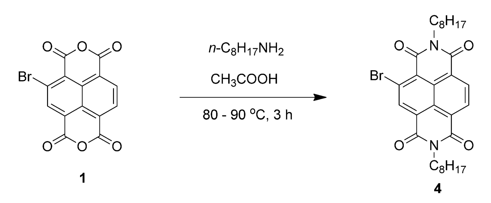

# Friday 4/1/2018

Today I spent a substantial amount of time (in excess of 8 hours)
preparing my document templates in LaTeX using Sublime Text as my editor
for both my weekly diary and my final report. Having a document template
ready to go means that I'm encouraged to work on my writing from day one
rather than leaving everything to the last minute.

Having read through the example report template and writing guide, I
have my concerns about how a chemistry research project will fit into
the prescribed structure, but will discuss with my supervisor further to
figure out an appropriate way to write the report. Based purely on
reading scholarly articles about similar topics and noting how they're
structured, they seem to completely omit the method section, quite often
consolidating all the information into a series of diagram, such as:

{: style="width: 70%; "class="center"}

Example of methodology condensed into a single figure showing reactants, products, reagents, solvents and conditions[^1]

I've decided to use the American Chemistry Society (ACS) referencing
style as it's incredibly simple and aesthetically pleasing, but mostly
because it's a commonly used standard within organic chemistry. It also
has the benefit of being very well supported in both LaTeX and EndNote,
rather than something like Swinburne Harvard which would require a
significantly larger amount of work to get auto-citing.

I am happy with my LaTeX setup for the moment and have decided to embed
my diary as a PDF into my canvas posts for ease of reading and feedback,
but will upload the final diary entry as an attachment for grading.

[^1]:Sasikumar, M.; Suseela, Y. V; Govindaraju, T. Dibromohydantoin: A Convenient Brominating Reagent for 1,4,5,8-Naphthalenetetracarboxylic Dianhydride. Asian J. Org. Chem. 2013, 2 (9), 779–785. https://doi.org/10.1002/ajoc.201300088.