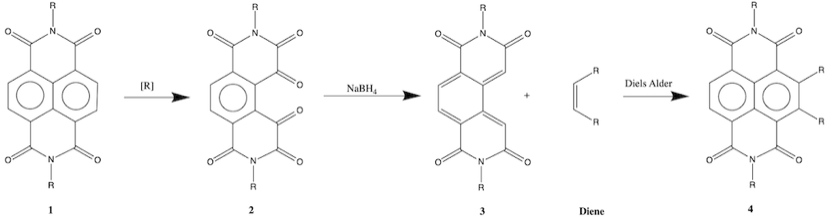

# Monday 7/1/2018

Disclaimer; I think this has just become my project outline, but it's
good for me, so that I can reinforce to myself what the project is and
what the problems actually are\... also, my supervisor is away until
Wednesday, so I have very little guidance with my project for the time
being. in the meantime though, this is my understanding:

### What am I even doing?

{: style="width: 70%; "class="center"}

* Starting with a base of naphthalene diimide (NDI) **1** the molecule is reduced to open up one of the two aromatic rings in a process that has been tested, but I'm not entirely sure if it's been published yet.
* My research begins at molecule **2** where we try to figure out how to reduce the resulting ketones into alkenes, which would de-aromatise the entire system but prepare it for more chemistry **3**. A  suggestion for the reducing agent was , but the exact conditions need to be figured out
* From here we can profile the molecule **4** using NMR, massspectrometry, redox potentials, etc to make sure we've created whatwe want, before the final step
* If there's time, we can try and use the Diels Alder reaction tore-aromatise the core of the NDI, this time introducing anyarbitrary R groups on to the side of the molecule **4.**

### The applications

Again, I'm not entirely certain about this, but my understanding is that
once the initial NDI **1** is formed, the core becomes highly electron
deficient, making it incredibly difficult to perform Electrophilic
Aromatic Substitution (EAS), which is the main way to add substituents
to the side of an aromatic ring.

The typical process is to add the substituents before forming the NDI
itself, which can be a finicky process, altering the chemistry of the
intermediate molecules, altering the effectiveness of the synthesis
process. NDIs therefore cannot be made in bulk and modified as needed.

This process would allow for much larger additions to core of the
molecule, after the NDI itself has been formed.

One application mention in meeting with my supervisor was using the
process to attach the NDI to fullerine (buckyballs), though I'm not
entirely sure of the implications of this.

### Actual progress

I've found a few methods for reducing molecule **2**$\ce{->}$**3** using $\ce{NaBH4}$[^2]

1. $\ce{NaBH4}$,$\ce{LiBr}$ and $\ce{Li2CO3}$ in with unknown conditions

2. $\ce{NaBH4}$ and $\ce{MeOH}$ @ RT for 1 h

3.  $\ce{NaBH4}$, $\ce{MeOH}$ and $\ce{TsCl/Py}$ with unknown conditions

Option 1 seems to have the best chance of reducing the ketone into an
alkene and not an alcohol, however consultation with my supervisor
should clarify this further.

Since option 2 is quick and easy, it might be worth performing it and
testing with FTIR to very quickly tell us if an alcohol was formed.

Next task on my list is to watch an educational
video on organic reducing agents

[^2]:Vera, W. J.; Laya, M. S.; Poon, P. S.; Banerjee, A. K.; Cabrera, E. V. Reagents for the Synthesis of Alkenes from Carbonyl Compounds: Applications in the Synthesis of Terpenoid Compounds. Ark. Online J. Org. Chem. 2013, 396–417.