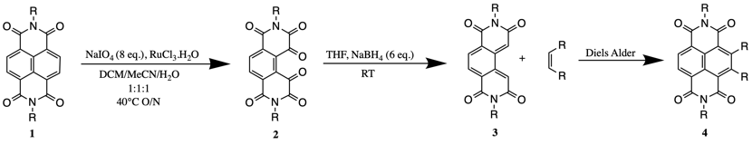
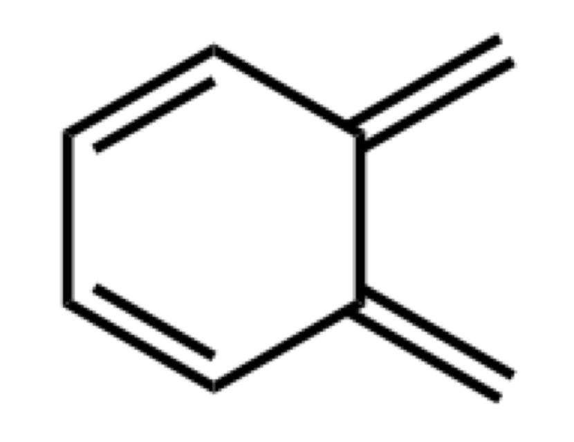

# Wednesday 9/1/2018

### The oxidation and reduction steps

In talking to other members of the research group, it has been brought
to my attention that a paper by @UnusualProductsNDI
([-@UnusualProductsNDI]) has all the answers to the oxidation and
reduction chemistry itself. As such, my updated plan:

{: style="width: 70%; "class="center"}

Conveniently, the group has already synthesised a large quantity of **2** ($R=\ce{C6H13}$), which looking through prior research can be time consuming to purify, so I can spend more time on **2**$\ce{->}$**3** and **3**$\ce{->}$**4**. Mechanisms for the oxidation reaction has been found in a paper, [^4] but the reduction reaction is still
unclear.

### Choosing my dienophile

Using the core of **3** (*o*-quinodimethane) as a diene, I looked into the specifics of Diels Alder reactions. It was suggested that fullerine ($\ce{C60}$) would be an interesting and useful dienophile to use, however in reading [^5], it really doesn't seem so simple. since there are multiple possible dienophiles, on the structure, multiple cycloadditions are possible, meaning that more strict stoichiometry needs to be observed, leading to lower yields of the final product.

There also appear to be stability issues with *o-quinodimethane* that may not necessarily translate to **3** due to the extra conjugation potential of the diimide substituents.

The diimides may also effect the electron density however, causiong them to be slightly deactivated.

{: style="width: 10%; "class="center"}

*o*-quinodimethane

Since most of the dienes used for the Diels Alder reaction (from my basic reading) are generated in situ, it's proving rather difficult to obtain specific details on the cycloaddition step, as the two processes often seem to be combined into one, with the diene as an intermediate, however in reading a book, the conditions of Diels Alder reactions are incredibly varied based on the electron density of both the diene and the dienophile.

is seeming like less of an appropriate diene for preliminary testing, however, as with everything, further discussion with my supervisor tomorrow is required to figure out the specifics.

[^4]:Tabatabaeian, K.; Mamaghani, M.; Mahmoodi, N. O.; Khorshidi, A. Ultrasonic-Assisted Ruthenium-Catalyzed Oxidation of Aromatic and Heteroaromatic Compounds. Catal. Commun. 2008, 9 (3), 416–420. https://doi.org/10.1016/j.catcom.2007.07.024.

[^5]:Ohno, M.; Koide, N.; Sato, H.; Eguchi, S. Synthesis of Heterocycle-Linked [60] Fullerene Derivatives by Heterocyclic o-Quinodimethane Diels-Alder Reaction and Self-Sensitized Photooxygenation of the Cycloadducts. Tetrahedron 1997, 53 (27), 9075–9086. https://doi.org/10.1016/S0040-4020(97)00600-5.