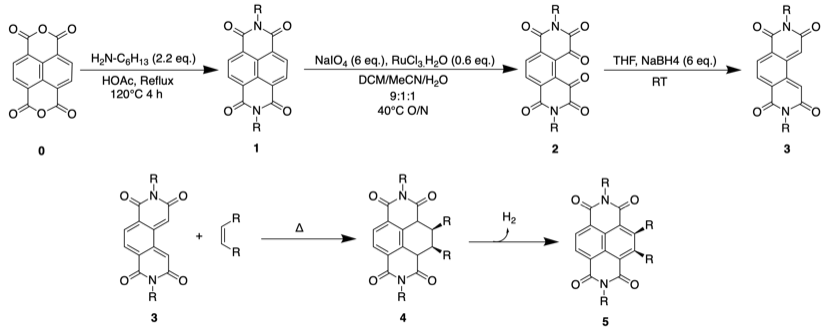

# Friday 11/1/2018

### Synthesis 1 (AS02) **1** from **0** (attempt 2)

Today I started the synthesis of **1** from **0**. The details were:

In a 50 mL two neck round bottom flask, 101.6 mg of **0** was dissolved in 20 mL of acetic acid. With constant stirring, 86 mg of hexylamine ($\ce{H2N-C6H13}$) was added dropwise to the acetic acid. The flask was then capped and refluxed at 120$^\circ$ C$ for two hours before being removed from the heat off and left at room temperature with stirring over the weekend.

### Notes

* TLC was not run, as acetic acid is very polar and prevents the rest of the compounds from migrating individually.