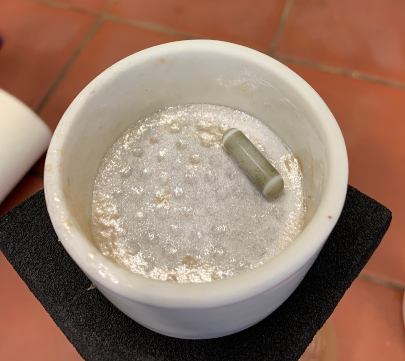
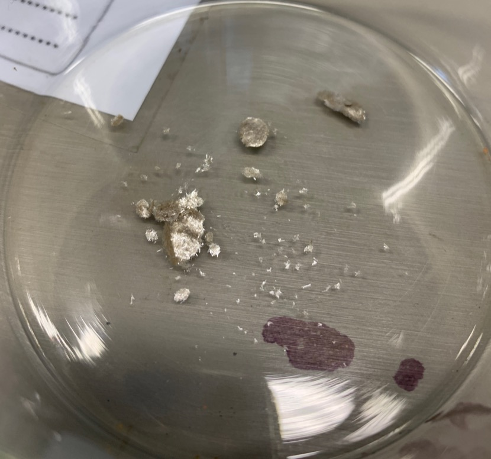
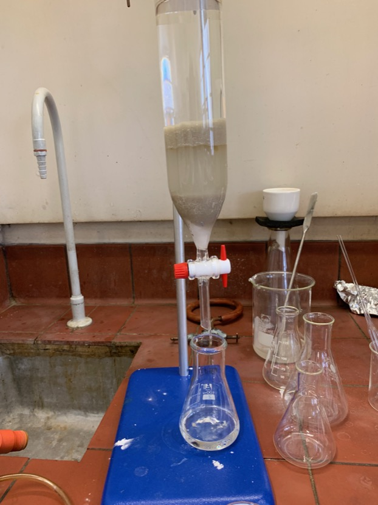
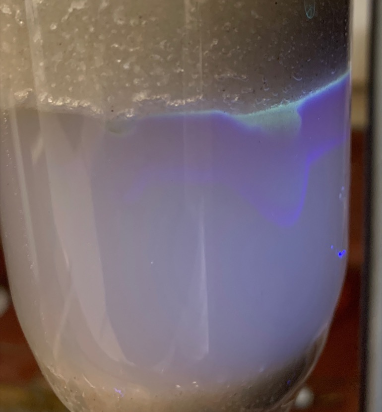
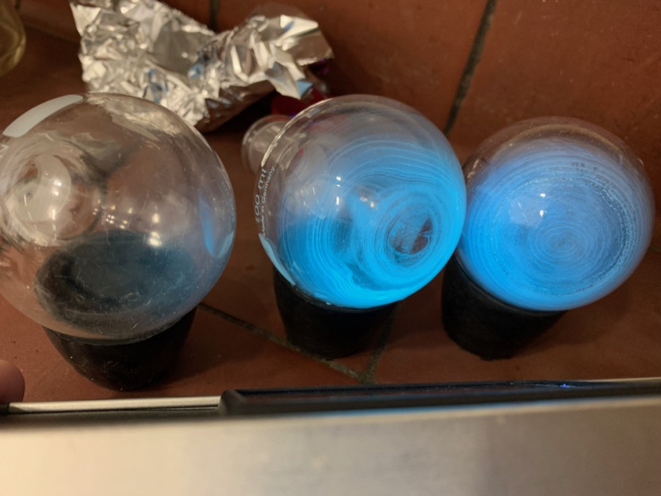
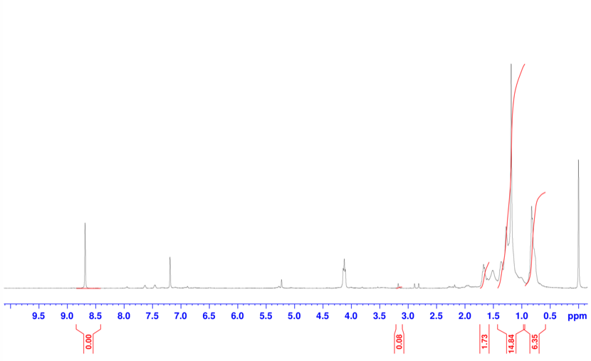
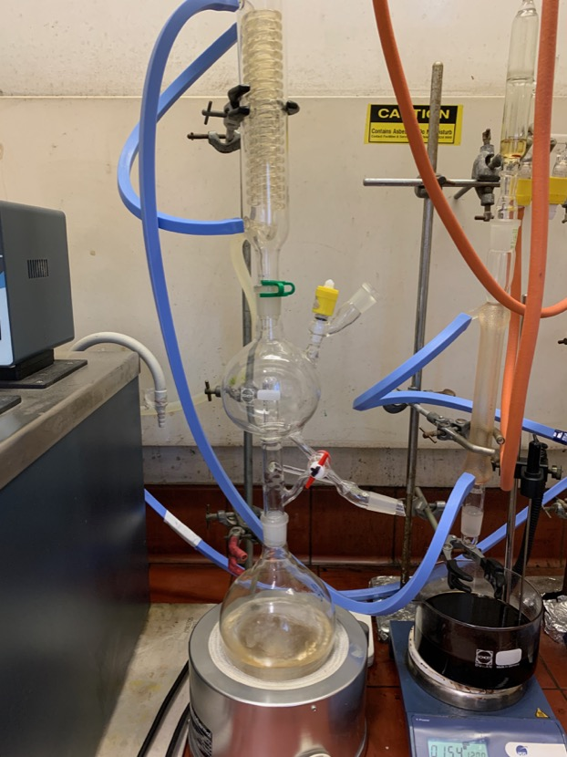
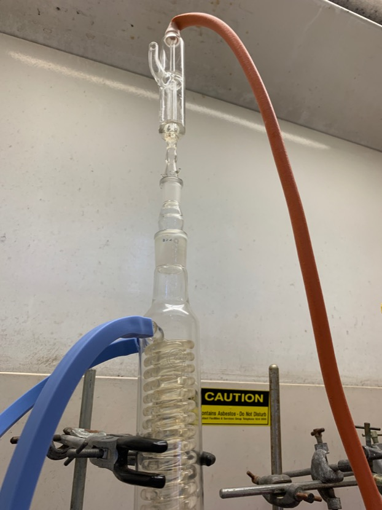
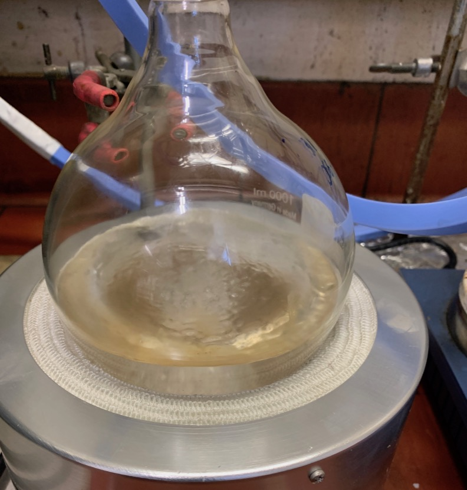

# Wednesday 16/1/2018

### Purification of **1** (AS02) (attempt 2)

After allowing the solution to cool overnight, the product, as well as some impurities had crystallised out and were filtered off ([fig:AS02vaccum](#fig:AS02vaccum){reference-type="ref" reference="fig:AS02vaccum"}). The crystalline precipitate was then washed with and hexane ([fig:AS02product](#fig:AS02product){reference-type="ref" reference="fig:AS02product"}), resulting in an impure product ([fig:AS02dry](#fig:AS02dry){reference-type="ref" reference="fig:AS02dry"}), that was confirmed with TLC.

| {#fig:AS02vaccum} | {#fig:AS02product} | {#fig:AS02dry} |
| :---------------------------------------------------------: | :----------------------------------------------------------: | :---------------------------------------------------: |
|                   Vacuum filtration setup                   |    Crystals of crude product, washed with MeOH and hexane    |       Visual yield of crude crystalline product       |

The impure product was redissolved in minimal DCM and purified by column chromatography with silica gel 60 as the solid phase and DCM:MeOH (200:1) for the liquid phase ([fig:AS02column](#fig:AS02column){reference-type="ref" reference="fig:AS02column"}). Since the product is clear in solution, UV light was used to make it fluoresce ([fig:AS02glow](#fig:AS02glow){reference-type="ref" reference="fig:AS02glow"}). TLC was used on each fraction to identify if it contained **1**. Three fractions were collected that contained **1** and for each, the DCM was removed by rotary evaporation. The resulting powder fluoresced blue-green ([fig:AS02productfinal](#fig:AS02productfinal){reference-type="ref" reference="fig:AS02productfinal"}), indicative of there being **1** present.The dried product was then dissolved in minimal DCM, placed in a weighed vial and the solvent was allowed to evaporate off in a fume cupboard.

| {#fig:AS02column}  | {#fig:AS02glow} | {#fig:AS02productfinal} |
| :----------------------------------------------------------: | :-----------------------------------------------------: | :----------------------------------------------------------: |
| The column setup with (from the bottom up)cotton, sand, silica gel 60, the crude product, sand and the liquid phase |    Visualising the product under long wave UV light.    | The final rotary evaporated product glowing under long wave UV light |

The dried product weighed in at 7.6 mg, with a calculated yield of 4.57%, indicating significant loss. Since column chromatography is my weakest wet skill, I suspect that it may have been the primary source of product loss. This was confirmed with NMR, indicating that while the product was there, the sample was very impure ([fig:AS02NMR](#fig:AS02NMR){reference-type="ref" reference="fig:AS02NMR"}). The solution has been redissolved in minimal chloroform and is being allowed to recrystallise overnight.

{: style="width: 100%;" class="center" fig:AS02NMR}

NMR spectra of the eluted products from the column, with the proton peaks of **1** having been integrated

### THF distillation

In a 1 L round bottom flask was added, $\sim$ 500 mL of THF, some sodium shavings and a small quantity of benzophenone. The round bottom flask was placed in a heating mantle and above it was set up a solvent still-head, double coil condenser and a gas bubbler. Argon gas was pumped through the setup and the THF/benzophenone/sodium mixture was brought to a boil.

The still-head was set up to allow the solvent to pass back down into the round bottom flask to continue being dried.

After a few hours, the sodium was completely consumed, so more was added, along with more benzophenone.

| {#fig:THF_stillcolumn} | {#fig:THF_top} | {#fig:THF_boiling} |
| :-------------------------------------------------------: | :-----------------------------------------------: | :---------------------------------------------------: |
|                The bottom of the THF still                |             The top of the THF still              |                 Boiling THF - initial                 |