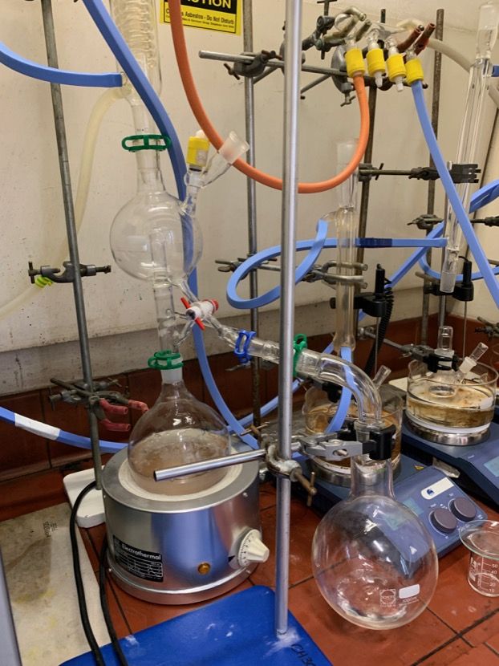
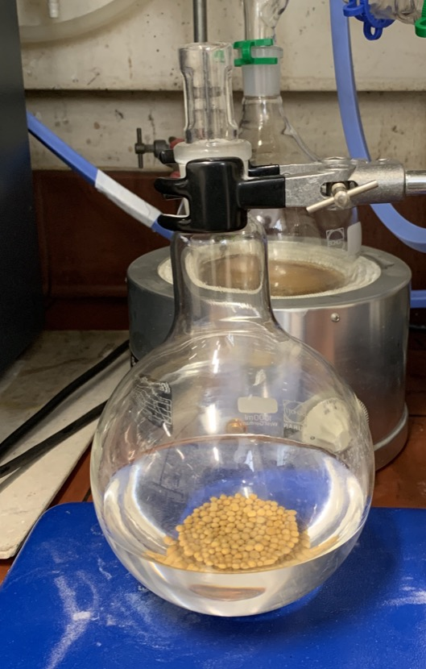
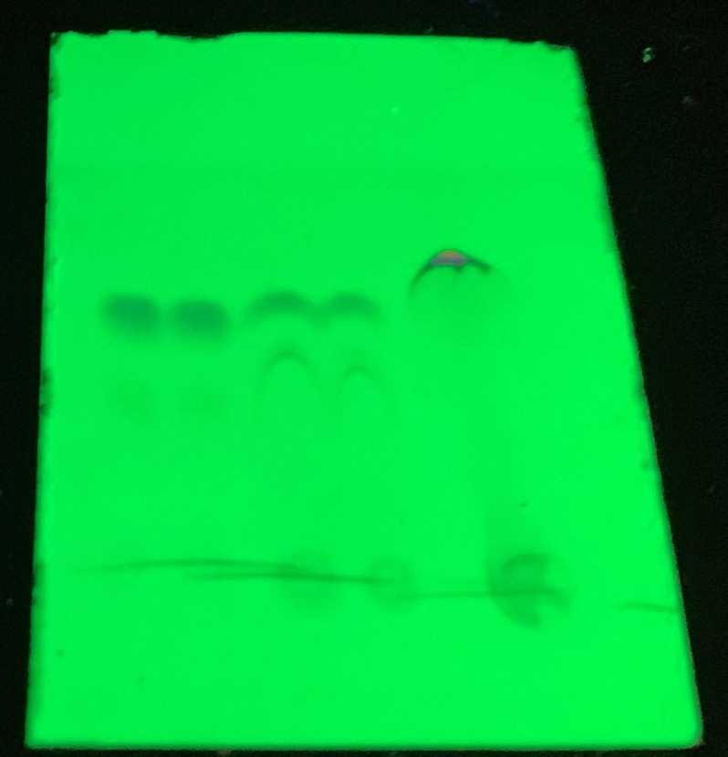
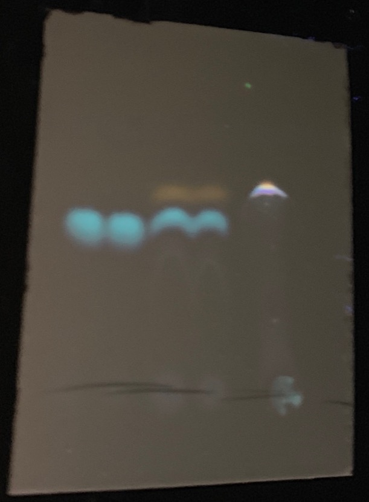
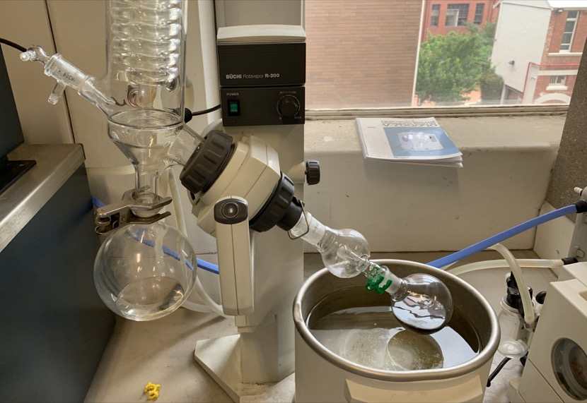

# Friday 18/1/2018

### THF distillation

Having left early yesterday, upon coming in today, the THF still was set up without the solvent still-head in place, boiling away. I have been told that my supervisor will return to reinstall the still-head. The THF in the still however is still yellow and thus is not dry.

On meeting with my supervisor, we have decided to distil off the THF that is currently in the still and reset the still with fresh benzophenone and sodium metal. Over the weekend, the THF will be stored on 4Å molecular sieves to try and pre-dry it, as it's something that we probably should have done before the initial distillation

|       |                                      |
| :---------------------: | :---------------------------------------------------: |
| THF being distilled off | The collected THF stored on $4\:\AA$ molecular sieves |

### Synthesis of **1** (AS03) (attempt 3)

On checking on the synthesis in the morning, the DCM had all boiled off and I was informed that DMF was supposed to be used, not DCM. 20 mL of DMF was added and the reaction was refluxed at 150$^\circ$ C.

TLC was taken of the reaction at 30 minutes and at 3 hours and compared to a stock sample of pure **1** ([fig:AS03TLC](#fig:AS03TLC){reference-type="ref" reference="fig:AS03TLC"}). It's pretty clear to see though in [fig:AS03TLCshort](#fig:AS03TLCshort){reference-type="ref" reference="fig:AS03TLCshort"} that even the pure sample isn't completely pure, which provides a small sense of confidence that it's not an easy purification.

Since the solvent used was DMF and it has a very high boiling point, it's important to separate off the organic soluble components into a more volatile solvent. This was done by adding a few drops of the reaction mixture to a vial with about 1 mL of chloroform and 1 mL of water. The DMF is miscible ion water, but the reactants and products will preferentially dissolve in the chloroform. The bottom, chloroform layer can then be blotted on the silica sheet for TLC.

From TLC in [fig:AS03TLClong](#fig:AS03TLClong){reference-type="ref" reference="fig:AS03TLClong"}, the dots from top to bottom most likely represent; $\ce{H2N-C6H13}$, **1**, **0**, and the dots at the origin being DMF.

| {#fig:AS03TLCshort} | {#fig:AS03TLClong} |
| :----------------------------------------------------------: | :----------------------------------------------------------: |
|                TLC under short wave UV light                 |                 TLC under long wave UV light                 |

The reaction mixture was added to a 250 mL round bottom flask with $\sim$50 mL of toluene and was rotary evaporated to remove the solvent ([fig:AS03rotovap](#fig:AS03rotovap){reference-type="ref" reference="fig:AS03rotovap"}). The process could not be completed before the end of the week, so the reduced AS03 will be left, capped in a fume cupboard over the weekend. With any luck, the products will crystallise out of it.

{: style="width: 50%;" class="center" #fig:AS03rotovap}

Rotary evaporation of DMF and toluene from reaction AS03
