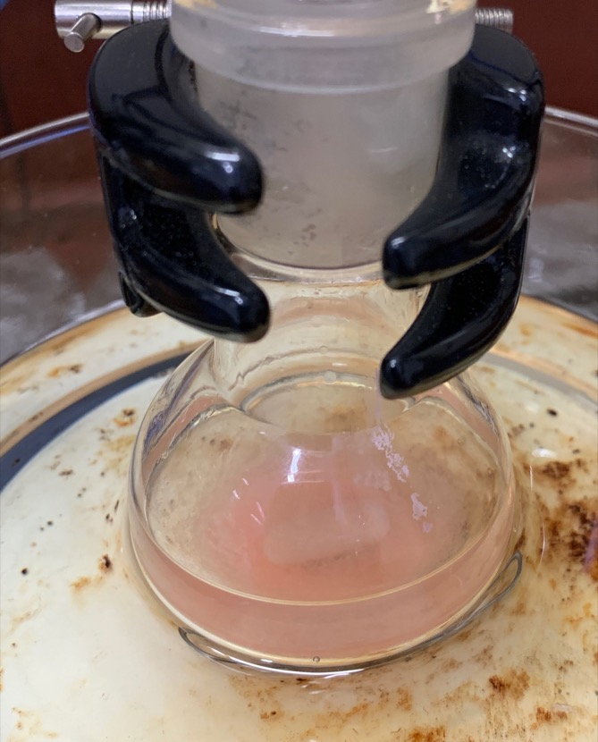
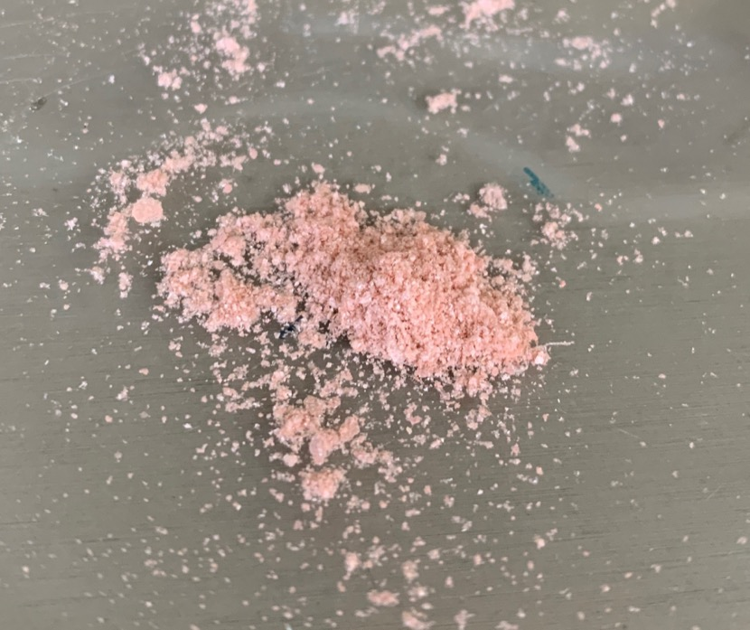
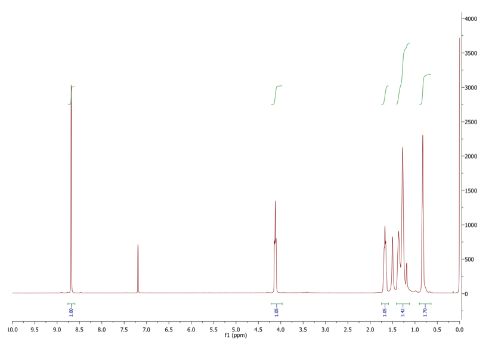
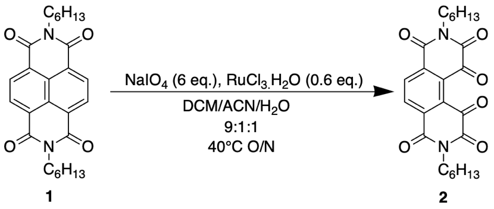
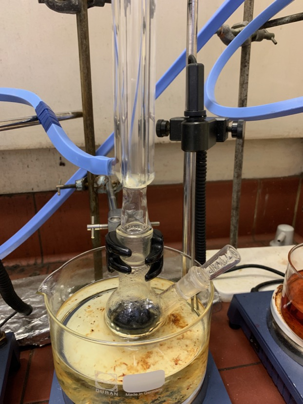

# Wednesday 23/1/2018

### Synthesis of **1** (AS03) (attempt 3)

Trying my fellow researcher's method, I dissolved the pink product in minimal chloroform and added $8\times$ methanol. This caused **1** to crash out, but unfortunately, so did the pink product. Upon centrifuging, both the pink and **1** were in the pellet.

In an attempt to try and remove the pink impurity from the pure **1**, I've added a mixture of hexane and methanol to a round bottom flask, with the dried, impure crystalline product ([fig:warmingAS03HexMeth](#fig:warmingAS03HexMeth){reference-type="ref" reference="fig:warmingAS03HexMeth"}). The hope is that the impurity will be soluble in hexane or methanol, which the NDI is not, causing it to dissolve in the solvent, rather than to stay in precipitation.

After this was completed, the methanol/hexane mixture was vacuum filtered off and the precipitate was washed with more methanol and hexane. The resulting precipitate was allowed to dry under vacuum and weighed. a total of $\sim$52 mg was recovered, accounting for a 29% yield. The low yield is most likely due to the DMF reaction being run for slightly shorter and slightly hotter

than it should, which may also account for the high proportion of side products.

There was probably also a significant loss in the purification process, as the products were transferred from vessel, to vessel to vessel, due to a constantly changing process and overall vision of how the product was to be purified

To paraphrase Dr Daniel Eldridge; This synthesis may be simple for a researcher, but I'm still just an undergraduate, and all of this is a part of the learning experience.

|   {#fig:warmingAS03HexMeth}    |                  |
| :----------------------------------------------------------: | :--------------------------------------------: |
| Crude crystalline product being warmed in methanol in hexane | Crystalline **1** with some pink contamination |

While the product is not completely pure, I will take an NMR to see how prominent this impurity is, as it's suspected that there is only a small amount of the pink impurity, but its colour is so strong, that it looks much more present. Compared to [fig:crudedriedAS03](#fig:crudedriedAS03){reference-type="ref" reference="fig:crudedriedAS03"}, it's much cleaner, and I'm not sure that I'm willing to keep trying to purify the compound, if it's going to result in an even smaller yield.

{: style="width: 100%;" class="center" #fig:AS03pureNMR}

NMR of the pure product of AS03, with **1 peaks being integrated**

As can be seen in [fig:AS03pureNMR](#fig:AS03pureNMR){reference-type="ref" reference="fig:AS03pureNMR"}, The sample is pretty much pure. Whatever the pink impurity is, it's small and not really showing up on the NMR. I believe that this product is pure enough to continue on to the synthesis of **2**.

The only confusing point for me is the single peak at 1.5 ppm. It represents two protons, though all the other protons in the sample.

I have been informed by my supervisor that the peak at 1.5 ppm is in fact $\ce{DOH}$ (deuterated water).

### Oxidation of **1** to form **2** (AS04)

{: style="width: 50%;" class="center"}

To a $50\:mL$ round bottom flask was added 60.6 mg of **1**, 179 mg of $\ce{NaIO4}$and 20 mL of DCM/ACN/$\ce{H2O}$ (9:1:1). With constant stirring, 17.4 mg of $\ce{RuCl3}$ was added and the flask was refluxed at 40$^\circ$ C overnight.

{: style="width: 30%;" class="center"}

Refluxing setup for AS04
