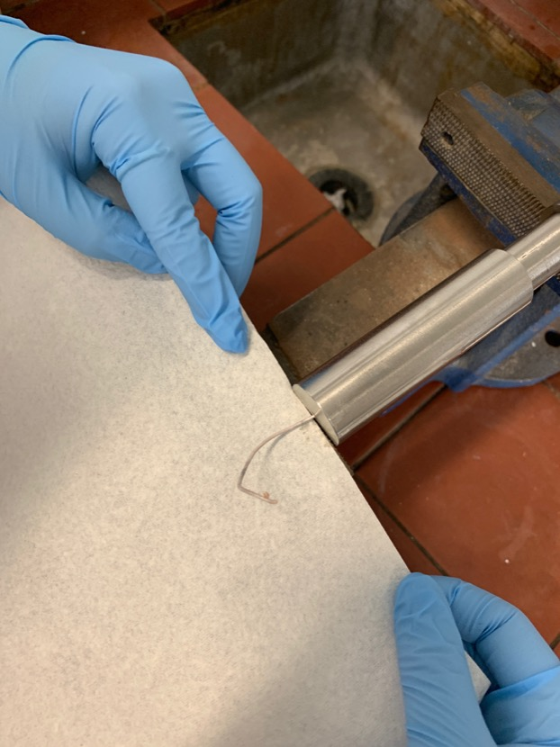

# Thursday 24/1/2018

### Oxidation of **1** to form **2** (AS04)

Upon re-reading the notes on this reaction, I've noticed that it only calls for 0.6 equivalents of $\ce{RuCl3}$. Since I don't know the mechanism for the reaction, I'm not sure if this will cause the **2** to be further oxidised on the other side as well. The products should be vastly different in terms of polarity though and should be eluted form a column separately, but either way, this may very well affect yield. Since I'm following through with the products from AS03, I'd like to obtain a usable product from this reaction, otherwise it may have been a waste and I'll have to use stock NDI-C6 to repeat the reaction.

While the reaction was successful, purification wasn't. The simple reasoning I can give is "it just wasn't my day today", but in essence, I made a series of stupid mistakes that caused me to physically lose my sample. The reaction has been set up again using stock NDI-C6 and will be left to synthesise overnight. This time I have respected the $0.6$ equivalents of $\ce{RuCl3}$.

### THF Still

Progress has finally been made. My supervisor had organised with the lab manager to get someone from engineering to make a crude sodium press, which is essentially a piston inside of a tube that has a very small hole in one end ([fig:sodiumpress](#fig:sodiumpress){reference-type="ref" reference="fig:sodiumpress"}).

{: style="width: 30%;" class="center" #fig:sodiumpress}

Extruding sodium metal

The piston and the tip of the tube is squeezed firmly in a vice with sodium in the middle, causing the sodium to be forced out the tiny hole (and somewhat up the sides of the piston), extruding it into a thin wire. This wire can then be used in the THF still as the drying agent, since it has a much larger surface area.

The next hurdle is just to get a new $\ce{N2}$ bottle hooked up, so that we can ensure an inert and dry atmosphere inside of the still. Since THF is hygroscopic, it will happily pull water out of the air if it's available.