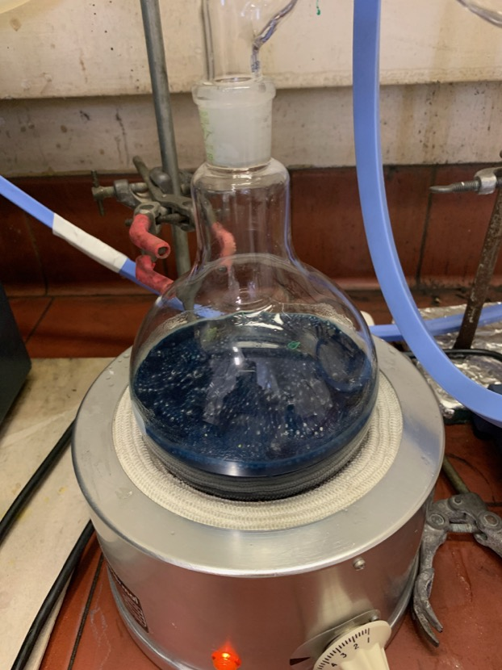
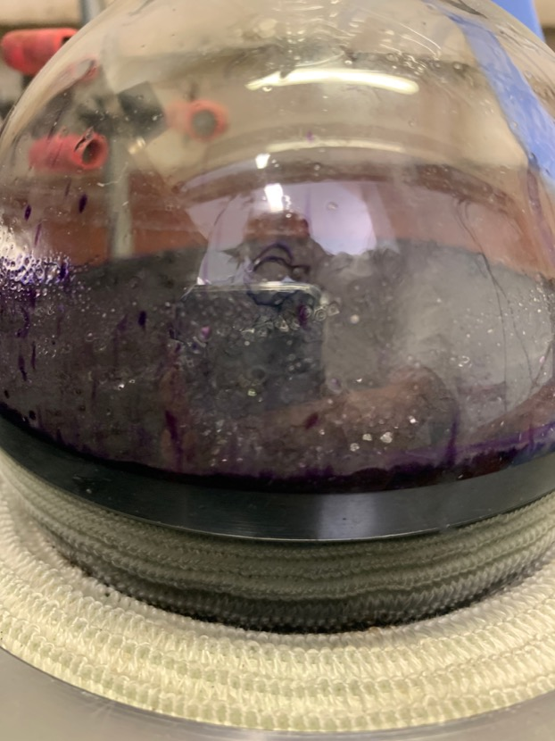
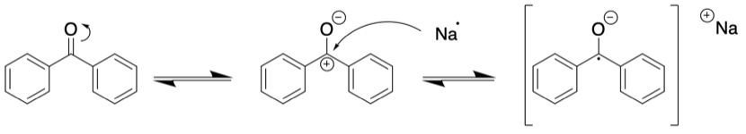

# Friday 25/1/2018

### Oxidation of **1** to form **2** (AS04)

Checking on the reaction with TLC in the morning, there was still a decent amount of the precursor **1** left in the reaction mixture, so I added another 95 mg of $\ce{NaIO4}$ and allowed to reaction to continue for a bit longer.

After about two hours, the reaction mixture was filtered through celite twice, completely removing the black colour, before being dried under rotary evaporation. The resulting dried crude product was redissolved in minimal DCM and introduced into a chromatography column with silica 60 as the solid phase.

| ![![]{label="fig:AS04blue"}](IMG_0106.jpeg){#fig:AS04blue} | ![![]{label="fig:AS04colintact"}](IMG_0107.jpeg){#fig:AS04colintact} | ![![]{label="fig:AS04colfinal"}](IMG_0108.jpeg){#fig:AS04colfinal} |
| :----------------------------------------------------------: | :----------------------------------------------------------: | :----------------------------------------------------------: |
|                     The UV damaged **2**                     |           What was assumed to be the intact **2**            |               The products that wouldn't elute               |

Unfortunately, it was not brought to my attention that the dione (**2**) is UV sensitive, so while I was trying to see what was happening, the trick I used with the purification of **1** where I held the UV lamp up to the column to see how it fluoresced, in this case, it appeared to have completely destroyed my product, turning it blue, as can be seen in [fig:AS04blue](#fig:AS04blue){reference-type="ref" reference="fig:AS04blue"}.

It was assumed that there would be some product left intact and that it would most likely be the yellow ring ion [fig:AS04colintact](#fig:AS04colintact){reference-type="ref" reference="fig:AS04colintact"}, but it didn't want to elute, so we cannot confirm it.

I have extracted three fractions from the column, but what you can see in [fig:AS04colfinal](#fig:AS04colfinal){reference-type="ref" reference="fig:AS04colfinal"} wouldn't elute from the column, even with DCM/methanol at 10:1. All three fractions seemed to contain every product that was seen in the crude, so I'm personally unsure as to what happened. My assumption is that the destroyed product was eluted and the intact **2** still existed in the column but since the column was so long and wasn't flowing as fast as it could have, may not have had the ability to be moved.

I will take NMR spectra of the tree fractions to try and determine what happened, on Tuesday when the university re-opens after the public holiday.

### THF Still

Returning in the morning, the still was back up and refluxing, however with the added sodium, the THF in the bottom of the still had turned green. to fix this, I added some more benzophenone and let the still keep refluxing until a very dark blue colour appeared ([subfig:drierTHF](#subfig:drierTHF){reference-type="ref" reference="subfig:drierTHF"}).

| {#subfig:wetTHF} | {#subfig:dryTHF} | {#subfig:drierTHF} |
| :----------------------------------------------------------: | :-------------------------------------------------------: | :----------------------------------------------------------: |
|                Wet THF refluxing in the still                |  Dried THF refluxing in the still with blue benzophenone  |  Dried THF refluxing in the still with purple benzophenone   |

In doing some reading, the blue colour is from the sodium-benzophenone ketyl species formed ([scheme:benzophenone](#scheme:benzophenone){reference-type="ref" reference="scheme:benzophenone"}). Since it can only form in oxygen and water free environments, it makes a perfect indicator for dryness, coinciding with a content of $\sim$10 ppm. The species itself is also an scavenging agent[^8].

formation of the radical sodium-benzophenone ketyl species

As the drying process continued, it went through a few colour changes, starting from clear ([subfig:wetTHF](#subfig:wetTHF){reference-type="ref" reference="subfig:wetTHF"}), to green, a light blue, dark blue ([subfig:dryTHF](#subfig:dryTHF){reference-type="ref" reference="subfig:dryTHF"}) and finally to a deep purple ([subfig:drierTHF](#subfig:drierTHF){reference-type="ref" reference="subfig:drierTHF"}).

[^8]:Suraru, S. L.; Würthner, F. Strategies for the Synthesis of Functional Naphthalene Diimides. Angew. Chemie - Int. Ed. 2014, 53 (29), 7428–7448. https://doi.org/10.1002/anie.201309746.