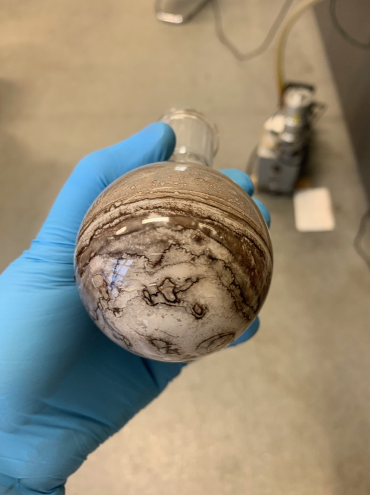

# Tuesday 29/1/2018

### Purification of side experiment - dry synthesis of **1** from **0**

Out of curiosity about two weeks ago, my supervisor asked me to set up a basic, crude synthesis of **1**, but this time, I'd be adding 2.6 equivalents of hexylamine onto $\sim$100 mg of dry NDA (**0**) and heating it to $\sim$90$^\circ$C. After putting the reaction together and thinking nothing of it, it was left for about a week before my supervisor asked for an NMR to be taken that showed a very clean looking **1**. It hadn't reacted completely though, and so another 1.5 equivalents of hexylamine was added.

After about another week of letting it sit at $\sim$90$^\circ$C, A large proportion of the black/grey powder had turned white ([fig:dry](#fig:dry){reference-type="ref" reference="fig:dry"}), prompting me to wonder, 'what kind of yield came of this?

{: style="width: 50%;" class="center" #fig:dry}

Dry synthesis of **1** from **0**

Since tomorrow morning the fumehoods are being serviced, I can't put on any overnight reactions, so I've decided to take the opportunity to purify the dry synthesis. To do this, I dissolved the dry product and washed the flask in minimal DCM and rotovapped it in a weighed, round bottom flask to dryness over about an hour. The flask was weighed by difference, giving $\sim$113 mg of crude.

The crude was then separated by column chromatography with DCM as the mobile phase and silica 60 as the stationary phase. Two fractions were collected, one being bright pink and one being yellow. The yellow fraction (most likely pure product) was rotovapped to dryness and redissolved in minimal DCM for NMR tomorrow (Sample A). The pink fraction was rotovapped tom dryness and the crystalline product was suspended in hot methanol. This was then vacuum filtered, resulting in a pale pink liquid and a pale pink crystalline product. The pink crystalline product was redissolved in minimal DCM for NMR tomorrow (Sample B). The pink filtrate was rotovapped, resulting in small clumps of flakey pink crystals that were redissolved in $\ce{CDCl3}$ and put in an NMR tube for spectroscopy tomorrow (Sample **C**).

### Report writing

I've decided that I should probably start writing my report, so I've began to write the methodology based on the successful bits of synthesis that I've accomplished. I've made notes about what I need to write about in the introduction, and my supervisor has told me that It could be interesting to talk about my... less successful attempts in the discussion as well.