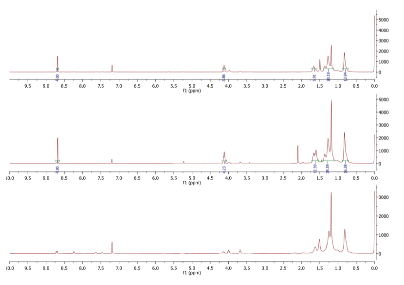
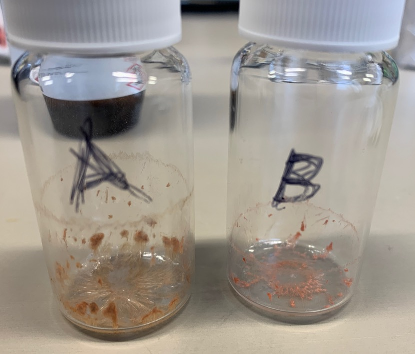
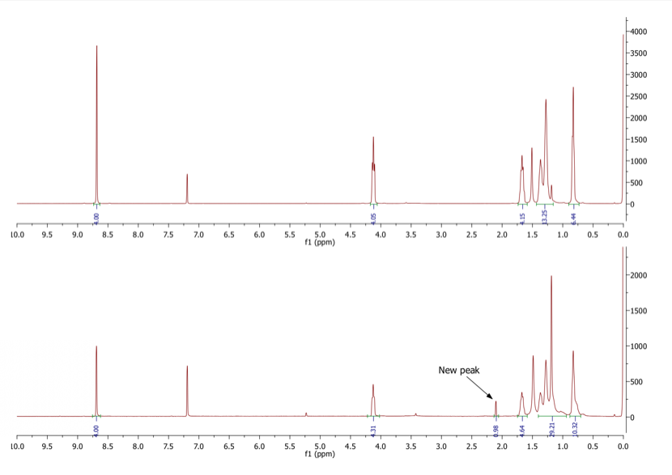
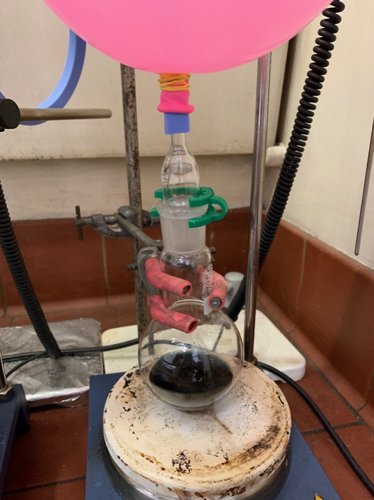
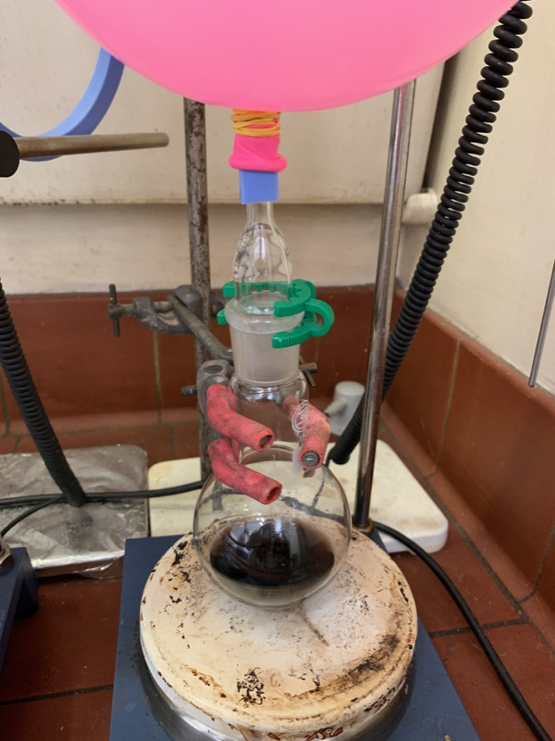
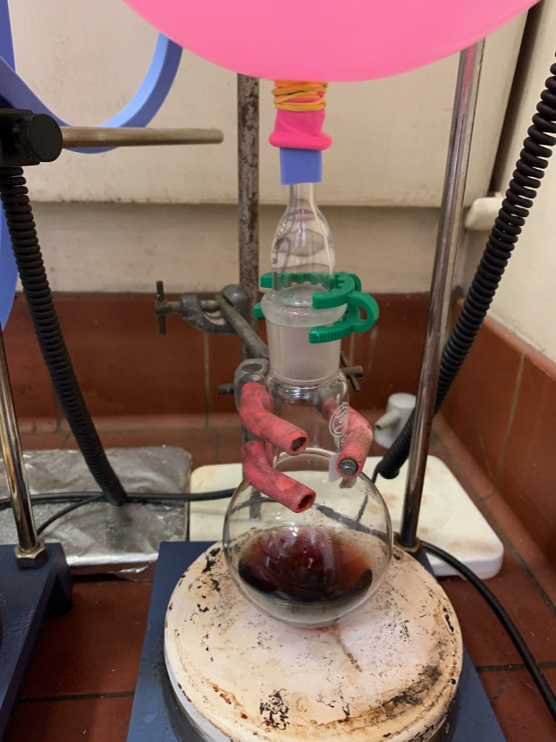
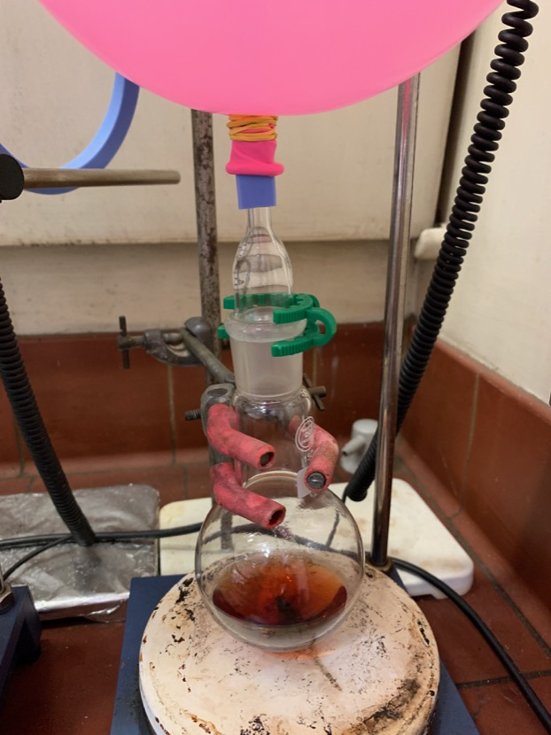

# Wednesday 30/1/2018

### Oxidation of **1** to form **2** (AS04)

For completeness, I would still like to synthesise and purify **1**, even though we have a stock sample. As with everything, the synthesis is not the problem, the problem is that I'm not particularly confident with running columns yet, as I haven't been taught the technique particularly thoroughly yet.

{: style="width: 100%;" class="center" #fig:AS04NMR}

NRM spectra of Fractions 1, 2 and 3 (from top to bottom)

As can be seen in [fig:AS04NMR](#fig:AS04NMR){reference-type="ref" reference="fig:AS04NMR"}, In fractions 1 and 2 there is a fair amount of precursor product (**1**), but across all three fractions we can't see the dione, which would have a 2 proton peak at $\sim$8.25 ppm. What we can see though is a fair amount of "H grease" and degraded products. I'm not entirely sure what the UV degraded **2** would look like to be able to predict what it's NMR might look like.

### Purification of side experiment - dry synthesis of **1** from **0**

{: style="width: 50%;" class="center" #fig:drycrystalline}

Dried samples of the processed fractions from yesterday's column

After leaving samples A and B to dry in the fumehood overnight, both crystallised into fine, fibrous crystals as expected from **1** ([fig:drycrystalline](#fig:drycrystalline){reference-type="ref" reference="fig:drycrystalline"}). NMR spectra were taken of the samples in $\ce{CDCl3}$.

The spectra showed that samples A and B were pure **1** and as such they have been combined and are currently drying to be able to determine the yield. While sample B showed a small proportion of **1**, it introduced some new peaks that may present some answers to what the pink stuff is ([fig:dryspectra](#fig:dryspectra){reference-type="ref" reference="fig:dryspectra"}).

{: style="width: 100%;" class="center" #fig:dryspectra}

NMR spectra of samples B (top) and C (Bottom)

In talking to a fellow research group member, the new peak is acetone, which leaves us no closer to identifying the pink stuff.

### Oxidation of **1** to form **2** (AS06)

To a 50 mL round bottom flask was added 51 mg of **1**, 150.6 mg of $\ce{NaIO4}$ and 20 mL of DCM/ACN/$\ce{H2O}$ (9:1:1). With constant stirring, 14.6 mg of $\ce{RuCl3}$ was added and the flask was refluxed at 40$^\circ$C overnight.

### Reduction of **2** to form **3** (AS05)

Finally getting on to real crux of the research project. We have sodium metal, in the THF still, with $\ce{N2}$ bubbling through the system and the THF is finally dry. We're finally ready to mode on to the synthesis of **3**.

As per [^3] To a round bottom flask was added 79.8 mg of **2** and $\sim$70 mg of $\ce{NaBH4}$. To this was added $\sim$30 mL of dry THF, straight from the solvent still. The flask was flushed with $\ce{N2}$ gas and was topped with a balloon full of $\ce{N2}$ to ensure an inert and dry atmosphere. The reaction was left at room temperature with stirring overnight.

|{#fig:AS05colour}|{#fig:AS05colour}|{#fig:AS05colour}|{#fig:AS05colour}|
|:---:|:---:|:---:|:---:|

The colour changes of AS05 over a period of an hour

Over a period of about an hour, the colour changed from blue, to brown, to red and gradually got lighter. It's expected that as the reduction proceeds to completion, the mixture will be colourless.

[^3]:Maniam, S.; Sandanayake, S.; Izgorodina, E. I.; Langford, S. J. Unusual Products from Oxidation of Naphthalene Diimides. Asian J. Org. Chem. 2016, 5 (4), 490–493. https://doi.org/10.1002/ajoc.201600048.