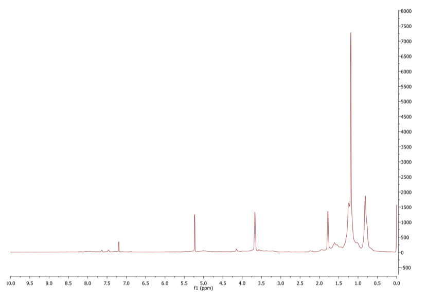
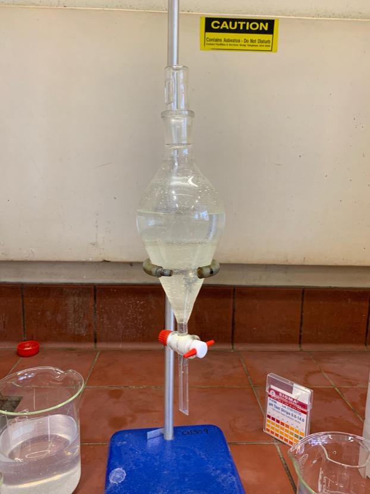

# Thursday 31/1/2018

### Oxidation of **1** to form **2** (AS06)

The reaction mixture was taken off the heat and filtered through celite, before being dried with the rotary evaporator, re-dissolved in minimal DCM and left to crystallise overnight, in a dark fume hood.

### Reduction of **2** to form **3** (AS05)

|{#fig:AS05banda}|![!Before and after the reduction[]{label="fig:AS05banda"}](IMG_0122.jpeg){#fig:AS05banda}|
|:--:|:--:|

Before and after the reduction

After returning to the lab, the reduction had turned a pale yellow colour ([fig:AS05banda](#fig:AS05banda){reference-type="ref" reference="fig:AS05banda"}) and was ready for processing. The reaction mixture was reduced under rotary evaporation and diluted with DCM. 2 M $\ce{HCl}$ was added dropwise to react any remaining $\ce{NaBH4}$. The mixture was then washed with water (4$\times$150 mL), washed with 1 M brine (2$\times$150 mL) and finally washed with saturated brine solution (2$\times$150 mL), before being dried under rotary evaporation. An NMR spectra was taken of the dried compound at this point before further processing.

{: style="width: 100%;" class="center" #fig:AS05NMR1}

NMR of the crude, washed solution

During the washing step, a fair amount of yellow precipitate formed (as can be seen in [subfig:AS05washing](#subfig:AS05washing){reference-type="ref" reference="subfig:AS05washing"}) that wasn't soluble in DCM, water, or brine. It was assumed that since [^3] mentioned that the product is soluble in DCM and forms a white solid, that the yellow is some side product.

| {#subfig:AS05washing} | {#subfig:AS05ppt} |
| :----------------------------------------------------------: | :----------------------------------------------------------: |
|            Washing the reaction mixture in water             |    Precipitate falling out of hexanes:ethyl acetate (5:1)    |

After the NMR showed no discernible product, I decided to continue on with the process, to see if something might pop out if we kept on purifying as per the method, so:
The NMR sample was combined with the remaining dry crude from the previous step and was dissolved in minimal DCM. $\sim$ 50 mL of hexanes:ethyl acetate (5:1) was added to the DCM and a fine white precipitate formed ([subfig:AS05ppt](#subfig:AS05ppt){reference-type="ref" reference="subfig:AS05ppt"}). This was left overnight to reduce the solvent and hopefully allow the precipitate to grow into slightly larger crystals for filtering.

[^3]:Maniam, S.; Sandanayake, S.; Izgorodina, E. I.; Langford, S. J. Unusual Products from Oxidation of Naphthalene Diimides. Asian J. Org. Chem. 2016, 5 (4), 490–493. https://doi.org/10.1002/ajoc.201600048.