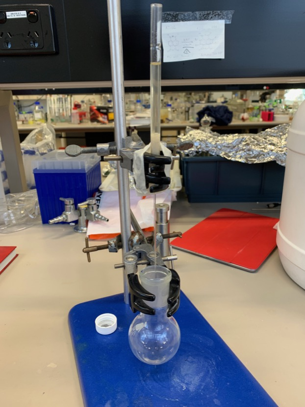

# Friday 1/2/2018

### Reduction of **2** to form **3** (AS05)

After allowing the precipitate to settle, I wasn't confident that the precipitate wasn't just some residual $\ce{MgSO4}$, So I reduced down the mixture with the rotary evaporator and redissolved the residue in minimal DCM, to ensure that the desired product **3** was in solution. I then filtered the solution (which was turbid at this point) through a pipette with some cotton wool and celite in it ([fig:AS05filterpipette](#fig:AS05filterpipette){reference-type="ref" reference="fig:AS05filterpipette"}), which gave me a crystal clear, yellow solution

After drying this again and taking an NMR, the results showed very little, because the solvent peaks were just too great ([\[fig:AS05NMRsolventpeaks\]](#fig:AS05NMRsolventpeaks){reference-type="ref" reference="fig:AS05NMRsolventpeaks"} Bottom).

{: style="width: 40%;" class="center"  #fig:AS05filterpipette}

Filtering the turbid solution through celite

{: style="width: 100%;" class="center" #fig:AS05NMRsolventpeaks}

NMR spectra of dried residue with too high solvent peaks (Bottom) and of the whole sample fully dried (Top)

I wasn't happy with the first filtering anyway, so I set up a new pipette, re-filtered the solution and decided to dry the solution over a longer period of time (while I went to lunch) to try and get the residue as dry as possible. The second NMR didn't show much change, despite the solution being significantly more concentrated ([fig:AS05NMRsolventpeaks](#fig:AS05NMRsolventpeaks){reference-type="ref" reference="fig:AS05NMRsolventpeaks"} Top), so I have passed the information to my supervisor for some more guidance.