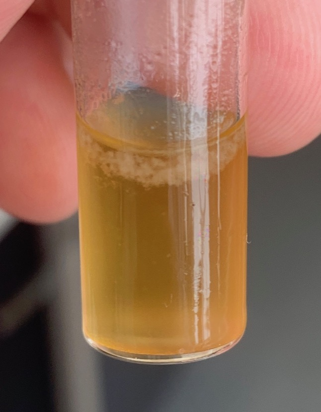

# Wednesday 6/2/2018

### Oxidation of **1** to form **2** (AS07)

New attempt with very close supervision from fellow group member:
In a round bottom flask, 67.7 mg of **1** was dissolved in 20 mL of DCM:ACN:water (9:1:1) with stirring. To this was added 20.6 mg of $\ce{RuCl3}$, followed by 235.0 mg of $\ce{NaIO4}$. The reaction mixture was heated to 40$^\circ$C and left for 3 hours.

TLC was taken to check the progress, and another 100 mg of $\ce{NaIO4}$ was added and left overnight.

### Reduction of **2** to form **3** (AS05)

Upon my supervisor's instruction, we ran MS on the sample and did indeed find some **3** in there, however it must be in really low quantity to not show up in NMR. I've redissolved the sample in $\sim$ 1 mL of DCM and am reducing it right down until it's barely liquid, at which point, following [^3], I will try and extract a product using *n*-hexane:ethyl acetate (5:1).

While adding the *n*-hexane:ethyl acetate didn't cause anything to precipitate, when I added 3$\times$ the amount of DCM on top of it and started evaporating it off (with increased airflow), a fine white precipitate started to fall out of solution ([fig:AS05ppt](#fig:AS05ppt){reference-type="ref" reference="fig:AS05ppt"}). In trying to filter off the precipitate, vacuum filtering it was not successful, however I'll try redissolving it in DCM and try crystallising the product out with straight *n*-hexane, instead of *n*-hexane:ethyl acetate to see what happens.
{: style="width: 40%;" class="center" #fig:AS05ppt}

Precipitate forming from crude **3**

So the process requires the ethyl acetate, but In thinking, it may be possible to reverse this process and dissolve the product in *n*-hexane and drip in ethyl acetate to try and crash out the product. I realised as well that the methodology I'm following is for a C8-NDI which will be slightly less polar than than the C6-NDI I've synthesised.

[^3]:
*o*-quinodimethane
