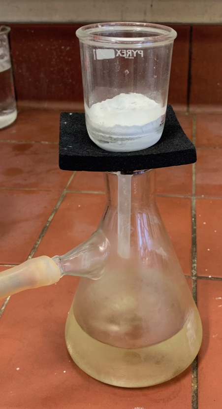
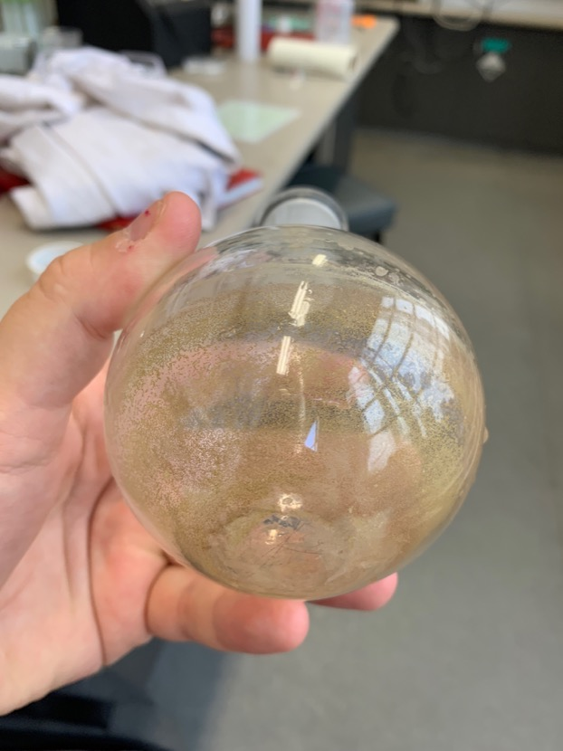
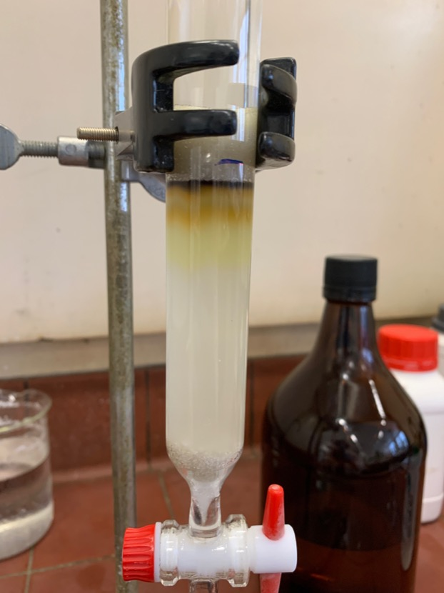
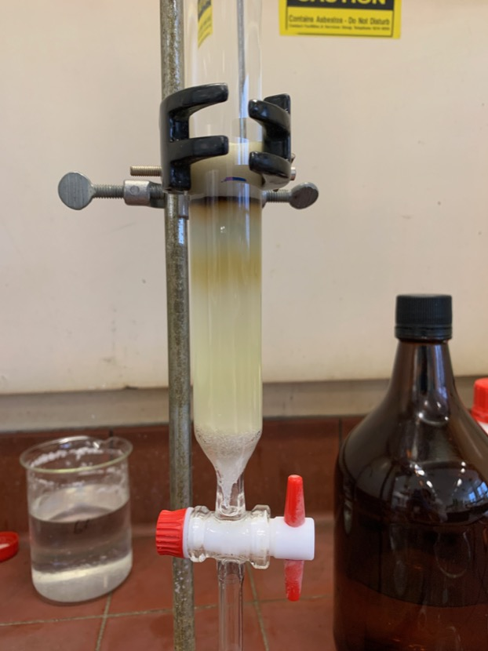
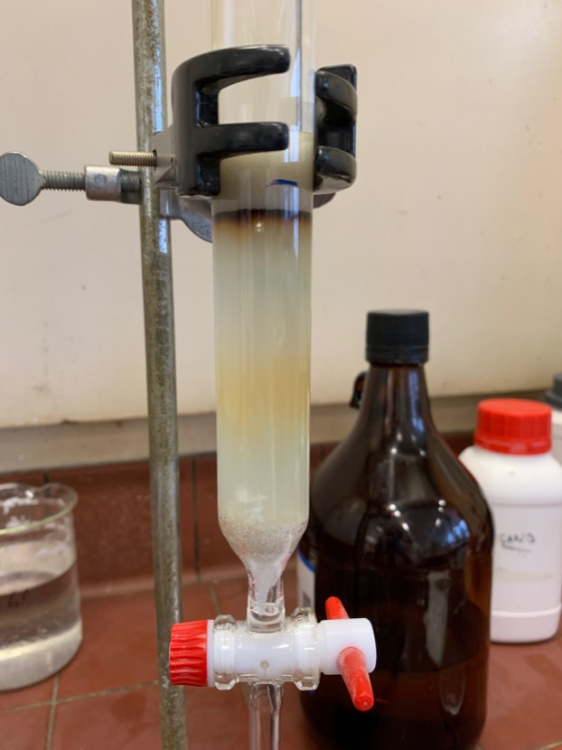
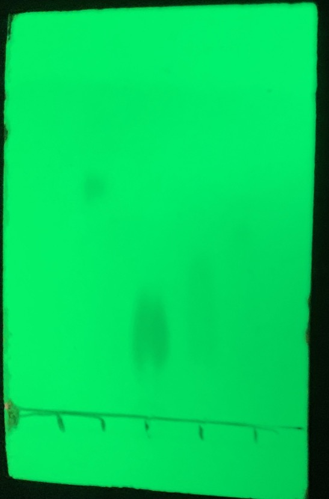
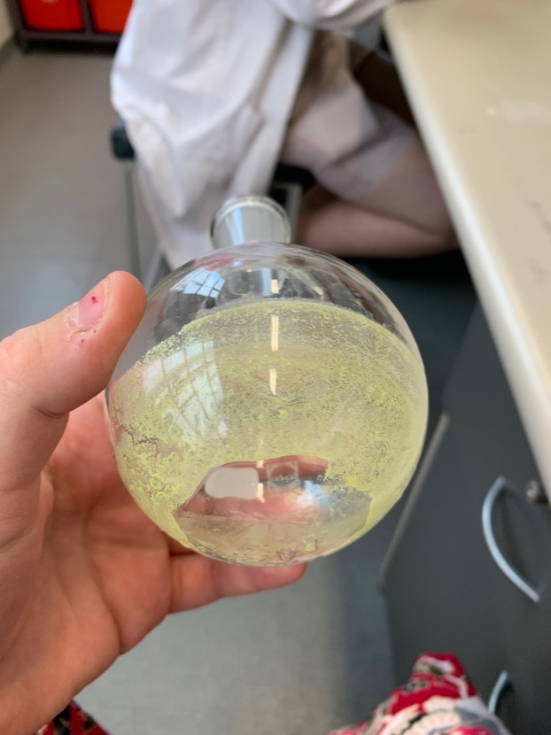

# Thursday 7/2/2018

### Oxidation of **1** to form **2** (AS07)

The following day, TLC was taken and the reaction was considered complete. The reaction mixture was filtered twice through celite, resulting in a yellow solution ([fig:AS07celite](#fig:AS07celite){reference-type="ref" reference="fig:AS07celite"}), which was then dried under vacuum, resulting in a brownish/yellow crystalline residue ([fig:AS07residue](#fig:AS07residue){reference-type="ref" reference="fig:AS07residue"})

| {#fig:AS07celite} | {#fig:AS07residue} |
| :----------------------------------------------------------: | :----------------------------------------------------------: |
|                Filtering AS07 through celite                 |                AS07 crude, rotovapped residue                |

The residue was then purified through column chromatography, with silica 60 as the stationary phase and DCM as the mobile phase ([fig:AS07column](#fig:AS07column){reference-type="ref" reference="fig:AS07column"}), resulting in a total of five fractions. As can be seen in [fig:AS07TLC](#fig:AS07TLC){reference-type="ref" reference="fig:AS07TLC"}, Fractions 3, 4 and 5 contained the product, and were thus combined, and dried, resulting in a bright yellow, crystalline powder ([fig:AS07residuepure](#fig:AS07residuepure){reference-type="ref" reference="fig:AS07residuepure"}).

My previous attempts had failed because on TLC, there was a product that migrated faster than **2**, causing me to think that the fraction with the product was the second *coloured* fraction (The dark orange one in [fig:AS07column](#fig:AS07column){reference-type="ref" reference="fig:AS07column"}), but in fact the faster migrating product was colourless, meaning that **2** was actually the bright yellow fraction that you can see in [fig:AS07column](#fig:AS07column){reference-type="ref" reference="fig:AS07column"}.

| {#fig:AS07column1} | {#fig:AS07column2} | {#fig:AS07column3} |
| :----------------------------------------------------------: | :----------------------------------------------------------: | :----------------------------------------------------------: |
|                      Initial separation                      |                     Secondary separation                     |                 AS07 after **2** was eluted                  |

| {#fig:AS07TLC} | {#fig:AS07residuepure} |
| :----------------------------------------------------------: | :----------------------------------------------------------: |
|                  TLC of the five fractions                   |                AS07 pure, rotovapped residue                 |

The product was weighed and a total of 42.7 mg was recovered, representing a 62.2% yield, which was greater than what has been achieved by the research group member guiding me through this synthesis. The product was confirmed as pure by NMR ([fig:AS07pureNMR](#fig:AS07pureNMR){reference-type="ref" reference="fig:AS07pureNMR"}).

{: style="width: 100%;" class="center" #fig:AS07pureNMR"}

NMR of purified AS07

### Reduction of **2** to form **3** (AS05)

Further attempts to purify/precipitate this have taken place, with the most successful being the addition of hexane:ethyl acetate (5:2) and the subsequent cooling of the solution, however extraction of the formed precipitate has proven to be difficult. A fellow group member has suggested that we should just try purifying it by column chromatography, the thought of which terrifies me, if for no other reason that knowing that the product will be completely colourless. TLC should have been taken earlier to identify what components exist within the solution.

### Reduction of **2** to form **3** (AS08) Attempt 2

As per[^3] To a round bottom flask was added 42.7 mg of **2** and 24 mg of $\ce{NaBH4}$. To this was added $\sim$ 20 mL of dry THF, straight from the solvent still, causing the contents of the flask to immediately turn dark blue. The flask was flushed with $\ce{N2}$ gas and was topped with a balloon full of to ensure an inert and dry atmosphere. The reaction was left at room temperature with stirring overnight.

### Things I've learned today

* To reuse a pipette when taking multiple TLC, just keep a small beaker of acetone next to you and between TLC blots, suck up acetone, blot dry on paper towel and repeat. It's not perfect, but it will clean the pipette enough for TLC
* When loading sample onto a column, try and add a little bit at a time and drain off the excess solvent. this should prevent the solvent front from getting too big.
* Make sure you know what fraction you're collecting in chromatography...

[^3]:Maniam, S.; Sandanayake, S.; Izgorodina, E. I.; Langford, S. J. Unusual Products from Oxidation of Naphthalene Diimides. Asian J. Org. Chem. 2016, 5 (4), 490–493. https://doi.org/10.1002/ajoc.201600048.