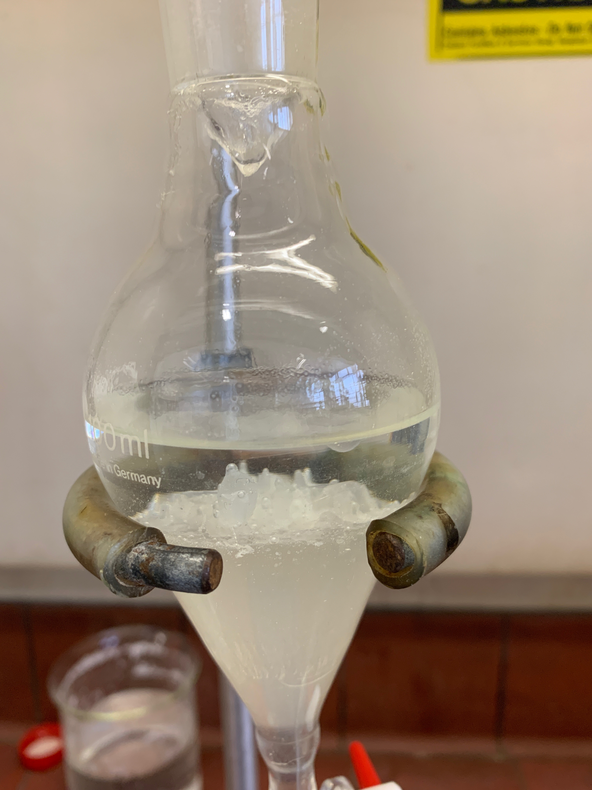

# Friday 8/2/2018

### Reduction of **2** to form **3** (AS08) Attempt 2

The reaction mixture had turned from deep blue to pale yellow and was reduced under vacuum to $\sim$10 mL and diluted with another $\sim$30 mL of DCM. The pH was checked at this point and determined to be $\sim$7.5, so not was added. The mixture was then washed with water (2$\times$40 mL) and $\sim$5.4 M brine (2$\times$40 mL). It was then dried with $\ce{NaSO4}, filtered through celite and dried under vacuum, producing a yellow/white crude powder. The crude powder was redissolved in minimal DCM.

{: style="width: 30%;" class="center" #fig:AS08washing}

Water washing of AS08

During the water washing ([fig:AS08washing](#fig:AS08washing){reference-type="ref" reference="fig:AS08washing"}), an interesting solid formed in the interface between the organic and aqueous phases. I'm not entire sure what it could be, or if there's anything in this reaction that could polymerise.

### Reduction of **2** to form **3** (AS05)

In playing around with this, I came up with a procedure that seems to work to precipitate out **3**, however the precipitate is so fine ([fig:AS05ppt2](#fig:AS05ppt2){reference-type="ref" reference="fig:AS05ppt2"}) that extracting it is proving difficult. I've come up with a plan (see Next week's plan) to precipitate and extract this using the skillset I've learned in biochemistry, of precipitating, centrifuging and washing.

Precipitated **3** from AS05

### Next week's plan

1.  Redissolve AS05 and AS08 in minimal DCM
2.  Pipette AS05 and AS08 into microcentrifuge tubes
3.  Dry the tubes till only 0.1 mL left
4.  Add 1 mL of hexane:ethyl acetate (5:1)
5.  Allow to precipitate
6.  Centrifuge and pour off supernatant
7.  Redissolve in 0.1 mL DCM in centrifuge tube
8.  Add another 1 ml of hexane:ethyl acetate (5:1)
9.  Allow to precipitate
10. Centrifuge and pour off supernatant
11. Pellet should now be pure **3**