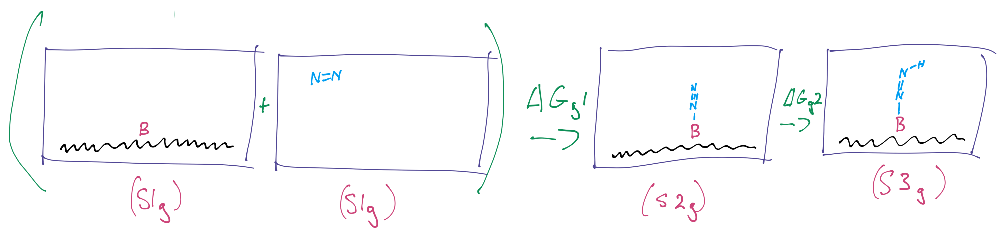
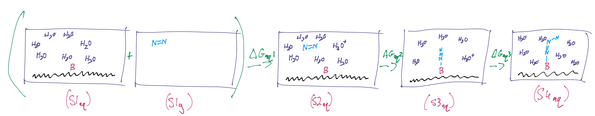
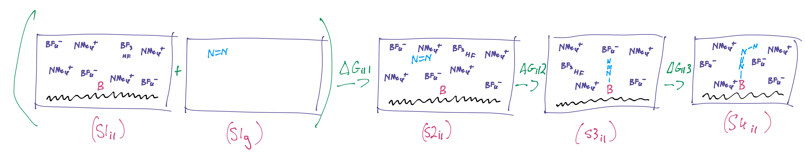

# Week 2

## Friday, 14. August 2020

After a lot of back and forth, trying to get an understanding of what the project is truly about and trying to figure out what's possible in the time allotted, I think I'm on the same page with my supervisor.

### The Plan (as I Understand it)

The plan seems to be to check three distinct systems. We want to check the first 2 states of the NRR in three distinct conditions; In gas phase, in water, and in ionic liquid. Knowing the thermodynamic performance of the system is one thing, but really it only serves as an indicator of what we *really* care about... does the IL solvation support the least stable $\ce{N2^*}$ state (The asterix indicating that it's adsorbed to the catalyst). This can be seen through a number of indicators, such as looking at how diffuse the MOs have become, but predominantly, by the charge on the nitrogen.

The thermodynamic calculations for this are as follows:

$$
\ce{S_{(g)} + N2_{(g)} ->[\Delta G_1^{g}] SN2^*_{(g)} + 1/2 H2 ->[\Delta G_2^{g}] SNNH^*_{(g)}}
$$

{: style="width: 80%;" class="center sharp"}

We can't have the $\ce{H+}$ in the gas phase and due to mathematical limitations, we can't calculate the energy of the proton dissociating, so we're using the Standard Hydrogen Electrode (SHE) potential to account for that energy.

For the aqueous system, things will start to get a bit more costly as we need to use explicit solvation to porperly model the system.

$$
\ce{S_{(aq)} + N2_{(g)} ->[\Delta G_1^{aq}] S_{(aq)} + N2_{(aq)} ->[\Delta G_2^{aq}] SN2^*_{(aq)} ->[\Delta G_3^{aq}]  SNNH^*_{(aq)}}
$$

{: style="width: 100%;" class="center sharp"}

And similarly for the IL

$$
\ce{S_{(il)} + N2_{(g)} ->[\Delta G_1^{il}] S_{(il)} + N2_{(il)} ->[\Delta G_2^{il}] SN2^*_{(il)} ->[\Delta G_3^{il}]  SNNH^*_{(il)}}
$$

{: style="width: 100%;" class="center sharp"}

We've decided to use $\ce{[BF4-][NMe4+]}$ for the IL as it's a simple enough combination that shouldn't be too expensive and should hopefully be somewhat representative. This also has a secondary effect that $\ce{BF4- + H+ -> BF3 + HF}$, which since we're hydrogenating the $\ce{N2}$, we need a proton carrier that is compatible with the IL. In the case of water we would simply get hydronium ($\ce{H3O+}$), but it's not so simple with ILs. 

As for computational details, I think I'm going to stick with ORCA on my supervisor's HPC cluster in China, using revPBE-D3BJ\Def2-TZVP for opts, though I need to do some more research into whether or not this will be sufficient for thermodynamic analysis.

The charge/multiplicity for the systems is as follows:

| Solvent  |  S1  |  S2  |  S3  |  S4  | $\ce{N2}$ |
| -------- | :--: | :--: | :--: | :--: | :-------: |
| Gas      | 0 2  | 0 2  | 0 1  | N/A  |    0 1    |
| Water/IL | 1 2  | 1 2  | 1 2  | 0 1  |           |