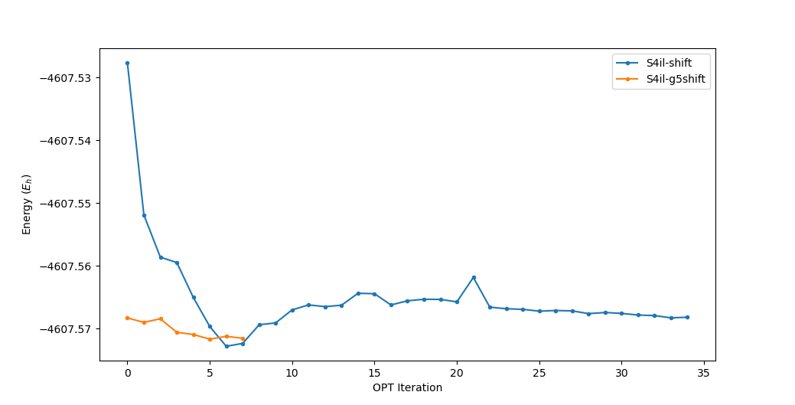
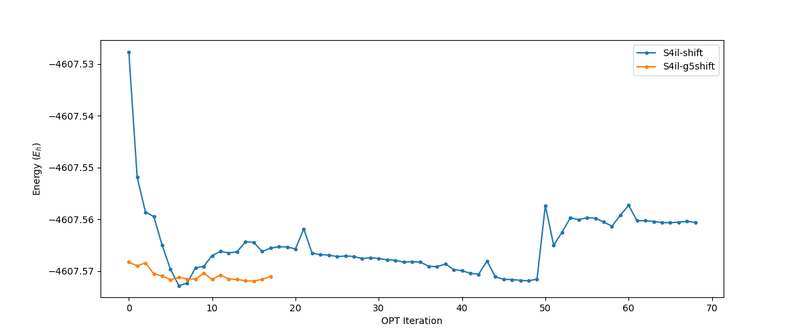

# Week 6

## Sunday, 6. September 2020

### 9:29 AM

|           |                          S1                          |                          S2                          |                          S3                          |                          S4                          |
| --------- | :--------------------------------------------------: | :--------------------------------------------------: | :--------------------------------------------------: | :--------------------------------------------------: |
| **Gas**   |   Opt/Freq <span style="color: green;">Done</span>   |   Opt/Freq <span style="color: green;">Done</span>   |   Opt/Freq <span style="color: green;">Done</span>   |                         N/A                          |
| **Water** | Opt/Freq <span style="color: orange;">Running</span> | Opt/Freq <span style="color: orange;">Running</span> | Opt/Freq <span style="color: orange;">Running</span> | Opt/Freq <span style="color: orange;">Running</span> |
| **IL**    |    Low Opt <span style="color: red;">Stale</span>    |    Low Opt <span style="color: red;">Stale</span>    |    Low Opt <span style="color: red;">Stale</span>    | Low Opt <span style="color: orange;">Running</span>  |

I just got notified of a "Just Accepted" JCTC [paper](http://dx.doi.org/10.1021/acs.jctc.0c00549) by Zoe Seeger, one of Katya's PhDs, that's quite interesting and shows a number of things

1. It shows how important dispersion is, accounting up to "15.9 % of the interaction energy"
2. How good TZ basis sets are, but also how aug-cc-pvtz isn't much better that cc-pvtz, for the cost
3. Meta-GGA hybrids (M06-2X and ωB97X-D) are better than dispersion corrected GGA functionals, which are better than pure GGA functionals
   * The performance of Meta-GGA hybrids improves with aug tz or larger basis sets
   * These are four highly recommended methods/basis sets for optimisation of large-scale clusters of ILs, each with an RMSD of $<1.0\:\AA$.
     * PBE-D3/VTZ
     * BLYP-D3/VTZ
     * ωB97X-D/aVDZ
     * FMO2- SRS-MP2/VTZ 
   * PBE-D3 and BLYP-D3 only produce good results with a tz basis

### 11:01 AM

This is quite interesting to me. The combination of using a finer DFT grid and levelshifting has resulted in immediately lower SCF energies, however it takes significantly longer to converge than just using levelshifting on it's own.

This (in conjunction with Zoe's paper) makes me wonder if leveshifting with a tz basis set, but still using a coarse grid might actually speed things up...

unfortunately I'm already using 96 cores out of my allocated 100 on MonARCH, so I'd need to kill a job to find out, or run one locally on my computer.

{: style="width: 80%;" class="center"}

## Tuesday, 8. September 2020

### 9:37 AM

I'm a bit conflicted about my next course of action, as the g5 + levelshifting job is by far optimising the smoothest, but it's also incredibly slow, taking almost 1000 SCF iterations to converge. This is also at the sz level, I'm not sure how much slower it will become at the tz level. 

{: style="width: 80%;" class="center"}

On the bright side, all of the aqueous systems are chugging along nicely

|           |                        S1                        |                          S2                          |                        S3                        |                         S4                          |
| --------- | :----------------------------------------------: | :--------------------------------------------------: | :----------------------------------------------: | :-------------------------------------------------: |
| **Gas**   | Opt/Freq <span style="color: green;">Done</span> |   Opt/Freq <span style="color: green;">Done</span>   | Opt/Freq <span style="color: green;">Done</span> |                         N/A                         |
| **Water** | Freq <span style="color: orange;">Running</span> | High Opt <span style="color: orange;">Running</span> | Freq <span style="color: orange;">Running</span> |  Freq <span style="color: orange;">Running</span>   |
| **IL**    |  Low Opt <span style="color: red;">Stale</span>  |    Low Opt <span style="color: red;">Stale</span>    |  Low Opt <span style="color: red;">Stale</span>  | Low Opt <span style="color: orange;">Running</span> |

### 8:36 PM

I decided to implement one of the suggestions from Zoe's paper and set off a new job (locally) to optimise S4il with PBE D3 cc-pvtz (Def2/J) and it's going incredibly well. In response, since I'm trying to use B97-3c as recommended by another paper (and not benchmarked in Zoe's paper), I'm checking to see how much of a contribution the basis set is having to the system.

The current job specifications look like this (I'm keeping level shifting on):

```
! Opt b97-3c cc-pvtz Def2/j CPCM

%scf
   maxiter 10000 # This is just a precaution, really.
   SOSCFStart 0.0033
   Shift Shift 0.1 ErrOff 0.1 end
end

```

```
! Opt PBE D3 cc-pvtz Def2/j CPCM

%scf
   maxiter 10000 # This is just a precaution, really.
   SOSCFStart 0.0033
   Shift Shift 0.1 ErrOff 0.1 end
end
```

!!! note "Emotional thought"
	At this point I feel so stupid for trying to cheap out on the basis set. The loss in time from having to calculate more integrals with Dunning's basis sets is well and truly made up for in the sheer amount of iterations it takes to converge Karlsruhe ones​ :unamused:

### 9:11 PM

Given this revelation, I've queued up the aqueous and gas phase jobs with Dunning's basis sets. 

## Wednesday, 9. September 2020

### 10:34 AM

With the switch to Dunning's basis sets, this is the result of the overnight queue. the good news is that the IL job is optimising quite smoothly at this point, converging in 10-25 SCF iterations. I think that having SOSCF in the job is a large part of that, it seems to be giving the SCF optimisation more 'direction' (makes logical sense really...)

|           |                          S1                          |                          S2                          |                          S3                          |                          S4                          |
| --------- | :--------------------------------------------------: | :--------------------------------------------------: | :--------------------------------------------------: | :--------------------------------------------------: |
| **Gas**   |   Opt/Freq <span style="color: green;">Done</span>   | Opt/Freq <span style="color: orange;">Running</span> |  Opt/Freq <span style="color: blue;">Queued</span>   |                         N/A                          |
| **Water** | High Opt <span style="color: orange;">Running</span> | High Opt <span style="color: orange;">Running</span> | High Opt <span style="color: orange;">Running</span> | High Opt <span style="color: orange;">Running</span> |
| **IL**    |   Low Opt <span style="color: red;">Waiting</span>   |   Low Opt <span style="color: red;">Waiting</span>   |   Low Opt <span style="color: red;">Waiting</span>   | Low Opt <span style="color: orange;">Running</span>  |


## Thursday, 10. September 2020

### 9:51 AM

Overnight, the S2g finished, but while forming the CP-SCF equations of the S3aq system, the job ran out of memory. I gave it an extra 2GB per core (32GB total), bumping it up to 160GB total, but I'm guessing that it will mean that the other aqueous jobs will fail too. hopefully 160GB will be enough.

<span style="color: grey; text-align: center; font-style: italic;" class="center">Changes marked with a ==highlight==</span>

|           |                        S1                        |                        S2                        |                              S3                              |                         S4                          |
| --------- | :----------------------------------------------: | :----------------------------------------------: | :----------------------------------------------------------: | :-------------------------------------------------: |
| **Gas**   | Opt/Freq <span style="color: green;">Done</span> | ==Freq <span style="color: green;">Done</span>== |     ==Freq <span style="color: orange;">Running</span>==     |                         N/A                         |
| **Water** | Freq <span style="color: orange;">Running</span> | Freq <span style="color: orange;">Running</span> | ==Freq <span style="color: orange;">Running (restarted)</span>== |  Freq <span style="color: orange;">Running</span>   |
| **IL**    | Low Opt <span style="color: red;">Waiting</span> | Low Opt <span style="color: red;">Waiting</span> |       Low Opt <span style="color: red;">Waiting</span>       | Low Opt <span style="color: orange;">Running</span> |

 

### 7:32 PM

<span style="color: grey; text-align: center; font-style: italic;" class="center">Changes marked with a ==highlight==</span>

|           |                        S1                        |                        S2                        |                        S3                        |                         S4                          |
| --------- | :----------------------------------------------: | :----------------------------------------------: | :----------------------------------------------: | :-------------------------------------------------: |
| **Gas**   | Opt/Freq <span style="color: green;">Done</span> |   Freq <span style="color: green;">Done</span>   | ==Freq <span style="color: green;">Done</span>== |                         N/A                         |
| **Water** | Freq <span style="color: orange;">Running</span> | Freq <span style="color: orange;">Running</span> | Freq <span style="color: orange;">Running</span> |  Freq <span style="color: orange;">Running</span>   |
| **IL**    | Low Opt <span style="color: red;">Waiting</span> | Low Opt <span style="color: red;">Waiting</span> | Low Opt <span style="color: red;">Waiting</span> | Low Opt <span style="color: orange;">Running</span> |

I've had to restart all the aq Freq jobs with more memory, so hopefully 10GB/core will be enough, otherwise I'd need to look at the maximum memory limits of MonARCH.

I've also noticed something quite strange happening with the S4il job, in which the energy has gone very quickly from $\sim-4616 \:Eh$ down to $\sim-5808\:Eh$. I'm guessing that's it's just found a more stable well to sit in, though it is screwing up the SOSCF. I've increased the threshold for SOSCF to start, so it shouldn't kick in until later, which should hopefully make the system optimise more cleanly.

## Saturday, 12. September 2020

### 10:26 AM

While I did keep working on getting these jobs done yesterday, I wasn't feeling the best and decided not to write about it. Mostly though, the IL job has stalled again, even with the cc-pvtz basis.

I'm currently running some tests with PBE-D3BJ and revPBE-D3BJ with cc-pvtz (Def2/J), though to be honest, the SCF isn't behaving quite as I'd like in the pure PBE job.

```
ITER       Energy         Delta-E        Max-DP      RMS-DP      [F,P]     Damp
               ***  Starting incremental Fock matrix formation  ***
  0  -4609.6590464236   0.000000000000 0.15698480  0.00052329  0.2186727 0.7000
  1  -4610.3944720028  -0.735425579213100.25666208  0.13508613  0.0980661 0.7000
  2  -4618.1779326077  -7.7834606049448710.01226786  6.62379720  2.4496462 0.7000
  3  -6620.7762743417-2002.59834173397813680.32194653 12.77631440 29.7804984 0.7000
  4 -15653.2779229974-9032.50164865570010396.22144236 10.26717104 51.1403474 0.7000
  5 -27086.9287129375-11433.6507899400577430.44062562  7.38716107 51.5593376 0.7000
  6 -37644.8530272227-10557.9243142852145227.47484355  5.30477892 43.8445755 0.7000
  7 -46293.0897960600-8648.2367688373343666.36683116  3.74546799 34.5086421 0.7000
```

The revPBE job seems to have just done something similar, though I'll let them run for a bit longer and see what happens.

### 1:17 PM

I'm running revPBE-D3BJ/cc-pvtz (Def2/J) at `grid5` and it sooms to be working! (for now)

### 2:05 PM

Spoke too soon.the energy just exploded again. I'm trying  B97-3c/cc-pvtz (Def2/J) at `grid5` as well thoughm so maybe it will have better luck.

### 4:58 PM

Things that I'm currently trying to get the IL system to converge:

* Increasing the level shifting magnitude/duration - <span style="color: red;">not converging</span>
* Starting the SOSCF earlier - <span style="color: red;">crashes</span>
* Increasing the DFT grid - <span style="color: red;">does nothing, slower</span>
* Using KDIIS instead of DIIS - <span style="color: red;">oscillates wildly</span>
* Newton-Raphson instead of DIIS - <span style="color: red;">not converging</span>
* Using no DIIS - <span style="color: red;">oscilates</span>
* Using a bigger basis set - <span style="color: red;">does nothing, slower</span>
* Using a smaller basis set - <span style="color: red;">does nothing, faster</span>
* Using a different source of basis set - <span style="color: red;">does nothing, faster</span>
* Augmenting the basis set - <span style="color: red;">does nothing, slower</span>
* Using PBE/revPBE - <span style="color: red;">energy explodes, converges(supposedly), and errors out</span>
* Increase damping - <span style="color: red;">crashed</span>
* Increasing the number of Fock matrices that DIIS remembers - <span style="color: orange;">running</span>

I have the highest hopes for level shifting, since it's been the biggest help in getting the systems to converge thus far, but I honestly don't know what's going to happen.

I really don't want to jump up a rung on the ladder, as it's going to mean re-doing everything again, and likely, significant;y worse scaling as well.

I also REALLY would love to stick with just using different SCF convergence techniques, as it means that the aq and gas calculations can just complete and not need to be repeated.

### 9:23 PM

Th most successful job of the bunch has been to increase the number of Fock matrices that the DIIS uses to calculate each step, which got me wondering, if there's anything else I can do to o tune the DIIS. I put together this little line to go in the input, which I'm hoping will help things along.

```
%scf
   DIIS MaxEq 15 MaxIt 50 Start 0.05 Bfac 1.2 end
end
```

I also ran a small test to see if any particular guess gave better results (when I realised that I was setting the guess wrong in previous tests), and found the following results:

| Guess | Energy |
| ----- | :----: |
|PModel | -4610.67419 |
|HCore | -14508.68116 |
|Hueckel | -4594.98199 |
|PAtom | -4597.414589 |

Since the energy of HCore is way too high, PModel seems to be the best guess. I've put both of these changes together, with the increase in level shifting and am hoping that I'll get something that converges.

I have also been having trouble converging S4aq as well for some reason, and am trying out a few of these ideas with that system too. currently it's running full second order SCF (Newton-Raphson), and we'll see how that goes.

