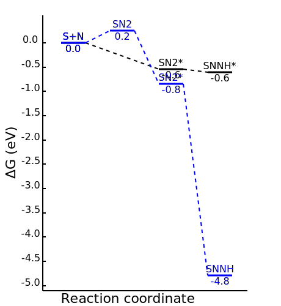

# Week 8

## Sunday, 27. September 2020

### 11:39 AM

<span style="color: grey; text-align: center; font-style: italic;" class="center">Changes marked with a ==highlight==</span>

|           |                              S1                              |                            S2                             |                            S3                             |                              S4                              |
| --------- | :----------------------------------------------------------: | :-------------------------------------------------------: | :-------------------------------------------------------: | :----------------------------------------------------------: |
| **Gas**   |       Opt/Freq <span style="color: green;">Done</span>       |     Opt/Freq <span style="color: green;">Done</span>      |     Opt/Freq <span style="color: green;">Done</span>      |                             N/A                              |
| **Water** | ==`verytight` Opt <span style="color: orange;">Running</span>== | Opt/Freq <span style="color: magenta;">Done/Broken</span> | Opt/Freq <span style="color: magenta;">Done/Broken</span> | `verytight` Freq <span style="color: orange;">Running</span> |
| **IL**    |     Opt/Freq <span style="color: orange;">Running</span>     |    Low Opt <span style="color: orange;">Running</span>    |   High Opt <span style="color: orange;">Running</span>    |      ==Freq <span style="color: blue;">Queued</span>==       |

Testing the aqueous jobs under `verytight` convergence criteria is still going, though I haven't been able to get Newton-Raphson steps to work on MonARCH yet. I noticed that all the jobs were running on the "mi\*" nodes, so I decided to exclude them and see if the jobs would go through on the "hc\*", "hs\*" or "mk\*" nodes. unfortunately, these queues are quite long.

Putting this here so I have it on record:

```
#SBATCH --constraint="Xeon-E5-2667-v3|Xeon-E5-2680-v3|Xeon-Platinum-8260"
```


I can't run the IL Freq jobs locally, they take significantly more memory than my computer has (they need up to 160GB), however I'm just using HF freqs to test whether or not the aq systems have negative frequencies.

### 9:18 PM

I just had a thought about getting the frequency calcs to go through... I could try calulating them numerically instead of analytically! I've set S4il to run numerically.

### 11:21 PM

I haven't fully been able to test it on any of the project systems yet, but calculating a full hessian every tenth step has made very light work of a separate OptTS job that I've been struggling with:

```
geom
   Calc_Hess true
   Recalc_Hess 5 # 10 is probably frequent enough for an opt job
end
```

## Monday, 28. September 2020

### 10:30 AM

!!! note "Personal note"
	The epoxidation job has actually helped my with this project, so I wanted to share something that I'm a little bit chuffed at having done.
	

	This is the mechanism, and the full *m*-CPBA molecule:
	
	<iframe class=center width="560" height="315" src="https://www.youtube.com/embed/qrq_VHFeDM8" frameborder="0" allow="accelerometer; autoplay; clipboard-write; encrypted-media; gyroscope; picture-in-picture" allowfullscreen></iframe>
	
	And this is the FMO interaction. You can see in the plot on the right of the window the total energy (pink) the ethene pi orbital (blue/purple) and the hydroxyl LPE of the *m*-CPBA (green/yellow):
	
	<iframe class=center width="560" height="315" src="https://www.youtube.com/embed/HDNUYczlit8" frameborder="0" allow="accelerometer; autoplay; clipboard-write; encrypted-media; gyroscope; picture-in-picture" allowfullscreen></iframe>

S1il and S2il have stalled again, and S1aq ran out of memory. S4il is chugging along with it's numerical frequencies though, which gives me some hope. The geometries for S1 and S2il both seem reasonable, so I'm not entirely sure what's going on.

<span style="color: grey; text-align: center; font-style: italic;" class="center">Changes marked with a ==highlight==</span>

|           |                              S1                              |                            S2                             |                            S3                             |                              S4                              |
| --------- | :----------------------------------------------------------: | :-------------------------------------------------------: | :-------------------------------------------------------: | :----------------------------------------------------------: |
| **Gas**   |       Opt/Freq <span style="color: green;">Done</span>       |     Opt/Freq <span style="color: green;">Done</span>      |     Opt/Freq <span style="color: green;">Done</span>      |                             N/A                              |
| **Water** | ==`verytight` Opt <span style="color: blue;">Queued</span>== | Opt/Freq <span style="color: magenta;">Done/Broken</span> | Opt/Freq <span style="color: magenta;">Done/Broken</span> | ==`verytight` Freq <span style="color: green;">Running</span>== |
| **IL**    |     ==Low Opt <span style="color: blue;">Queued</span>==     |   ==Low Opt <span style="color: blue;">Queued</span>==    |   High Opt <span style="color: orange;">Running</span>    |     ==Freq <span style="color: orange;">Running</span>==     |

### 5:29 PM

I've spent the majority of my day banging my head against the desk trying to get these jobs to cooperate, but I just can't get S1 or S2il to converge to anything reasonable.

My pursuit to optimise S1 and S4aq to a proper minima is taking forever, since the process of calculating a full Hessian is effectively a frequency calculation to base the optimisation off. Naturally, this is excruciatingly costly. 

I honestly don't know why I agreed to this project. This seems like the domain of polarisable force fields or QM/MM... possibly both...

### 6:49 PM

I've spoken to Chenghua and we've decided that it will best for me to focus on just getting the aqueous jobs done. I did suggest a few other options to get a full set o data out, but I think he'd like at least one portion of this project done to completion.

I might sit down later tonight and write down a list of suggestions for future research to ensure this project gets done.

<span style="color: grey; text-align: center; font-style: italic;" class="center">Changes marked with a ==highlight==</span>

|           |                              S1                              |                              S2                              |                              S3                              |                              S4                              |
| --------- | :----------------------------------------------------------: | :----------------------------------------------------------: | :----------------------------------------------------------: | :----------------------------------------------------------: |
| **Gas**   |       Opt/Freq <span style="color: green;">Done</span>       |       Opt/Freq <span style="color: green;">Done</span>       |       Opt/Freq <span style="color: green;">Done</span>       |                             N/A                              |
| **Water** | ==`verytight` Opt <span style="color: blue;">Queued</span>==<br/>`Calc_Hess` Opt <span style="color: orange;">Running</span> | ==`verytight` Opt <span style="color: blue;">Queued</span>== | ==`verytight` Opt <span style="color: blue;">Queued</span>== | ==`verytight` Opt <span style="color: blue;">Queued</span>==<br/>`Calc_Hess` Opt <span style="color: orange;">Running</span> |

### LATER (not yet written/placeholder)

Things to discuss

* EFP
* Starting from MD simulation
* Polarisable force fields
* QM/MM

## Tuesday, 29. September 2020

### 10:28 AM

It looks like a few jobs have finished their `verytight` opt, though I'll have to run frequencies before I'll now if it's a true minima.

<span style="color: grey; text-align: center; font-style: italic;" class="center">Changes marked with a ==highlight==</span>

|           |                              S1                              |                              S2                              |                             S3                              |                              S4                              |
| --------- | :----------------------------------------------------------: | :----------------------------------------------------------: | :---------------------------------------------------------: | :----------------------------------------------------------: |
| **Gas**   |       Opt/Freq <span style="color: green;">Done</span>       |       Opt/Freq <span style="color: green;">Done</span>       |      Opt/Freq <span style="color: green;">Done</span>       |                             N/A                              |
| **Water** | ==`verytight` Opt <span style="color: orange;">Running</span>==<br/>==`Calc_Hess` Opt <span style="color: red;">Failed</span>== | ==`verytight` Opt <span style="color: orange;">Running</span>== | ==`verytight` Opt <span style="color: green;">Done</span>== | ==`verytight` Opt <span style="color: green;">Done</span>==<br/>`Calc_Hess` Opt <span style="color: orange;">Running</span>(at least n) |

### 12:22 PM

Just found an awesome tool for plotting reaction energies, called mechaSVG[^1]  that allows you to easily make plots like these:

{: style="width: 50%;" class="center"}

Since the plots are all SVG files, they can be customised further in programs like inkscape.

[^1]:Angnes, R. A. MechaSVG. *GitHub Repos.* **2020**. https://doi.org/10.5281/zenodo.3970267.

## Wednesday, 30. September 2020

### 10:14 AM

Most of the jobs have now finished their `verytight` opt, and I also set off `Calc_Hess` jobs for all of the jobs, as even though they'll take a longer time to run, they're more likely to find a true minima.

<span style="color: grey; text-align: center; font-style: italic;" class="center">Changes marked with a ==highlight==</span>

|           |                              S1                              |                              S2                              |                              S3                              |                              S4                              |
| --------- | :----------------------------------------------------------: | :----------------------------------------------------------: | :----------------------------------------------------------: | :----------------------------------------------------------: |
| **Gas**   |       Opt/Freq <span style="color: green;">Done</span>       |       Opt/Freq <span style="color: green;">Done</span>       |       Opt/Freq <span style="color: green;">Done</span>       |                             N/A                              |
| **Water** | ==`verytight` Opt <span style="color: orange;">Running</span>==<br/>==`Calc_Hess` Opt <span style="color: orange;">Running</span>== | ==`verytight` Opt <span style="color: green;">Done</span>==<br/>==`Calc_Hess` Opt <span style="color: orange;">Running</span>== | `verytight` Opt <span style="color: green;">Done</span><br/>==`Calc_Hess` Opt <span style="color: orange;">Running</span>== | `verytight` Opt <span style="color: green;">Done</span><br/>`Calc_Hess` Opt <span style="color: orange;">Running</span> |

## Friday, 2. October 2020

### 1:13 PM

All of the `verytight` jobs have finished now, but I'm not convinced that they'll produce any better results. After a few false starts, I've set off S(1/4)aq for freqs, though all of the `Calc_Hess` jobs are still going on their first calculation of the hessian... I'm not sure that it's going to be a successful approach to optimising these jobs, just due to time limitations. Using numerical hessian calculation probably isn't helping but if it means the jobs won't crash, then it's pretty much the only way to run them.

<span style="color: grey; text-align: center; font-style: italic;" class="center">Changes marked with a ==highlight==</span>

|           |                              S1                              |                              S2                              |                              S3                              |                              S4                              |
| --------- | :----------------------------------------------------------: | :----------------------------------------------------------: | :----------------------------------------------------------: | :----------------------------------------------------------: |
| **Gas**   |       Opt/Freq <span style="color: green;">Done</span>       |       Opt/Freq <span style="color: green;">Done</span>       |       Opt/Freq <span style="color: green;">Done</span>       |                             N/A                              |
| **Water** | ==`verytight` Freq <span style="color: blue;">Queued</span>==<br/>`Calc_Hess` Opt <span style="color: orange;">Running</span> | `verytight` Opt <span style="color: green;">Done</span><br/>`Calc_Hess` Opt <span style="color: orange;">Running</span> | `verytight` Opt <span style="color: green;">Done</span><br/>`Calc_Hess` Opt <span style="color: orange;">Running</span> | ==`verytight` Freq <span style="color: blue;">Queued</span><br/>==`Calc_Hess` Opt <span style="color: orange;">Running</span> |

## Saturday, 3. October 2020

### 12:36 PM

The `Calc_Hess` jobs were just taking far too long, so I'm setting off all the freq jobs based on the `verytight` opts. The queues on MonARCH seem to be taking forver, so I hope these jobs will be picked up soon... and that they won't faill...

<span style="color: grey; text-align: center; font-style: italic;" class="center">Changes marked with a ==highlight==</span>

|           |                            S1                             |                              S2                              |                              S3                              |                            S4                             |
| --------- | :-------------------------------------------------------: | :----------------------------------------------------------: | :----------------------------------------------------------: | :-------------------------------------------------------: |
| **Gas**   |     Opt/Freq <span style="color: green;">Done</span>      |       Opt/Freq <span style="color: green;">Done</span>       |       Opt/Freq <span style="color: green;">Done</span>       |                            N/A                            |
| **Water** | `verytight` Freq <span style="color: blue;">Queued</span> | ==`verytight` Freq <span style="color: blue;">Queued</span>== | ==`verytight` Freq <span style="color: blue;">Queued</span>== | `verytight` Freq <span style="color: blue;">Queued</span> |

### 4:38 PM

So after spending most of the day procrastinating doing real work by doing housework, S1aq and S4aq have been picked up and are running 

<span style="color: grey; text-align: center; font-style: italic;" class="center">Changes marked with a ==highlight==</span>

|           |                              S1                              |                            S2                             |                            S3                             |                              S4                              |
| --------- | :----------------------------------------------------------: | :-------------------------------------------------------: | :-------------------------------------------------------: | :----------------------------------------------------------: |
| **Gas**   |       Opt/Freq <span style="color: green;">Done</span>       |     Opt/Freq <span style="color: green;">Done</span>      |     Opt/Freq <span style="color: green;">Done</span>      |                             N/A                              |
| **Water** | ==`verytight` Freq <span style="color: orange;">Running</span>== | `verytight` Freq <span style="color: blue;">Queued</span> | `verytight` Freq <span style="color: blue;">Queued</span> | ==`verytight` Freq <span style="color: orange;">Running</span>== |

### 9:09 PM

I've had a bit of a think and It's decently possible that B97-3c isn't representing the system properly, so i thought that since I already have the gas phase jobs done in `! Opt revPBE D3BJ Def2-TZVP/Def2-TZVP/J,` I could repeat that level of theory for the aqueous jobs at a `verytight` level and see how they go. They should also be cheaper to run since the Ahlrichs basis sets aren't as large, and they should be picked up much sooner since they won't need as much memory to run.

|           |                              S1                              |                              S2                              |                              S3                              |                              S4                              |
| --------- | :----------------------------------------------------------: | :----------------------------------------------------------: | :----------------------------------------------------------: | :----------------------------------------------------------: |
| **Gas**   |       Opt/Freq <span style="color: green;">Done</span>       |       Opt/Freq <span style="color: green;">Done</span>       |       Opt/Freq <span style="color: green;">Done</span>       |                             N/A                              |
| **Water** | `verytight` Freq <span style="color: orange;">Running</span><br/>==PBE Opt <span style="color: blue;">Queued</span>== | `verytight` Freq <span style="color: blue;">Queued</span><br/>==PBE Opt <span style="color: blue;">Queued</span>== | `verytight` Freq <span style="color: blue;">Queued</span><br/>==PBE Opt <span style="color: blue;">Queued</span>== | `verytight` Freq <span style="color: orange;">Running</span><br/>==PBE Opt <span style="color: blue;">Queued</span>== |

