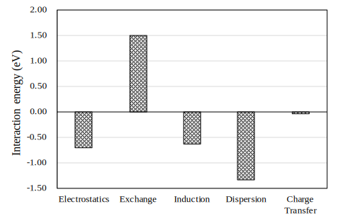
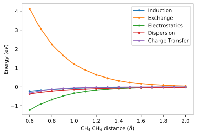
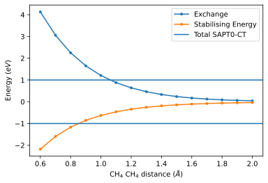
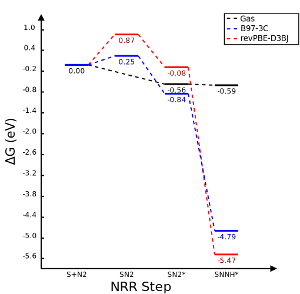
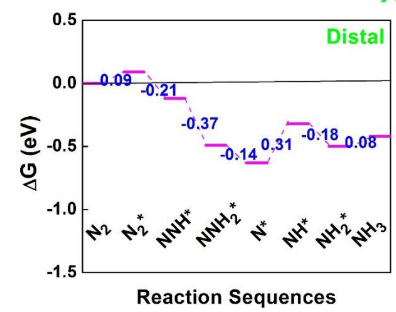

# Week 10

## Monday, 12. October 2020

### 2:59 PM

I haven't really had much to say because truthfully there hasn't been too much going on as of late. S1aq-pbe-freq has been chugging along slowly, but since everyhting is still coming out with negative frequencies, I'm not entirely sure what to do beyond just start writing up my report.

I think that in all honesty I don't have the time to fix the problems that are present and the best that I could do at this point is knock something up quickly with SMD just as a simple proof of concept. Chenghua has already said that he'd reather that I finish at least part of this properly, but I'm not sure what I'd be able to manage in what time is left. Admittedly, I have two weeks to finish up and write my report, but these jobs just take a HUGE amount of time to run.

<span style="color: grey; text-align: center; font-style: italic;" class="center">Changes marked with a ==highlight==</span>

|           |                              S1                              |                              S2                              |                              S3                              |                              S4                              |
| --------- | :----------------------------------------------------------: | :----------------------------------------------------------: | :----------------------------------------------------------: | :----------------------------------------------------------: |
| **Gas**   |       Opt/Freq <span style="color: green;">Done</span>       |       Opt/Freq <span style="color: green;">Done</span>       |       Opt/Freq <span style="color: green;">Done</span>       |                             N/A                              |
| **Water** | `verytight` Freq <span style="color: green;">Done</span><br/>==PBE Opt <span style="color: orange;">Running</span>== | `verytight` Freq <span style="color: green;">Done</span><br/>PBE Freq <span style="color: green;">Done</span> | `verytight` Freq <span style="color: green;">Done</span><br/>PBE Freq <span style="color: green;">Done</span> | `verytight` Freq <span style="color: green;">Done</span><br/>PBE Freq <span style="color: green;">Done</span><br/>SAPT0-CT<span style="color: green;">Done</span> |

### 4:28 PM

I just had a look at doing some EFP jobs, but GAMESS isn't properly set up on the supercomputer, so I'd likely have to do them in Psi4, which has limited solvation customisation and only handles solvation calculations on a single thread.

The SMD option could be achievable, but cooling at the SAPT numbers, it looks like the solvent really needs to be handled slightly more explicitly to get any decent results

### 4:49 PM

So I had a chat to Katya's group on Slack and they do have GAMESS running, but it's the 2016 version which has limited functionality for what I need. It's mostly there because it's a legacy tool for things that haven't been migrated to Gadi, from back when they were doing FMO locally.

### 10:02 PM

I think I'm going to call it a night. I've mostly been working on my report and have added in an intro section for SAPT and population analysis, as well as writing my method (SO MANY REFERENCES :astonished:). I'm at a total of 3300 words and 75 references, though i feel as though the rest should be a little bit easier, as I can switch from explaining mode to discussing mode, which is always MUCH more pleasant.

I probably will end up introducing a few more concepts in the failure section of things to try in the future, as I'd like to highlight the usefulness of EFP and PFF-MD or even ONIOM (QM/MM if you will) for these kinds of issues.

## Tuesday, 13. October 2020

### 10:57 AM

I've been trying to rationalise the results of the SAPT interactions and one o the things that was confusing me was the exchange energy. In my mind, if exchanging electrons in degenerate orbitals is stabilising, then why is SAPT exchange always destabilising, but This quote from wiki (yes, I know) kind of helps.

> "As a mathematical consequence, fermions exhibit strong repulsion when their wave functions overlap, but bosons exhibit attraction. This repulsion is what the exchange interaction models."

{: style="width: 60%;" class="center"}


I guess that the repulsion that comes from the overlap of the wavefunctions is countered by the stabilisation that comes from dispersion. In hindsight, this is something that I realised in my summer research project, that exchange and dispersion will be inversely proportional, as the overlap of the wavefunction of the different bodies increases.

### 1:05 PM

I just spent the past couple of hours writing a little [JupyterLab workbook (linked)](https://adreasnow.com/Notebooks/MethaneSAPTScan.html) to generate this beautiful little plot of the SAPT0-CT interaction of two methane molecules as they approach each other. It's pretty clear to see the balance between stabilising and destabilising energy.

{: style="width: 60%;" class="center"}

In fact, if we sum all of them up, we can see that there is a general trend of them being destabilised (exhibiting repulsive behaviour) faster than exhibiting stabilising behaviour, hence an overall repulsive effect.

{: style="width: 60%;" class="center"}

### 1:47 PM

The last of the jobs has finished. Amazingly, this is the only aqueous job that doesn't have negative frequencies!

<span style="color: grey; text-align: center; font-style: italic;" class="center">Changes marked with a ==highlight==</span>

|           |                              S1                              |                              S2                              |                              S3                              |                              S4                              |
| --------- | :----------------------------------------------------------: | :----------------------------------------------------------: | :----------------------------------------------------------: | :----------------------------------------------------------: |
| **Gas**   |       Opt/Freq <span style="color: green;">Done</span>       |       Opt/Freq <span style="color: green;">Done</span>       |       Opt/Freq <span style="color: green;">Done</span>       |                             N/A                              |
| **Water** | `verytight` Freq <span style="color: green;">Done</span><br/>==PBE Opt <span style="color: green;">Done</span>== | `verytight` Freq <span style="color: green;">Done</span><br/>PBE Freq <span style="color: green;">Done</span> | `verytight` Freq <span style="color: green;">Done</span><br/>PBE Freq <span style="color: green;">Done</span> | `verytight` Freq <span style="color: green;">Done</span><br/>PBE Freq <span style="color: green;">Done</span><br/>SAPT0-CT<span style="color: green;">Done</span> |

Putting the B97-3c and revPBE-D3BJ jobs side by side, this is what we get... revPBE-D3BJ isn't much better at representing the system

{: style="width: 50%;" class="center"}

## Saturday, 17. October 2020

### 4:54 PM

As much as it pains me to say it at this point in time, but I really haven't done much with this project this week. I've been trying to do some more writing for the final report, but the results simply aren't usable and would take significantly longer than the time left in the semester to get to a working state.

Comparing my findings to those of the JACS paper[^1]can really mean a number of different things:

* The PBE method used in the JACS paper wasn't sufficient for modelling the system
* Implicit solvation just isn't suitable for capturing the true solvation interactions (my personal preference)
* That something has gone wrong in my calculations or interpretations (the most likely situation)
* That higher levels of theory are required to truly encapsulate the system (this seems unlikely)

{: style="width: 50%;" class="center"}

There is one possible way to test a number of these scenarios, and that would be run these jobs again using implicit solvation. This would test both whether my calculations are wrong and whether the implicit solvation is just not capturing the system properly.

### 5:19 PM

I've just queued all the jobs for this with the follow parameters, to make them comparable to the revPBE-D3BJ jobs 

```
! Opt Freq revPBE D3BJ def2-TZVP VeryTightSCF VeryTightOpt Grid5 CPCM
```

I'm running them all with SMD for the most accurate implicit solvation for thermodynamics. Fingers crossed these should be pretty painless... :crossed_fingers:

<span style="color: grey; text-align: center; font-style: italic;" class="center">Changes marked with a ==highlight==</span>

|           |                            S1                            |                          S2                           |                          S3                           |                          S4                           |
| --------- | :------------------------------------------------------: | :---------------------------------------------------: | :---------------------------------------------------: | :---------------------------------------------------: |
| **Gas**   |     Opt/Freq <span style="color: green;">Done</span>     |   Opt/Freq <span style="color: green;">Done</span>    |   Opt/Freq <span style="color: green;">Done</span>    |                          N/A                          |
| **Water** | Implicit Opt <span style="color: orange;">Running</span> | Implicit Opt <span style="color: blue;">Queued</span> | Implicit Opt <span style="color: blue;">Queued</span> | Implicit Opt <span style="color: blue;">Queued</span> |

[^1]:Liu, C.; Li, Q.; Wu, C.; Zhang, J.; Jin, Y.; Macfarlane, D. R.; Sun, C. Single-Boron Catalysts for Nitrogen Reduction Reaction. *J. Am. Chem. Soc.* **2019**, *141* (7), 2884–2888. https://doi.org/10.1021/jacs.8b13165.

### 11:33 PM

Nothing new, but all the jobs have been picked 

<span style="color: grey; text-align: center; font-style: italic;" class="center">Changes marked with a ==highlight==</span>

|           |                            S1                            |                            S2                            |                            S3                            |                            S4                            |
| --------- | :------------------------------------------------------: | :------------------------------------------------------: | :------------------------------------------------------: | :------------------------------------------------------: |
| **Gas**   |     Opt/Freq <span style="color: green;">Done</span>     |     Opt/Freq <span style="color: green;">Done</span>     |     Opt/Freq <span style="color: green;">Done</span>     |                           N/A                            |
| **Water** | Implicit Opt <span style="color: orange;">Running</span> | Implicit Opt <span style="color: orange;">Running</span> | Implicit Opt <span style="color: orange;">Running</span> | Implicit Opt <span style="color: orange;">Running</span> |