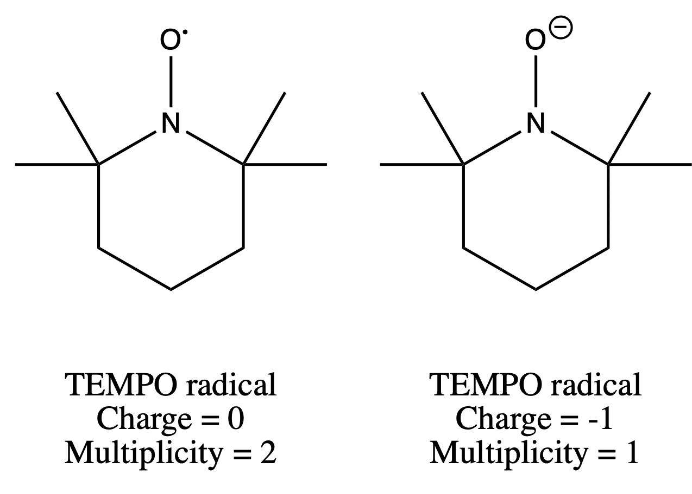

# Thursday, 20. February 2020

## To do

* [ ] Optimise TEMPO anion
  * [ ] Genmer/Molclus TEMPO anion
  * [ ] SAPT/HF TEMPO anion
* [x] Look into pyrrole N-H bonding
  * [x] Bond length
  * [x] Charge analysis
* [x] Update scripts and notebook to include TEMPO

## What I did

#### 11:26 AM

After submitting the tempo radical to optimise last night, it turns out that we want to tempo anion:{: style="width: 50%; "class="center"}

That means I have to re-optimise the structure.

I’m also getting on some analysis to look at what’s happening with the pyrrole N-H bond, to see if the pyrrole is trying to donate a proton. It doesn’t look like it is from preliminary results though.

#### 12:44 PM

| System                 | $\ce{H-ion}$ Distance ($\AA$) | $\Delta\ce{N-H}$ Bond length ($\AA$) | Ion charge CHELPG (au) | $\Delta$N Charge CHELPG (au) | $\Delta$H Charge CHELPG (au) | Ion charge Hirshfeld (au) | $\Delta$N Charge Hirshfeld (au) | $\Delta$H Charge Hirshfeld (au) |
| ---------------------- | :----------------------------------: | :--------------------: | :------------------: | :------------------: | :--------------------: | :------------------: | :------------------: | :------------------: |
| Pyrrole-$\ce{Cl-}$     |               2.173               |               $+0.017$               | -0.923                 |        +0.10        |        +0.001        | -1.000 | -0.008 | -0.058 |
| Pyrrole-$\ce{N(CN)2-}$ |               1.947 (To $\ce{C#N}$ N)               |               $+0.011$               | -0.955                 |        +0.021        |        +0.042    | -0.881 | -0.010 | -0.027 |
| Pyrrole-$\ce{C(CN)3-}$ |               2.546 (To $\ce{C#N}$ N)               |               $+0.001$               | -0.948                 |        -0.118        |        +0.032    | -0.945 | -0.017 | -0.009 |