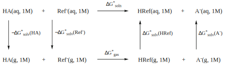

# Computational Thermo Equations

## $pK_a$ Equation

$$
\begin{align}
pK_a\text{ from }K_a:\\
\ce{HA &<=> A- + H+}\\
\ce{K_a}&=\frac{\ce{[A-][H+]}}{\ce{[HA]}}\\
\ce{pK_a}&=\ce{-log(K_a)}\\
pK_a\text{ from }pH:\\
\ce{pK_a}&=\text{pH}\ce{-log}\bigg(\frac{\ce{[A-]}}{\ce{[HA]}}\bigg)
\end{align}
$$

## $K_{eq}$ From $pK_a$ of Reactant Species

$$
pK_{eq}=pK_a^{\text{left acid}}-pK_a^{\text{right acid}}\\
K_{eq}=10^{-pK}
$$

??? note "e.g. Will ammonia and acetonitrile react?"
	$$
		\ce{NH3 + H2C#N- -> NH2- + H3C#N}\\
		36 \hskip{1.7cm} \ce{->} \hskip{1.5cm} 25
	$$
	
	 
	
	$$
	\begin{align}
	pK_{eq}&=36-25\\
	&=11\\
	k_{eq}&=1\times10^{-11}\\
	k_{eq}&<<<1
	\end{align}
	$$
	
	$k_{eq}$ is much less than 1, so we have much more reactant than product. No reaction, but ammonium will:
	
	$$
	\ce{NH4+ + H2C#N- -> NH3 + H3C#N}\\
	9.3 \hskip{1.7cm} \ce{->} \hskip{1.5cm}25
	$$
	
	 
	
	$$
	\begin{align}
	pK_{eq}&=9.3-25\\
	&=11\\
	k_{eq}&=5\times10^{15}\\
	k_{eq}&>>>1
	\end{align}
	$$
	
	==As a shortcut, we can also say that kinetcs favours the acid with the higher $pK_a$, and as there's a big difference between the two, the reactants will be favoured over the reagents==

## Calculating $pK_a$ From Thermodynamics Calculations

{: style="width: 80%; "class="center"}

Using 'the proton exchange method' from [A universal approach for continuum solvent $pK_a$ calculations: are we there yet?](http://link.springer.com/10.1007/s00214-009-0667-0) (Ho and Coote 2010), we can use a reference species with a known $pK_a$to act as our proton acceptor, this will give us the reference $pK_a(\text{HRef})$.

$$
\begin{align}
\text{For reaction:}\\
\ce{HA_{(g)} + Ref_{(g)} &-> A-_{(g)} + HRef_{(g)}}\\
\text{We can use the equation:}\\
\Delta G_g&= (\ce{A-_{(g)} + HRef_{(g)}})-(\ce{HA_{(g)} + Ref_{(g)}})\\
\text{And susequent solvation equtions}\\
\Delta G_{solv}(\ce{X})&=\Delta G(\ce{X_{(aq)}})-\Delta G(\ce{X_{(g)}})
\end{align}
$$

From this point, we need to calculate $\Delta G_{sol}$ (not to be mixed with $\Delta G_{solv}$

$$
\Delta G_{soln}^*=\Delta G_g^*+\Delta G_{solv}^*(\ce{A-})+\Delta G_{solv}^*(\ce{HRef})-\Delta G_{solv}^*(\ce{HA})-\Delta G_{solv}^*(\ce{Ref})
$$

!!! warning
	Watch your units. You'll need your $\Delta G_{soln}^*$ in $J\cdot mol^{-1}$

And now we can use the reference value to correct our calculated $pK_a$

$$
pK_a=\frac{\Delta G^*_{soln}}{RT\ln(10)}+pK_a(\ce{HRef})
$$

Another method if using water as a proton acceptor is to use this equation, which accounts for the bulk concentration of water. Change it to $+log[\ce{H2O}]$ if using $\ce{OH-}$ as your proton acceptor.

$$
pK_a=\frac{\Delta G^*_{soln}}{RT\ln(10)}-\log[H2O]
$$

!!! warning
	If using the $\ce{H2O/H3O+}$ cycle as your HRef, calculations seem to struggle with $\Delta G_{solv}(\ce{H3O+})$, so the experimental value of `-0.1756148` can be used instead, along with $pK_a(\ce{HRef})=-1.7$. You could also use $\ce{OH-/H2O}\:\:[pK_a(\ce{HRef})=14]$ instead,

## ZPVE and Thermodynamics

The ZPVE can be calculated from the frequencies as such: 

$$
E_{ZPVE}=\frac{1}{2}\sum\limits_ih\nu_i
$$

Which can then be used to calculate $G^\circ$ from $E^\circ$

Where:

* $q=$ Partition function
* $Q_c=$ Reaction quotient $\bigg(Q_c=\frac{[C]^c[D]^d}{[A]^a[B]^b} \text{  where: } \ce{aA + bB -> cC + dC}\bigg)$

$$
\begin{align}
\Delta G^\circ&=\Delta H^\circ-T\Delta S^\circ\\
\Delta G^\circ&=E^\circ+E_{ZPVE}-RT\ln(q)\\
\Delta U&=\Delta H - RT\Delta n\\
\\
\Delta U&=E^\circ+E_{ZPVE}\\
\Delta H^\circ&=\Delta U+P\Delta V\\
\\
\Delta_r G&=\Delta_r G^\circ+RT\ln Q
\end{align}
$$

## Reaction Constants from Thermodynamics

### Transition State Theory

* $k =$ Rate constant
* $T =$ Temperature (K)
* $\Delta G =\Delta G_f-\Delta G_i$
* $R =$ Gas constant
* $h =$ Planck constant
* $\kappa=$ Transmission coefficient (see [To Account for Tunnelling](#to-account-for-tunneling))

$$
\begin{align}
\text{Between two minima:}\\
k&=exp\bigg(\frac{-\Delta G}{RT}\bigg)\\
\text{Between minima and TS (Eyring–Polanyi):}\\
k&=\bigg(\frac{\kappa k_b T}{h}\bigg)exp\bigg({\frac{-\Delta G ^{\circ\ddagger}}{RT}}\bigg)\\
\end{align}
$$

!!! note
	If not accounting for tunnelling, $\kappa=1$

### Eyring $\big(\ln\big(\frac{k}{T}\big)$ over $\frac{1}{T}\big)$

$$
\ln\bigg(\frac{k}{T}\bigg)=\frac{-\Delta H^{\circ\ddagger}}{RT}+\frac{\Delta S^{\circ\ddagger}}{R}+\ln{\bigg(\frac{\kappa k_B}{h}\bigg)}\\
$$

### Arrhenius $\big(\ln(k)$ over $\frac{1}{T}\big)$

$$
\begin{align}
\ln(k)&=\frac{-E_a}{RT}+\ln(A)\\
&\hskip{1cm}or\\
k&=A\exp\bigg(\frac{-E_a}{RT}\bigg)\\\\
Where:\\
E_a&=\Delta H^{\circ\ddagger}+RT\\
A&=\frac{k_BT}{h}\exp{\bigg(\frac{1+\Delta S^{\circ\ddagger}}{R}\bigg)}
\end{align}
$$

## To Account for Tunnelling

!!! note
	~~I haven't managed to make this work in plotting, I think I'm messing up something with how I'm handling $\text{Im}(\nu^\ddagger)$.~~ 
	~~**Edit #1:** I have figured this out... it turns out I just need to retake a basic  spectroscopy unit :unamused:~~ 
	~~**Edit #2:** Okay, I'm not sure anymore, since the barrier height seems to not do anything~~ 
	~~**Edit #3:** I made it better! I switched my constants to be in units of $Eh$ and made the input to be in $\kjmol$ which I convert to $Eh$. Since the function is outputting $\kappa(T)$, the internal units are irrelevant.~~ 
	**Edit #4:** While experimenting with some other things in this plot, I noticed that the discontinuation between the two pieces of the piecewise functions was because I had incorrectly transcribed the function (in one piece I wrote $\frac{1}{\alpha-\beta}$ where I should have put a $\frac{1}{\beta-\alpha}$, so they didn't line up properly)

### [Skodje-Truhlar](https://doi.org/10.1021/j150606a003)

Where:

* $V^\ddagger=$ Activation energy (this is formally $V_0=E^\ddagger-E_i$)
* $V=\max(V_1,0)$ (formally $V_2$); where $V_1=\max\big([E_f-E_i],0\big)$
* $\text{Im}(\nu^\ddagger)=$ Magnitude of the imaginary frequency of the transition state
  * Note that this needs to be the frequency in $Hz$ or $s^{-1}$, so you'll need to convert it from $\tilde\nu(cm^{-1})$ as $\nu(s^{-1})=\frac{c\cdot100}{\tilde\nu(cm^{-1})^{-1}}$
  * Also note that the frequency is temperature dependent, so this can't be extrapolated beyond the temperature of the calculation. 

$$
\begin{align}
\kappa(T)&=\begin{matrix}
\frac{\beta}{\beta-\alpha}\bigg[\exp\bigg((\beta-\alpha)(\Delta V^\ddagger-V)\bigg)-1\bigg], & \alpha\leq\beta \\ 
\frac{\beta\pi/\alpha}{\sin(\beta\pi/\alpha)}-\frac{\beta}{\beta-\alpha}\exp\bigg((\beta-\alpha)(\Delta V^\ddagger-V)\bigg), & \alpha\geq\beta\\
\end{matrix}\\
\\
\alpha&=\frac{2\pi}{h\text{Im}(\nu^\ddagger)}
\\
\beta&=\frac{1}{k_BT}
\end{align}
$$

This gives your transmission coefficient ($\kappa(T)$) which can be inserted back into the [Eyring–Polanyi equation](./#transition-state-theory)

??? info "Example"
	A working?? example of this can be played with [here on Desmos](https://www.desmos.com/calculator/qscfcnwaax)
	

	<iframe src="https://www.desmos.com/calculator/qscfcnwaax" width="100%" height="500px" style="border: 1px solid #ccc" frameborder=0></iframe>

## Boltzmann Distributions (Fractional Population  Distribution)

!!! note
	If you're dealing with absolute energies, the energy could be relative to each other. e.g. $\max(w_i-w_n)$. This will solve issues with numbers overflowing if they get too big. 
	
$$
\begin{align}
\text{Calculate the weighting of each species you want to compare:}\\
w_n&=exp\bigg({\frac{−\Delta G_n}{k_B T}}\bigg)\\
\text{Calculate the sum of their weights (partition function):}\\
q &= \sum\limits_i w_i\\
\text{Find the proportion of each species that would exist:}\\
PD&=\frac{w_n}{q}\\
\end{align}
$$
