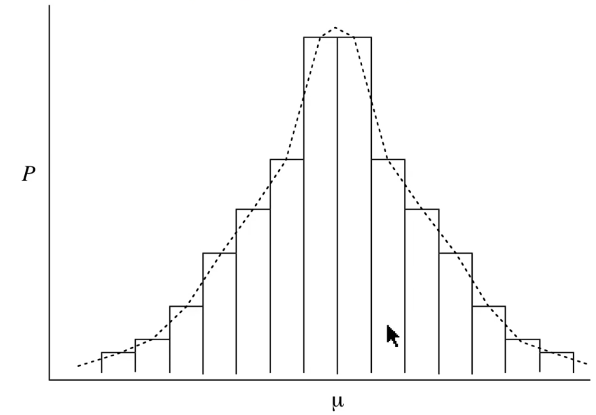
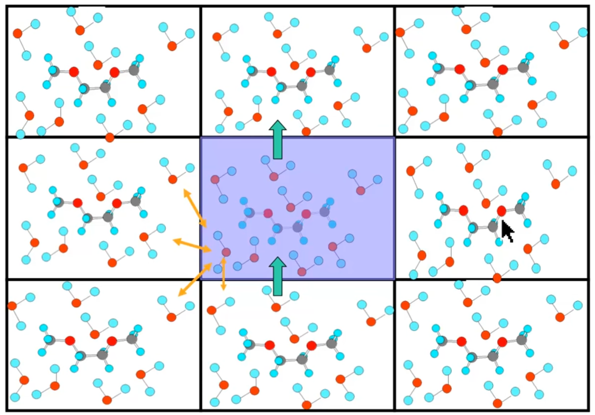
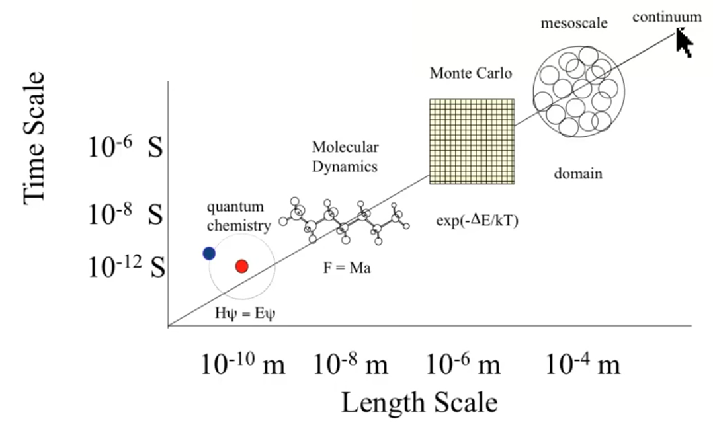

# MM Force Fields: Part 3

??? abstract
	
	

	<iframe width="560" height="315" src="https://www.youtube.com/embed/ddO_zZ95GXY" frameborder="0" allow="accelerometer; autoplay; encrypted-media; gyroscope; picture-in-picture" allowfullscreen></iframe>
	

When we calculate properties that are based on a Boltzmann distribution, it's easy to think of the $\pm$ as being an error, however while some of it is, there is an element that is simply the statistical variance of the distribution itself, that is that the system will not just exist as the [expectation value](.././02.07/#integrating-over-phase-space), but will deviate around it.

{: style="width: 50%; "class="center"}

## What's the point?

* Running MD simulations allows us to calculate time and momentum dependant properties about the geometry
* Allows us to perform certain "tricks" that couldn't be done experimentally:
  * Maintaining constant temperature (thermostats)
  * Maintaining constant pressure (pistons)

### Solvation in MD

* If only one shell of hydration is used to calculate solvation, while one side of the solvent molecules sees the solute, the other side will effectively see a vacuum
  * We could use more solvent molecules to prevent this, however that would be computationally not useful

#### PBC

Instead we can use PBC which essentially clones the current geometry into the surrounding cells to reduce the amount of computation required to calculate the system. This effectively makes a "pseudo crystal". You calculate the force fields on the primary unit cell and extend out into other cells only for long range interactions

Since the system is periodic, it's possible to use specific optimisations to make the system significantly more efficient than it would be if calculating everything explicitly.

!!! note
	It's really important to make sure there are well designed cutoffs to long range interactions, or a particular atom could potentially interact with itself. 

{: style="width: 50%; "class="center"}

### "Quasi-Ergodic" sampling problem

* Effects MD and Monte Carlo systems
* Most prominent in lower temperature systems

!!! definition
	**Ergodic:** relating to or denoting systems or processes with the property that, given sufficient time, they include or impinge on all points in a given space and can be represented statistically by a reasonably large selection of points.

The problem is that while you're doing well ergodically within a single well on the PES, that is that you'll explore it in a proper Boltzmann Distributed way, there are wells that you just won't be able to explore, either because:

* In MD, there was an energy barrier that was just too high
* in Monte Carlo, you just didn't get lucky enough to fall into that well

The real world would solve this by having the system run infinitely long, however that's not a luxury that we have.

## What method to use

### Molecular Dynamics

* To calculate MD properly, you need smooth derivatives, as the calculation of the next state is based on the forces of the current state, which is given by the second derivative of the PES
* For every timestep, every atom needs to be updated

### Monte Carlo

* Needs no derivatives, as it is based on random moves and energy calculation
* Works best on smaller systems where fewer "guesses" are needed
* Can use local updates, that is that the you can measure the change in energy of a single change in geometry, (e.g. one solvent molecule) since all the other molecules will remain the same and will have the same energy contribution
* **MC is time independent** 

## Scales

* Continuum refers to solvation continuum
* The equations below the plot refer to the method of calculation one might use to obtain the desired properties
* the plot is both on a scale of the size of the system, and of the timescale of the system

{: style="width: 50%; "class="center"}

!!! note
	"Coarse Graining" is a process of breaking down each component of a larger scale model into smaller models (e.g. continuum models for implicit solvation, MD for explicit solvation)