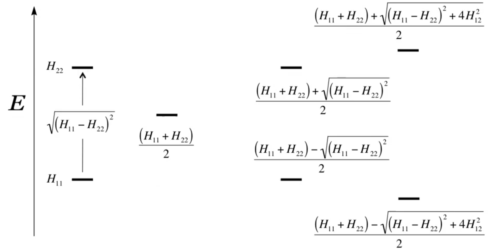

# Effective Hamiltonians

## What are the Resonance and Overlap Integrals?

Lots of algebra but the gist is:

From our determinant, we have a way to think about what the values mean

$$
\begin{vmatrix}
H_{11}-ES_{11} & H_{12}-ES_{12} & \cdots & H_{1N}-ES_{1N} \\ 
H_{21}-ES_{21} & H_{22}-ES_{22} & \cdots & H_{2N}-ES_{2N} \\
\vdots         & \vdots         & \ddots & \vdots\\
H_{N1}-ES_{N1} & H_{N2}-ES_{N2} & \cdots & H_{NN}-ES_{NN}
\end{vmatrix}=0
$$

​						

* The overlap integrals are normalised values ($-1$ to $1$) that measure the nearness and phase relationships between the orbitals
* The resonance integrals on the diagonal give us the energy of each of the MO
* The resonance integrals on the off-diagonal allow for a mixing of orbitals that improve the energy of one orbital at the expense of another

!!! info "Example"
	For a 2 basis function system, with zero overlap integrals, our determinant looks like this:
	
	$$
	\begin{vmatrix}
	H_{11}-E& H_{12}\\ 
	H_{21} & H_{22}-E\\
	\end{vmatrix}=0
	$$
	
	When we solve this we get:
	
	$$
	E=\frac{(H_{11}+H_{22})\pm\sqrt{(H_{11}-H_{22})^2+4H_{12}^2}}{2}
	$$
	
	Which we can think of as:
	
	* $H_{11}/H_{22}=$ The initial MO energy
	* $\sqrt{(H_{11}-H_{22})^2}=$ The difference between the two MOs 
	* $\frac{(H_{11}+H_{22})}{2}=$ The middle point between the two MOs 
	* $4H_{12}^2=$ A corrective term that allows for the basis functions to mix and provide resonance stabilisation/destabilisaiton
	
	{: style="width: 60%; "class="center"}

