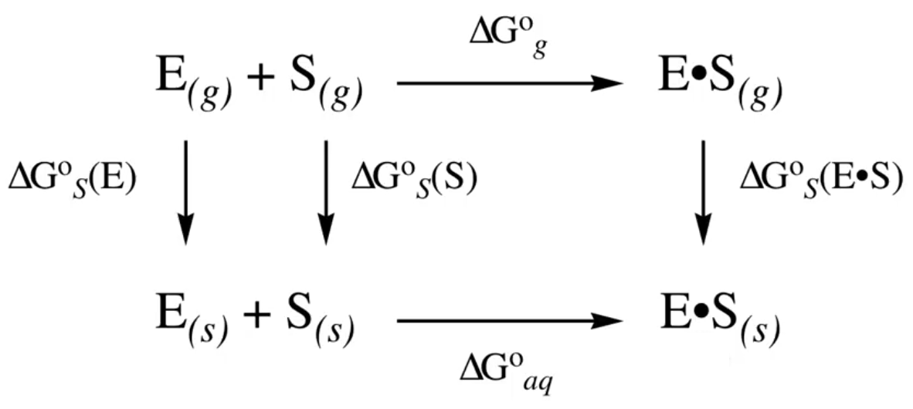
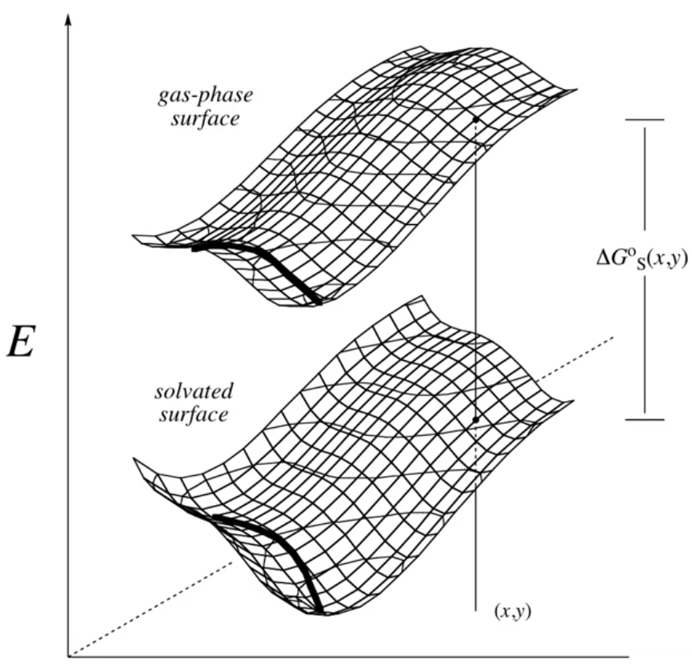
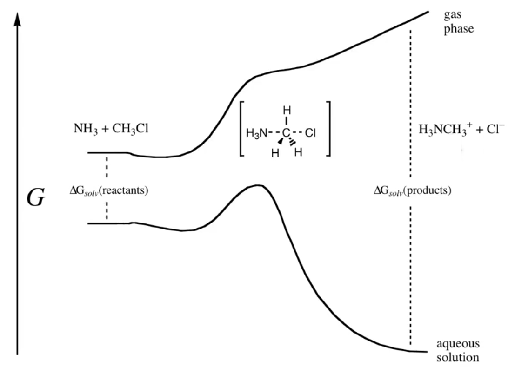
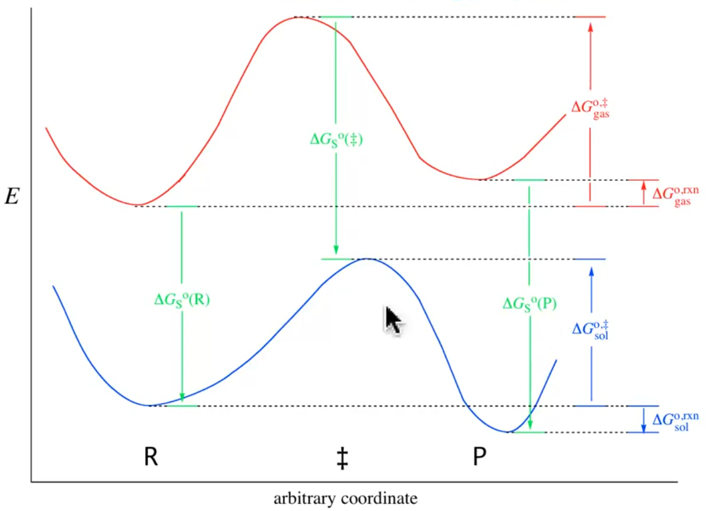

# Chemical Phenomena

??? abstract
	
	

	<iframe width="560" height="315" src="https://www.youtube.com/embed/Fx3zkPxt2qc" frameborder="0" allow="accelerometer; autoplay; encrypted-media; gyroscope; picture-in-picture" allowfullscreen></iframe>
	

!!! Definitions
	
	**Condensed Phase:** The scientific study of the properties of matter, as in its solid and liquid phases, in which atoms or particles adhere to each other or are highly concentrated.
	
	**Isotropic:** (of an object or substance) having a physical property which has the same value when measured in different directions. Often contrasted with
	
	**Exergonic vs Exothermic** Exothemric relates to the heat transfer $\Delta H$, while Exergonic refers to the overall enegy transfer $\Delta G$ (which includes entropy)

## Important condensed phases

* Homogeneous liquid solutions are the most common condensed phase in chemistry (solvation)
* Solids (particularly crystalline)
* Surfaces - interfaces between phases
* Liquid crystal solutions - solutions that have non-homogeneous properties - typically non isotropic
* Supercritical fluids - taking a substance beyond it's critical temperature
* Membranes - seperate two other phases

Sometimes the boundaries between the condensed phase and the component of interest is not so clear.

e.g. hydrated metal ions.

## Why is solvation important

Condensed-phase properties depend on the condensed-phase wavefunction. This may be very different from the gas phase properties.

For systems that interact within a condensed phase, the interaction also requires a partial desolvation step to be able to interact

The PES will likely be very different in and out of the condensed phased

## E.g. 1. Solvatochromism of Dye $\ce{E_T30}\:(S_1-S_0)$ (excited state 1 $\to$ excited state 0)
{: style="width: 30%; "class="center"}

| Solvent | Colour | $\lambda_{max}, nm$ |
| ------- | ------ | ------------------- |
| anisole | yellow | 769                 |
| acetone | green | 677  |
|2-pentanol | blue | 608|
|ethanol | violet | 550|
|methanol | red | 515 |

## E.g. 2. Enzyme-substrate binding

One way to approach this would be to use a thermodynamic cycle (since $\Delta E$ is a state function). This is an example of desolvation used in molecular recognition

{: style="width: 60%; "class="center"}

$$
\Delta G^\circ_{aq}=-(\Delta G^\circ_{aq}(E)+\Delta G^\circ_{aq}(S))+\Delta G^\circ_g+\Delta G^\circ_{aq}(E\cdot S)
$$

Taking the first negative ($-(\Delta G^\circ_{aq}(E)+\Delta G^\circ_{aq}(S))$)is the equivalent of desolvating the components

## The PES

The solvated energy of a system will not be continuous over all point son the PES. Some solvated geometries will end up with lower minima relative to each other than their gas phase counterparts

{: style="width: 40%; "class="center"}

<h2>E.g. 3. $S_N2$ reaction</h2>

This reaction is significantly stabilised by the solvent, since there are charged species involved. In the gas phase, there doesn't even seem to be a definite transition structure

{: style="width: 50%; "class="center"}

## General reaction coordinate

In this particular figure, the primary points of the reaction trajectory are very similar, however the transition structure has moved along the PES ($\ce{<->}$) and the product has been significantly stabilised by the effect of the solvent. This particular representation would allow us to better calculate/plot the reaction free energy cycles involved.

## {: style="width: 50%; "class="center"}

## Explicit and Implicit solvent modelling

#### Explicit

* Add in physical solvent molecules around the system of interest
* This will likely make finding the reaction coordinate incredibly difficult, due to the sheer number of degrees of freedom involved in the solvent molecules

#### Implicit

1. Start by computing the gas phase reaction curve with one method
2. Then compute the free energies of solvation at specific points of interest, using another method.

## Equilibrium - Free energy of solvation

These properties are NOT explicitly observable properties of the solvent

$$
\Delta G_S^\circ = \Delta G_{ENP}+G^\circ_{CDS}
$$

Where:

**The dielectric is represented by (electrostatic):**

* $E=$ electronic energy - The atomic charges pulling the solvent and solute together
* $N=$ nuclear repulsion - The proton-proton forces pushing the solvent and solute apart
* $P=$ solute-solvent polarisation - The ability for the solvent to orient itself and for the electrons to disperse around the molecules in reaction to electronic stimuli

**Other solvent properties are represented by(non-electrostatic):**

* $C=$ cavitation energy - The energy required to displace the solvent to form the cavity
* $D=$ [dispersion forces](../../../Undergrad%20Notes/Sem%205.%20Inorganic%20Chemistry/Physical%20Thoery/06.%20Covalent%20Bonding/#dispersion-forces) - "The induced dipole-induced dipole favourable interaction, associated with electron correlation" - not electrostatic since it's fundamental and the dipoles are non permanent
* $S=$ structural - concequences of solvating a molcule that could be favourable or unfavourable, e.g. H-bonding is favourable, non-polar molecules in a polar solvent, is unfavourable (reduces the water's entropy, because the hydrogen bonding opportunities are lost)

