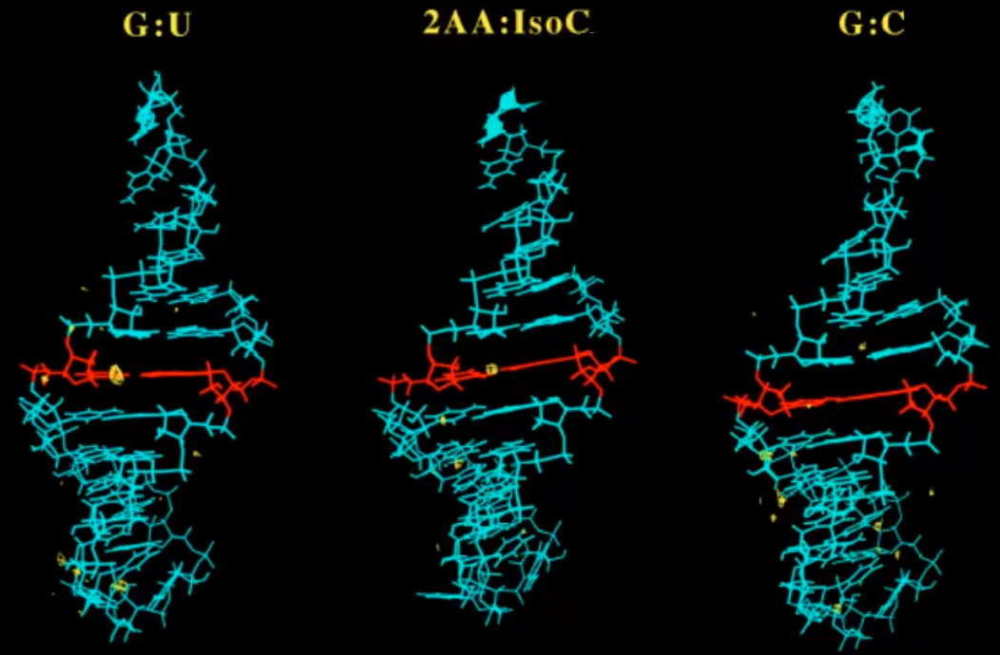
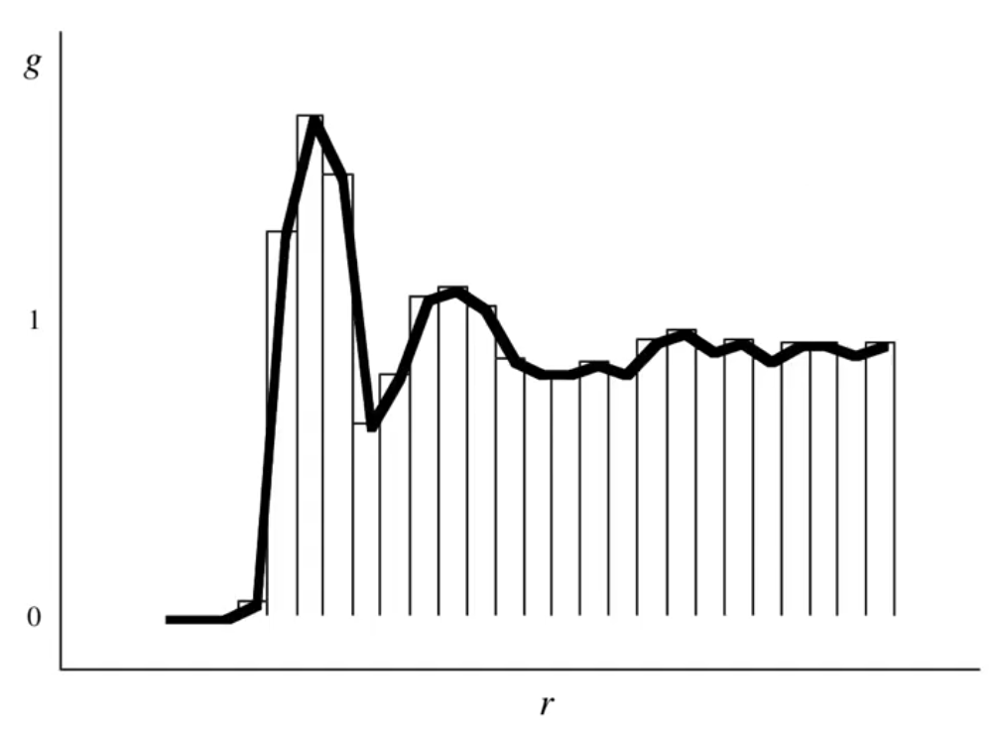

# Explicit Solvation

??? abstract
	
	

	<iframe width="560" height="315" src="https://www.youtube.com/embed/caxpxBT8JsM" frameborder="0" allow="accelerometer; autoplay; encrypted-media; gyroscope; picture-in-picture" allowfullscreen></iframe>
	

	

## Rules for explicit solvation

### 1. It takes a LOT of solvent molecules to look like a solution

* too few and it looks like a cluster, which is not a solution

* This makes it incredibly expensive
* We have tools to make this more simple - PBC, Ewald sums, QM/MM, split basis?

### Benefits:

* The solvent IS actually there, so we can performa a solvent density analysis (molecules per unit$^2$)
* Density differences mean that you can look at the specific interactions with regions of the molecule (favourable/unfavourable solvation conditions)

#### E.g. Solvation of tRNA

In this example, we can see that while there is typically only favourable solvation along the $\ce{PO4}$ spine in RNA (**2AA:IsoC** and **G:C**), in this case (**G:U**), we have hydration in the typically hydrophobic minor groove.

This extra solvation also correlates with enzymatic methylation of the base pair in this particular species.

{: style="width: 60%; "class="center"}

### 2. Equilibrium properties (e.g. free energies) require averaging over phase space (MM/MD)

* There are far too many minima if we do this though optimisation, making a QM-only solvation process near impossible to do rigorously

* Solvation really should be done through MC or MD, until [ergodic](../../2.%20The%20PES/02.08/#quasi-ergodic-sampling-problem) behaviour is identified.

  * To make this more rigorous, different starting trajectories should be chosen and the system should converge to the same average geometry
  * This also allows for averages of flexible molecules with dynamic structures (particularly biopolymers)
* You could also choose a small portion of MD steps to then run QM calculations on, reducing the amount of possible configurations
  * You can obtain structural details that are associated specifically with the solvation shell. Specific solvent-solute molecular interactions.
  
  

### Radial distribution function

Tells us the distribution of distances between atoms $A$ and $B$. (The probability of finding an atom at distance $r$)

Where:

* $V=$ Volume that all the atoms take up
* $g_{AB}=$ Radial distribution of atoms $A$ to $B$
* $r=$ The distance between the atoms
* $\frac{1}{N_A\cdot N_B}=$ A normalisation value for the numbers of atoms $A$ ($N_A$) and $B$ ($N_B$)
* $\sum\limits_{i=1}^{N_A}\sum\limits_{j=1}^{N_B}=$ Summing over all the occurrences of atoms $A$, from $i=1$ to $N_A$  and $B$, from $j=1$ to $N_B$
* $\delta\big[r-r_{A_iB_j}\big]=$ [Kronecker delta function](https://en.wikipedia.org/wiki/Kronecker_delta) - Checking whether the distance between the atoms is equal to the value of $r$ we've specified (spits out a True/False statement)

$$
\frac{1}{V}g_{AB}(r)=\frac{1}{N_A\cdot N_B}\bigg\langle\sum\limits_{i=1}^{N_A}\sum\limits_{j=1}^{N_B}\delta\big[r-r_{A_iB_j}\big]\bigg\rangle
$$

In the plot below, the distances ($r$) of the shells of hydration are 

{: style="width: 60%; "class="center"}