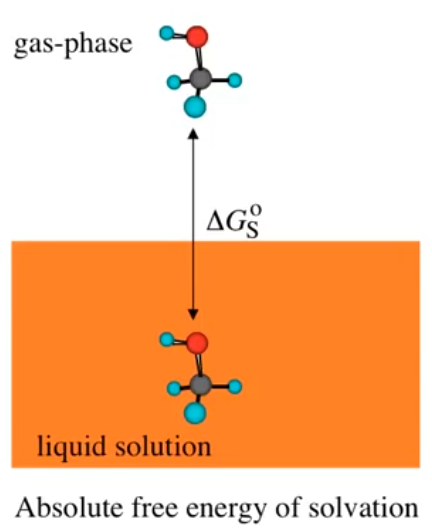
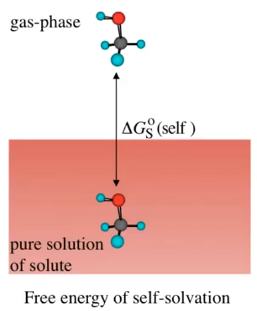
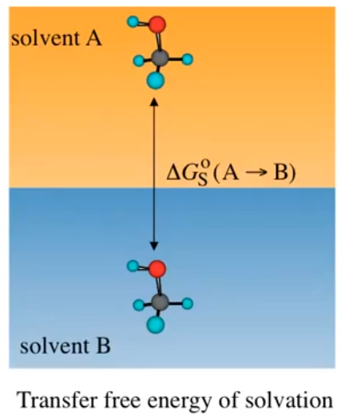

# Phase-Phase Partitioning

??? abstract
	
	

	<iframe width="560" height="315" src="https://www.youtube.com/embed/quAOVYJuJQU" frameborder="0" allow="accelerometer; autoplay; encrypted-media; gyroscope; picture-in-picture" allowfullscreen></iframe>
	

	

## What do we predict with SMx Solvation Models

| Solvation free energy |  Vapour pressure  | Partition coefficient |
| :-------------------: | :---------------: | :-------------------: |
|      |  |      |

By combining these we can also calculate solubility, interference adsorption and membrane permeability.

## Partition coefficients

Really straight forward, since we can use the difference between the two solvation energies

$$
\Delta G^\circ_{1\to2}=\Delta G^\circ_{sol\:2}-\Delta G^\circ_{sol\:1}
$$

To calculate a $K_{eq}$ from this we can use the equation

Where $\Delta G^\circ=\Delta G^\circ_{1\to2}$ 

$$
K_{eq}=\exp{\big(\frac{-\Delta G^\circ}{RT}\big)}
$$

And we can simply take the log of $K_{eq}$ to get $\log K$

!!! Note
	I didn't bother to write notes on $\log P$, $\log S$, membrane/water partitioning or soil/water partitioning, since he skips over a lot of the equations. I'll likely cover a lot of the methodology in Advanced Physical Chemistry.

