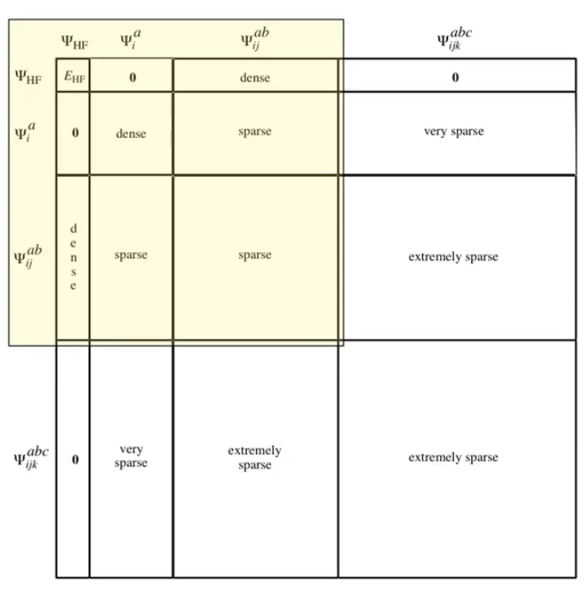
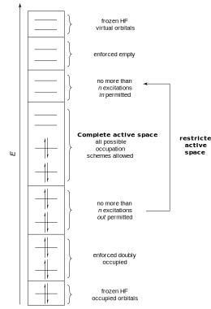

# Configuration Interaction (CI)

??? abstract
	

	<center>
	<iframe width="560" height="315" src="https://www.youtube.com/embed/KrDz8zayXoI" frameborder="0" allow="accelerometer; autoplay; encrypted-media; gyroscope; picture-in-picture" allowfullscreen></iframe>
	</center>

Configuration Interaction (CI) simply means, to build a wavefunction out of a linear combination of singly/doubly/triply/etc. excited wavefunctions. Typically CI is interested in the ground state, and higher excitations are used to account for correlation.

{: style="width: 60%; "class=center sharp"}

#### CI Singles

Have quality that is only about that of HF, as there are no excitations beyond the singly excited reference state.

The exited state is made from a combination of excitations, each corresponding to a combination of the $\Psi^a_i$ eigenvalues

!!! info "Example"
	```
	Excited State 1:
		14 -> 16     0.62380
		14 -> 17     0.30035
	

	Excited State 2:
		15 -> 16     0.68354
		
	Excited State 3:
		11 -> 16    -0.15957
		12 -> 16     0.55680
		14 -> 16    -0.19752
		14 -> 17     0.29331
	```

If we want to consider a bit of correlation, we could incorporate higher excitations (e.g. $\Psi^{ab}_{ij}$ and $\Psi^{abc}_{ijk}$ to give CISDT) but this gets expensive and only captures the effects of single or double excitations.

#### MSSCF

Instead, we can look at all possible combinations of excitations (which would be 'full CI') more cheaply by using a multiconfigurational approach, in which:

{: style="width: 40%; "class=center sharp"}


These calculations come under the banner of MCSCF (MultiConfiguration Self Consistent Field), but more specifically, the method described about is CASSCF (Complete Active Space SCF) or RASSCF (Restricted Active Space SCF).

Since this give us all of our excitations only, it doesn't include any correlation. We can then include correlation perturbatively using an MP2 like formalism in the method called CASPT2 (Complete Active Space Perturbation Theory, second order). This is considered accurate to ~0.2 eV for excitations.

State averaging: optimising the orbitals for the average energy of all the states preserves the order of them, otherwise, you'll be biasing one state over the over, as no configuration of orbitals will be optimal for all states.