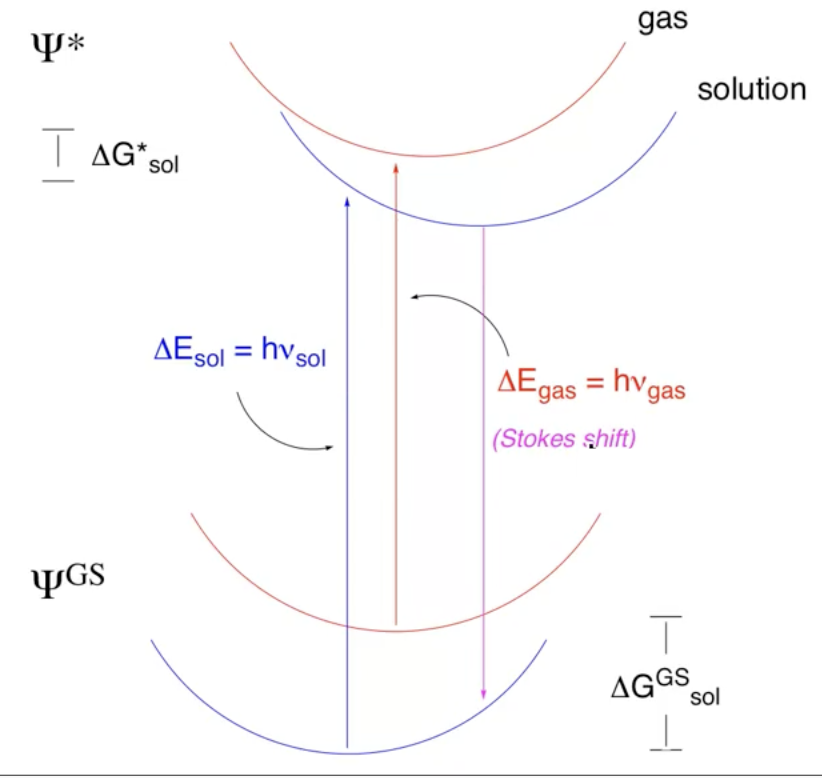

# Solvatochromism

??? abstract
	
	

	<iframe width="560" height="315" src="https://www.youtube.com/embed/PdNE4VZrhys" frameborder="0" allow="accelerometer; autoplay; encrypted-media; gyroscope; picture-in-picture" allowfullscreen></iframe>
	

Since excitations are adiabatic processes, the solvatochromic effect is not considered to be based on $\Delta G_{sol}^0$ and $\Delta G_{sol}^*$, as seen in the figure below. The 'Stokes shift' is the difference between the the adiabatic absorbed and emitted photons.

{: style="width: 50%; "class=center sharp"}

!!! info
	The rest of this video was just on how we can use empirical parameters of polarisability and h-Bbonding acidity to create implicit solvent models to account for solvatochromism.
