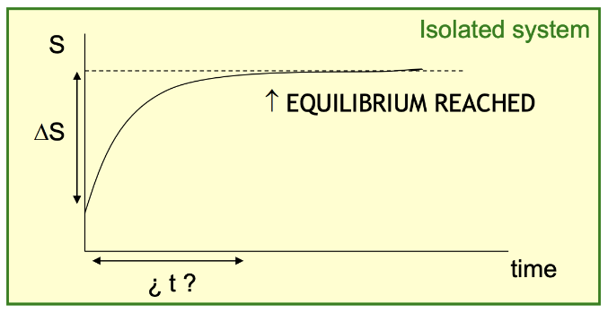

# CHE10002 - Entropy/Gibbs Free Energy

!!! Definition
	Entropy is s measure of how ordered a system is.  
	The second law of thermodynamics states that any spontaneous process increases the entropy of the universe.

* To decrease the entropy of a system, work needs to be done
* The act of decreasing the entropy of one system inevitably means increasing the entropy of another
* Entropy, like enthalpy is a state function.

## Examples of disorder

#### Systems of a lower energy state of matter have a lower entropy

$\ce{H2O_{(l)}}$ has a lower entropy than $\ce{H2O_{(g)}}$ (96.9 vs 188.7)

#### Atoms of a higher molecular weight have lower entropy

$\ce{He_{(g)}}$ has a lower entropy than $\ce{Ne_{(g)}}$ (126.1 vs 146.2 )

#### Molecules with fewer bonds have less entropy

$\ce{C2H2_{(g)}}$ has a lower entropy than $\ce{C2H6_{(g)}}$ (200.9 vs 229.2)

#### Systems with fewer moles of the same atom have less entropy

$\ce{I2_{(g)}}$ has a lower entropy than $\ce{2I_{(g)}}$

* This goes for reactions too
* $\ce{2ZnO_{(s)}}$ has lower entropy than $\ce{2Zn_{(s)} + O2_{(g)}}$ (2 moles vs 3 moles)

## Entropy as a function of time

While a spontaneous process occurs, entropy increases until a point at which equilibrium is reached. at this point, there is no net change in the constituents of the reaction, so there can be no further increase in entropy.

{: style="width: 50%; "class="center"}

## Spontaneity

> "spontaneous processes increase the entropy"
>
> Chris Cramer

In a chemical sense, is a measure of whether or not a reaction is thermodynamically capable of happening without outside energy input

If an equation has a a positive enthalpy ($\Delta H=+ve$), it is logically unlikely to occur, since heat is required form the environment. We can compare the effects of enthalpy and entropy, to determine which change is driving the reaction:

If $\Delta H>T\Delta S$, then the reaction is **enthalpy driven** 

if $\Delta H<T\Delta S$ then the reaction is **entropy driven** 

**E.g.:**
$$
\ce{2NH4Cl_{(s)} + Ba(OH)2.8H2O_{(s)} -> 2NH3_{(g)} + 10H2O_{(l)} + BaCl2_{(s)}}
$$

$$
\begin{gather}
\Delta H^\circ=166\:KJ \text{ (endothemric)}\\
\Delta S^\circ=0.594\:KJ\cdot  K^{-1}\\
T=298.15\:K\\
\end{gather}
$$

So when we calculate $T \Delta S$ we get; $298.15\cdot0.594=177\:KJ$

Since $T \Delta S$ is greater than $\Delta H$, the endothermic nature of the reaction is overcome by the entropy to make it spontaneous

!!! note
	The reason for the much larger contribution of entropy is that the reaction converts 3 moles of solid into one mole of solid, 10 moles of liquid and 2 moles of gas. This is both a massive increase in the number of moles of matter, but also a massive increase in the entropy from species that have more ability to move around.

## Gibbs Free Energy

* Is also a state function
* Measures the amount of energy available to do useful chemical work
* If $\Delta G$ is $-ve$, then the reaction is spontaneous
* If $\Delta G$ is $0$, then the reaction is in equilibrium

$$
\Delta G^\circ=\Delta H^\circ-T\Delta S^\circ
$$

**E.g.:**
In the above example, we can calculate the $\Delta G$ as:

$$
\Delta G=166-(298.15\cdot0.594)=-11\:KJ\cdot mol^{-1}
$$

Which means that ultimately, despite taking in $166\:KJ\cdot mol^{-1}$, the system has actually lost $11\:KJ\cdot mol^{-1}$ of energy and is more stable as a result.

### Non-standard state spontaneity

To calculate spontaneity in non standard state conditions we can use the following equation

Where $Q=\frac{\text{products}}{\text{reactants}}$

$$
\Delta G=\Delta G^\circ+RT\ln(Q)
$$

### Determination of equilibrium constants (rate constants)

We can use $\Delta G$ to calculate a $k_x$

Where $R=$ Gas Constant ($8.314\:J\cdot K^{-1}\cdot mol^{-1}$)

$$
\Delta G^\circ=-RT\ln(k)
$$

