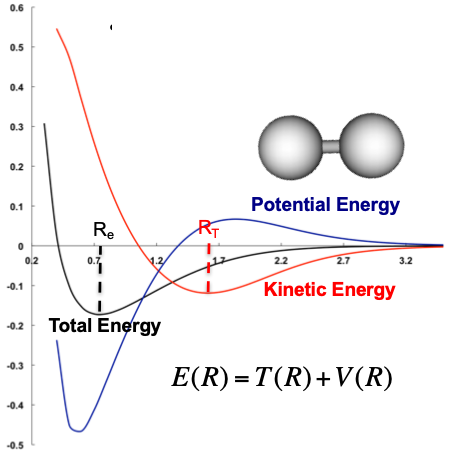
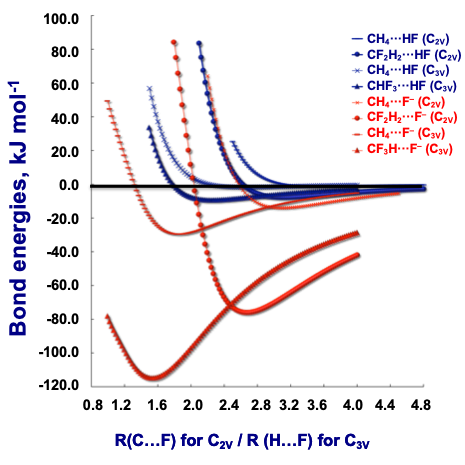
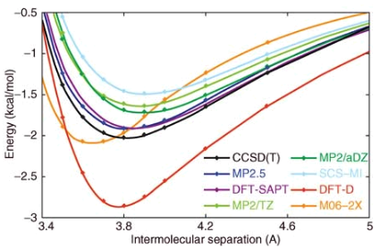

# PES and BO Approximation

The potential energy surface is a multidimensional surface that is made up of the the energy, where $R$ is the geometry and $N$ is the number of atoms:

$$
E\approx f(R^N)
$$

The Hamiltonian is a complex operator that's made up of five energy terms:

$$
\begin{gather}
\hat{H}=\hat{T}_n+\hat{T}_e+V_{ne}+V_{nn}+V_{ee}\\
\hat{H}=\hat{T}_n(\vec{R})+\hat{T}_e(\vec{r})+V_{ne}(\vec{r},\vec{R})+V_{nn}(\vec{R})+V_{ee}(\vec{r},\vec{R})
\end{gather}
$$

We can calculate $V_{nn}$ using basic coulombic potential ($V=\frac{q_1\cdot q_2}{R_{12}}$) and we can combine out remaining kinetic terms since they both depend on $\vec{r},\vec{R}$, which leaves us with:

$$
\hat{H}=\hat{T}_n(\vec{R})+\hat{T}_e(\vec{r})+V(\vec{r},\vec{R})
$$

Since the mass of the electron is so small compared to the mass of the proton, we can separate out the electronic Schrödinger equation from the nuclear Schrödinger equation with the Born-Oppenheimer approximation

## Born-Oppenheimer Approximation

We can start by separating out the wavefunction into two different components:

$$
\psi(\vec{r},\vec{R})=\psi(\vec{r},\vec{R}_{fixed})\cdot\psi(\vec{R})
$$

Then we can recombine the terms into electronic and nuclear equations:

$$
\begin{align}
Electronic\\
\hat{H}_e&=\hat{T}_e+V_e(\vec{r},\vec{R}_{fixed})\\
Nuclear\\
H_n&=\hat{T}_n+V(\vec{R})
\end{align}
$$

The electronic energy is used to calculate the nuclear equation, and the nuclear equation is used to calculate frequencies of the geometry.

## Atomic Units

For the simplification of the maths, Douglass Hartree implemented a set of units that are used called the atomic units:

$$
\begin{align}
m_e&=1\\
q_e&=1\\
\hbar&=1\\
\frac{1}{4\pi \epsilon_0}&=1
\end{align}
$$

This gives rise the the Hartree unit of energy:

$$
1H_a=2625.5\:kJ\cdot mol^{-1}
$$

## Virial Theorem - Bonding

The virial theorem describes bonding in more physical terms, by explaining that at bonding equilibrium, the kinetic energy will equal the negative half of the potential energy

$$
T=-\frac{1}{2}V
$$

{: style="width: 30%; "class="center"}

This can best be thought of as:

* At larger distances, the potential energy increases and kinetic energy decreases, as the electrons are forming molecular orbitals, resulting in a sharing of the electrons
  * Slower electrons
* At smaller distances, the potential energy drastically decreases as the electrons get closer to the nuclei and the kinetic energy increases, as the orbitals contract 
  * Faster electrons

## Ground State PES

Things to note that you may not have already covered:

* It's important to look for imaginary frequencies, as you can reach a minima $\big(\frac{\partial E}{\partial R}=0\big)$ or close enough $(10^{-10}$ for `scf=tight`$)$

* In intermolecular complexes, the deeper the minima, the stronger the interaction (e.g. electrostatic). weaker interactions will have have more shallow minima (e.g. dispersion)

{: style="width: 30%; "class="center"}

* Different levels of theory will have different energy and optimal geometries. It is often necessary to perform an "assessment structure"

{: style="width: 30%; "class="center"}

## Transition States

* Are maxima that have at least one imaginary frequency
* These show the direction of a reaction

**Transition state theory** (TST) makes two big assumptions:

1. The transition state will occur on the PES at a fixed intrinsic reaction coordinate (IRC), that connects the reactants and products
   * It will only have one degree of freedom and is considered to be in  *local equilibrium* with the reactants.
2. The reactants reach the transition state only once before collisiion/crossing

**Variational transitions state theory** (VTST)

Standard transition state theory uses the enthalpy only ($\Delta H$) to calculate the reaction barrier, where VTST uses the Gibb's free energy as the barrier. VTST is better for low, or non existent barriers, such as with proton transfer

### IRC Calcs

These tend to be rather expensive, so it's often useful to do a low level IRC search, then to re-calculate the PES at a high level of theory to get a better representation. Small changes in geometry can have a big impact on the energy of the system

We can check this by calculaitng the kinetics of the system:

$$
k(T)=K\cdot e^\frac{-\Delta G^*}{RT}
$$

$10\:kJ\cdot mol^{-1}$ would result in an error of a factor of 57 in the rate constant.

