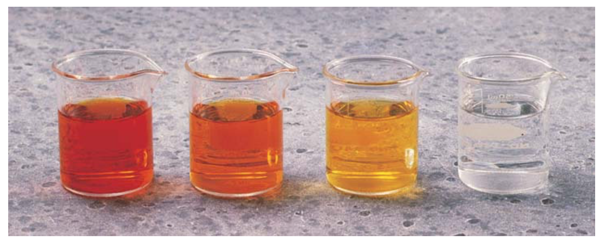
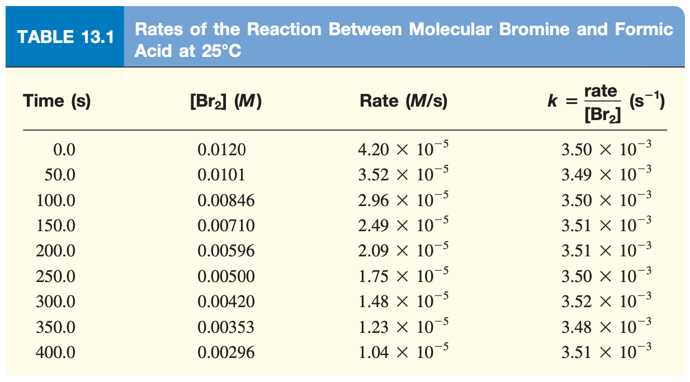

# Chemical Kinetics

## Derivation of the rate $k$

#### Kinetics - The study of the rate of reactions

Rates are measured as change over time and can be expressed as: 

$$
\begin{align}\text{For equation }\ce{A->B},\:\:\text{Rate }=-&\frac{\Delta [A]}{\Delta t}\text{ (a decrease in A over time)}\\
\text{ or }&\frac{\Delta [B]}{\Delta t}\text{ (an increase in B over time)}\end{align}
$$

We can measure these experimentally using spectroscopy for absorbent species, or electric potential for ions and plot them as such:

!!! info "Example 1 - Reaction of Molecular Bromine and Formic Acid"
	
	$$
	\ce{Br2_{(aq)} + HCOOH_{(aq)} -> 2Br-_{(aq)} + 2H+_{(aq)} + CO2_{(g)}}
	$$
	
	
Which decreases in absorption as $\ce{Br2}$ is consumed over time:

	
	{: style="width: 50%; "class="center"}
	
	Using the data in Table 13.1 , we can calulate the **average rate**:
	
	$$
	\begin{align}\text{average rate } &= -\frac{\Delta [\ce{Br2}]}{\Delta t}\\
	&=-\frac{[\ce{Br2}]_f - [\ce{Br2}]_i} {t_f-t_i}\\
	&=-\frac{(0.0101-0.0120)\:M}{50.0\:s}=3.80\times 10^{-5}\:M/s\end{align}
	$$
	
	{: style="width: 50%; "class="center"}
	
	We chose 50 seconds arbitrarily though and could have used any interval. If we took infinitely small measurements, we'd eventually reach the **instantanous rate** at that particular point in time.
	Graphically, this is given as the tangent of the reaction rate curve at a specifica point in time.

E.g. 1 primarily shows us that the $\text{rate}$ is proportional to $[\ce{Br2}]$ in a rate constant[^1] called $k$:

Since  has the unit , and  has the units ,  has the units $S^{-1}$

$$
\begin{align}
\text{rate }\propto&[\ce{Br2}]\\
=k&[\ce{Br2}]\\
\frac{\text{rate}}{[\ce{Br2}]}=k&\\
\frac{M/s}{M}=s&^{-1}
\end{align}
$$

As a result, it's important to note that while the rate is dependent on concentration, $k$ is not.

If we plot the concentration over time (left) we can see that we get a curved descent, however if we plot the concentration over the rate (right), we can see that we get a straight line.

Where the temperature is consistent, the *ratio* of the rate/$\ce{[Br2]}$ remains the same.

!!! note 
	
	Because of this, we can use any vanlue of $t$ to determine $k$. The slight deviations of the resulting values are due to an experimental uncertainty, as per Table 13.1.

{: style="width: 100%; "class="centre"}

[^1]:"A constant of proportionality between the reaction rate and the concentration of reactant"

## Ideal gas law in kinetics

We can substitute this logic into other equations as well and determine rate laws of gasses using the  pressure of the system as the decomposition of hydrogen peroxide.

!!! info "Example 2 - Decomposition of hydrogen peroxide" 
	
	Considering the reaction $\ce{2H2O2_{(aq)} -> 2H2O_{(l)} + O2_{(g)}}$ we have the evolution of gas, which means that there will be a proportional increase in pressure (where volume remains the same). We can rearrange the ideal gas law to give us molar concentration
	
	$$
	\begin{align}PV&=nRT\\
	P&=\frac{n}{V}RT\\
	\frac{P}{RT}&=\frac{n}{V}\\
	\frac{P}{RT}&=[\ce{O2}]\end{align}
	$$
	
	If we keep constant temperature, we can pull out $\frac{1}{RT}$ and multiply by $\frac{1}{t}$
	
	$$
	\text{rate}=\frac{\Delta [\ce{O2}]}{\Delta t}=\frac{\Delta P}{\Delta t}\frac{1}{RT}
	$$
	
	Using the plot below, we convert mmHg/min to atm/s, calculate the tangent at time $=400\:s$ ($\Delta P/\Delta t$) and multiply by $1/RT$ as per the equation, to get the instantaneous rate of $\ce{O2}$ evolution.
	
	{: style="width: 50%; "class="center"}

#### Rate laws obey stoichiometry

!!! info "E.g. 2"
	$$
	\ce{2N2O5_{(g)} -> 4NO2_{(g)} + O2_{(g)}}\\
	\ce{O2}\hskip{1cm}+9.0\times 10^{-6}\:M/s
	$$
	

	To calculate the rate of $\ce{NO2}$ production, we can just multiply the $\ce{O2}$ rate by 4, since there will be four moles for every mole of $\ce{O2}$ produced. For $\ce{N2O5}$ we take twice the negative of the rate of $\ce{O2}$
	
	$$
	\begin{gather}
	\ce{NO2}= 4(9.0\times 10^{-6}\:M/s)=3.6\times 10^{-5}\:M/s\\
	\ce{N2O5} = -2(9.0\times 10^{-6}\:M/s)=-1.8\times 10^{-5}\:M/s\\
	\therefore\\
	\text{Rate }=\frac{\Delta [\ce{O2}]}{\Delta t}=\frac{1}{4}\frac{\Delta [\ce{NO2}]}{\Delta t}=-\frac{1}{2}\frac{\Delta [\ce{N2O5}]}{\Delta t}
	\end{gather}
	$$

This can be simplified to a general expression:

For reaction $\ce{aA + bB -> cC + dD}$

$$
\text{rate}=-\frac{1}{a}\frac{\Delta A}{\Delta t}=-\frac{1}{b}\frac{\Delta B}{\Delta t}=\frac{1}{c}\frac{\Delta C}{\Delta t}=\frac{1}{d}\frac{\Delta D}{\Delta t}
$$

## Questions

???+ warn "13.1 - What is meant by the rate of a chemical reaction? What are the units of the rate of a reaction?"
	
	The rate of a chemical reaction is how fast the reaction happens, measured as a rate with  unit 	$M/s$

???+ warn "13.2 - Distinguish between average rate and instantaneous rate. Which of the two rates gives us an unambiguous measurement of reaction rate? Why?""
	
	The average rate is the molarity difference $\Delta M$ over a finite period of time $\Delta t$. The instantaneous rate is the tangent of the curve at a finite point on  the plot of $\frac{\Delta M}{\Delta t}$.  

???+ warn "13.5 - Write the reaction rate expressions for the following reactions in terms of the disappearance of the reactants and the appearance of products:""
	
	a) $\ce{H2_{(g)} + I2_{(g)} -> 2HI_{(g)}}$
	
	$\text{rate}=-\frac{\Delta[\ce{H2}]}{\Delta t}=-\frac{\Delta[\ce{I2}]}{\Delta t}=\frac{1}{2}\frac{\Delta[\ce{HI}]}{\Delta t}$
	
	b) $\ce{5Br-_{(aq)} + BrO3-_{(aq)} + 6H+_{(aq)} -> 3Br2_{(aq)} + 3H2O_{(l)}}$
	
	$\text{rate}=-\frac{1}{5}\frac{\Delta[\ce{Br-}]}{\Delta t}=-\frac{\Delta[\ce{BrO3-}]}{\Delta t}=-\frac{1}{6}\frac{\Delta[\ce{H+}]}{\Delta t}=\frac{1}{3}\frac{\Delta[\ce{Br2}]}{\Delta t}=\frac{1}{3}\frac{\Delta[\ce{H2O}]}{\Delta t}$

???+ warn "13.7 - Consider the reaction $\ce{2NO_{(g)} + O2_{(g)} -> 2NO2_{(g)}}$ Suppose that at a particular moment during the reaction nitric oxide ($\ce{NO}$) is reacting at the rate of $0.066\:M/s$. (a) At what rate is $\ce{NO2}$ being formed? (b) At what rate is molecular oxygen reacting?""
	
	a)  $\ce{NO2}$ is being produced at a rate  of $0.066\:M/s$
	
	b) $\ce{O2}$ is being produced at twice the rate that $\ce{NO2}$ is being removed, so $-0.033\:M/s$

???+ warn "13.8 -Consider the reaction $\ce{N2_{(g)} + 3H2_{(g)} -> 2NH3_{(g)}}$ Suppose that at a particular moment during the reaction molecular hydrogen is reacting at the rate of $0.074\:M/s$. (a) At what rate is ammonia being formed? (b) At what rate is molecular nitrogen reacting?""
	
	a) $\ce{NH3}$ will be being produced at a rate of $\frac{3}{2}\text{rate}_{\ce{H2}} = 0.111\:M/s$
	
	b) $\ce{N2}$ will be being produced at a rate of $\frac{1}{3}\text{rate}_{\ce{H3}} = -0.025\:M/s$

