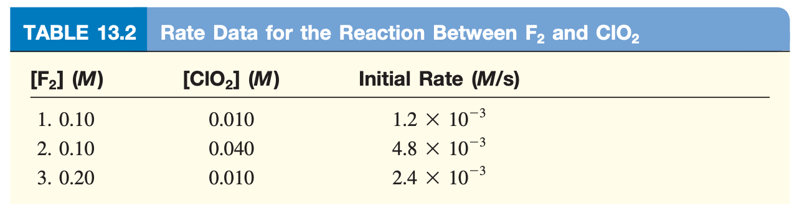

# The Rate Law

The rate law takes the general form:

$$
\text{rate}=k[A]^x[B]^y
$$

$x$ and $y$ are not the molar coefficients, but are an experimental exponent that  specify the relationship between the concentrations of the reactants ($A$ and $B$) and the reaction rate. When added together, they give the ***reaction order***[^1]

!!! note
	It can be useful to measure the rate of the reaction at the beginning, as the changes will be more detectable as the concentrations change drastically.
	

	This also reduces the influence of  a back reaction ($\ce{reactants <- products}$), which would introduce an error into the rate measurement.

## Rate Law Determination

!!! note "E.g. 1 - Nitrous oxide and hydrogen gas"
	If we consider the reaction $\ce{2NO_{(g)} + 2H2_{(g)} -> N2_{(g)} + 2H2O_{(g)}}$ we can start building our rate equation.
	

	We start by putting in our reactants:
	
	$$
	\text{rate}=k[\ce{NO}]^x[\ce{H2}]^y
	$$
	
	

	
	| Experiment | $[\ce{NO}]\:(M)$ | $[\ce{H2}]\:(M)$ | Initial Rate $(M/s)$ |
	| ---------- | ---------------- | ---------------- | -------------------- |
	| 1          | 0.0050           | 0.0020           | $1.25\times10^{-5}$  |
	| 2          | 0.0100           | 0.0020           | $5.00\times10^{-5}$  |
	| 3          | 0.0100           | 0.0040           | $1.00\times10^{-4}$  |
	
	

	
	And then we can calculate the exponents for the reaction. If we look at the table above, we can see that as we increase $[\ce{NO}]$ two times[^2], the rate increases four times, so they are linked 1:2, and our exponent is 2. As we increase $[\ce{H2}]$ by two we see  an increase of 2 and therefore $x=2$ and $y=1$.
		
	$$
	\begin{align}\text{rate}&=k[\ce{NO}]^2[\ce{H2}]^1\\&=k[\ce{NO}]^2[\ce{H2}]\end{align}
	$$
	
	We can consider this to be a second order reaction in $\ce{NO}$ and first in $\ce{H2}$, but is a third order reaction overall

## Rate Constant Determination

!!! note "Example 1 - Nitrous oxide and hydrogen gas"
	We can determine this by substituting the experimental values into out rate law:
	
	$$
	\begin{align}\text{rate}&=k[\ce{NO}]^2[\ce{H2}]\\
	1.25\times10^{-5}\:M/s&=k(0.0050\:M)^2(0.0020\:M)\\
	1.25\times10^{-5}\:M/s&=k(5\times10^{-8}\:M^3)\\
	\frac{1.25\times10^{-5}\:\bcancel{M}/s}{5\times10^{-8}\:M^\bcancel{3}}&=k\\
	250\:\frac{1}{M^2\cdot s}&=k
	\end{align}
	$$
	
	It's worth noting that the units of the rate constant are not going to be the same for every reaction.

## A few Final notes

1. Rate laws are always determined experimentally. This is done by calculating the initial reaction rate with varying starting conditions.
2. Reaction order is always defined by the reactant and not the product.
3. The order of the reaction is not related to the stoichiometric coefficient.

## Questions

???+ warn "13.9 - Explain what is meant by the rate law of a reaction."
	
	The rate law is the equation that describes the kinetics of an equation in specific state conditions.

???+ warn "13.10 - What are the units for the rate constants of zero order, first-order, and second-order reactions?"
	
	Zero order:
	
	$$
	\begin{align}\text{rate}&=k[A]^0[B]^0\\
	\text{rate}&=k\\
	M\cdot s^{-1}&=k
	\end{align}
	$$
	
	First Order:
	
	$$
	\begin{align}\text{rate}&=k[A]^1[B]^0\\
	\text{rate}&=k[A]\\
	\frac{\text{rate}}{[A]}&=k\\
	\frac{\bcancel{M}\cdot s^{-1}}{\bcancel{M}} &=k\\
	s^{-1}&=k\\
	\end{align}
	$$
	
	Second Order:
	
	$$
	\begin{align}\text{rate}&=k[A]^1[B]^1\\
	\text{rate}&=k[A][B]\\
	\frac{\text{rate}}{[A][B]}&=k\\
	\frac{\bcancel{M}\cdot s^{-1}}{\bcancel{M}M} &=k\\
	(M\cdot s)^{-1}&=k\\
	\end{align}
	$$

???+ warn "13.12 - On which of the following properties does the rate constant of a reaction depend?"
	
	**a) reactant concentrations** - *Yes* 
	**b) nature of reactants** - *Yes* 
	**c) temperature** - *Yes*

???+ warn "13.13 - Write the rate law for the reaction $\ce{NH4+_{(aq)} + NO2-_{(aq)} -> N2_{(g)} + 2H2O_{(l)}}$"
	
	$$
	\text{rate}=k[\ce{NH4+_{(aq)}}]^x[NO2-_{(aq)}]^y
	$$

???+ warn "13.14 - Use the data in Table 13.2[^3] to calculate the rate of the reaction at the time when $[\ce{F2}] =  0.010\:M$ and $[\ce{ClO2}] = 0.020\:M$."
	
	Determination of $k$ 
	
	$$
	\begin{align}\text{rate}&=k[\ce{F2}]^1[ClO2]^1\\
	\frac{\text{rate}}{[\ce{F2}]^1[ClO2]^1}&=k\\
	\frac{1.2\times 10^{-3}}{(0.10)(0.010)}&=k\\
	1.2\:(M\cdot s)^{-1}&=k
	\end{align}
	$$
	
	Determination of $\text{rate}$ at $[\ce{F2}] =  0.010\:M$ and $[\ce{ClO2}] = 0.020\:M$:
	
	$$
	\begin{align}\text{rate}&=1.2(0.010)(0.020)\\
	\text{rate}&=2.4\times 10^{-4}\:M\cdot s^{-1}
	\end{align}
	$$

???+ warn "13.16 - Consider the reaction $\ce{X + Y -> Z}$ From the following data, obtained at $360 K$"
	
	**a) determine the order of the reaction,**
	
	$$
	\text{rate}=k[X]^2[Y]^1
	$$
	
	The reaction is second order in $X$, first order in $Y$ and third order overall.
	
	**b) determine the initial rate of disappearance of $X$ when the concentration of $X$ is $0.30 M$ and that of $Y$ is $0.40 M$.**
	
	Determination of $k$ 
	
	$$
	\begin{align}\text{rate}&=k[X]^2[Y]^1\\
	\frac{\text{rate}}{[X]^2[Y]^1}&=k\\
	\frac{0.053}{(0.1)^2(0.5)}&=k\\
	10.6 \:(M^2\cdot s)^{-1}&=k
	\end{align}
	$$
	
	Determination of $\text{rate}$ at $[X] =  0.30\:M$ and $[Y] = 0.40\:M$:
	
	$$
	\begin{align}\text{rate}&=10.6(0.3)^2(0.40)\\
	\text{rate}&=0.38\:M\cdot s^{-1}
	\end{align}
	$$
	
	

	
	| Initial Rate of Disappearance of X (M/s) | [X] (M) | [Y] (M) |
	| ---------------------------------------- | ------- | ------- |
	| 0.053                                    | 0.1     | 0.5     |
	| 0.127                                    | 0.2     | 0.3     |
	| 1.02                                     | 0.4     | 0.6     |
	| 0.254                                    | 0.2     | 0.6     |
	| 0.509                                    | 0.4     | 0.3     |
	
	

???+ warn "13.18 - Consider the reaction $\ce{A -> B}$ The rate of the reaction is $1.6\times10^{-2} M/s$ when the concentration of $A$ is $0.35\:M$. Calculate the rate constant if the reaction is (a) first order in $A$ and (b) second order in $A$."
	
	Determination of $k$ - First order in $A$ 
	
	$$
	\begin{align}\text{rate}&=k[A]^1\\
	\frac{\text{rate}}{[A]^1}&=k\\
	\frac{0.016}{(0.35)^1}&=k\\
	0.046 \:(M\cdot s)^{-1}&=k
	\end{align}
	$$
	
	Determination of $k$ - Second order in $A$ 
	
	$$
	\begin{align}\text{rate}&=k[A]^2\\
	\frac{\text{rate}}{[A]^2}&=k\\
	\frac{0.016}{(0.35)^2}&=k\\
	0.13 \:(M^2\cdot s)^{-1}&=k
	\end{align}
	$$

[^1]:The sum of the powers to which all reactant concentrations appearing in the rate law are raised.
[^2]: $\begin{align}\bigg(\frac{[\ce{NO}]_f}{[\ce{NO}]_i}\bigg)^x&=\frac{\text{rate}_f}{\text{rate}_i}\\2^x&=4\\\frac{\log{4}}{\log{2}}&=x\\&=2\end{align}$
[^3]:{: style="width: 50%; "class="left"}