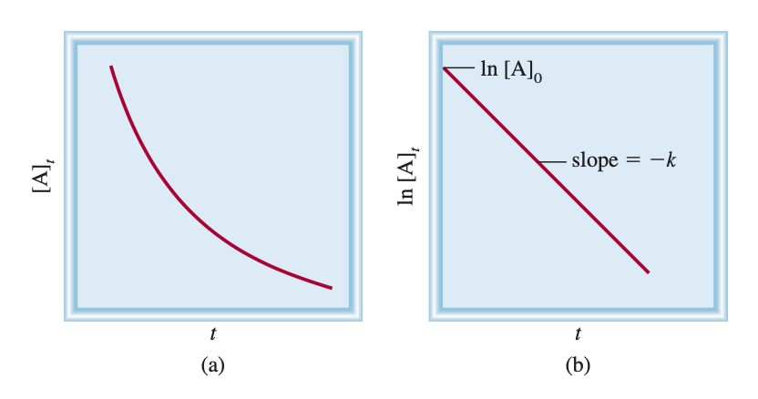
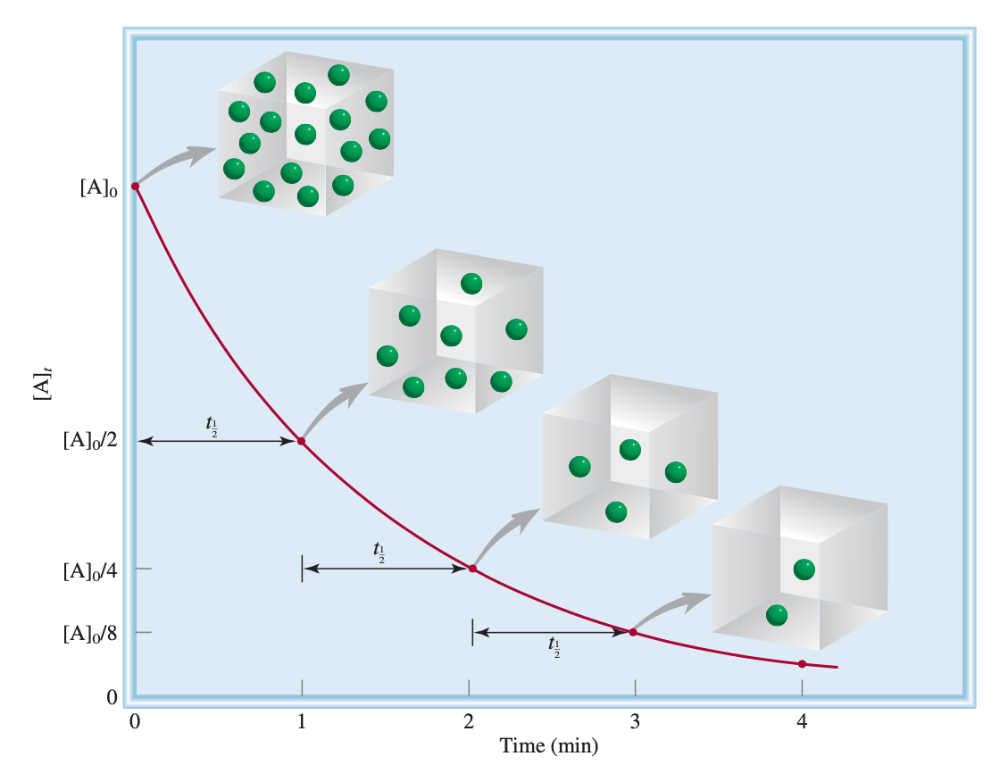
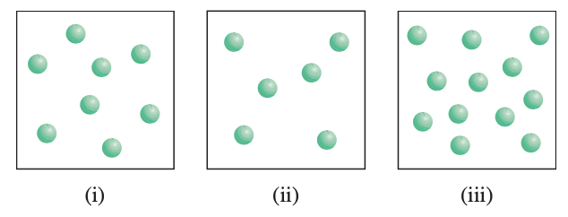

# The Relationship Between Reactant Concentration and Time

## Derivation of the integrated rate law (First Order)

For a first order reaction ($A\ce{->}\text{product}$), the $\text{rate}=-\frac{\Delta[A]}{\Delta t}$.

From the rate law, we know that $\text{rate}=k[A]$ with units $s^{-1}$, so combining the two equations, we get:

$$
-\frac{\Delta[A]}{\Delta t}=k[A]$
$$

When we integrate this, we get:

$$
\ln\frac{[A]_t}{[A]_0}=-kt
$$

Which can be rearranged to:

$$
\ln[A]_t=-kt+\ln[A]_0
$$

Which has the form $y=mx+b$. This conveniently means that if  we plot the natural log of the concentration over time of the equation, the gradient of the line $=-k$

??? info "Derivation"
	
	$$
	\begin{align}-\frac{d[A]}{dt}&=k[A]\\
	-\frac{d[A]}{[A]}&=-kdt\\
	\int_{[A]_0}^{[A]_t}\frac{d[A]}{[A]}&=-k\int_{0}^{t}dt\\
	\ln[A]_t-\ln[A]_0&=-kt\\
	&\text{or}\\
	\ln\frac{[A]_t}{[A]_0}&=-kt\end{align}
	$$
{: style="width: 60%; "class="center"}

## The Equations
$$
\ln\frac{[A]_t}{[A]_0}=-kt
$$

$$
\ln[A]_t=-kt+\ln[A]_0
$$
## Usage

This equation can be used to link concentrations and time of first order equations

!!! info "Example 1 - Conversion of cyclopropane $\ce{->}$ propene"
	
	The conversion of cyclopropane to propene in the gas phase is a first-order reaction with a rate constant of $6.7\times10^{-4}\:s^{-1}$ at 500°C.
	
	1. If the initial concentration of cyclopropane was 0.25 M, what is the concentration after 8.8 min? 
	
	$$
	\begin{align}
	\ln[A]_t&=-kt+\ln[A]_0\\
	[A]_t&=exp(-kt+\ln[A]_0)\\
	[A]_t&=exp\big[-(6.7\times10^{-4})(8.8\times60)+\ln(0.25)\big]\\
	[A]_t&=0.18\:M\\
	\end{align}
	$$
	
	2. How long (in minutes) will it take for the concentration of cyclopropane to decrease from 0.25 M to 0.15 M? 
	
	$$
	\begin{align}
	\ln\frac{[A]_t}{[A]_0}&=-kt\\
	\frac{\ln\frac{[A]_t}{[A]_0}}{-k}&=t\\
	\frac{\ln\frac{0.15}{0.25}}{-(6.7\times10^{-4})}&=t\\
	(762\:s)\times\frac{1\:min}{60\:s}&=t\\
	13\:min&=t
	\end{align}
	$$
	
	3. How long (in minutes) will it take to convert 74 percent of the starting material?
	
	$$
	\begin{align}
	\ln\frac{0.26}{1}&=-kt\\
	\frac{\ln\frac{0.26}{1}}{-k}&=t\\
	\frac{\ln\frac{0.26}{1}}{-(6.7\times10^{-4})}&=t\\
	2011\:s\times\frac{1\:min}{60\:s}&=t\\
	34\:min&=t\\
	\end{align}
	$$

## Reaction Half Life

Another metric that  we can use is reaction half life, that is the amount of time it takes for half the reactant to be consumed in the reaction. 

$$
t_\frac{1}{2}=\frac{0.693}{k}
$$

??? info "Derivation"
	
	$$
	\begin{align}
	\ln\frac{[A]_t}{[A]_0}&=-kt\\
	t&=\frac{1}{k}\ln\frac{[A]_t}{[A]_0}\\
	\text{By definition, the}&\text{ half life is when }[A]_t=[A]_0/2\text{, so}\\
	t_\frac{1}{2}&=\frac{1}{k}\ln\frac{[A]_0}{[A]_0/2}\\
	t_\frac{1}{2}&=\frac{1}{k}\ln 2=\frac{0.693}{k}\\
	\end{align}
	$$

We can see that the half life is independent of the starting concentration, 

{: style="width: 60%; "class="center"}

## Derivation of the integrated rate law (Second Order)

The second order rate law process holds firm for the first order, however we get a different integrated rate law. The multi-reactant integrated rate law is beyond the scope of Chang, but the single reactant, second order integrated rate law comes out as:

$$
\frac{1}{[A]_t}=kt\frac{1}{[A]_0}
$$

This still takes the form of a linear equation, however now the gradient $=+k$

The resulting half life equation also differs and we get:

$$
t_\frac{1}{2}=\frac{1}{k[A]0}
$$

We now have an inverse correlation with the initial concentration.

Derivation of the integrated rate law (Second Order)

## Derivation of the integrated rate law (Zeroth Order)

We repeat the process once more and unsurprisingly, the resulting integrated rate law is:

$$
[A]_t=-kt+[A]_0
$$

There is a straight correlation between the concentration at $t_i$ and $t_f$, determined only by $k$

## Questions

???+ warn "13.21  Write an equation relating the concentration of a reactant $A$ at $t=0$ to that at $t=t$ for a first-order reaction. Define all the terms and give their units. Do the same for a second-order reaction."
	
	#### First Order:
	
	Where:
	
	* $t=$ The time in seconds between the initial and final concentrations
	* $k=$ The rate constant, a proportionality term between $[A]$ and the rate of the reaction, in units $s^{-1}$
	* $[A]_t =$ The final concentration of $A$ at $t_f$ in $M$
	* $[A]_0=$ The initial concentration of $A$ at $t_i$ n $M$
	
	$$
	\ln[A]_t=-kt+\ln[A]_0
	$$	
	
	#### Second Order:
	
	Where:
	
	* $t=$ The time in seconds between the initial and final concentrations
	* $k=$ The rate constant, a proportionality term between $[A]$ and the rate of the reaction, in 	units $(M\cdot s)^{-1}$
	* $[A]_t =$ The final concentration of $A$ at $t_f$ in $M$
	* $[A]_0=$ The initial concentration of $A$ at $t_i$ n $M$
	
	$$
	\frac{1}{[A]_t}=kt+\frac{1}{[A]_0}
	$$	

???+ warn "13.22  Define half-life. Write the equation relating the half-life of a first-order reaction to the rate constant."
	
	Half life is the amout of time it takes for half of the reactant to be con sumed in the reaction.
	
	#### First order
	
	$$
	t_\frac{1}{2}=\frac{0.693}{k}
	$$

???+ warn "13.24  For a first-order reaction, how long will it take for the concentration of reactant to fall to one-eighth its original value? Express your answer in terms of the half-life ($t_\frac{1}{2}$) and in terms of the rate constant $k$."
	
	$$
	\begin{align}
	t_\frac{1}{2}&=\frac{0.693}{k}\\
	t_\frac{1}{8}&=\frac{3(0.693)}{k}\\
	t_\frac{1}{8}&=\frac{2.079}{k}\\
	\end{align}
	$$

???+ warn "13.25 What is the half-life of a compound if 75 percent of a given sample of the compound decomposes in 60 min? Assume first-order kinetics."
	
	$$
	\begin{align}
	75\%=2t_\frac{1}{2}&=60\:mins\\
	50\%=t_\frac{1}{2}&=30\:mins\\
	\end{align}
	$$

???+ warn "13.26 The thermal decomposition of phosphine ($\ce{PH3}$) into phosphorus and molecular hydrogen is a first-order reaction ($\ce{4PH3_{(g)} -> P4_{(g)} + 6H2_{(g)}}$). The half-life of the reaction is 35.0 s at 680°C. Calculate"
	
	**a) The first-order rate constant for the reaction**
	
	$$
	\begin{align}
	t_\frac{1}{2}&=\frac{0.693}{k}\\
	35.0&=\frac{0.693}{k}\\
	35.0k&=0.693\\
	k&=\frac{0.693}{35.0}\\
	k&=0.0198\\
	\end{align}
	$$
	
	**b) The time required for 95 percent of the phosphine to decompose.**
	
	$$
	\begin{align}
	\ln\bigg(\frac{[A]_0}{[A]_f}\bigg)&=-kt\\
	\ln\bigg(\frac{0.05}{1}\bigg)&=-kt\\
	\frac{\ln\bigg(\frac{0.05}{1}\bigg)}{-k}=t\\
	\frac{\ln\bigg(\frac{0.05}{1}\bigg)}{-k}=t\\
	151\:s&=t\\
	\end{align}
	$$

???+ warn "13.28 The rate constant for the second-order reaction $\ce{2NO2_{(g)} -> 2NO_{(g)} + O2_{(g)}}$ is $0.54\:(M\cdot s)^{-1}$ at 300°C. How long (in seconds) would it take for the concentration of $\ce{NO2} to decrease from 0.62 M to 0.28 M?"
	
	$$
	\begin{align}
	\frac{1}{[A]_t}&=kt\frac{1}{[A]_0}\\
	\frac{[A]_0}{[A]_t}&=kt\\
	\frac{[A]_0}{k[A]_t}&=t\\
	\frac{0.62}{0.54(0.28)}&=t\\
	4.10\:s&=t\\
	\end{align}
	$$

???+ warn "13.30 The reaction $\ce{X -> Y}$ shown here follows first-order kinetics. Initially different amounts of $X$ molecules are placed in three equal-volume containers at the same temperature."
	
	{: style="width: 50%; "class="center"}
	
	**a) What are the relative rates of the reaction in these three containers?** 
	
	The rates will be 3:2:4
	
	**b) How would the relative rates be affected if the volume of each container were doubled?** 
	
	The relative rates between the containers would remain the same, but the the absolute rate within each container would decrease by 50%
	
	**c) What are the relative half-lives of the reactions in (i) to (iii)?**
	
	The are all identical

